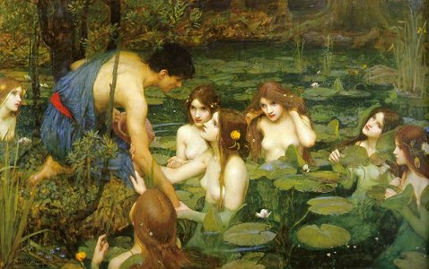

  
[Intangible Textual Heritage](../../index)  [Classics](../index) 

------------------------------------------------------------------------

[Buy this Book at
Amazon.com](https://www.amazon.com/exec/obidos/ASIN/0674990013/internetsacredte)

------------------------------------------------------------------------

<table width="75%">
<colgroup>
<col style="width: 50%" />
<col style="width: 50%" />
</colgroup>
<tbody>
<tr class="odd">
<td width="50%" data-valign="TOP"> 
</td>
<td width="50%" data-valign="TOP"><h1 id="the-argonautica" data-align="CENTER">The Argonautica</h1>
<h2 id="by-apollonius-rhodius" data-align="CENTER">by Apollonius Rhodius</h2>
<h2 id="tr.-r.c.-seaton" data-align="CENTER">tr. R.C. Seaton</h2>
<h4 id="with-parallel-greek-text" data-align="CENTER">with parallel Greek text</h4>
<h4 id="section" data-align="CENTER">[1912]</h4></td>
</tr>
</tbody>
</table>

------------------------------------------------------------------------

[Book 1](#section_000)   \|    [Book 2](#section_001)   \|    [Book
3](#section_002)   \|    [Book 4](#section_003)   \|   

------------------------------------------------------------------------

|                                                                                                                           |
|---------------------------------------------------------------------------------------------------------------------------|
|  |

The Argonautica tells the story of the journey of Jason and the
Argonauts to the land of Colchis in search of the Golden Fleece. The
story of the Argonauts was a traditional cycle of myths which Apollonius
of Rhodes wove into this saga at the turn of the third century BCE.
Apollonius, born about 270 BC, was a librarian at the great Library of
Alexandria. He composed the Argonautica in his youth, but it got a poor
reception in Alexandria. Rejected, he moved to Rhodes where he gained
fame as a teacher, and his poem got more respect. Eventually he returned
to Alexandria, where the Argonautica was finally acclaimed. Opinions
differed in antiquity on the Argonautica; some Romans such as Virgil
held it in high esteem. Quintillian and Longinus criticized it as
mediocre.

In the Argonautica, Jason is impelled on his quest by King Peleas, who
receives a prophecy that a man with one sandal would be his nemesis.
Jason, a hero-in-training, loses a sandal in a river, arrives at the
court of Peleas, and the epic is set in motion. So Peleas sends Jason
off on the ultimate scavenger hunt for 'The Golden Fleece.' Jason
assembles an 'A list' of Greek heroes, including Odysseus, Orpheus,
Heracles and dozens of others. They journey in a great ship, the Argo,
to the eastern end of the Black Sea, essentially to the ends of the
earth. This story is also retold for young adults at this site in [The
Heroes](../gft/index), by Charles Kingsley.

The Argonautica has impacted our culture from [the
Aeneid](../virgil/index) to Star Trek. The Golden Fleece has become a
byword for 'an unobtainable object.' And who can forget Ray
Harryhausen's classic stop motion animation in the 1963 film [Jason and
the
Argonauts](https://www.amazon.com/exec/obidos/ASIN/0767810864/internetsacredte)?
The pre-Raphaelite John William Waterhouse painting above, which is a
favorite college dorm room poster, depicts [an
incident](argo12.htm#1.1207-1239) from the Argonautica where Hylas (or
Aeolas), the companion of Heracles, is seduced and carried away by a
water-nymph, to [Heracles' inconsolable sorrow](argo12.htm#1.1261-1272).

PRODUCTION NOTES: This presentation of the Argonautica includes the
electronic text of the R.C. Seaton English translation (originally
prepared by the [Online Medieval and Classical
Library](https://omacl.org/Argonautica)). in parallel with the Greek
text. These were collated and formatted using a custom C program written
at Intangible Textual Heritage. Line numbers were adjusted in the
English text in a couple of minor instances to match the Greek. This
part of the site requires that your browser be set to display Unicode
text correctly; [please refer to this file](../../unicode) if you do not
see the full polytonic Greek.

------------------------------------------------------------------------

### Book 1

[line 1](argo00)  
[line 105](argo01)  
[line 202](argo02)  
[line 306](argo03)  
[line 402](argo04)  
[line 512](argo05)  
[line 609](argo06)  
[line 700](argo07)  
[line 834](argo08)  
[line 910](argo09)  
[line 1012](argo10)  
[line 1103](argo11)  
[line 1207](argo12)  
[line 1315](argo13)  

### Book 2

[line 1](argo14)  
[line 145](argo15)  
[line 209](argo16)  
[line 301](argo17)  
[line 408](argo18)  
[line 500](argo19)  
[line 611](argo20)  
[line 714](argo21)  
[line 811](argo22)  
[line 911](argo23)  
[line 1002](argo24)  
[line 1123](argo25)  
[line 1200](argo26)  

### Book 3

[line 1](argo27)  
[line 100](argo28)  
[line 210](argo29)  
[line 304](argo30)  
[line 401](argo31)  
[line 502](argo32)  
[line 609](argo33)  
[line 705](argo34)  
[line 802](argo35)  
[line 912](argo36)  
[line 1008](argo37)  
[line 1102](argo38)  
[line 1225](argo39)  
[line 1326](argo40)  

### Book 4

[line 1](argo41)  
[line 109](argo42)  
[line 206](argo43)  
[line 303](argo44)  
[line 410](argo45)  
[line 503](argo46)  
[line 627](argo47)  
[line 718](argo48)  
[line 833](argo49)  
[line 922](argo50)  
[line 1014](argo51)  
[line 1110](argo52)  
[line 1228](argo53)  
[line 1318](argo54)  
[line 1422](argo55)  
[line 1502](argo56)  
[line 1601](argo57)  
[line 1731](argo58)  
