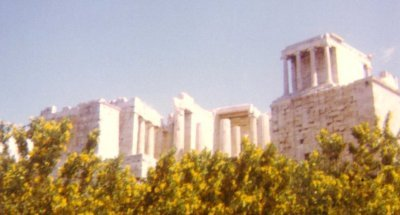

[Intangible Textual Heritage](../../index)  [Classical
Paganism](../index)  [Legends & Sagas](../../neu/index) 

------------------------------------------------------------------------

<table>
<colgroup>
<col style="width: 50%" />
<col style="width: 50%" />
</colgroup>
<tbody>
<tr class="odd">
<td></td>
<td><h1 id="bulfinchs-mythology">BULFINCH'S MYTHOLOGY</h1>
<h2 id="the-age-of-fable">THE AGE OF FABLE</h2>
<h3 id="or-stories-of-gods-and-heroes">OR STORIES OF GODS AND HEROES</h3>
<h3 id="by-thomas-bulfinch">by Thomas Bulfinch</h3>
<h4 id="section">[1855]</h4></td>
</tr>
</tbody>
</table>

------------------------------------------------------------------------

[CHAPTER I. Introduction.](bulf00)  
[CHAPTER II. Prometheus And Pandora.](bulf01)  
[CHAPTER III. Apollo And Daphne- Pyramus And Thisbe- Cephalus And
Procris.](bulf02)  
[CHAPTER IV. Juno And Her Rivals, Io And Callisto- Diana And Actaeon-
Latona And The Rustics.](bulf03)  
[CHAPTER V. Phaeton.](bulf04)  
[CHAPTER VI. Midas- Baucis And Philemon.](bulf05)  
[CHAPTER VII. Proserpine- Glaucus And Scylla.](bulf06)  
[CHAPTER VIII. Pygmalion- Dryope- Venus And Adonis- Apollo And
Hyacinthus.](bulf07)  
[CHAPTER IX. Ceyx And Halcyone: Or, The Halcyon Birds.](bulf08)  
[CHAPTER X. Vertumnus And Pomona.](bulf09)  
[CHAPTER XI. Cupid And Psyche.](bulf10)  
[CHAPTER XII. Cadmus- The Myrmidons.](bulf11)  
[CHAPTER XIII. Nisus And Scylla- Echo And Narcissus- Clytie- Hero And
Leander.](bulf12)  
[CHAPTER XIV. Minerva- Niobe.](bulf13)  
[CHAPTER XV. The Graeae And Gorgons- Perseus- Medusa- Atlas-
Andromeda.](bulf14)  
[CHAPTER XVI. Monsters. Giants, Sphinx, Pegasus, And Chimaera, Centaurs,
Griffin, And Pygmies.](bulf15)  
[CHAPTER XVII. The Golden Fleece- Medea](bulf16)  
[CHAPTER XVIII. Meleager And Atalanta.](bulf17)  
[CHAPTER XIX. Hercules- Hebe And Ganymede.](bulf18)  
[CHAPTER XX. Theseus- Daedalus- Castor And Pollux.](bulf19)  
[CHAPTER XXI. Bacchus- Ariadne.](bulf20)  
[CHAPTER XXII. The Rural Deities- Erisichthon- Rhoecus- The Water
Deities- The Camenae- The Winds.](bulf21)  
[CHAPTER XXIII. Achelous And Hercules- Admetus And Alcestis- Antigone-
Penelope.](bulf22)  
[CHAPTER XXIV. Orpheus And Eurydice- Aristaeus- Amphion- Linus-
Thamyris- Marsyas- Melampus- Musaeus.](bulf23)  
[CHAPTER XXV. Arion- Ibycus- Simonides- Sappho.](bulf24)  
[CHAPTER XXVI. Endymion- Orion- Aurora And Tithonus- Acis And
Galatea.](bulf25)  
[CHAPTER XXVII. The Trojan War.](bulf26)  
[CHAPTER XXVIII. The Fall Of Troy- Return Of The Greeks- Agamemnon,
Orestes And Electra.](bulf27)  
[CHAPTER XXIX. Adventures Of Ulysses- The Lotus-eaters- Cyclopse- Circe
-sirens- Scylla And Charybdis- Calypso.](bulf28)  
[CHAPTER XXX. The Phaeacians- Fate Of The Suitors.](bulf29)  
[CHAPTER XXXI. Adventures Of Aeneas- The Harpies- Dido-
Palinurius.](bulf30)  
[CHAPTER XXXII. The Infernal Regions- The Sibyl.](bulf31)  
[CHAPTER XXXIII. Aeneas In Italy- Camilla- Evander- Nisus And Euryalus-
Mezentius- Turnus.](bulf32)  
[CHAPTER XXXIV. Pythagoras- Egyptian Deities- Oracles.](bulf33)  
[CHAPTER XXXV. Origin Of Mythology- Statues Of Gods And Goddesses- Poets
Of Mythology.](bulf34)  
[CHAPTER XXXVI. Modern Monsters- The Phoenix- Basilisk- Unicorn-
-salamander.](bulf35)  
[CHAPTER XXXVII. Eastern Mythology- Zoroaster- Hindu Mythology- Castes-
Buddha- Grand Lama.](bulf36)  
[CHAPTER XXXVIII. Northern Mythology- Valhalla- The
Valkyrior.](bulf37)  
[CHAPTER XXXIX. Thor's Visit To Jotunheim.](bulf38)  
[CHAPTER XL. The Death Of Baldur- The Elves- Runic Letters- Skalds-
Iceland.](bulf39)  
[CHAPTER XLI. The Druids- Iona.](bulf40)  
[CHAPTER XLII. Beowulf.](bulf41)  
[Proverbial Expressions](bulf42)  
