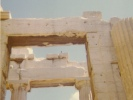

  
[Intangible Textual Heritage](../../index)  [Classics](../index) 
[Index](index)  [Previous](dep042)  [Next](dep044) 

------------------------------------------------------------------------

[Buy this Book at
Amazon.com](https://www.amazon.com/exec/obidos/ASIN/B002D48Q7A/internetsacredte)

------------------------------------------------------------------------

  
*The Discourses of Epictetus*, tr. by P.E Matheson, \[1916\], at
Intangible Textual Heritage

------------------------------------------------------------------------

### CHAPTER XI

#### WHAT IS THE BEGINNING OF PHILOSOPHY

The beginning of philosophy with those
who approach it in the right way and by the door is a consciousness of
one's own weakness and want of power in regard to necessary things. For
we come into the world with no innate conception of a right-angled
triangle, or of a quarter-tone or of a semi-tone, but we are taught what
each of these means by systematic instruction; and therefore those who
are ignorant of these things do not think that they know them. On the
other hand every one has come into the world with an innate conception
as to good and bad, noble and shameful, becoming and unbecoming,
happiness and unhappiness, fitting and inappropriate, what is right to
do and what is wrong. Therefore we all use these terms and try to fit
our

p. 301

preconceived notions to particular facts. 'He did nobly', 'dutifully',
'un-dutifully'. 'He was unfortunate', 'he was fortunate'; 'he is
unjust', 'he is just.' Which of us refrains from these phrases? Which of
us puts off using them until he is taught them, just as men who have no
knowledge of lines or sounds refrain from talking of them? The reason is
that on the subject in question we come into the world with a certain
amount of teaching, so to say, already given us by nature; to this basis
of knowledge we have added our own fancies.

'Why!' says he; 'do I not know what is noble and what is shameful? Have
I no conception of them?'

You have.

'Do I not fit my conception to particulars?'

You do.

'Do I not fit them well then?'

There lies the whole question and there fancy comes in. For, starting
with these admitted principles, men advance to the matter in dispute,
applying these principles inappropriately. For if they really possessed
this faculty as well, what would prevent them from being perfect? You
think that you apply your preconceptions properly to particular cases;
but tell me, how do you arrive at this?

I have such a conviction.

But another has a different conviction, has he not, and yet believes. as
you do, that he is applying his conception rightly?

He does.

Is it possible then for you both to apply your conceptions properly in
matters on which you hold contrary opinion?

It is impossible.

Can you then point us to anything beyond your own opinion which will
enable us to apply our conceptions better? Does the madman do anything
else but what he thinks right? Is this criterion then sufficient for him
too?

It is not.

Come, then, let us look for something beyond personal opinion. Where
shall we find it?

Here you see the beginning of philosophy, in the discovery of the
conflict of men's minds with one another, and the attempt to seek for
the reason of this conflict, and the condemnation of mere opinion, as a
thing not to be trusted; and a search to determine whether your opinion
is true, and an attempt to discover a standard, just as we discover the
balance to deal with weights and the rule to deal with things straight
and crooked. This is the beginning of philosophy.

'Are all opinions right which all men hold?'

Nay, how is it possible for contraries to be both right?

p. 302

'Well, then, not all opinions, but our opinions?'

Why ours, rather than those of the Syrians or the Egyptians, or the
personal opinion of myself or of this man or that?

'Why indeed?'

So then, what each man thinks is not sufficient to make a thing so: for
in dealing with weights and measures we are not satisfied with mere
appearance, but have found a standard to determine each. Is there, then,
no standard here beyond opinion? It is impossible surely that things
most necessary among men should be beyond discovery and beyond proof?

There is a standard then. Then, why do we not seek it and find it, and
having found it use it hereafter without fail, never so much as
'stretching out our finger' without it? For it is this standard, I
suppose, the discovery of which relieves from madness those who wrongly
use personal opinion as their only measure, and enables us thereafter to
start from known principles, clearly defined, and so to apply our
conceptions to particulars in definite and articulate form.

What subject, I might ask, lies before us for our present discussion?
'Pleasure.'

Submit it to the rule, put it in the balance. Ought the good to be
something which is worthy to inspire confidence and trust? 'It ought.'

Is it proper to have confidence in anything which is insecure? 'No.'

Has pleasure, then, any certainty in it?

'No.'

Away with it then! Cast it from the scales and drive it far away from
the region of good things. But if your sight is not keen, and you are
not satisfied with one set of scales, try another.

Is it proper to be elated at what is good?

'It is.'

Is it proper, then, to be elated at the pleasure of the moment? Be
careful how you say that it is proper. If you do, I shall not count you
worthy of the scales.

Thus things are judged and weighed if we have standards ready to test
them: and in fact the work of philosophy is to investigate and firmly
establish such standards; and the duty of the good man is to proceed to
apply the decisions arrived at.

------------------------------------------------------------------------

[Next: Chapter XII. On the Art of Discussion](dep044)
