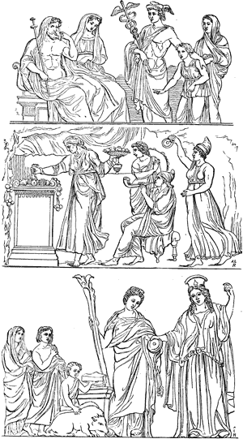
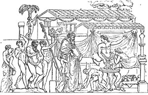
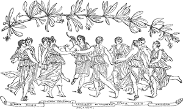

  
[Intangible Textual Heritage](../../index)  [Classics](../index) 
[Index](index)  [Previous](ebm02)  [Next](ebm04) 

------------------------------------------------------------------------

  
*The Eleusinian and Bacchic Mysteries*, by Thomas Taylor, \[1891\], at
Intangible Textual Heritage

------------------------------------------------------------------------

p. 8

   
Eleusinian Mysteries.

p. 9

   
Bacchus.

                      “’Tis not merely  
The human being’s pride that peoples space  
With life and mystical predominance,  
Since likewise for the stricken heart of Love  
This visible nature, and this common world  
Is all too narrow; yea, a deeper import  
Lurks in the legend told my infant years  
That lies upon that truth, we live to learn,  
For fable is Love’s world, his home, his birthplace;  
Delightedly he dwells ’mong fays and talismans,  
And spirits, and delightedly believes  
Divinities, being himself divine.  
The intelligible forms of ancient poets,  
The fair humanities of Old Religion,  
The Power, the Beauty, and the Majesty,  
That had their haunts in dale or piny mountain,  
Or forests by slow stream, or pebbly spring,  
Or chasms or wat’ry depths;—all these have vanished.  
They live no longer in the faith of Reason,  
But still the heart doth need a language; still  
Doth the old instinct bring back the old names.”

Schiller: *The
Piccolomini*, Act. ii. Scene 4.

p. 10

   
Apollo and Muses.

------------------------------------------------------------------------

[Next: Introduction](ebm04)
