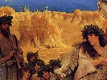
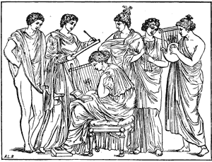

  
[Intangible Textual Heritage](../../index)  [Classics](../index) 
[Index](index)  [Previous](ebm06)  [Next](ebm08) 

------------------------------------------------------------------------

  
*The Eleusinian and Bacchic Mysteries*, by Thomas Taylor, \[1891\], at
Intangible Textual Heritage

------------------------------------------------------------------------

#### Εις ΑΘΗΝΑΝ.

> ΚΛΥΘΙ μευ αιγιοχοιο διος τεκος· ἡ γενετηρος  
> Πηγης εκπροϑορουσα, και ακροτατης απο σειρας  
> Αρσενοϑυμε· φερασπι· μεγασϑενες· οβριμοπατηρ,  id="fr_123">[\*](#fn_123)  
> Κεκλυϑι· δεχνυσο δ’ ὑμνον ευφρονι ποτνια ϑυμω  
> Ἡ σοφιης πετασασα θεοστυβεας [†](#fn_124)
> πυλεωνας.  
> Και χϑονιων δαμασασα θεωμαχα φυλα γιγαντων.  
> Ἡ κραδιην εσαωσας αμυστιλευτον [‡](#fn_125)
> ανακτος  
> Αιϑερος εν γυαλοισι μεριζομενου ποτε Βακχου  
> Τιτανων ὑπο χερσι, πορες δε ε πατρι φερουσα  
> Οφρα νεος βουλησιν απ’ αρῥητοισι τοκηος,  
> Εκ Σεμελης περι κοσμον ανηβηση Διονυσσος.  
> Ἡς πελεκις [§](#fn_126) θηριων ταμνων
> προθελυμνα καρηνα  
> Πανδερκους ἑκατης παϑεων ἡνυσε γενεϑλην·  
> Ἡ κρατος Ἡρας σεμνον εγερσι βροτων αρετα·ων  
> Η βιοτον κοσμησας ολον πολυειδεσι τεχναις,  
> Δεμιουργικην οερην [‖](#fn_127) ψυχαισι
> βαλλουσα·  
> Ἡ λαχες αχροπολια . . . . . .  
> Συμβολον ακροτατης μεγαλης σεο ποτνια σειρης·

p. 225

> Ἡ χϑονα βωτιανειρα φιλησας μητερας βιβλων.  
> Ουνομα αστυ δε δωκας εχειν σεο και φρενας εσϑλας.  
> Κλυϑι μευ ἡ φαος ἁγνον απαστραπτουσα προσωπου·  
> Δος δε μοι ολβιον ορμον ἁλωομενα περι γαιαν.  
> Δος ψυχῃ φαος αγνον απ’ ευιρεων σεο μυϑων·  
> Και σοφιην· και ερωτα· μενος δ’ εμπνευσον ερωτι,   
> Τοσσατιον, και τοιον, οσον χϑονιων απο κολπων   
> Αψερνη προς Ολυμπον ες ηϑεα πατροσ εοιο,   
> Ειδε τις αμπλακιημε [\*](#fn_128) κακη
> βιοτοιο δαμαζει.  
> Ιλαϑι μειλιχοβουλε· σαομβρστε· μηδεμεασης  id="fr_129">[†](#fn_129)   
> ῾Ριγεδαναις ποιναισιν ελωρ και κυρμα γενεσσα,   
> Κειμενον εν δαπεδοισιν, ὁτι τεος ευχομαι ειναι·   
> Κεκλυϑι κεκλυϑι· και μοι μειλισχιν ουας ὑποχες.

#### TO MINERVA.

> Daughter of
> ægis-bearing Jove, divine,  
> Propitious to thy votaries’ prayer incline;  
> From thy great father’s fount supremely bright,  
> Like fire resounding, leaping into light.  
> Shield-bearing goddess, hear, to whom belong  
> A manly mind, and power to tame the strong!  
> Oh, sprung from matchless might, with joyful mind  
> Accept this hymn; benevolent and kind!  
> The holy gates of wisdom, by thy hand  
> Are wide unfolded; and the daring band  
> Of earth-born giants, that in impious fight  
> Strove with thy fire, were vanquished by thy might.  
> Once by thy care, as sacred poets sing,  
> The heart of Bacchus, swiftly-slaughtered king,

p. 226

> Was sav’d in Æther, when, with fury fired,  
> The Titans fell against his life conspired;  
> And with relentless rage and thirst for gore,  
> Their hands his members into fragments tore:  
> But ever watchful of thy father’s will,  
> Thy power preserv’d him from succeeding ill,  
> Till from the secret counsels of his fire,  
> And born from Semelé through heavenly sire,  
> Great Dionysus to the world at length  
> Again appeared with renovated strength.  
> Once, too, thy warlike ax, with matchless sway,  
> Lopped from their savage necks the heads away  
> Of furious beasts, and thus the pests destroyed  
> Which long all-seeing Hecaté annoyed.  
> By thee benevolent great Juno’s might  
> Was roused, to furnish mortals with delight.  
> And thro’ life’s wide and various range, ’t is thine  
> Each part to beautify with art divine:  
> Invigorated hence by thee, we find  
> A demiurgic impulse in the mind.  
> Towers proudly raised, and for protection strong,  
> To thee, dread guardian deity, belong,  
> As proper symbols of th’ exalted height  
> Thy series claims amidst the courts of light.  
> Lands are beloved by thee, to learning prone,  
> And Athens, Oh Athena, is thy own!  
> Great goddess, hear! and on my dark’ned mind  
> Pour thy pure light in measure unconfined;—  
> That sacred light, Oh all-protecting queen,  
> Which beams eternal from thy face serene.  
> My soul, while wand’ring on the earth, inspire  
> With thy own blessed and impulsive fire:  
> And from thy fables, mystic and divine,  
> Give all her powers with holy light to shine.

p. 227

> Give love, give wisdom, and a power to love,  
> Incessant tending to the realms above;  
> Such as unconscious of base earth’s control  
> Gently attracts the vice-subduing soul:  
> From night’s dark region aids her to retire,  
> And once more gain the palace of her sire.  
> O all-propitious to my prayer incline!  
> Nor let those horrid punishments be mine  
> Which guilty souls in Tartarus confine,  
> With fetters fast’ned to its brazen floors,  
> And lock’d by hell’s tremendous iron doors.  
> Hear me, and save (for power is all thine own)  
> A soul desirous to be thine alone.  id="fr_130">[\*](#fn_130)

It is very remarkable in this hymn, that the exploits of Minerva
relative to cutting off the heads of wild beasts with an ax, etc., is
mentioned by no writer whatever; nor can I find the least trace of a
circumstance either in the history of Minerva or Hecate to which it
alludes. [†](#fn_131) And from hence, I

p. 228

think, we may reasonably conclude that it belonged to the arcane Orphic
narrations concerning these goddesses, which were consequently but
rarely mentioned, and this but by a few, whose works, which might afford
us some clearer information, are unfortunately lost.

   
Musical Conference.

------------------------------------------------------------------------

### Footnotes

[224:\*](ebm07.htm#fr_123) Lege οβριμοπατρη.

[224:†](ebm07.htm#fr_124) Lege θεοσεβειας.

[224:‡](ebm07.htm#fr_125) Lege αμυσι λυτου.

[224:§](ebm07.htm#fr_126) Lege πελεκυς.

[224:‖](ebm07.htm#fr_127) Lege Ορμην.

[225:\*](ebm07.htm#fr_128) Lege αμπλακημα.

[225:†](ebm07.htm#fr_129) Lege μηδ’ εμ’ εασης.

[227:\*](ebm07.htm#fr_130) If I should ever be
able to publish a second edition of my translation of the hymns of
Orpheus, I shall add to it a translation of all those hymns of Proclus,
which are fortunately extant; but which are nothing more than the wreck
of a great multitude which he composed.

[227:†](ebm07.htm#fr_131) If Mr. Taylor had
been conversant with Hindu literature, he would have perceived that
these exploits of Minerva-Athenè were taken from the buffalo-sacrifice
of Durga or Bhavani. The whole Dionysiac legend is but a rendering of
the Sivaic and Buddhistic legends into a Grecian dress.—A. W.

------------------------------------------------------------------------

[Next: Appendix](ebm08)
