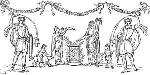

  
[Intangible Textual Heritage](../../index)  [Classics](../index) 
[Index](index)  [Previous](ebm07)  [Next](ebm09) 

------------------------------------------------------------------------

  
*The Eleusinian and Bacchic Mysteries*, by Thomas Taylor, \[1891\], at
Intangible Textual Heritage

------------------------------------------------------------------------

p. 229

   
Venus Rising from the Sea.

#### APPENDIX.

Since writing the above Dissertation, I
have met with a curious Greek manuscript entitled: “Of Psellus,
*Concerning Dæmons, [\*](#fn_132) according to
the opinion of the Greeks”:* του Ψελλου τινα περι δαιμονων δοξαζουσιν
Ἑλληνες: In the course of which he describes the machinery of the
Eleusinian Mysteries as follows:—Ἁ δε γε μυστηρια τουτων, οἱον αυτικα τα
Ελευσινια, τον μυϑικον ὑποκρινεται δια μιγνυμενον τῃ δηοι, ἢ τῃ
Δημητερι, και τῃ Θυγατερει ταυτης Φερσεφαττῃ τῃ και Κορη. Επειδη δε
εμελλον και αφροδισιοι επι τη μυησει γινεσϑαι συμπλοκαι, αναδυεται πως ἡ
Αφροδιτη απο τινων πεπλασμενων μηδεων

p. 230

τελαγιος. Ειτα δε γαμηλιος επι τῃ Κορῃ ὑμεναιος. Και επαδουσιν οἱ
τελουμενοι, εκ τυμπανου εφαγον εκ κυμβαλων επιον, εκιρνοφορησα (lege
εκερνοφορησα) ὑπο τον παστον εισεδυν. Ὑποκρινεται δε και τας δηους
ὡδινας. Ἱκετηριαι γουν αυτικα δηους. Και χολης ποσις, και καρδιαλγιαι.
Εφ’ οἱς και τραγοσκελες μιμημα παϑαινομενον περι τοις διδυμοις· ὁτι περ
ὁ Ζευς δικας αποτιννυς της βιας τῃ Δημητερι τεραγου (lege τραγου) ορχεις
αποτεμων, τῳ κολπω ταυτης κατεϑετο, ὡσπερ δη και εαυτου. Επι πασιν αἱ
του Διονυσου τιμαι, και ἡ κυστις, και τα πολυομφαλα ποπανα, και οἱ τω
Σαβαζιω τελουμενοι, κληδονες τε και μιμαλωνες, και τις ηχων λεβης
Θεσπρωτειος και Δωδωναιον χαλκειον, και Κορυβας αλλος και κουρης ετερος,
δαιμονων μιμηματα. Εφ’ οἱς ἡ Βαβωτους (lege ἡ Βαυβω τους) μηρους
ανασυρομενη, και ὁ γυναικος κτεις, ουτω γαρ ονομαζουσι την αιδω
αισχυνομενοι. Και ουτως εν αισχρω την τελετην καταλυουσιν. *I. e*. “The
Mysteries of these demons, such as the Eleusinia, consisted in
representing the mythical narration of Jupiter mingling with Ceres and
her daughter Proserpina (Phersephatté). But as

p. 231

venereal connections are in the initiation, [\*](#fn_133) a Venus is represented rising from the
sea, from certain moving sexual parts: afterwards the celebrated
marriage of Proserpina (with Pluto) takes place; and those who are
initiated sing:

> “‘Out of the drum I have eaten,  
> Out of the cymbal I have drank,  
> The mystic vase I have sustained,  
> The bed I have entered.’

\[paragraph continues\] The pregnant
throes likewise of Ceres \[Deo\] are represented: hence the
supplications of Deo are exhibited; the drinking of bile, and the
heart-aches. After this, an effigy with the thighs of a goat makes its
appearance, which is represented as suffering vehemently about the
testicles: because Jupiter, as if to expiate the violence which he had
offered to Ceres, is represented as cutting off the testicles of a goat,
and placing them on her bosom, as if they were his own. But after all
this, the rites of Bacchus succeed; the Cista, and the cakes with many
bosses, like those of a shield. Likewise the

p. 232

mysteries of Sabazius, divinations, and the mimalons or Bacchants; a
certain sound of the Thesprotian bason; the Dodonæan brass; another
Corybas, and another Proserpina,—representations of Demons. After these
succeed the uncovering of the thighs of Baubo, and a woman’s comb
(*kteis*), for thus, through a sense of shame, they denominate the
sexual parts of a woman. And thus, with scandalous exhibitions, they
finish the initiation.”

From this curious passage, it appears that the Eleusinian Mysteries
comprehended those of almost all the gods; and this account will not
only throw light on the relation of the Mysteries given by Clemens
Alexandrinus, but likewise be elucidated by it in several particulars. I
would willingly unfold to the reader the mystic meaning of the whole of
this machinery, but this can not be accomplished by any one, without at
least the possession of all the Platonic manuscripts which are extant.
This acquisition, which I would infinitely prize above the wealth of the
Indies, will, I hope, speedily and fortunately

p. 233 p. 234

   
Jupiter disguised as Diana, and Calisto.

   
Hercules, Deianeira and Nessus.

p. 235

be mine, and then I shall be no less anxious to communicate this arcane
information, than the liberal reader will be to receive it. I shall only
therefore observe, that the mutual communication of energies among the
gods was called by ancient theologists ἱερος γαμος, *hieros gamos, a
sacred marriage;* concerning which Proclus, in the second book of his
manuscript Commentary on the *Parmenides*, admirably remarks as follows:
Ταυτην δε την κοινωνιαν, ποτε μεν εν τοις συστοιχοις ὁρωσι ϑεοις (οἱ
ϑεολογοι) και καλουσι γαμον Ἡρας και Διος, Ουρανου και Γης, Κρονου και
῾Ρεας· ποτε δε των καταδεεστερων προς τα κρειττω, και καλουσι γαμον Διος
και Δημητρας· ποτε δε και εμπαλιν των κρειττωνων προς τα ὑφειμενα, και
λεγουσι Διος και Κορης γαμον. Επειδη των Θεων αλλαι μεν εισιν αἱ προς τα
συστοιχα κοινωνιαι, αλλαι δε αἱ προς τα προ αυτων· αλλαι δε αἱ προς τα
μετα ταυτα. Και δει την ἑκαστης ιδιοτητα κατανοειν και μεταγειν απο των
Θεων επι τα ειδη την τοιαυτην διαπλοκην. *I. e*. “Theologists at one
time considered this communion of the gods in divinities co-ordinate
with each other; and

p. 236

then they called it the marriage of Jupiter and Juno, of Heaven and
Earth \[Uranos and Ge\], of Saturn and Rhea: but at another time, they
considered it as subsisting between subordinate and superior divinities;
and then they called it the marriage of Jupiter and Ceres; but at
another time, on the contrary, they beheld it as subsisting between
superior and subordinate divinities; and then they called it the
marriage of Jupiter and Koré. For in the gods there is one kind of
communion between such as are of a co-ordinate nature; another between
the subordinate and supreme; and another again between the supreme and
subordinate. And it is necessary to understand the peculiarity of each,
and to transfer a conjunction of this kind from the gods to the
communion of ideas with each other.” And in *Timæus*, book i., he
observes: και το την αυτην (supple ϑεαν) ἑτεροις ἣ τον αυτον ϑεον
πλειοσι συζευγνυσϑαι, λαβοις αν εκ των μυστικων λογων, και των εν
απορῥητοις λεγομενων ἱερων γαμων. *I. e*. “And that the same goddess is
conjoined with other gods, or the same god with many goddesses, may be
collected from the mystic

p. 237

discourses, and those marriages which are called in the Mysteries
*Sacred Marriages*.”

Thus far the divine Proclus; from the first of which passages the reader
may perceive how adultery and rapes, as represented in the machinery of
the Mysteries, are to be understood when applied to the gods; and that
they mean nothing more than a communication of divine energies, either
between a superior and subordinate, or subordinate and superior,
divinity. I only add that the apparent indecency of these exhibitions
was, as I have already observed, exclusive of its mystic meaning,
designed as a remedy for the passions of the soul: and hence mystic
ceremonies were very properly called ακεα, *akea, medicines*, by the
obscure and noble Heracleitus. [\*](#fn_134)

   
Sacrifice of a Pig.

------------------------------------------------------------------------

### Footnotes

[229:\*](ebm08.htm#fr_132) Dæmons, divinities,
spirits; a term formerly applied to all rational beings, good or bad,
other than mortals.

[231:\*](ebm08.htm#fr_133) *I. e*. a
representation of them.

[237:\*](ebm08.htm#fr_134) Iamblichus: *De Mysteriis*.

------------------------------------------------------------------------

[Next: Orphic Hymns](ebm09)
