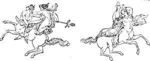

  
[Intangible Textual Heritage](../../index)  [Classics](../index) 
[Index](index)  [Previous](ebm10)  [Next](ebm12) 

------------------------------------------------------------------------

  
*The Eleusinian and Bacchic Mysteries*, by Thomas Taylor, \[1891\], at
Intangible Textual Heritage

------------------------------------------------------------------------

p. 241

   
Nymphs and Centaurs.

#### GLOSSARY.

*Aporrheta*, Greek απορῥητα—The instructions given by the hierophant or
interpreter in the Eleusinian Mysteries, not to be disclosed on pain of
death. There was said to be a synopsis of them in the *petroma* or two
stone tablets, which, it is said, were bound together in the form of a
book.

*Apostatise*—To fall or descend, as the spiritual part of the soul is
said to descend from its divine home to the world of nature.

*Cathartic*—Purifying. The term was used by the Platonists and others in
connection with the ceremonies of purification before initiation, also
to the corresponding performance of rites and duties which renewed the
moral life. The *cathartic* virtues were the duties and mode of living,
which conduced to that end. The phrase is used but once or twice in this
edition.

*Cause*—The agent by which things are generated or produced.

*Circulation*—The peculiar spiral motion or progress by which the
spiritual nature or “intellect” descended from the divine region of the
universe into the world of sense.

*Cogitative*—Relating to the understanding: dianoetic.

*Conjecture*, or *Opinion*—A mental conception that can be changed by
argument.

*Coré*—A name of Ceres or Demeter, applied by the Orphic and later
writers to her daughter Persephoné or Proserpina. She was supposed to
typify the spiritual nature which was abducted

p. 242

*Coré*—*continued*.  
by Hades or Pluto into the Underworld, the figure signifying the
apostasy or descent of the soul from the higher life to the material
body.

*Corically*—After the manner of Proserpina, *i. e.*, as if descending
into death from the supernal world.

*Dæmon*—A designation of a certain class of divinities. Different
authors employ the term differently. Hesiod regards them as the souls of
the men who lived in the Golden Age, now acting as guardian or tutelary
spirits. Socrates, in the *Cratylus*, says “that dæmon is a term
denoting wisdom, and that every good man is dæmonian, both while living
and when dead, and is rightly called a dæmon.” His own attendant spirit
that checked him whenever he endeavored to do what he might not, was
styled his Dæmon. Iamblichus places Dæmons in the second order of
spiritual existence.—Cleanthes, in his celebrated *Hymn*, styles Zeus
δαιμον (*daimon*).

*Demiurgus*—The creator. It was the title of the; chief-magistrate in
several Grecian States, and in this work is applied to Zeus or Jupiter,
or the Ruler of the Universe. The latter Platonists, and more especially
the Gnostics, who regarded matter as constituting or containing the
principle of Evil, sometimes applied this term to the Evil Potency, who,
some of them affirmed, was the Hebrew God.

*Distributed*—Reduced from a whole to parts and scattered. The spiritual
nature or intellect in its higher estate was regarded as a whole, but in
descending to worldly conditions became divided into parts or perhaps
characteristics.

*Divisible*—Made into parts or attributes, as the mind, intellect, or
spiritual, first a whole, became thus distinguished in its descent. This
division was regarded as a fall into a lower plane of life.

*Energise*, Greek ενεργεω—To operate or work, especially to undergo
discipline of the heart and character.

p. 243

*Energy*—Operation, activity.

*Eternal*—Existing through all past time, and still continuing.

*Faith*—The correct conception of a thing as it seems,—fidelity.

*Freedom*—The ruling power of one’s life; a power over what pertains to
one’s self in life.

*Friendship*—Union of sentiment; a communion in doing well.

*Fury*—The peculiar mania, ardor, or enthusiasm which inspired and
actuated prophets, poets, interpreters of oracles, and others; also a
title of the goddesses Demeter and Persephone as the chastisers of the
wicked,—also of the Eumenides.

*Generation*, Greek γενεσις—Generated existence, the mode of life
peculiar to this world, but which is equivalent to death, so far as the
pure intellect or spiritual nature is concerned; the process by which
the soul is separated from the higher form of existence, and brought
into the conditions of life upon the earth. It was regarded as a
punishment, and according to Mr. Taylor, was prefigured by the abduction
of Proserpina. The soul is supposed to have pre-existed with God as a
pure intellect like him, but not actually identical—at one but not
absolutely the same.

*Good*—That which is desired on its own account.

*Hades*—A name of Pluto; the Underworld, the state or region of departed
souls, as understood by classic writers; the physical nature, the
corporeal existence, the condition of the soul while in the bodily life.

*Herald*, Greek κηρυξ—The crier at the Mysteries.

*Hierophant*—The interpreter who explained the purport of the mystic
doctrines and dramas to the candidates.

*Holiness*, Greek ὁσιοτης—Attention to the honor due to God.

*Idea*—A principle in all minds underlying our cognitions of the
sensible world.

*Imprudent*—Without foresight; deprived of sagacity.

*Infernal regions*—Hades, the Underworld.

*Instruction*—A power to cure the soul.

p. 244

*Intellect*, Greek νους—Also rendered *pure reason*, and by Professor
Cocker, *intuitive reason*, and the rational soul; the spiritual nature.
“The organ of self-evident, necessary, and universal truth. In an
immediate, direct, and intuitive manner, it takes hold on truth with
absolute certainty. The reason, through the medium of *ideas*, holds
communion with the world of real Being. These ideas are the *light*
which reveals the world of unseen realities, as the sun reveals the
world of sensible forms. ‘*The Idea of the good* is the *Sun* of the
Intelligible World; it sheds on objects the light of truth, and gives to
the soul that knows the power of knowing.’ Under this light the eye of
reason apprehends the eternal world of being as truly, yet more truly,
than the eye of sense apprehends the world of phenomena. This power the
rational soul possesses by virtue of its having a nature kindred, or
even homogeneous with the Divinity. It was ‘generated by the Divine
Father,’ and like him, it is in a certain sense ‘eternal.’ Not that we
are to understand Plato as teaching that the rational soul had an
independent and underived existence; it was created or ‘generated’ in
eternity, and even now, in its incorporate state, is not amenable to the
condition of time and space, but, in a peculiar sense, dwells in
eternity: and therefore is capable of beholding eternal realities, and
coming into communion with absolute beauty, and goodness, and truth—that
is, with God, the *Absolute Being*.”—*Christianity and Greek
Philosophy*, x. pp. 349, 350.

*Intellective*—Intuitive; perceivable by spiritual insight.

*Intelligible*—Relating to the higher reason.

*Interpreter*—The hierophant or sacerdotal teacher who, on the last day
of the Eleusinia, explained the *petroma* or stone book to the
candidates, and unfolded the final meaning of the representations and
symbols. In the Phoenician language he was called פתר, *peter*. Hence
the *petroma*, consisting of two tablets of stone, was a pun on the
designation, to imply the

p. 245

*Interpreter—continued*.  
wisdom to be unfolded. It has been suggested by the Rev, Mr. Hyslop,
that the Pope derived his claim, as the successor of Peter, from his
succession to the rank and function of the Hierophant of the Mysteries,
and not from the celebrated Apostle, who probably was never in Rome.

*Just*—Productive of Justice.

*Justice*—The harmony or perfect proportional action of all the powers
of the soul, and comprising equity, veracity, fidelity, usefulness,
benevolence, and purity of mind, or holiness.

*Judgment*—A peremptory decision covering a disputed matter; also
διανοια, *dianoia*, or understanding.

*Knowledge*—A comprehension by the mind of fact not to be overthrown or
modified by argument.

*Legislative*—Regulating.

*Lesser Mysteries*—The τελεται, *teletai*, or ceremonies of
purification, which were celebrated at Agræ, prior to full initiation at
Eleusis. Those initiated on this occasion were styled μυσται, *mystæ*,
from μυω, *muo*, to vail; and their initiation was called μυησις,
*muesis*, or vailing, as expressive of being vailed from the former
life.

*Magic*—Persian *mag*, Sanscrit *maha*, great. Relating to the order of
the Magi of Persia and Assyria.

*Material dæmons*—Spirits of a nature so gross as to be able to assume
visible bodies like individuals still living on the Earth.

*Matter*—The elements of the world, and especially of the human body, in
which the idea of evil is contained and the soul incarcerated. Greek
ὑλη, *Hulé* or *Hylé*.

*Muesis*, Greek μυησις, from μυω, to vail—The last act in the Lesser
Mysteries, or τελεται, *teletai*, denoting the separating of the
initiate from the former exotic life.

*Mysteries*—Sacred dramas performed at stated periods. The most
celebrated were those of Isis, Sabazius, Cybelè, and Eleusis.

p. 246

*Mystic*—Relating to the Mysteries: a person initiated in the Lesser
Mysteries—Greek μυσται.

*Occult*—Arcane; hidden; pertaining to the mystical sense.

*Orgies*, Greek οργιαι—The peculiar rites of the Bacchic Mysteries.

*Opinion*—A hypothesis or conjecture.

*Partial*—Divided, in parts, and not a whole.

*Philologist*—One pursuing literature.

*Philosopher*—One skilled in philosophy; one disciplined in a right
life.

*Philosophise*—To investigate final causes; to undergo discipline of the
life.

*Philosophy*—The aspiration of the soul after wisdom and truth, “Plato
asserted philosophy to be the science of unconditioned being, and
asserted that this was known to the soul by its intuitive reason
(intellect or spiritual instinct) which is the organ of all philosophic
insight. The reason perceives substance; the understanding, only
phenomena. Being (το ον), which is the reality in all actuality, is in
the ideas or thoughts of God; and nothing exists (or appears outwardly),
except by the force of this indwelling idea. The word is the true expression of the nature of
every object: for each has its divine and natural name, besides its
accidental human appellation. Philosophy is the recollection of what the
soul has seen of things and their names.” (J.
Freeman Clarke.)

*Plotinus*—A philosopher who lived in the Third Century, and revived the
doctrines of Plato.

*Prudent*—Having foresight.

*Purgation, purification*—The introduction into the *Teletæ* or Lesser
Mysteries; a separation of the external principles from the soul.

*Punishment*—The curing of the soul of its errors.

*Prophet*, Greek μαντις,—One possessing the prophetic mania, or
inspiration.

*Priest*—Greek μαντις—A prophet or inspired person, ἱερευς—a sacerdotal
person.

p. 247

*Revolt*—A rolling away, the career of the soul in its descent from the
pristine divine condition.

*Science*—The knowledge of universal, necessary, unchangeable, and
eternal ideas.

*Shows*—The peculiar dramatic representations of the Mysteries.

*Teleté*, Greek τελετη—The finishing or consummation; the Lesser
Mysteries.

*Theologist*—A teacher of the literature relating to the gods.

*Theoretical*—Perceptive.

*Torch bearer*—A priest who bore a torch at the Mysteries.

*Titans*—The beings who made war against Kronos or Saturn. E. Pococke
identifies them with the *Daityas* of India, who resisted the Brahmans.
In the Orphic legend, they are described as slaying the child
Bacchus-Zagreus.

*Titanic*—Relating to the nature of Titans.

*Transmigration*—The passage of the soul from one condition of being to
another. This has not any necessary reference to any rehabilitation in a
corporeal nature, or body of flesh and blood. See I *Corinthians*, XV.

*Virtue*—A good mental condition; a stable disposition.

*Virtues*—Agencies, rites, influences. *Cathartic Virtues*—Purifying
rites or influences.

*Wisdom*—The knowledge of things as they exist; “the approach to God as
the substance of goodness in truth.”

*World*—The cosmos, the universe, as distinguished from the earth and
human existence upon it.

   
Eleusinian Priest and Assistants.

------------------------------------------------------------------------

[Next: List of Illustrations](ebm12)
