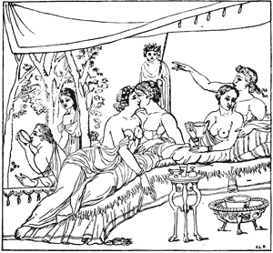

  
[Intangible Textual Heritage](../../index)  [Classics](../index) 
[Index](index)  [Previous](ebm11) 

------------------------------------------------------------------------

  
*The Eleusinian and Bacchic Mysteries*, by Thomas Taylor, \[1891\], at
Intangible Textual Heritage

------------------------------------------------------------------------

p. 248

   
Fortune and the Three Fates.

LIST OF ILLUSTRATIONS.

##### DRAWN FROM THE ANTIQUE BY A. L. RAWSON.

------------------------------------------------------------------------

A description of the illustrations to
this volume properly includes the two or three theories of human life
held by the ancient Greeks, and the beautiful myth of Demeter and
Proserpina, the most charming of all mythological fancies, and the
Orgies of Bacchus, which together supplied the motives to the artists of
the originals from which these drawings were made.

From them we learn that it was believed that the soul is a part of, or a
spark from, the Great Soul of the Kosmos, the Central Sun of the
intellectual universe, and therefore immortal; has lived before, and
will continue to live after this “body prison” is dissolved; that the
river Styx is between us and the unseen world, and hence we have no
recollection of any former state of existence; and that the body is
Hades, in which the soul is made to suffer for past misdeeds done in the
unseen world.

Poets and philosophers, tragedians and comedians, embellished the myth
with a thousand fine fancies which were

p. 249

woven into the ritual of Eleusis, or were presented in the theaters
during the Bacchic festivals.

The pictures include, beside the costumes of priests, priestesses, and
their attendants, and of the fauns and satyrs, many of the sacred
vessels and implements used in celebrating the Mysteries, in the orgies,
and in the theaters, all of which were drawn by the ancient artists from
the objects represented, and their work has been carefully followed
here.

Page.

<table width="100%">
<colgroup>
<col style="width: 33%" />
<col style="width: 33%" />
<col style="width: 33%" />
</colgroup>
<tbody>
<tr class="odd">
<td data-valign="top">
1.
</td>
<td data-valign="top">
Frontispiece. Sacrifice to Ceres.—<em>Denkmäler, sculptur</em>. 
The goddess stands near a serpent-guarded altar, on which a sheaf of grain is aflame. Worshipers attend, and Jupiter approves. (See page <a href="ebm04.htm#page_17">17</a>.)
</td>
<td></td>
</tr>
<tr class="even">
<td data-valign="top">
2.
</td>
<td data-valign="top">
Decorating a Statue of Bacchus.—<em>Rom. Campana</em>. 
The priest wears a lamb-skin skirt, the thyrsus is a natural vine with grape clusters, and there are fruit and wine bearers.
</td>
<td data-valign="top">
<a href="ebm01.htm#page_4">4</a>
</td>
</tr>
<tr class="odd">
<td data-valign="top">
3.
</td>
<td data-valign="top">
Bacchantes with Thyrsus and Flute.—<em>Rom. Camp</em>. 
Two fragments.
</td>
<td data-valign="top">
<a href="ebm01.htm#page_4">4</a>
</td>
</tr>
<tr class="even">
<td data-valign="top">
4.
</td>
<td data-valign="top">
Symbolical Ceremony.—<em>Rom. Camp.</em> 
Torch and thyrsus bearers and faun. See cut No. 40, and page <a href="ebm06.htm#page_208">208</a> for reference to pine nut.
</td>
<td data-valign="top">
<a href="ebm01.htm#page_4">4</a>
</td>
</tr>
<tr class="odd">
<td data-valign="top">
5.
</td>
<td data-valign="top">
Bacchus and Nymphs.
</td>
<td data-valign="top">
<a href="ebm01.htm#page_5">5</a>
</td>
</tr>
<tr class="even">
<td data-valign="top">
6.
</td>
<td data-valign="top">
Pluto, Proserpina, and Furies.—<em>Galerie des Peintres</em>. 
The Furies were said to be children of Pluto and Proserpina; other accounts say of Nox and Acheron, and Acheron was a son of Ceres without a father. (See page <a href="ebm05.htm#page_65">65</a>.)
</td>
<td data-valign="top">
<a href="ebm01.htm#page_5">5</a>
</td>
</tr>
<tr class="odd">
<td data-valign="top">
7.
</td>
<td data-valign="top">
Priestess with Amphora and Sacred Cake.
</td>
<td data-valign="top">
<a href="ebm01.htm#page_6">6</a>
</td>
</tr>
<tr class="even">
<td data-valign="top">
8.
</td>
<td data-valign="top">
Priestess with Musical Instruments.
</td>
<td data-valign="top">
<a href="ebm01.htm#page_6">6</a>
</td>
</tr>
<tr class="odd">
<td data-valign="top">
9.
</td>
<td data-valign="top">
Faun Kissing Bacchante.—<em>Bourbon Mus.</em>
</td>
<td data-valign="top">
<a href="ebm01.htm#page_6">6</a>
</td>
</tr>
<tr class="even">
<td data-valign="top">
10.
</td>
<td data-valign="top">
Faun and Bacchus.—<em>Bourbon Mus.</em>
</td>
<td data-valign="top">
<a href="ebm01.htm#page_6">6</a>
</td>
</tr>
</tbody>
</table>

p. 250

Page.

<table width="100%">
<colgroup>
<col style="width: 33%" />
<col style="width: 33%" />
<col style="width: 33%" />
</colgroup>
<tbody>
<tr class="odd">
<td data-valign="top">
11.
</td>
<td data-valign="top">
Etruscan Vase.—<em>Millingen.</em> 
See drawings on page <a href="ebm05.htm#page_106">106</a>.
</td>
<td data-valign="top">
<a href="ebm02.htm#page_7">7</a>
</td>
</tr>
<tr class="even">
<td data-valign="top">
12.
</td>
<td data-valign="top">
Mercury Presenting a Soul to Pluto.—<em>Pict. Ant. Sep. Nasonum, pl</em>. I, 8.
</td>
<td data-valign="top">
<a href="ebm03.htm#page_8">8</a>
</td>
</tr>
<tr class="odd">
<td data-valign="top">
13.
</td>
<td data-valign="top">
Mystic Rites.—<em>Admiranda, tau</em>. 17.
</td>
<td data-valign="top">
<a href="ebm03.htm#page_8">8</a>
</td>
</tr>
<tr class="even">
<td data-valign="top">
14.
</td>
<td data-valign="top">
Eleusinian Ceremony.—<em>Oest. Denk. Alt. Kunst</em>, II., 8.
</td>
<td data-valign="top">
<a href="ebm03.htm#page_8">8</a>
</td>
</tr>
<tr class="odd">
<td data-valign="top">
15.
</td>
<td data-valign="top">
Bacchic Festival.—<em>Bartoli, Admiranda</em>, 43. 
Probably a stage scene. The characters are the king, who was an archon of Athens; a thyrsus bearer, musician, wine and fruit bearers, dancers, and Pluto and Proserpina. A boy removes the king’s sandal. (See page <a href="ebm05.htm#page_35">35</a>.)
</td>
<td data-valign="top">
<a href="ebm03.htm#page_9">9</a>
</td>
</tr>
<tr class="even">
<td data-valign="top">
16.
</td>
<td data-valign="top">
Apollo and the Muses.—<em>Florentine Museum.</em> 
The muses were the daughters of Jupiter and Mnemosyne; that is, of the god of the present instant, and of memory. Their office was, in part, to give information to any inquiring soul, and to preside over the various arts and sciences. They were called by various names derived from the places where they were worshiped: Aganippides, Aonides, Castalides, Heliconiades, Lebetheides, Pierides, and others. Apollo was called Musagetes, as their leader and conductor. The palm tree, laurel, fountains on Helicon, Parnassus, Pindus, and other sacred mountains, were sacred to the muses.
</td>
<td data-valign="top">
<a href="ebm03.htm#page_10">10</a>
</td>
</tr>
<tr class="odd">
<td data-valign="top">
17.
</td>
<td data-valign="top">
Prometheus Forms a Woman.—<em>Visconti, Mus. Pio. Clem</em>., IV., 34. 
Mercury, the messenger of the gods, brings a soul from Jupiter for the body made by Prometheus, and the three Fates attend. The Athenians built an altar for the worship of Prometheus in the grove of the Academy.
</td>
<td data-valign="top">
<a href="ebm04.htm#page_11">11</a>
</td>
</tr>
<tr class="even">
<td data-valign="top">
18.
</td>
<td data-valign="top">
Procession of Iacchus and Phallus.—<em>Montfaucon</em>. 
From Athens to Eleusis, on the sixth day of the Eleusinia. The statue is made to play its part in a mystic ceremony, typifying the union of the sexes in generation. Attendant priestesses bear a basket of dried figs and a phallus, baskets of fruit, vases of wine, with clematis, and musical and sacrificial instruments. None but women and children were permitted to take part in this ceremony. The wooden emblem of fecundity was an object of supreme veneration, and the ceremony of placing and hooding it. was assigned to the most highly respected woman in Athens, as a mark of honor. Lucian and Plutarch
</td>
<td data-valign="top">
<a href="ebm04.htm#page_16">16</a>
</td>
</tr>
</tbody>
</table>

p. 251

Page.

<table width="100%">
<colgroup>
<col style="width: 33%" />
<col style="width: 33%" />
<col style="width: 33%" />
</colgroup>
<tbody>
<tr class="odd">
<td></td>
<td data-valign="top">
say the phallus bearers at Rome carried images (phalloi) at the top of long poles, and their bodies were stained with wine lees, and partly covered with a lamb-skin, their heads crowned with a wreath of ivy. (See page <a href="ebm04.htm#page_14">14</a>.)
</td>
<td></td>
</tr>
<tr class="even">
<td data-valign="top">
19, 20, 21.
</td>
<td data-valign="top">
From Etruscan Vases—<em>Florentine Museum</em>. 
Human sacrifice may be indicated in the lower group.
</td>
<td data-valign="top">
<a href="ebm04.htm#page_22">22</a>
</td>
</tr>
<tr class="odd">
<td data-valign="top">
22.
</td>
<td data-valign="top">
Venus and Proserpina in Hades.<em>—Galerie des Peintres.</em> 
The myth relates that Venus gave Proserpina a pomegranate to eat in Hades, and so made her subject to the law which required her to remain four months of each year with Pluto in the Underworld, for Venus is the goddess who presides over birth and growth in all cases. Cerberus (see page <a href="ebm05.htm#page_65">65</a>) keeps guard, and one of the heads holds her garment, signifying that his master is entitled to one-third of her time.
</td>
<td data-valign="top">
<a href="ebm04.htm#page_28">28</a>
</td>
</tr>
<tr class="even">
<td data-valign="top">
23.
</td>
<td data-valign="top">
Rape of Proserpina. Carried Down to Hades (Invisibility)—<em>Flor. Mus</em>. 
See note, p. <a href="ebm05.htm#page_152">152</a>.
</td>
<td data-valign="top">
<a href="ebm04.htm#page_29">29</a>
</td>
</tr>
<tr class="odd">
<td data-valign="top">
24.
</td>
<td data-valign="top">
Pallas, Venus, and Diana Consulting.<em>—Gal. des Peint.</em> 
Jupiter ordered these divinities to excite desire in the heart of Proserpina as a means of leading her into the power of the richest of all monarchs, the one who most abounds in treasures. (See page <a href="ebm05.htm#page_140">140</a>.)
</td>
<td data-valign="top">
<a href="ebm04.htm#page_30">30</a>
</td>
</tr>
<tr class="even">
<td data-valign="top">
25.
</td>
<td data-valign="top">
Dionysus as God of the Sun.—<em>Pit. Ant. Ercolano</em>. 
Dionysus—Bacchus—symbolizes the sun as god of the seasons; rides on a panther, pours wine into a drinking-horn held by a satyr, who also carries a wine skin bottle. The winged genii of the seasons attend. Winter carries two geese and a cornucopia; Spring holds in one hand the mystical cist, and in the other the mystic zone; Summer bears a sickle and a sheaf of grain; and Autumn has a hare and a horn-of-plenty full of fruits. Fauns, satyrs, boy-fauns, the usual attendants of Bacchus, play with goats and panthers between the legs of the larger figures.
</td>
<td data-valign="top">
<a href="ebm05.htm#page_31">31</a>
</td>
</tr>
<tr class="odd">
<td data-valign="top">
26.
</td>
<td data-valign="top">
Herse and Mercury.<em>—Pit. Ant. Ercolano.</em> 
A fabled love match between the god and a daughter of Cecrops, the Egyptian who founded Athens, supplied the ritual for the festivals Hersephoria, in which young girls of seven to eleven years, from the most noted families, dressed in
</td>
<td data-valign="top">
<a href="ebm05.htm#page_42">42</a>
</td>
</tr>
</tbody>
</table>

p. 252

Page.

<table width="100%">
<colgroup>
<col style="width: 33%" />
<col style="width: 33%" />
<col style="width: 33%" />
</colgroup>
<tbody>
<tr class="odd">
<td></td>
<td>
white, carried the sacred vessels and implements used in the Mysteries in procession. Cakes of a peculiar form were made for the occasion.
</td>
<td></td>
</tr>
<tr class="even">
<td data-valign="top">
27.
</td>
<td data-valign="top">
Narcissus Sees His Image in Water.<em>—P. Ovid. Naso.</em> 
The son of Cephissus and Liriope, an Oceanid, was said to be very beautiful. He sought to win the favor of the nymph of the fountain where he saw his face reflected, and failing, he drowned himself in chagrin. The gods, unwilling to lose so much beauty, changed him into the flower now known by his name. (See page <a href="ebm05.htm#page_150">150</a>.)
</td>
<td data-valign="top">
<a href="ebm05.htm#page_42">42</a>
</td>
</tr>
<tr class="odd">
<td data-valign="top">
28.
</td>
<td data-valign="top">
Jupiter as Diana, and Calisto.—<em>P. Ovid. Naso.</em> 
The supreme deity of the ancients, beside numerous marriages, was credited with many amours with both divinities and mortals. In some of those adventures he succeeded by using a disguise, as here in the form of the Queen of the Starry Heavens, when he surprised Calisto (Helice), a daughter of Lycaon, king of Arcadia, an attendant on Diana. The companions of that goddess were pledged to celibacy. Jupiter, in the form of a swan, surprised Leda, who became mother of the Dioscuri (twins).
</td>
<td data-valign="top">
<a href="ebm05.htm#page_62">62</a>
</td>
</tr>
<tr class="even">
<td data-valign="top">
29.
</td>
<td data-valign="top">
Diana and Calisto.—<em>Ovid. Naso, Neder.</em> 
The fable says that when Diana and her nymphs were bathing the swelling form of Calisto attracted attention. It was reported to the goddess, when she punished the maid by changing her into the form of a bear. She would have been torn in pieces by the hunter’s dogs, but Jupiter interposed and translated her to the heavens, where she forms the constellation The Great Bear. Juno was jealous of Jupiter, and requested Thetis to refuse the Great Bear permission to descend at night beneath the waves of ocean, and she, being also jealous of Poseidon, complied, and therefore the dipper does not dip, but revolves close around the pole star.
</td>
<td data-valign="top">
<a href="ebm05.htm#page_62">62</a>
</td>
</tr>
<tr class="odd">
<td data-valign="top">
30.
</td>
<td data-valign="top">
Bacchantes and Fauns Dancing.—<em>Rom. Campana</em>, 37. 
A stage ballet.
</td>
<td data-valign="top">
<a href="ebm05.htm#page_74">74</a>
</td>
</tr>
<tr class="even">
<td data-valign="top">
31.
</td>
<td data-valign="top">
Hercules, Bull, and Priestess.—<em>Rom. Camp</em>. 
Bacchic orgies.
</td>
<td data-valign="top">
<a href="ebm05.htm#page_74">74</a>
</td>
</tr>
<tr class="odd">
<td data-valign="top">
32.
</td>
<td data-valign="top">
Fruit and Thyrsus Bearers.—<em>Bour. Mus</em>.
</td>
<td data-valign="top">
<a href="ebm05.htm#page_84">84</a>
</td>
</tr>
<tr class="even">
<td data-valign="top">
33.
</td>
<td data-valign="top">
Torch-Bearer as Apollo.—<em>Bourbon Mus.</em>
</td>
<td data-valign="top">
<a href="ebm05.htm#page_84">84</a>
</td>
</tr>
<tr class="odd">
<td data-valign="top">
34.
</td>
<td data-valign="top">
Eleusinian Mysteries.—<em>Florence Mus</em>.
</td>
<td data-valign="top">
<a href="ebm05.htm#page_94">94</a>
</td>
</tr>
</tbody>
</table>

p. 253

Page.

35\.

Etruscan Mystic Ceremony.—*Rom. Camp.*

[94](ebm05.htm#page_94)

36\.

Etruscan Altar Group.—*Flor. Mus*.  
The mystic cist with serpent coiled around, the
sacred oaks, baskets, drinking-horns, zones, festoon of branches and
flowers, make very pretty and impressive accessories to two handsome
priestesses.

[106](ebm05.htm#page_106)

37\.

Etruscan Bacchantes.—*Millingen.*  
These two groups were drawn from a vase (page
[7](ebm02.htm#page_7)) which is a very fine work of art. The drapery,
decoration, symbols, accessories, and all the details of implements used
in the celebration of the Mysteries are very carefully drawn on the
vase, which is well preserved. This vase is a strong proof of the
antiquity of the orgies, for the Etruscans, Tyrrheni, and Tusci were
ancient before the Romans began to build on the Tiber.

[106](ebm05.htm#page_106)

38\.

Etruscan Ceremony.—*Millingen.*

[106](ebm05.htm#page_106)

39\.

Satyr, Cupid and Venus.—*Montfaucon;
Sculpture.*  
Some Roman writers affirmed that the Satyr was a
real animal, but science has dissipated that belief, and the monster has
been classed among the artificial attractions of the theater where it
belongs, and where it did a large share of duty in the Mysteries. They
were invented by the poets as an impersonation of the life that animates
the branches of trees when the wind sweeps through them, meaning,
whistling, or shrieking in the gale. They were said to be the chief
attendants on Bacchus, and to delight in revel and wine.

[110](ebm05.htm#page_110)

40\.

Cupids, Satyr, and Statue of
Priapus.—*Montfaucon.*  
The many suggestive emblems in this picture form an
instructive group, symbolic of Nature’s life-renewing power. The
ancients adored this power under the emblems of the organs of
generation. Many passages in the Bible denounce that worship, which is
called “the grove,” and usually was an upright stone, or wooden pillar,
plain or ornamented, as in Rome, where it became a statue to the waist,
as seen in the engraving. The Palladium at Athens was a Greek form. The
Druzes of Mount Lebanon in Syria now dispense with emblems of wood and
stone, and use the natural objects in their mystic rites and
ceremonies.

[110](ebm05.htm#page_110)

41\.

Apollo and Daphne,—*Galerie des Peint.*  
The rising sun shines on the dew-drops, and warming
them as they hang on the leaves of the laurel tree, they
disappear,

[118](ebm05.htm#page_118)

p. 254

Page.

<table width="100%">
<colgroup>
<col style="width: 33%" />
<col style="width: 33%" />
<col style="width: 33%" />
</colgroup>
<tbody>
<tr class="odd">
<td></td>
<td>
leaving the tree; and it is said by the poet that Apollo loves and seeks Daphne, striving to embrace her, when she flies and is transformed into a laurel tree at the instant she is embraced by the sun-god.
</td>
<td></td>
</tr>
<tr class="even">
<td data-valign="top">
42.
</td>
<td data-valign="top">
Diana and Endymion.—<em>Bourbon Mus</em>. 
Diana as the queen of the night loves Endymion, the setting sun. The lovers ever strive to meet, but inexorable fate as ever prevents them from enjoying each other’s society. The fair huntress sometimes is permitted, as when she is the new moon, or in the first quarter, to approach near the place where her beloved one lingers near the Hesperian gardens, and to follow him even to the Pillars of Hercules, but never to embrace him. The new moon, as soon as visible, sets near but not with the sun. Endymion reluctantly sinks behind the western horizon, and would linger until the loved one can be folded in his arms, but his duty calls and he must turn his steps toward the Elysian Fields to cheer the noble and good souls who await his presence, ever cheerful and benign. Diana follows closely after and is welcomed by the brave and beautiful inhabitants of the Peaceful Islands, but while receiving their homage her lover hastens on toward the eastern gates, where the golden fleece makes the morning sky resplendent.
</td>
<td data-valign="top">
<a href="ebm05.htm#page_118">118</a>
</td>
</tr>
<tr class="odd">
<td data-valign="top">
43.
</td>
<td data-valign="top">
Ceres and the Car of Triptolemus.—<em>P. Ovid. Naso, Neder</em>. 
Triptolemus (the word means three plowings) was the founder of the Eleusinian Mysteries, and was presented by Ceres with her car drawn by winged dragons, in which he distributed seed grain all over the world.
</td>
<td data-valign="top">
<a href="ebm05.htm#page_127">127</a>
</td>
</tr>
<tr class="even">
<td data-valign="top">
44.
</td>
<td data-valign="top">
Pluto Marries Proserpina.—<em>P. Ovid. Naso, Neder</em>. 
Jupiter is said to have consented to request of Pluto that Proserpina might revisit her mother’s dwelling, and the picture represents him as very earnest in his appeal to his brother. Since then the seed of grain has remained in the ground no longer than four months; the other eight it is above, in the regions of light. In the engraving a curtain is held up by bronze figures. This seems conclusive that it was a representation of a dramatic scene. (See pp. <a href="ebm05.htm#page_159">159</a>, <a href="ebm06.htm#page_186">186</a>.)
</td>
<td data-valign="top">
<a href="ebm05.htm#page_127">127</a>
</td>
</tr>
<tr class="odd">
<td data-valign="top">
45.
</td>
<td data-valign="top">
Proserpina, according to the Greeks.—<em>Heck.</em>
</td>
<td data-valign="top">
<a href="ebm05.htm#page_138">138</a>
</td>
</tr>
<tr class="even">
<td data-valign="top">
46.
</td>
<td data-valign="top">
Bacchus after the Visit to India.—<em>Heck.</em>
</td>
<td data-valign="top">
<a href="ebm05.htm#page_138">138</a>
</td>
</tr>
<tr class="odd">
<td data-valign="top">
47.
</td>
<td data-valign="top">
A Roman Figure of Ceres.—<em>Heck.</em>
</td>
<td data-valign="top">
<a href="ebm05.htm#page_138">138</a>
</td>
</tr>
</tbody>
</table>

p. 255

Page.

<table width="100%">
<colgroup>
<col style="width: 33%" />
<col style="width: 33%" />
<col style="width: 33%" />
</colgroup>
<tbody>
<tr class="odd">
<td data-valign="top">
48.
</td>
<td data-valign="top">
Demeter, from Etruscan Vase.—<em>Heck.</em>
</td>
<td data-valign="top">
<a href="ebm05.htm#page_138">138</a>
</td>
</tr>
<tr class="even">
<td data-valign="top">
49.
</td>
<td data-valign="top">
Venus, Pallas, and Diana Inspecting the Needlework of Proserpina.—<em>Galerie des Peint.</em>
</td>
<td data-valign="top">
<a href="ebm05.htm#page_142">142</a>
</td>
</tr>
<tr class="odd">
<td data-valign="top">
50.
</td>
<td data-valign="top">
Proserpina Exposed to Pluto.—<em>Ovid. Naso, Neder</em>. 
There may have been a mild sarcasm in this artist’s mind when he drew the maid as dallying with Cupid, and the richest monarch in all the earth in the distance, hastening toward her. He succeeded, as is shown in the next engraving.
</td>
<td data-valign="top">
<a href="ebm05.htm#page_152">152</a>
</td>
</tr>
<tr class="even">
<td data-valign="top">
51.
</td>
<td data-valign="top">
Pluto Carrying Off Proserpina.<em>—P. Ovid. Naso, Neder.</em> 
Eternal change is the universal law. Proserpina must go down into the Underworld that she may rise again into light and life. The seed must be planted under or into the soil that it may have a new birth and growth.
</td>
<td data-valign="top">
<a href="ebm05.htm#page_152">152</a>
</td>
</tr>
<tr class="odd">
<td data-valign="top">
52.
</td>
<td data-valign="top">
Proserpina in Pluto’s Court.—<em>Montfaucon.</em> 
As a personation she was the “Apparent Brilliance” of all fruits and flowers.
</td>
<td data-valign="top">
<a href="ebm05.htm#page_156">156</a>
</td>
</tr>
<tr class="even">
<td data-valign="top">
53.
</td>
<td data-valign="top">
Ceres in Hades.—<em>Montfaucon.</em>
</td>
<td data-valign="top">
<a href="ebm05.htm#page_162">162</a>
</td>
</tr>
<tr class="odd">
<td data-valign="top">
54.
</td>
<td data-valign="top">
Bacchus, Fauns, and Wine Jars.—<em>Montfaucon.</em>
</td>
<td data-valign="top">
<a href="ebm05.htm#page_168">168</a>
</td>
</tr>
<tr class="even">
<td data-valign="top">
55.
</td>
<td data-valign="top">
Tragic Actor.—<em>Bourbon Museum.</em>
</td>
<td data-valign="top">
<a href="ebm05.htm#page_168">168</a>
</td>
</tr>
<tr class="odd">
<td data-valign="top">
56.
</td>
<td data-valign="top">
A Group of Deities.—<em>Heck.</em> 
Pan and Dionysus, Hygeia, Hermes, Dionysus and Faunus, and Silenus.
</td>
<td data-valign="top">
<a href="ebm05.htm#page_168">168</a>
</td>
</tr>
<tr class="even">
<td data-valign="top">
57.
</td>
<td data-valign="top">
Night with Her Starry Canopy.—<em>Heck.</em>
</td>
<td data-valign="top">
<a href="ebm05.htm#page_168">168</a>
</td>
</tr>
<tr class="odd">
<td data-valign="top">
58.
</td>
<td data-valign="top">
The Three Graces.—<em>Heck.</em>
</td>
<td data-valign="top">
<a href="ebm05.htm#page_168">168</a>
</td>
</tr>
<tr class="even">
<td data-valign="top">
59.
</td>
<td data-valign="top">
Cupid Asleep in the Arms of Venus.—<em>Galerie des Peint</em>.
</td>
<td data-valign="top">
<a href="ebm05.htm#page_174">174</a>
</td>
</tr>
<tr class="odd">
<td data-valign="top">
60.
</td>
<td data-valign="top">
Prize Dance between a Satyr and a Goat.—<em>Antichi</em>.
</td>
<td data-valign="top">
<a href="ebm05.htm#page_174">174</a>
</td>
</tr>
<tr class="even">
<td data-valign="top">
61.
</td>
<td data-valign="top">
Baubo and Ceres at Eleusis.—<em>Galerie des Peint</em>. 
See page <a href="ebm08.htm#page_232">232</a>.
</td>
<td data-valign="top">
<a href="ebm05.htm#page_174">174</a>
</td>
</tr>
</tbody>
</table>

p. 256

Page.

<table width="100%">
<colgroup>
<col style="width: 33%" />
<col style="width: 33%" />
<col style="width: 33%" />
</colgroup>
<tbody>
<tr class="odd">
<td data-valign="top">
62.
</td>
<td data-valign="top">
Psyche Asleep in Hades.<em>—From the ruins of the Bath of Titus, Rome.</em> 
See page <a href="ebm05.htm#page_45">45</a>.
</td>
<td data-valign="top">
<a href="ebm06.htm#page_186">186</a>
</td>
</tr>
<tr class="even">
<td data-valign="top">
63.
</td>
<td data-valign="top">
Nymphs of the Four Rivers in Hades.<em>—Tomb of the Nasons.</em> 
“It was easy for poets and mythographers, when they had once started the idea of a gloomy land watered with the rivers of woe, to place Styx, the stream which makes men shudder, as the boundary which separates it from the world of living men, and to lead through it the channels of Lêthê, in which all things are forgotten, of Kokytos, which echoes only with shrieks of pain, and of Pyryphlegethon, with its waves of fire.” Acheron, in the early myths, was the only river of Hades.
</td>
<td data-valign="top">
<a href="ebm06.htm#page_187">187</a>
</td>
</tr>
<tr class="odd">
<td data-valign="top">
64.
</td>
<td data-valign="top">
Etruscan Vase Group.—<em>Millingen.</em>
</td>
<td data-valign="top">
<a href="ebm06.htm#page_198">198</a>
</td>
</tr>
<tr class="even">
<td data-valign="top">
65.
</td>
<td data-valign="top">
Dancers, Etruscans.—<em>Millin,</em> 1 <em>pl</em>. 27.
</td>
<td data-valign="top">
<a href="ebm06.htm#page_198">198</a>
</td>
</tr>
<tr class="odd">
<td data-valign="top">
66.
</td>
<td data-valign="top">
Greek Convivial Scene.—<em>Millin</em>, 1 <em>pl.</em> 38.
</td>
<td data-valign="top">
<a href="ebm06.htm#page_198">198</a>
</td>
</tr>
<tr class="even">
<td data-valign="top">
67.
</td>
<td data-valign="top">
Faun and Bacchante.—<em>Bour. Mus.</em>
</td>
<td data-valign="top">
<a href="ebm06.htm#page_206">206</a>
</td>
</tr>
<tr class="odd">
<td data-valign="top">
68.
</td>
<td data-valign="top">
Thyrsus-Bearer.—<em>Bourbon Museum.</em>
</td>
<td data-valign="top">
<a href="ebm06.htm#page_206">206</a>
</td>
</tr>
<tr class="even">
<td data-valign="top">
69.
</td>
<td data-valign="top">
Bacchante and Faun.—<em>Bour. Mus.</em> 
These three very graceful pictures were drawn from paintings on walls in Herculaneum.
</td>
<td data-valign="top">
<a href="ebm06.htm#page_206">206</a>
</td>
</tr>
<tr class="odd">
<td data-valign="top">
70.
</td>
<td data-valign="top">
King, Torch, Fruit, and Thyrsus Bearer.
</td>
<td data-valign="top">
<a href="ebm06.htm#page_212">212</a>
</td>
</tr>
<tr class="even">
<td data-valign="top">
71.
</td>
<td data-valign="top">
Hercules Reclining.—<em>Zoëga, Bassirilievi,</em> 70. 
Here is an actual ceremony in which many actors took parts; with an altar, flames, a torch, tripod, the kerux (crier), bacchantes, fauns, and other attendants on the celebration of the Mysteries, including the role of an angel with wings.
</td>
<td data-valign="top">
<a href="ebm06.htm#page_212">212</a>
</td>
</tr>
<tr class="odd">
<td data-valign="top">
72.
</td>
<td data-valign="top">
Marriage (or Adultery) of Mars and Venus.—<em>Montfaucon</em>. 
See pages <a href="ebm08.htm#page_231">231</a>-<a href="ebm08.htm#page_237">237</a>. If this is from a scene as played at the Bacchic theaters, those dramas must have been very popular, and justly so. To those theaters, which were supported by the government in Athens and in many other cities throughout Greece, we owe the immortal works of Æschylus and Sophocles.
</td>
<td data-valign="top">
<a href="ebm06.htm#page_220">220</a>
</td>
</tr>
</tbody>
</table>

p. 257

Page.

<table width="100%">
<colgroup>
<col style="width: 33%" />
<col style="width: 33%" />
<col style="width: 33%" />
</colgroup>
<tbody>
<tr class="odd">
<td data-valign="top">
73.
</td>
<td data-valign="top">
Musical Conference (Epithalamium).—<em>S. Bartoli, Admiranda, pl.</em> 62. 
Written music was evidently used, for one of the company is writing as if correcting the score, and writing with the left hand.
</td>
<td data-valign="top">
<a href="ebm07.htm#page_228">228</a>
</td>
</tr>
<tr class="even">
<td data-valign="top">
74.
</td>
<td data-valign="top">
Venus Rising from the Sea.—<em>Ovid. Naso, Verburg</em>. 
This goddess was called Venus Anadyomene, for the poets said she rose from the sea—the morning sunlight on the foam of the sea on the shore of the island Cythera, or Cyprus, or wherever the poet may choose as the favored place for the manifestation of the generative power of nature, and wherever flowers show her footprints. The loves bear aloft her magic girdle, which Juno borrowed as a means of winning back Jupiter’s affection. The rose and the myrtle were sacred to her. Her worship was the motive for building temples in Cythera and in Cyprus at Amathus, Idalium. Golgoi, and in many other places. (See engravings 22, 39, and 49, and page <a href="ebm08.htm#page_230">230</a>.)
</td>
<td data-valign="top">
<a href="ebm08.htm#page_229">229</a>
</td>
</tr>
<tr class="odd">
<td data-valign="top">
75.
</td>
<td data-valign="top">
Jupiter Disguised as Diana, and Calisto.<em>—Ovid. Naso, Neder.</em> 
The gods were said to have the power, and to practice assuming the form of any other of their train, or of any animal. In these disguises they are supposed to play tricks on each other as here. Diana is the queen of the night sky, Calisto is one of her attendants, and many white clouds float over the blue ether (Jupiter), and are chased by the winds (as dogs).
</td>
<td data-valign="top">
<a href="ebm08.htm#page_234">234</a>
</td>
</tr>
<tr class="even">
<td data-valign="top">
76.
</td>
<td data-valign="top">
Hercules, Deianeira, and Nessus.<em>—Ovid. Naso, Neder.</em> 
The sun nears the end of the day’s journey; he is aged and weary; dark clouds obscure his face and obstruct his way, but still Hercules loves beautiful things, and Deianeira, the fair daughter of the king of Ætolia, retires with him into exile. At a ford the hero entrusts his bride to Nessus the Centaur, to carry across the river. The ferryman made love to the lady, and Hercules resented the indiscretion, and wounded him by an arrow. Dying Nessus tells Deianeira to keep his blood as a love charm in case her husband should love another woman. Hercules did love another, named Iole, and Deianeira dipped his shirt in the blood of Nessus—the crimson and scarlet clouds of a splendid sunset are made glorious by the blood of Nessus, and Hercules is burnt on the funeral pyre of scarlet and crimson sunset clouds.
</td>
<td data-valign="top">
<a href="ebm08.htm#page_234">234</a>
</td>
</tr>
</tbody>
</table>

p. 258

Page.

<table width="100%">
<colgroup>
<col style="width: 33%" />
<col style="width: 33%" />
<col style="width: 33%" />
</colgroup>
<tbody>
<tr class="odd">
<td data-valign="top">
77.
</td>
<td data-valign="top">
The Sacrifice.—<em>Herculaneum</em>, IV., 13.
</td>
<td data-valign="top">
<a href="ebm08.htm#page_237">237</a>
</td>
</tr>
<tr class="even">
<td data-valign="top">
78.
</td>
<td data-valign="top">
Hercules Drunk.—<em>Zoëga, Bassirilievi</em>, tav. 67.
</td>
<td data-valign="top">
<a href="ebm09.htm#page_238">238</a>
</td>
</tr>
<tr class="odd">
<td data-valign="top">
79.
</td>
<td data-valign="top">
Proserpina Enthroned in Hades.—<em>Archäol. Zeit</em>. 
The principle of growth rules the Underworld.
</td>
<td data-valign="top">
<a href="ebm10.htm#page_240">240</a>
</td>
</tr>
<tr class="even">
<td data-valign="top">
80.
</td>
<td data-valign="top">
Bacchante and Centaur.—<em>Bourbon Mus.</em>
</td>
<td data-valign="top">
<a href="ebm11.htm#page_241">241</a>
</td>
</tr>
<tr class="odd">
<td data-valign="top">
81.
</td>
<td data-valign="top">
Bacchante and Centauress.—<em>Bourbon Mus</em>.
</td>
<td data-valign="top">
<a href="ebm11.htm#page_241">241</a>
</td>
</tr>
<tr class="even">
<td data-valign="top">
82.
</td>
<td data-valign="top">
Eleusinian Priest and Assistants.
</td>
<td data-valign="top">
<a href="ebm11.htm#page_247">247</a>
</td>
</tr>
<tr class="odd">
<td data-valign="top">
83.
</td>
<td data-valign="top">
The Fates.—<em>Zoëga, Bassirilievi</em>, tav. 46.
</td>
<td data-valign="top">
<a href="#page_248">248</a>
</td>
</tr>
<tr class="even">
<td data-valign="top">
84.
</td>
<td data-valign="top">
Supper Scene.
</td>
<td data-valign="top">
<a href="#page_258">258</a>
</td>
</tr>
<tr class="odd">
<td data-valign="top">
85.
</td>
<td data-valign="top">
Bacchic Bull.—<em>Antichi.</em>
</td>
<td data-valign="top">
On cover.
</td>
</tr>
</tbody>
</table>

   
Supper-Scene.
