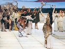

  
[Intangible Textual Heritage](../../index)  [Classics](../index) 
[Index](index)  [Previous](fsgr01)  [Next](fsgr03) 

------------------------------------------------------------------------

  
*Five Stages of Greek Religion*, by Gilbert Murray, \[1925\], at
Intangible Textual Heritage

------------------------------------------------------------------------

------------------------------------------------------------------------

p. xi

## PREFACE TO THE SECOND EDITION

In revising the *Four Stages of Greek Religion* I have found myself
obliged to change its name. I felt there was a gap in the story. The
high-water mark of Greek religious thought seems to me to have come just
between the Olympian Religion and the Failure of Nerve; and the
decline—if that is the right word—which is observable in the later ages
of antiquity is a decline not from Olympianism but from the great
spiritual and intellectual effort of the fourth century b.c., which culminated in the *Metaphysics* and the
*De Anima* and the foundation of the Stoa and the Garden. Consequently I
have added a new chapter at this point and raised the number of Stages
to five.

My friend Mr. E. E. Genner has kindly enabled me to correct two or three
errors in the first edition, and I owe special thanks to my old pupil,
Professor E. R. Dodds, for several interesting observations and
criticisms on points connected with Plotinus and Sallustius. Otherwise I
have altered little. I am only sorry to have left the book so long out
of print.

G. M.

------------------------------------------------------------------------

[Next: Preface to the First Edition](fsgr03)

