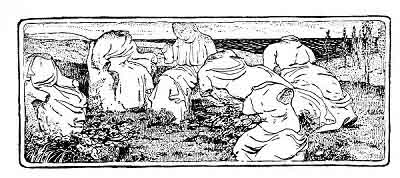
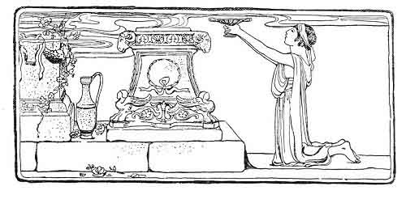

  
[Intangible Textual Heritage](../../index)  [Classics](../index) 
[Index](index)  [Previous](gft07)  [Next](gft09) 

------------------------------------------------------------------------

p. 45

 

### PART FIVE

### HOW PERSEUS CAME HOME AGAIN

AND when a year was ended, Perseus hired Phœnicians from Tyre, and cut
down cedars, and built himself a noble galley; and painted its cheeks
with vermilion, and pitched its sides with pitch; and in it he put
Andromeda, and all her dowry of jewels, and rich shawls, and spices from
the East; and great was the weeping when they rowed away. But the
remembrance of his brave deed was left behind; and Andromeda's rock was
shown at Iopa in Palestine, till more than a thousand years were past.

So Perseus and the Phœnicians rowed to the westward, across the sea of
Crete, till they came to the blue Ægean and the pleasant Isles of
Hellas, and Seriphos, his ancient home.

Then he left his galley on the beach, and went up as of old; and he
embraced his mother, and Dictys his good foster-father, and they wept
over each other a long while, for it was seven years and more since they
had met.

p. 46

Then Perseus went out, and up to the hall of Polydectes; and underneath
the goat-skin he bore the Gorgon's head.

And when he came into the hall, Polydectes sat at the table-head, and
all his nobles and landowners on either side, each according to his
rank, feasting on the fish and the goat's-flesh, and drinking the
blood-red wine. The harpers harped, and the revellers shouted, and the
wine-cups rang merrily as they passed from hand to hand, and great was
the noise in the hall of Polydectes.

Then Perseus stood upon the threshold, and called to the king by name.
But none of the guests knew Perseus, for he was changed by his long
journey. He had gone out a boy, and he was come home a hero; his eye
shone like an eagle's, and his beard was like a lion's beard, and he
stood up like a wild bull in his pride.

But Polydectes the wicked knew him, and hardened his heart still more;
and scornfully he called,--

"Ah, foundling! Have you found it more easy to promise than to fulfil?"

"Those whom the Gods help fulfil their promises; and those who despise
them, reap as they have sown. Behold the Gorgon's head!"

Then Perseus drew back the goat-skin, and held aloft the Gorgon's head.

Pale grew Polydectes and his guests as they looked upon that dreadful
face. They tried to rise up from their seats: but from their seats they
never rose, but stiffened, each man where he sat, into a ring of cold
gray stones.

p. 47

Then Perseus turned and left them, and went down to his galley in the
bay; and he gave the kingdom to good Dictys, and sailed away with his
mother and his bride.

And Polydectes and his guests sat still, with the wine-cups before them
on the board; till the rafters crumbled down above their heads, and the
walls behind their backs, and the table crumbled down between them, and
the grass sprung up about their feet: but Polydectes and his guests sit
on the hill-side, a ring of gray stones until this day.

But Perseus rowed westward toward Argos, and landed, and went up to the
town. And when he came, he found that Acrisius his grandfather had fled.
For Prœtus his wicked brother had made war against him afresh; and had
come across the river from Tiryns, and conquered Argos, and Acrisius had
fled to Larissa, in the country of the wild Pelasgi.

Then Perseus called the Argives together, and told them who he was, and
all the noble deeds which he had done. And all the nobles and the yeomen
made him king, for they saw that he had a royal heart; and they fought
with him against Argos, and took it, and killed Prœtus, and made the
Cyclopes serve them, and build them walls round Argos, like the walls
which they had built at Tiryns: and there were great rejoicings in the
vale of Argos, because they had got a king from Father Zeus.

But Perseus' heart yearned after his grandfather, and he said, "Surely
he is my flesh and blood, and he will love me now that I am come home
with honour: I will go and find him, and bring him home, and we will
reign together in peace."

p. 48

So Perseus sailed away with his Phœnicians, round Hydrea and Sunium,
past Marathon and the Attic shore, and through Euripus, and up the long
Eubœan sea, till he came to the town of Larissa, where the wild Pelasgi
dwelt.

And when he came there, all the people were in the fields, and there was
feasting, and all kinds of games; for Teutamenes their king wished to
honour Acrisius, because he was the king of a mighty land.

So Perseus did not tell his name, but went up to the games unknown; for
he said, "If I carry away the prize in the games, my grandfather's heart
will be softened toward me."

So he threw off his helmet, and his cuirass, and all his clothes, and
stood among the youths of Larissa, while all wondered at him, and said,
"Who is this young stranger, who stands like a wild bull in his pride?
Surely he is one of the heroes, the sons of the Immortals, from
Olympus."

And when the games began, they wondered yet more; for Perseus was the
best man of all, at running, and leaping, and wrestling and throwing the
javelin; and he won four crowns, and took them, and then he said to
himself, "There is a fifth crown yet to be won; I will win that, and lay
them all upon the knees of my grandfather."

And as he spoke, he saw where Acrisius sat, by the side of Teutamenes
the king, with his white beard flowing down upon his knees, and his
royal staff in his hand; and Perseus wept when he looked at him, for his
heart yearned after his kin; and he said, "Surely he is a kingly old
man, yet he need not be ashamed of his grandson."

 

[  
Click to enlarge](img/04800.jpg)  
The death of King Acrisius  

 

p. 49

Then he took the quoits, and hurled them, five fathoms beyond all the
rest; and the people shouted, "Further yet, brave stranger! There has
never been such a hurler in this land."

Then Perseus put out all his strength, and hurled. But a gust of wind
came from the sea, and carried the quoit aside, and far beyond all the
rest; and it fell on the foot of Acrisius, and he swooned away with the
pain.

Perseus shrieked, and ran up to him; but when they lifted the old man
up, he was dead, for his life was slow and feeble.

Then Perseus rent his clothes, and cast dust upon his head, and wept a
long while for his grandfather. At last he rose, and called to all the
people aloud, and said,--

"The Gods are true, and what they have ordained must be. I am Perseus,
the grandson of this dead man, the far-famed slayer of the Gorgon."

Then he told them how the prophecy had declared that he should kill his
grandfather, and all the story of his life.

So they made a great mourning for Acrisius, and burnt him on a right
rich pile; and Perseus went to the temple, and was purified from the
guilt of the death, because he had done it unknowingly.

Then he went home to Argos, and reigned there well with fair Andromeda;
and they had four sons and three daughters, and died in a good old age.

And when they died, the ancients say, Athené took them up into the sky,
with Cepheus and Cassiopœia. And there on

p. 50

starlight nights you may see them shining still; Cepheus with his kingly
crown, and Cassiopœia in her ivory chair, plaiting her star-spangled
tresses, and Perseus with the Gorgon's head, and fair Andromeda beside
him, spreading her long white arms across the heaven, as she stood when
chained to the stone for the monster. All night long, they shine, for a
beacon to wandering sailors; but all day they feast with the Gods, on
the still blue peaks of Olympus.

 

 

------------------------------------------------------------------------

[Next: Part One: How the Centaur Trained the Heroes on Pelion](gft09)
