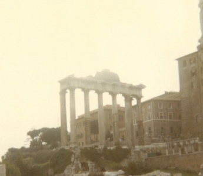

  
[Intangible Textual Heritage](../../../index)  [Classics](../../index) 
[Gibbon](../index) 

------------------------------------------------------------------------

[Buy this Book at
Amazon.com](https://www.amazon.com/exec/obidos/ASIN/B001VEIDQC/internetsacredte)

------------------------------------------------------------------------

<table width="75%">
<colgroup>
<col style="width: 50%" />
<col style="width: 50%" />
</colgroup>
<tbody>
<tr class="odd">
<td width="50%" data-valign="TOP"> 
Roman Forum [Photograph (c) 2007 Copyright J. B. Hare, All Rights Reserved]</td>
<td width="50%" data-valign="CENTER"><h1 id="decline-and-fall-of-the-roman-empire-vol.-1" data-align="CENTER">Decline and Fall of the Roman Empire, Vol. 1</h1>
<h2 id="by-edward-gibbon" data-align="CENTER">by Edward Gibbon</h2>
<h4 id="section" data-align="CENTER">[1776]</h4></td>
</tr>
</tbody>
</table>

------------------------------------------------------------------------

[Contents](#contents)    [Start Reading](daf01000)

------------------------------------------------------------------------

**Volume 1** \|  [Volume 2](../02/index) \|  [Volume 3](../03/index) \| 
[Volume 4](../04/index) \|  [Volume 5](../05/index) \|  [Volume
6](../06/index)

------------------------------------------------------------------------

|                                                                                                                           |
|---------------------------------------------------------------------------------------------------------------------------|
|  |

------------------------------------------------------------------------

 [Title Page](daf01000)  
[Introduction](daf01001)  
[Preface Of The Author.](daf01002)  
[Preface To The First Volume.](daf01003)  
[Chapter I: The Extend Of The Empire In The Age Of The Anoninies. Part
I.](daf01004)  
[Chapter I: The Extend Of The Empire In The Age Of The Anoninies. Part
II.](daf01005)  
[Chapter I: The Extend Of The Empire In The Age Of The Anoninies. Part
III.](daf01006)  
[Chapter II: The Internal Prosperity In The Age Of The Antonines. Part
I.](daf01007)  
[Chapter II: The Internal Prosperity In The Age Of The Antonines. Part
II.](daf01008)  
[Chapter II: The Internal Prosperity In The Age Of The Antonines. Part
III.](daf01009)  
[Chapter II: The Internal Prosperity In The Age Of The Antonines. Part
IV.](daf01010)  
[Chapter III: The Constitution In The Age Of The Antonines. Part
I.](daf01011)  
[Chapter III: The Constitution In The Age Of The Antonines. Part
II.](daf01012)  
[Chapter IV: The Cruelty, Follies And Murder Of Commodus. Part
I.](daf01013)  
[Chapter IV: The Cruelty, Follies And Murder Of Commodus. Part
II.](daf01014)  
[Chapter V: Sale Of The Empire To Didius Julianus. Part I.](daf01015)  
[Chapter V: Sale Of The Empire To Didius Julianus. Part II.](daf01016)  
[Chapter VI: Death Of Severus, Tyranny Of Caracalla, Usurpation Of
Marcinus. Part I.](daf01017)  
[Chapter VI: Death Of Severus, Tyranny Of Caracalla, Usurpation Of
Marcinus. Part II.](daf01018)  
[Chapter VI: Death Of Severus, Tyranny Of Caracalla, Usurpation Of
Marcinus. Part III.](daf01019)  
[Chapter VI: Death Of Severus, Tyranny Of Caracalla, Usurpation Of
Marcinus. Part IV.](daf01020)  
[Chapter VII: Tyranny Of Maximin, Rebellion, Civil Wars, Death Of
Maximin. Part I.](daf01021)  
[Chapter VII: Tyranny Of Maximin, Rebellion, Civil Wars, Death Of
Maximin. Part II.](daf01022)  
[Chapter VII: Tyranny Of Maximin, Rebellion, Civil Wars, Death Of
Maximin. Part III.](daf01023)  
[Chapter VIII: State Of Persion And Restoration Of The Monarchy. Part
I.](daf01024)  
[Chapter VIII: State Of Persion And Restoration Of The Monarchy. Part
II.](daf01025)  
[Chapter IX: State Of Germany Until The Barbarians. Part I.](daf01026)  
[Chapter IX: State Of Germany Until The Barbarians. Part
II.](daf01027)  
[Chapter IX: State Of Germany Until The Barbarians. Part
III.](daf01028)  
[Chapter X: Emperors Decius, Gallus, Aemilianus, Valerian And Gallienus.
Part I.](daf01029)  
[Chapter X: Emperors Decius, Gallus, Aemilianus, Valerian And Gallienus.
Part II.](daf01030)  
[Chapter X: Emperors Decius, Gallus, Aemilianus, Valerian And Gallienus.
Part III.](daf01031)  
[Chapter X: Emperors Decius, Gallus, Aemilianus, Valerian And Gallienus.
Part IV.](daf01032)  
[Chapter XI: Reign Of Claudius, Defeat Of The Goths. Part
I.](daf01033)  
[Chapter XI: Reign Of Claudius, Defeat Of The Goths. Part
II.](daf01034)  
[Chapter XI: Reign Of Claudius, Defeat Of The Goths. Part
III.](daf01035)  
[Chapter XII: Reigns Of Tacitus, Probus, Carus And His Sons. Part
I.](daf01036)  
[Chapter XII: Reigns Of Tacitus, Probus, Carus And His Sons. Part
II.](daf01037)  
[Chapter XII: Reigns Of Tacitus, Probus, Carus And His Sons. Part
III.](daf01038)  
[Chapter XIII: Reign Of Diocletian And This Three Associates. Part
I.](daf01039)  
[Chapter XIII: Reign Of Diocletian And This Three Associates. Part
II.](daf01040)  
[Chapter XIII: Reign Of Diocletian And This Three Associates. Part
III.](daf01041)  
[Chapter XIII: Reign Of Diocletian And This Three Associates. Part
IV.](daf01042)  
[Chapter XIV: Six Emperors At The Same Time, Reunion Of The Empire. Part
I.](daf01043)  
[Chapter XIV: Six Emperors At The Same Time, Reunion Of The Empire. Part
II.](daf01044)  
[Chapter XIV: Six Emperors At The Same Time, Reunion Of The Empire. Part
III.](daf01045)  
[Chapter XIV: Six Emperors At The Same Time, Reunion Of The Empire. Part
IV.](daf01046)  
[Chapter XV: Progress Of The Christian Religion. Part I.](daf01047)  
[Chapter XV: Progress Of The Christian Religion. Part II.](daf01048)  
[Chapter XV: Progress Of The Christian Religion. Part III.](daf01049)  
[Chapter XV: Progress Of The Christian Religion. Part IV.](daf01050)  
[Chapter XV: Progress Of The Christian Religion. Part V.](daf01051)  
[Chapter XV: Progress Of The Christian Religion. Part VI.](daf01052)  
[Chapter XV: Progress Of The Christian Religion. Part VII](daf01053)  
[Chapter XV: Progress Of The Christian Religion. Part VIII.](daf01054)  
[Chapter XV: Progress Of The Christian Religion. Part IX.](daf01055)  
