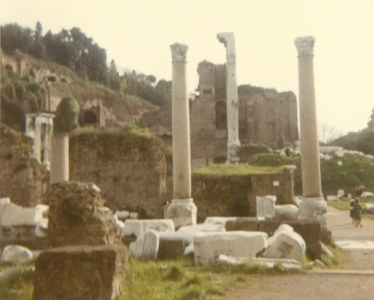

  
[Intangible Textual Heritage](../../../index)  [Classics](../../index) 
[Gibbon](../index) 

------------------------------------------------------------------------

[Buy this Book at
Amazon.com](https://www.amazon.com/exec/obidos/ASIN/B001VEIE84/internetsacredte)

------------------------------------------------------------------------

<table width="75%">
<colgroup>
<col style="width: 50%" />
<col style="width: 50%" />
</colgroup>
<tbody>
<tr class="odd">
<td width="50%" data-valign="TOP"> 
Roman Forum [Photograph (c) 2007 Copyright J. B. Hare, All Rights Reserved]</td>
<td width="50%" data-valign="CENTER"><h1 id="decline-and-fall-of-the-roman-empire-vol.-3" data-align="CENTER">Decline and Fall of the Roman Empire, Vol. 3</h1>
<h2 id="by-edward-gibbon" data-align="CENTER">by Edward Gibbon</h2>
<h4 id="section" data-align="CENTER">[1781]</h4></td>
</tr>
</tbody>
</table>

------------------------------------------------------------------------

[Contents](#contents)    [Start Reading](daf03000)

------------------------------------------------------------------------

[Volume 1](../01/index) \|  [Volume 2](../02/index) \|  **Volume 3** \| 
[Volume 4](../04/index) \|  [Volume 5](../05/index) \|  [Volume
6](../06/index)

------------------------------------------------------------------------

|                                                                                                                           |
|---------------------------------------------------------------------------------------------------------------------------|
|  |

------------------------------------------------------------------------

 [Title Page](daf03000)  
[Chapter XXVII: Civil Wars, Reign Of Theodosius. Part I.](daf03001)  
[Chapter XXVII: Civil Wars, Reign Of Theodosius. Part II.](daf03002)  
[Chapter XXVII: Civil Wars, Reign Of Theodosius. Part III.](daf03003)  
[Chapter XXVII: Civil Wars, Reign Of Theodosius. Part IV.](daf03004)  
[Chapter XXVII: Civil Wars, Reign Of Theodosius. Part V.](daf03005)  
[Chapter XXVIII: Destruction Of Paganism. Part I.](daf03006)  
[Chapter XXVIII: Destruction Of Paganism. Part II.](daf03007)  
[Chapter XXVIII: Destruction Of Paganism. Part III.](daf03008)  
[Chapter XXIX: Division Of Roman Empire Between Sons Of Theodosius. Part
I.](daf03009)  
[Chapter XXIX: Division Of Roman Empire Between Sons Of Theodosius. Part
II.](daf03010)  
[Chapter XXX: Revolt Of The Goths. Part I.](daf03011)  
[Chapter XXX: Revolt Of The Goths. Part II.](daf03012)  
[Chapter XXX: Revolt Of The Goths. Part III.](daf03013)  
[Chapter XXX: Revolt Of The Goths. Part IV.](daf03014)  
[Chapter XXX: Revolt Of The Goths. Part V.](daf03015)  
[Chapter XXXI: Invasion Of Italy, Occupation Of Territories By
Barbarians. Part I.](daf03016)  
[Chapter XXXI: Invasion Of Italy, Occupation Of Territories By
Barbarians. Part II.](daf03017)  
[Chapter XXXI: Invasion Of Italy, Occupation Of Territories By
Barbarians. Part II.](daf03018)  
[Chapter XXXI: Invasion Of Italy, Occupation Of Territories By
Barbarians. Part III.](daf03019)  
[Chapter XXXI: Invasion Of Italy, Occupation Of Territories By
Barbarians. Part IV.](daf03020)  
[Chapter XXXI: Invasion Of Italy, Occupation Of Territories By
Barbarians. Part V.](daf03021)  
[Chapter XXXI: Invasion Of Italy, Occupation Of Territories By
Barbarians. Part VI.](daf03022)  
[Chapter XXXII: Emperors Arcadius, Eutropius, Theodosius II. Part
I.](daf03023)  
[Chapter XXXII: Emperors Arcadius, Eutropius, Theodosius II. Part
II.](daf03024)  
[Chapter XXXII: Emperors Arcadius, Eutropius, Theodosius II. Part
III.](daf03025)  
[Chapter XXXIII: Conquest Of Africa By The Vandals. Part I.](daf03026)  
[Chapter XXXIII: Conquest Of Africa By The Vandals. Part
II.](daf03027)  
[Chapter XXXIV: Attila. Part I.](daf03028)  
[Chapter XXXIV: Attila. Part II.](daf03029)  
[Chapter XXXIV: Attila. Part III.](daf03030)  
[Chapter XXXV: Invasion By Attila. Part I.](daf03031)  
[Chapter XXXV: Invasion By Attila. Part II.](daf03032)  
[Chapter XXXV: Invasion By Attila. Part III.](daf03033)  
[Chapter XXXVI: Total Extinction Of The Western Empire. Part
I.](daf03034)  
[Chapter XXXVI: Total Extinction Of The Western Empire. Part
II.](daf03035)  
[Chapter XXXVI: Total Extinction Of The Western Empire. Part
II.](daf03036)  
[Chapter XXXVI: Total Extinction Of The Western Empire. Part
III.](daf03037)  
[Chapter XXXVI: Total Extinction Of The Western Empire. Part
IV.](daf03038)  
[Chapter XXXVI: Total Extinction Of The Western Empire. Part
V.](daf03039)  
[Chapter XXXVII: Conversion Of The Barbarians To Christianity. Part
I.](daf03040)  
[Chapter XXXVII: Conversion Of The Barbarians To Christianity. Part
II.](daf03041)  
[Chapter XXXVII: Conversion Of The Barbarians To Christianity. Part
III.](daf03042)  
[Chapter XXXVII: Conversion Of The Barbarians To Christianity. Part
V.](daf03043)  
[Chapter XXXVIII: Reign Of Clovis. Part I.](daf03044)  
[Chapter XXXVIII: Reign Of Clovis. Part II.](daf03045)  
[Chapter XXXVIII: Reign Of Clovis. Part III.](daf03046)  
[Chapter XXXVIII: Reign Of Clovis. Part IV.](daf03047)  
[Chapter XXXVIII: Reign Of Clovis. Part V.](daf03048)  
[Chapter XXXVIII: Reign Of Clovis. Part VI.](daf03049)  
