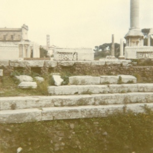

  
[Intangible Textual Heritage](../../../index)  [Classics](../../index) 
[Gibbon](../index) 

------------------------------------------------------------------------

[Buy this Book at
Amazon.com](https://www.amazon.com/exec/obidos/ASIN/B001VEIECA/internetsacredte)

------------------------------------------------------------------------

<table width="75%">
<colgroup>
<col style="width: 50%" />
<col style="width: 50%" />
</colgroup>
<tbody>
<tr class="odd">
<td width="50%" data-valign="TOP"> 
Roman Forum [Photograph (c) 2007 Copyright J. B. Hare, All Rights Reserved]</td>
<td width="50%" data-valign="CENTER"><h1 id="decline-and-fall-of-the-roman-empire-vol.-5" data-align="CENTER">Decline and Fall of the Roman Empire, Vol. 5</h1>
<h2 id="by-edward-gibbon" data-align="CENTER">by Edward Gibbon</h2>
<h4 id="section" data-align="CENTER">[1788]</h4></td>
</tr>
</tbody>
</table>

------------------------------------------------------------------------

[Contents](#contents)    [Start Reading](daf05000)

------------------------------------------------------------------------

[Volume 1](../01/index) \|  [Volume 2](../02/index) \|  [Volume
3](../03/index) \|  [Volume 4](../04/index) \|  **Volume 5** \|  [Volume
6](../06/index)

------------------------------------------------------------------------

|                                                                                                                           |
|---------------------------------------------------------------------------------------------------------------------------|
|  |

------------------------------------------------------------------------

 [Title Page](daf05000)  
[Chapter XLIX: Conquest Of Italy By The Franks. Part I.](daf05001)  
[Chapter XLIX: Conquest Of Italy By The Franks. Part II.](daf05002)  
[Chapter XLIX: Conquest Of Italy By The Franks. Part III.](daf05003)  
[Chapter XLIX: Conquest Of Italy By The Franks. Part IV.](daf05004)  
[Chapter XLIX: Conquest Of Italy By The Franks. Part V.](daf05005)  
[Chapter XLIX: Conquest Of Italy By The Franks. Part VI.](daf05006)  
[Chapter L: Description Of Arabia And Its Inhabitants. Part
I.](daf05007)  
[Chapter L: Description Of Arabia And Its Inhabitants. Part
II.](daf05008)  
[Chapter L: Description Of Arabia And Its Inhabitants. Part
III.](daf05009)  
[Chapter L: Description Of Arabia And Its Inhabitants. Part
IV.](daf05010)  
[Chapter L: Description Of Arabia And Its Inhabitants. Part
V.](daf05011)  
[Chapter L: Description Of Arabia And Its Inhabitants. Part
VI.](daf05012)  
[Chapter L: Description Of Arabia And Its Inhabitants. Part
VII.](daf05013)  
[Chapter L: Description Of Arabia And Its Inhabitants. Part
VIII.](daf05014)  
[Chapter LI: Conquests By The Arabs. Part I.](daf05015)  
[Chapter LI: Conquests By The Arabs. Part II.](daf05016)  
[Chapter LI: Conquests By The Arabs. Part IV.](daf05017)  
[Chapter LI: Conquests By The Arabs. Part V.](daf05018)  
[Chapter LI: Conquests By The Arabs. Part VI.](daf05019)  
[Chapter LI: Conquests By The Arabs. Part VII.](daf05020)  
[Chapter LI: Conquests By The Arabs. Part VII.](daf05021)  
[Chapter LI: Conquests By The Arabs. Part IX.](daf05022)  
[Chapter LII: More Conquests By The Arabs. Part I.](daf05023)  
[Chapter LII: More Conquests By The Arabs. Part II.](daf05024)  
[Chapter LII: More Conquests By The Arabs. Part III.](daf05025)  
[Chapter LII: More Conquests By The Arabs. Part IV.](daf05026)  
[Chapter LII: More Conquests By The Arabs. Part V.](daf05027)  
[Chapter LIII: Fate Of The Eastern Empire. Part I.](daf05028)  
[Chapter LIII: Fate Of The Eastern Empire. Part II.](daf05029)  
[Chapter LIII: Fate Of The Eastern Empire. Part III.](daf05030)  
[Chapter LIII: Fate Of The Eastern Empire. Part IV.](daf05031)  
[Chapter LIV: Origin And Doctrine Of The Paulicians. Part
I.](daf05032)  
[Chapter LIV: Origin And Doctrine Of The Paulicians. Part
II.](daf05033)  
[Chapter LV: The Bulgarians, The Hungarians And The Russians. Part
I.](daf05034)  
[Chapter LV: The Bulgarians, The Hungarians And The Russians. Part
II.](daf05035)  
[Chapter LV: The Bulgarians, The Hungarians And The Russians. Part
III.](daf05036)  
[Chapter LVI: The Saracens, The Franks And The Normans. Part
I.](daf05037)  
[Chapter LVI: The Saracens, The Franks And The Normans. Part
II.](daf05038)  
[Chapter LVI: The Saracens, The Franks And The Normans. Part
III.](daf05039)  
[Chapter LVI: The Saracens, The Franks And The Normans. Part
IV.](daf05040)  
[Chapter LVI: The Saracens, The Franks And The Normans. Part
V.](daf05041)  
[Chapter LVII: The Turks. Part I.](daf05042)  
[Chapter LVII: The Turks. Part II.](daf05043)  
[Chapter LVII: The Turks. Part III.](daf05044)  
[Chapter LVIII: The First Crusade. Part I.](daf05045)  
[Chapter LVIII: The First Crusade. Part II.](daf05046)  
[Chapter LVIII: The First Crusade. Part III.](daf05047)  
[Chapter LVIII: The First Crusade. Part IV.](daf05048)  
[Chapter LVIII: The First Crusade. Part V.](daf05049)  
