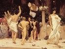

  
[Intangible Textual Heritage](../../index)  [Classics](../index) 
[Index](index)  [Next](gpr01) 

------------------------------------------------------------------------

  
*Greek Popular Religion*, by Martin P. Nilsson, \[1940\], at Intangible
Textual Heritage

------------------------------------------------------------------------

# GREEK POPULAR RELIGION

## By MARTIN P. NILSSON

###### SOMETIME RECTOR, UNIVERSITY OF LUND, SWEDEN

#### NEW YORK: COLUMBIA UNIVERSITY PRESS

###### LECTURES ON THE HISTORY OF RELIGIONS

###### SPONSORED BY THE AMERICAN COUNCIL OF LEARNED SOCIETIES

###### NEW SERIES, NO. I

#### \[1940, copyright not renewed\]

**NOTICE OF ATTRIBUTION**  
Scanned at Intangible Textual Heritage, November 2005. This text is in
the public domain in the United States because it was not renewed at the
US Copyright office in a timely fashion, as required by law at the time.
These files may be used for any non-commercial purpose, provided this
notice of attribution is left intact in all copies.

 

  [  
Click to enlarge](img/front.jpg)  
DEMETER, TRIPTOLEMOS, AND KORE  

------------------------------------------------------------------------

[Next: Foreword](gpr01)
