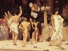

  
[Intangible Textual Heritage](../../index)  [Classics](../index) 
[Index](index)  [Previous](gpr03)  [Next](gpr05) 

------------------------------------------------------------------------

  
*Greek Popular Religion*, by Martin P. Nilsson, \[1940\], at Intangible
Textual Heritage

------------------------------------------------------------------------

p. xv

# ILLUSTRATIONS

<table data-border="0">
<colgroup>
<col style="width: 33%" />
<col style="width: 33%" />
<col style="width: 33%" />
</colgroup>
<tbody>
<tr class="odd">
<td data-valign="bottom">
 
</td>
<td data-valign="bottom">
DEMETER, TRIPTOLEMOS, AND KORE
</td>
<td data-valign="bottom">
<a href="gpr00.htm#img_front">Frontispiece</a>
</td>
</tr>
<tr class="even">
<td data-valign="bottom">
 
</td>
<td data-valign="bottom">
Votive relief. National Museum, Athens (Photograph by Alinari)
</td>
<td data-valign="bottom">
 
</td>
</tr>
<tr class="odd">
<td data-valign="bottom">
 

1.
</td>
<td data-valign="bottom">
ARCADIAN HERM
</td>
<td data-valign="bottom">
<a href="gpr12.htm#img_fig01">143</a>
</td>
</tr>
<tr class="even">
<td data-valign="bottom">
 
</td>
<td data-valign="bottom">
From K. Rhomaios, "Arkadikoi Hermai," <em>Ephemeris archaiologike</em>, 1911
</td>
<td data-valign="bottom">
 
</td>
</tr>
<tr class="odd">
<td data-valign="bottom">
 

2.
</td>
<td data-valign="bottom">
HERMES PSYCHOPOMPOS
</td>
<td data-valign="bottom">
<a href="gpr12.htm#img_fig02">143</a>
</td>
</tr>
<tr class="even">
<td data-valign="bottom">
 
</td>
<td data-valign="bottom">
Lekythos. Jena. From A. Furtwängler and K. Reichhold, <em>Griechische Vasenmalerei</em> (Munich, 1900-1932)
</td>
<td data-valign="bottom">
 
</td>
</tr>
<tr class="odd">
<td data-valign="bottom">
 

3.
</td>
<td data-valign="bottom">
HERM OFFERING
</td>
<td data-valign="bottom">
<a href="gpr12.htm#img_fig03">143</a>
</td>
</tr>
<tr class="even">
<td data-valign="bottom">
 
</td>
<td data-valign="bottom">
Red-figured vase. From C. Watzinger, <em>Griechische Vasen in Tübingen</em> (Reutlingen, 1924)
</td>
<td data-valign="bottom">
 
</td>
</tr>
<tr class="odd">
<td data-valign="bottom">
 

4.
</td>
<td data-valign="bottom">
GOAT DAEMONS
</td>
<td data-valign="bottom">
<a href="gpr13.htm#img_fig04">144</a>
</td>
</tr>
<tr class="even">
<td data-valign="bottom">
 
</td>
<td data-valign="bottom">
Bronze statuette. From F. Hiller von Gaertringen and H. Lattermann, <em>Arkadische Forschungen</em> (Berlin, 1911)
</td>
<td data-valign="bottom">
 
</td>
</tr>
<tr class="odd">
<td data-valign="bottom">
 

5.
</td>
<td data-valign="bottom">
ARTEMIS
</td>
<td data-valign="bottom">
<a href="gpr13.htm#img_fig05">144</a>
</td>
</tr>
<tr class="even">
<td data-valign="bottom">
 
</td>
<td data-valign="bottom">
Ivory votive relief. Halle. From <em>Mitteilungen des Deutschen archäologischen Instituts, athenische Abteilung</em>, Vol. L (1925)
</td>
<td data-valign="bottom">
 
</td>
</tr>
<tr class="odd">
<td data-valign="bottom">
 

6.
</td>
<td data-valign="bottom">
RIVER GOD
</td>
<td data-valign="bottom">
<a href="gpr13.htm#img_fig06">144</a>
</td>
</tr>
<tr class="even">
<td data-valign="bottom">
 
</td>
<td data-valign="bottom">
Red-figured vase. Louvre, Paris. From J. E. Harrison, <em>Prolegomena to the Study of Greek Religion</em>, 3d ed. (Cambridge, 1922)
</td>
<td data-valign="bottom">
 
</td>
</tr>
<tr class="odd">
<td data-valign="bottom">
 

7.
</td>
<td data-valign="bottom">
VOTIVE MASKS
</td>
<td data-valign="bottom">
<a href="gpr13.htm#img_fig07">144</a>
</td>
</tr>
<tr class="even">
<td data-valign="bottom">
 
</td>
<td data-valign="bottom">
Terracotta masks from the shrine of Artemis Orthia. From the <em>Illustrated London News</em>, Oct. 17, 1936
</td>
<td data-valign="bottom">
 
</td>
</tr>
<tr class="odd">
<td data-valign="bottom">
 

8.
</td>
<td data-valign="bottom">
PAN AND NYMPHS
</td>
<td data-valign="bottom">
<a href="gpr14.htm#img_fig08">145</a>
</td>
</tr>
<tr class="even">
<td data-valign="bottom">
 
</td>
<td data-valign="bottom">
Votive relief. National Museum, Athens (Photograph by Alinari)
</td>
<td data-valign="bottom">
 
</td>
</tr>
<tr class="odd">
<td data-valign="bottom">
 

9.
</td>
<td data-valign="bottom">
LANDSCAPE WITH SHRINES
</td>
<td data-valign="bottom">
<a href="gpr14.htm#img_fig09">145</a>
</td>
</tr>
<tr class="even">
<td data-valign="bottom">
 
</td>
<td data-valign="bottom">
Fresco. House of Livia, Rome. From G. E. Rizzio, <em>Monumenti delta pittura antica scoperti in Italia</em> (Rome, 1936-38)
</td>
<td data-valign="bottom">
 
</td>
</tr>
<tr class="odd">
<td data-valign="bottom">
 
</td>
<td data-valign="bottom">
p. xvi
</td>
<td data-valign="bottom">
 
</td>
</tr>
<tr class="even">
<td data-valign="bottom">
 

10.
</td>
<td data-valign="bottom">
HERO IN A SHRINE
</td>
<td data-valign="bottom">
<a href="gpr14.htm#img_fig10">145</a>
</td>
</tr>
<tr class="odd">
<td data-valign="bottom">
 
</td>
<td data-valign="bottom">
Votive relief. National Museum, Athens (Photograph by Alinari)
</td>
<td data-valign="bottom">
 
</td>
</tr>
<tr class="even">
<td data-valign="bottom">
 

11.
</td>
<td data-valign="bottom">
KERNOS
</td>
<td data-valign="bottom">
<a href="gpr15.htm#img_fig11">146</a>
</td>
</tr>
<tr class="odd">
<td data-valign="bottom">
 
</td>
<td data-valign="bottom">
British Museum, London. From "Notes from the Cyclades," <em>Annual of the British School at Athens</em>, III (1896-97)
</td>
<td data-valign="bottom">
 
</td>
</tr>
<tr class="even">
<td data-valign="bottom">
 

12.
</td>
<td data-valign="bottom">
SWINGING FESTIVAL
</td>
<td data-valign="bottom">
<a href="gpr15.htm#img_fig12">146</a>
</td>
</tr>
<tr class="odd">
<td data-valign="bottom">
 
</td>
<td data-valign="bottom">
Red-figured skyphos. State Museum, Berlin. From A. Furtwängler and K. Reichhold, <em>Griechische Vasenmalerei</em> (Munich, 1900-1932)
</td>
<td data-valign="bottom">
 
</td>
</tr>
<tr class="even">
<td data-valign="bottom">
 

13.
</td>
<td data-valign="bottom">
DIONYSUS IN A SHIP
</td>
<td data-valign="bottom">
<a href="gpr16.htm#img_fig13">147</a>
</td>
</tr>
<tr class="odd">
<td data-valign="bottom">
 
</td>
<td data-valign="bottom">
Black-figured vase. Bologna. From M. Bieber, <em>Die Denkmäler zum Theaterwesen im Altertum</em> (Berlin, 1920)
</td>
<td data-valign="bottom">
 
</td>
</tr>
<tr class="even">
<td data-valign="bottom">
 

14.
</td>
<td data-valign="bottom">
WINE OFFERING TO DIONYSUS
</td>
<td data-valign="bottom">
<a href="gpr16.htm#img_fig14">147</a>
</td>
</tr>
<tr class="odd">
<td data-valign="bottom">
 
</td>
<td data-valign="bottom">
Red-figured stamnos. National Museum, Naples. From A. Furtwängler and K. Reichhold, <em>Griechische Vasenmalerei</em> (Munich, 1900-1932)
</td>
<td data-valign="bottom">
 
</td>
</tr>
<tr class="even">
<td data-valign="bottom">
 

15.
</td>
<td data-valign="bottom">
INITIATION RITES
</td>
<td data-valign="bottom">
<a href="gpr17.htm#img_fig15">148</a>
</td>
</tr>
<tr class="odd">
<td data-valign="bottom">
 
</td>
<td data-valign="bottom">
Marble vase. National Museum, Rome. From L. R. Farnell, <em>The Cults of the Greek States</em> (Oxford, 1896-1909)
</td>
<td data-valign="bottom">
 
</td>
</tr>
<tr class="even">
<td data-valign="bottom">
 

16.
</td>
<td data-valign="bottom">
GODS OF ELEUSIS
</td>
<td data-valign="bottom">
<a href="gpr17.htm#img_fig16">148</a>
</td>
</tr>
<tr class="odd">
<td data-valign="bottom">
 
</td>
<td data-valign="bottom">
Votive relief. National Museum, Athens. From <em>Ephemeris archaiologike</em>, 1886
</td>
<td data-valign="bottom">
 
</td>
</tr>
<tr class="even">
<td data-valign="bottom">
 

17.
</td>
<td data-valign="bottom">
ANODOS OF PHEREPHATTA
</td>
<td data-valign="bottom">
<a href="gpr18.htm#img_fig17">149</a>
</td>
</tr>
<tr class="odd">
<td data-valign="bottom">
 
</td>
<td data-valign="bottom">
Red-figured krater. Albertinum Museum, Dresden. From J. E. Harrison, <em>Prolegomena to the Study of Greek Religion</em>, 3d ed. (Cambridge, 1922)
</td>
<td data-valign="bottom">
 
</td>
</tr>
<tr class="even">
<td data-valign="bottom">
 

18.
</td>
<td data-valign="bottom">
ANODOS OF KORE
</td>
<td data-valign="bottom">
<a href="gpr18.htm#img_fig18">149</a>
</td>
</tr>
<tr class="odd">
<td data-valign="bottom">
 
</td>
<td data-valign="bottom">
Black-figured lekythos. Bibliothèque Nationale, Paris. J. E. Harrison <em>Prolegomena to the Study of Greek Religion</em>, 3d ed. (Cambridge, 1922)
</td>
<td data-valign="bottom">
 
</td>
</tr>
<tr class="even">
<td data-valign="bottom">
 

19.
</td>
<td data-valign="bottom">
BEARDED TRIPTOLEMOS
</td>
<td data-valign="bottom">
<a href="gpr19.htm#img_fig19">150</a>
</td>
</tr>
<tr class="odd">
<td data-valign="bottom">
 
</td>
<td data-valign="bottom">
Black-figured amphora. From A. B. Cook, <em>Zeus</em> (Cambridge, 1914-25)
</td>
<td data-valign="bottom">
 
</td>
</tr>
<tr class="even">
<td data-valign="bottom">
 

20.
</td>
<td data-valign="bottom">
CORN IN A SHRINE
</td>
<td data-valign="bottom">
<a href="gpr19.htm#img_fig20">150</a>
</td>
</tr>
<tr class="odd">
<td data-valign="bottom">
 
</td>
<td data-valign="bottom">
Red-figured vase. Hermitage, Leningrad. From P. Wolters, "Die goldenen Ähren," Festschrift für James Loeb zum sechzigsten Geburtstag gewidmet (Munich, 1930)
</td>
<td data-valign="bottom">
 
</td>
</tr>
<tr class="even">
<td data-valign="bottom">
 
</td>
<td data-valign="bottom">
p. xvii
</td>
<td data-valign="bottom">
 
</td>
</tr>
<tr class="odd">
<td data-valign="bottom">
 

21.
</td>
<td data-valign="bottom">
REUNION OF DEMETER AND KORE
</td>
<td data-valign="bottom">
<a href="gpr20.htm#img_fig21">150</a>
</td>
</tr>
<tr class="even">
<td data-valign="bottom">
 
</td>
<td data-valign="bottom">
Pinax of Ninnion. Ethnikon Museum, Athens. From L. R. Farnell, <em>The Cults of the Greek States</em> (Oxford, 1896-1909)
</td>
<td data-valign="bottom">
 
</td>
</tr>
<tr class="odd">
<td data-valign="bottom">
 

22.
</td>
<td data-valign="bottom">
DEPARTURE OF TRIPTOLEMOS
</td>
<td data-valign="bottom">
<a href="gpr20.htm#img_fig22">151</a>
</td>
</tr>
<tr class="even">
<td data-valign="bottom">
 
</td>
<td data-valign="bottom">
Red-figured skyphos by Hieron. British Museum, London. From A. Furtwängler and K. Reichhold, <em>Griechische Vasenmalerei</em> (Munich, 1900-1932)
</td>
<td data-valign="bottom">
 
</td>
</tr>
<tr class="odd">
<td data-valign="bottom">
 

23.
</td>
<td data-valign="bottom">
TRIPTOLEMOS WITH A PLOW
</td>
<td data-valign="bottom">
<a href="gpr20.htm#img_fig23">151</a>
</td>
</tr>
<tr class="even">
<td data-valign="bottom">
 
</td>
<td data-valign="bottom">
Red-figured skyphos. From J. E. Harrison, <em>Prolegomena to the Study of Greek Religio</em>n, 3d ed. (Cambridge, 1922)
</td>
<td data-valign="bottom">
 
</td>
</tr>
<tr class="odd">
<td data-valign="bottom">
 

24.
</td>
<td data-valign="bottom">
THE CHILD PLOUTON
</td>
<td data-valign="bottom">
<a href="gpr21.htm#img_fig24">152</a>
</td>
</tr>
<tr class="even">
<td data-valign="bottom">
 
</td>
<td data-valign="bottom">
Hydria. Museum, Istanbul. From J. E. Harrison, <em>Prolegomena to the Study of Greek Religion</em>, 3d ed. (Cambridge, 1922)
</td>
<td data-valign="bottom">
 
</td>
</tr>
<tr class="odd">
<td data-valign="bottom">
 

25.
</td>
<td data-valign="bottom">
PLOUTON AND PERSEPHONE (PHEREPHATTA)
</td>
<td data-valign="bottom">
<a href="gpr21.htm#img_fig25">152</a>
</td>
</tr>
<tr class="even">
<td data-valign="bottom">
 
</td>
<td data-valign="bottom">
Red-figured kylix. British Museum, London. From L. R. Farnell, <em>The Cults of the Greek States</em> (Oxford, 1896-1909)
</td>
<td data-valign="bottom">
 
</td>
</tr>
<tr class="odd">
<td data-valign="bottom">
 

26.
</td>
<td data-valign="bottom">
ZEUS KTESIOS
</td>
<td data-valign="bottom">
<a href="gpr22.htm#img_fig26">153</a>
</td>
</tr>
<tr class="even">
<td data-valign="bottom">
 
</td>
<td data-valign="bottom">
Votive relief. From <em>Mitteilungen des Kaiserlich deutschen archäologischen Instituts, athenische Abteilung</em>, Vol. XXXIII (1908)
</td>
<td data-valign="bottom">
 
</td>
</tr>
<tr class="odd">
<td data-valign="bottom">
 

27.
</td>
<td data-valign="bottom">
ZEUS MEILICHIOS
</td>
<td data-valign="bottom">
<a href="gpr22.htm#img_fig27">153</a>
</td>
</tr>
<tr class="even">
<td data-valign="bottom">
 
</td>
<td data-valign="bottom">
Votive relief from the Peiraeus. Berlin Museum. From J. E. Harrison, <em>Prolegomena to the Study of Greek Religion</em>, 3d ed. (Cambridge, 1922)
</td>
<td data-valign="bottom">
 
</td>
</tr>
<tr class="odd">
<td data-valign="bottom">
 

28.
</td>
<td data-valign="bottom">
ZEUS MEILICHIOS
</td>
<td data-valign="bottom">
<a href="gpr22.htm#img_fig28">153</a>
</td>
</tr>
<tr class="even">
<td data-valign="bottom">
 
</td>
<td data-valign="bottom">
Votive relief from the Peiraeus. Berlin Museum. From A. B. Cook, Zeus (Cambridge, 1914-25)
</td>
<td data-valign="bottom">
 
</td>
</tr>
<tr class="odd">
<td data-valign="bottom">
 

29.
</td>
<td data-valign="bottom">
DIOSCURI
</td>
<td data-valign="bottom">
<a href="gpr23.htm#img_fig29">154</a>
</td>
</tr>
<tr class="even">
<td data-valign="bottom">
 
</td>
<td data-valign="bottom">
Coin from Sparta. From W. H. Roscher, <em>Ausführliches Lexikon der griechischen and römischen Mythologie</em> (Leipzig, 1884-1937)
</td>
<td data-valign="bottom">
 
</td>
</tr>
<tr class="odd">
<td data-valign="bottom">
 

30.
</td>
<td data-valign="bottom">
APOLLO AGYIEUS
</td>
<td data-valign="bottom">
<a href="gpr23.htm#img_fig30">154</a>
</td>
</tr>
<tr class="even">
<td data-valign="bottom">
 
</td>
<td data-valign="bottom">
Coin. From L. R. Farnell, <em>The Cults of the Greek States</em> (Oxford, 1896-1909)#
</td>
<td data-valign="bottom">
 
</td>
</tr>
<tr class="odd">
<td data-valign="bottom">
 

31.
</td>
<td data-valign="bottom">
DIOSCURI
</td>
<td data-valign="bottom">
<a href="gpr23.htm#img_fig31">154</a>
</td>
</tr>
<tr class="even">
<td data-valign="bottom">
 
</td>
<td data-valign="bottom">
Relief from Sparta. Museum, Sparta. From M. N. Tod and A. J. B. Wace, <em>A Catalogue of the Sparta Museum</em> (Oxford, 1906)
</td>
<td data-valign="bottom">
 
</td>
</tr>
<tr class="odd">
<td data-valign="bottom">
 
</td>
<td data-valign="bottom">
p. xviii
</td>
<td data-valign="bottom">
 
</td>
</tr>
<tr class="even">
<td data-valign="bottom">
 

32.
</td>
<td data-valign="bottom">
DIOSCURI COMING TO A MEAL
</td>
<td data-valign="bottom">
<a href="gpr23.htm#img_fig32">154</a>
</td>
</tr>
<tr class="odd">
<td data-valign="bottom">
 
</td>
<td data-valign="bottom">
Votive relief. Louvre, Paris (Photograph by Alinari)
</td>
<td data-valign="bottom">
 
</td>
</tr>
<tr class="even">
<td data-valign="bottom">
 

33.
</td>
<td data-valign="bottom">
TRIPLE HECATE
</td>
<td data-valign="bottom">
<a href="gpr23.htm#img_fig33">154</a>
</td>
</tr>
<tr class="odd">
<td data-valign="bottom">
 
</td>
<td data-valign="bottom">
Collection of Graf Lamberg. From <em>Jahreshefte des Osterreichischen archäologischen Institutes in Wien</em>, Vol. XIII (1910)
</td>
<td data-valign="bottom">
 
</td>
</tr>
<tr class="even">
<td data-valign="bottom">
 

34.
</td>
<td data-valign="bottom">
ATHENA ERGANE
</td>
<td data-valign="bottom">
<a href="gpr24.htm#img_fig34">155</a>
</td>
</tr>
<tr class="odd">
<td data-valign="bottom">
 
</td>
<td data-valign="bottom">
Red-figured vase. Caputi Collection, Ruvo. From C. Dugas, <em>Greek Pottery</em> (London, 1926)
</td>
<td data-valign="bottom">
 
</td>
</tr>
<tr class="even">
<td data-valign="bottom">
 

35.
</td>
<td data-valign="bottom">
CYBELE, THE GREAT MOTHER
</td>
<td data-valign="bottom">
<a href="gpr24.htm#img_fig35">155</a>
</td>
</tr>
<tr class="odd">
<td data-valign="bottom">
 
</td>
<td data-valign="bottom">
Black-figured pelike. British Museum, London (Photograph by the British Museum)
</td>
<td data-valign="bottom">
 
</td>
</tr>
<tr class="even">
<td data-valign="bottom">
 

36.
</td>
<td data-valign="bottom">
BENDIS
</td>
<td data-valign="bottom">
<a href="gpr24.htm#img_fig36">155</a>
</td>
</tr>
<tr class="odd">
<td data-valign="bottom">
 
</td>
<td data-valign="bottom">
Votive relief. British Museum, London (Photograph by the British Museum)
</td>
<td data-valign="bottom">
 
</td>
</tr>
<tr class="even">
<td data-valign="bottom">
 

37.
</td>
<td data-valign="bottom">
OFFERING TO ASCLEPIUS
</td>
<td data-valign="bottom">
<a href="gpr25.htm#img_fig37">156</a>
</td>
</tr>
<tr class="odd">
<td data-valign="bottom">
 
</td>
<td data-valign="bottom">
Votive relief. Glyptothek, Munich (Photograph by Kaufmann)
</td>
<td data-valign="bottom">
 
</td>
</tr>
<tr class="even">
<td data-valign="bottom">
 

38.
</td>
<td data-valign="bottom">
ASCLEPIUS OF MELOS
</td>
<td data-valign="bottom">
<a href="gpr25.htm#img_fig38">156</a>
</td>
</tr>
<tr class="odd">
<td data-valign="bottom">
 
</td>
<td data-valign="bottom">
Marble head. British Museum, London. From H. von Brunn and F. Bruckmann, <em>Denkmäler griechischer and römischer Sculptur</em>, 1st Series (Munich, 1888-1900)
</td>
<td data-valign="bottom">
 
</td>
</tr>
<tr class="even">
<td data-valign="bottom">
 

39.
</td>
<td data-valign="bottom">
GARDENS OF ADONIS
</td>
<td data-valign="bottom">
<a href="gpr25.htm#img_fig39">156</a>
</td>
</tr>
<tr class="odd">
<td data-valign="bottom">
 
</td>
<td data-valign="bottom">
Red-figured aryballos. Karlsruhe. From A. Furtwängler and K. Reichhold, <em>Griechische Vasenmalerei</em> (Munich, 1900-1932)
</td>
<td data-valign="bottom">
 
</td>
</tr>
</tbody>
</table>

 

------------------------------------------------------------------------

[Next: The Countryside](gpr05)
