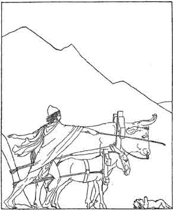

  
[Intangible Textual Heritage](../../../index)  [Classics](../../index) 
[Homer](../index)  [Index](index)  [Previous](aoo00)  [Next](aoo02) 

------------------------------------------------------------------------

# PART I

HOW TELEMACHUS THE SON OF ODYSSEUS WAS MOVED TO GO ON A VOYAGE IN SEARCH
OF HIS FATHER AND HOW HE HEARD FROM MENELAUS AND HELEN THE TALE OF TROY

### I

THIS is the story of Odysseus, the most renowned of all the heroes the
Greek poets have told us of--of Odysseus, his wars and his wanderings.
And this story of Odysseus begins with his son, the youth who was called
Telemachus.

|                  |
|------------------|
|  |

It was when Telemachus was a child of a month old that a messenger came
from Agamemnon, the Great King, bidding Odysseus betake himself to the
war against Troy that the Kings and Princes of Greece were about to
wage. The wise Odysseus, foreseeing the disasters that would befall all
that entered that war, was loth to go. And so when Agamemnon’s messenger
came to the island of Ithaka where he was King, Odysseus pretended to be
mad. And that the messenger, Palamedes, might believe he was mad indeed,
he did a thing that no man ever saw being done before--he took an ass
and an ox and yoked them together to the same plough and began to plough
a field. And when he had ploughed a furrow he sowed it, not with seeds
that would grow, but with salt. When Palamedes saw him doing this he was
nearly persuaded that Odysseus was mad. But to test him he took the
child Telemachus and laid him down in the field in the way of the
plough. Odysseus, when he came near to where the child lay, turned the
plough aside and thereby showed that he was not a mad man. Then had he
to take King Agamemnon’s summons. And Agamemnon’s word was that Odysseus
should go to 

|                  |
|------------------|
|  |

Aulis where the ships of the Kings and Princes of Greece were being
gathered. But first he was to go into another country to seek the hero
Achilles and persuade him also to enter the war against Troy.

And so Odysseus bade good-bye to his infant son, Telemachus, and to his
young wife, Penelope, and to his father, old Laertes. And he bade
good-bye to his house and his lands and to the island of Ithaka where he
was King. He summoned a council of the chief men of Ithaka and commended
to their care his wife and his child and all his household, and
thereafter he took his sailors and his fighting men with him and he
sailed away. The years went by and Odysseus did not return. After ten
years the City was taken by the Kings and Princes of Greece and the
thread of war was wound up. But still Odysseus did not return. And now
minstrels came to Ithaka with word of the deaths or the homecomings of
the heroes who had fought in the war against Troy. But no minstrel
brought any word of Odysseus, of his death or of his appearance in any
land known to men. Ten years more went by. And now that infant son whom
he had left behind, Telemachus, had grown up and was a young man of
strength and purpose.

------------------------------------------------------------------------

[Next: Chapter II](aoo02)
