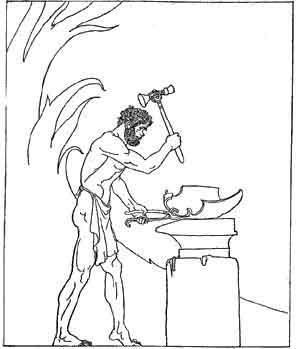

  
[Intangible Textual Heritage](../../../index)  [Classics](../../index) 
[Homer](../index)  [Index](index)  [Previous](aoo15)  [Next](aoo17) 

------------------------------------------------------------------------

### XVI

‘NOW Thetis, the mother of Achilles, went to Olympus where the gods have
their dwellings and to the house of Hephaistos, the smith of the gods.
That house shone above all the houses on Olympus because Hephaistos
himself had made it of shining bronze. And inside the house there were
wonders--handmaidens that were not living but that were made out of gold
and made with such wondrous skill that they waited upon Hephaistos and
served and helped him as though they were living maids.’

‘Hephaistos was lame and crooked of foot and went limping. He and Thetis
were friends from of old time, for, when his mother would have forsaken
him because of his crooked foot, Thetis and her sister reared him within
one of the Ocean’s caves and it was while he was with them that he began
to work in metals. So the lame god was pleased to see Thetis in his
dwelling and he welcomed 

|                  |
|------------------|
|  |

her and clasped her hand and asked of her what she would have him do for
her.’

‘Then Thetis, weeping, told him of her son Achilles, how he had lost his
dear friend and how he was moved to go into the battle to fight with
Hector, and how he was without armour to protect his life, seeing that
the armour that the gods had once given his father was now in the hands
of his foe. And Thetis besought Hephaistos to make new armour for her
son that he might go into the battle.’

‘She no sooner finished speaking than Hephaistos went to his work-bench
and set his bellows--twenty were there--working. And the twenty bellows
blew into the crucibles and made bright and hot fires. Then Hephaistos
threw into the fires bronze and tin and silver and gold. He set on the
anvil-stand a great anvil, and took in one hand his hammer and in the
other hand his tongs.’

‘For the armour of Achilles he made first a shield and then a corselet
that gleamed like fire. And he made a strong helmet to go on the head
and shining greaves to wear on the ankles. The shield was made with five
folds, one fold of metal upon the other, so that it was so strong and
thick that no spear or arrow could pierce it. And upon this shield he
hammered out images that were a wonder to men.’

‘The first were images of the sun and the moon and of the stars that the
shepherds and the seamen watch--the Pleiades and Hyads and Orion and the
Bear that is also called the Wain. And below he hammered out the images
of two cities: in one there were people going to feasts and playing
music and dancing and giving judgements in the market-place: the other
was a city besieged: there were warriors on the walls and there was an
army marching out of the gate to give battle to those that besieged
them. And below the images of the cities he made a picture of a ploughed
field, with ploughmen driving their yokes of oxen along the furrows, and
with men bringing them cups of wine. And he made a picture of another
field where men were reaping and boys were gathering the corn, where
there was a servant beneath an oak tree making ready a feast, and women
making ready barley for a supper for the men who were reaping, and a
King standing aPart and watching all, holding a staff in his hands and
rejoicing at all he saw.’

‘And another image he made of a vineyard, with clusters of grapes that
showed black, and with the vines hanging from silver poles. And he
showed maidens and youths in the vineyard, gathering the grapes into
baskets, and one amongst them, a boy, who played on the viol. Beside the
image of the vineyard he made images of cattle, with herdsmen, and with
nine dogs guarding them. But he showed two lions that had come up and
had seized the bull of the herd, and the dogs and men strove to drive
them away but were affrighted. And beside the image of the oxen he made
the image of a pasture land, with sheep in it, and sheep-folds and
roofed huts.’

‘He made yet another picture--a dancing-place with youths and maidens
dancing, their hands upon each others’ hands. Beautiful dresses and
wreaths of flowers the maidens had on, and the youths had daggers of
gold hanging from their silver belts. A great company stood around those
who were dancing, and amongst them there was a minstrel who played on
the lyre.’

‘Then all around the rim of the shield Hephaistos, the lame god, set an
image of Ocean, whose stream goes round the world. Not long was he in
making the shield and the other wonderful pieces of armour. As soon as
the armour was ready Thetis put her hands upon it, and flying down from
Olympus like a hawk, brought it to the feet of Achilles, her son.’

‘And Achilles, when he saw the splendid armour that Hephaistos the lame
god had made for him, rose up from where he lay and took the
wonderfully-wrought piece in his hands. And he began to put the armour
upon him, and none of the Myrmidons who were around could bear to look
upon it, because it shone with such brightness and because it had all
the marks of being the work of a god.’

------------------------------------------------------------------------

[Next: Chapter XVII](aoo17)
