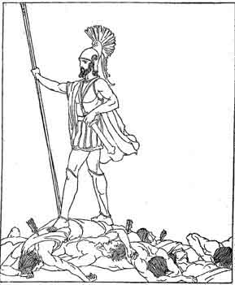
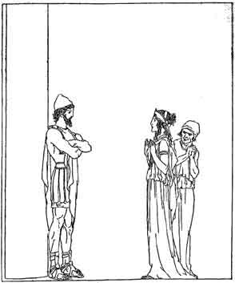

  
[Intangible Textual Heritage](../../../index)  [Classics](../../index) 
[Homer](../index)  [Index](index)  [Previous](aoo38)  [Next](aoo40) 

------------------------------------------------------------------------

### XVI

EURYCLEIA, the old nurse, went to the upper chamber where Penelope lay
in her bed. She bent over her and called out, ‘Awake, Penelope, dear
child. Come down and see with thine own eyes what hath happened. The
wooers are overthrown. And he whom thou hast ever longed to see hath
come back. Odysseus, thy husband, hath returned. He hath slain the proud

|                  |
|------------------|
|  |

wooers who have troubled thee for so long.’

But Penelope only looked at the nurse, for she thought that her brain
had been turned.

Still Eurycleia kept on saying, ‘In very deed Odysseus is here. He is
that guest whom all the wooers dishonour in the hall.’

Then hearing Eurycleia say these words, Penelope sprang out of bed and
put her arms round the nurse’s neck. ‘O tell me--if what thou dost say
be true--tell me how this stranger slew the wooers, who were so many.’

‘I did not see the slaying,’ Eurycleia said, ‘but I heard the groaning
of the men as they were slain. And then I found Odysseus standing
amongst many dead men, and it comforted my heart to see him standing
there like a lion aroused. Come with me now, lady, that you may both
enter into your heart’s delight--you that have suffered so much of
affliction. Thy lord hath come alive to his own hearth, and he hath
found his wife and his son alive and well.’

‘Ah no!’ said Penelope, ‘ah no, Odysseus hath not returned. He who hath
slain the wooers is one of the deathless gods, come down to punish them
for their injustice and their hardheartedness. Odysseus long ago lost
the way of his returning, and he is lying dead in some far-off land.’

‘No, no,’ said Eurycleia. ‘I can show thee that it is Odysseus indeed
who is in the hall. On his foot is the scar that the tusk of a boar gave
him in the old days. I spied it when I was washing his feet last night,
and I would have told thee of it, but he clapped a hand across my mouth
to stop my speech. Lo, I stake my life that it is Odysseus, and none
other who is in the hall below.’

Saying this she took 

|                  |
|------------------|
|  |

Penelope by the hand and led her from the upper chamber into the hall.
Odysseus was standing by a tall pillar. He waited there for his wife to
come and speak to him. But Penelope stood still, and gazed long upon
him, and made no step towards him.

Then said Telemachus, ‘Mother, can it be that thy heart is so hard? Here
is my father, and thou wilt not go to him nor question him at all.’

Said Penelope, ‘My mind is amazed and I have no strength to speak, nor
to ask him aught, nor even to look on him face to face. If this is
indeed Odysseus who hath come home, a place has to be prepared for him.’

Then Odysseus spoke to Telemachus and said, ‘Go now to the bath, and
make thyself clean of the stains of battle. I will stay and speak with
thy lady mother.’

‘Strange lady,’ said he to Penelope, ‘is thy heart indeed so hard? No
other woman in the world, I think, would stand so aloof from her husband
who, after so much toil and so many trials, has come back after twenty
years to his own hearth. Is there no place for me here, and must I again
sleep in the stranger’s bed?’

Said Penelope, ‘In no stranger’s bed wilt thou lie, my lord. Come,
Eurycleia. Set up for him his own bedstead outside his bed-chamber.’

Then Odysseus said to her, speaking in anger: ‘How comes it that my bed
can be moved to this place and that? Not a bed of that kind was the bed
I built for myself. Knowest thou not how I built my bed? First, there
grew up in the courtyard an olive tree. Round that olive tree I built a
chamber, and I roofed it well and I set doors to it. Then I sheared off
all the light wood on the growing olive tree, and I rough-hewed the
trunk with the adze, and I made the tree into a bed post. Beginning with
this bed post I wrought a bedstead, and when I finished it, I inlaid it
with silver and ivory. Such was the bed I built for myself, and such a
bed could not be moved to this place or that.’

Then did Penelope know assuredly that the man who stood before her was
indeed her husband, the steadfast Odysseus--none other knew of where the
bed was placed, and how it had been built. Penelope fell a-weeping and
she put her arms round his neck.

‘O Odysseus, my lord,’ she said, ‘be not angry with thy wife. Always the
fear was in my heart that some guileful stranger should come here
professing to be Odysseus, and that I should take him to me as my
husband. How terrible such a thing would be! But now my heart is freed
from all doubts. Be not angry with me, Odysseus, for not throwing myself
on thy neck, as the women of the house did.’

Then husband and wife wept together, and Penelope said, ‘It was the gods
did this to us, Odysseus--the gods who grudged that we should have joy
of the days of our youth.’

Next they told each other of things that happened in the twenty years
they were apart; Odysseus speaking of his own toils and sorrows, and
Penelope telling what she had endured at the hands of the wooers. And as
they told tales, one to the other, slumber came upon them, and the dawn
found them sleeping side by side.

------------------------------------------------------------------------

[Next: Chapter XVII](aoo40)
