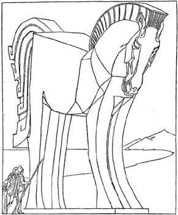

  
[Intangible Textual Heritage](../../../index)  [Classics](../../index) 
[Homer](../index) 

------------------------------------------------------------------------

<table>
<colgroup>
<col style="width: 50%" />
<col style="width: 50%" />
</colgroup>
<tbody>
<tr class="odd">
<td data-valign="CENTER" width="50%"></td>
<td data-valign="CENTER" width="50%"><h1 id="the-adventures-of-odysseus-and-the-tale-of-troy" data-align="CENTER">The Adventures of Odysseus and the Tale of Troy</h1>
<h2 id="by-padraic-colum" data-align="CENTER">By Padraic Colum</h2>
<h3 id="illustrated-by-willy-pogany" data-align="CENTER">Illustrated by Willy Pogany</h3>
<h4 id="section" data-align="CENTER">[1918]</h4></td>
</tr>
</tbody>
</table>

------------------------------------------------------------------------

[Title Page](aoo00)  

### Part I: The Iliad

[Chapter I](aoo01)  
[Chapter II](aoo02)  
[Chapter III](aoo03)  
[Chapter IV](aoo04)  
[Chapter V](aoo05)  
[Chapter VI](aoo06)  
[Chapter VII](aoo07)  
[Chapter VIII](aoo08)  
[Chapter IX](aoo09)  
[Chapter X](aoo10)  
[Chapter XI](aoo11)  
[Chapter XII](aoo12)  
[Chapter XIII](aoo13)  
[Chapter XIV](aoo14)  
[Chapter XV](aoo15)  
[Chapter XVI](aoo16)  
[Chapter XVII](aoo17)  
[Chapter XVIII](aoo18)  
[Chapter XIX](aoo19)  
[Chapter XX](aoo20)  
[Chapter XXII](aoo21)  
[Chapter XXII](aoo22)  
[Chapter XXIII](aoo23)  

### Part II: The Odyssey

[Chapter I](aoo24)  
[Chapter II](aoo25)  
[Chapter III](aoo26)  
[Chapter IV](aoo27)  
[Chapter V](aoo28)  
[Chapter VI](aoo29)  
[Chapter VII](aoo30)  
[Chapter VIII](aoo31)  
[Chapter IX](aoo32)  
[Chapter X](aoo33)  
[Chapter XI](aoo34)  
[Chapter XII](aoo35)  
[Chapter XIII](aoo36)  
[Chapter XIV](aoo37)  
[Chapter XV](aoo38)  
[Chapter XVI](aoo39)  
[Chapter XVII](aoo40)  
