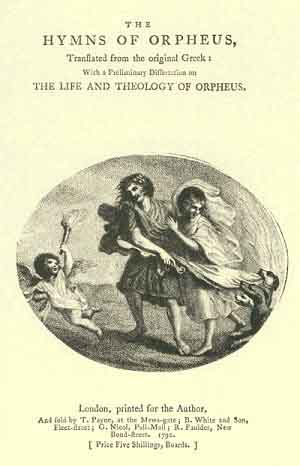

[Intangible Textual Heritage](../../index)  [Classics](../index) 

------------------------------------------------------------------------

<table width="50%">
<colgroup>
<col style="width: 50%" />
<col style="width: 50%" />
</colgroup>
<tbody>
<tr class="odd">
<td width="50%" data-valign="TOP"><a href="img/title.jpg"> 
Click to enlarge</a></td>
<td width="50%"><h1 id="the-hymns-of-orpheus" data-align="CENTER">The Hymns of Orpheus</h1>
<h3 id="translated-by-thomas-taylor" data-align="CENTER">Translated by Thomas Taylor</h3>
<h4 id="section" data-align="CENTER">[1792]</h4></td>
</tr>
</tbody>
</table>

------------------------------------------------------------------------

[Contents](#contents)    [Start Reading](hoo00)

The Orphic Hymns are a set of pre-classical poetic compositions,
attributed to the culture hero Orpheus, himself the subject of a
renowned myth. In reality, these poems were probably composed by several
different poets. Reminiscent of the [Rig-Veda](../../hin/rveng/index),
the Orphic Hymns contain a rich set of clues about prehistoric European
mythology.

This translation by Thomas Taylor, a British neo-Platonist classicist,
is of additional interest for its introduction and *extensive*
footnotes, which discuss in great detail Taylors' philosophy. Taylor,
who was considered a bit outside the pale by contemporary scholars, was
an influence on successive generations of occultists such as the
Theosophists and the Golden Dawn, and in the 20th Century such writers
as Manly P. Hall.

*Production Notes:* The original book printed 's' as 'f' extensively.
These have been consistently changed to 's'; except in some doubtful
words, which are left as printed in the original; these are marked in
bold type. The Greek passages in this document have been converted to
Unicode. Note that there are several archaic Greek letters in this text
for which there is no Unicode equivalent currently, or which were so
illegible in the original no certain transcription could be provided.
These have been transcribed with \# in place of the dubious glyph, and
an image of the word is inserted after the transcription.

------------------------------------------------------------------------

 [Title Page](hoo00)  
[Preface](hoo01)  

### A Dissertation on the Life and Theology of Orpheus

[Section I](hoo02)  
[Section II](hoo03)  
[Section III](hoo04)  

### The Initiations of Orpheus

[To Musæus](hoo05)  
[I. To the Goddess Prothyræa](hoo06)  
[II. To Night](hoo07)  
[III: To Heaven](hoo08)  
[IV: To Fire](hoo09)  
[V. To Protogonus, Or the First-Born](hoo10)  
[VI: To The Stars](hoo11)  
[VII: To The Sun](hoo12)  
[VIII: To The Moon](hoo13)  
[IX: To Nature](hoo14)  
[X: To Pan](hoo15)  
[XI: To Hercules](hoo16)  
[XII: To Saturn](hoo17)  
[XIII: To Rhea](hoo18)  
[XIV: To Jupiter](hoo19)  
[XV: To Juno](hoo20)  
[XVI: To Neptune](hoo21)  
[XVII: To Pluto](hoo22)  
[XVIII: To Thundring Jove](hoo23)  
[XIX: To Jove, as the Author of Lightning](hoo24)  
[XX: To the Clouds](hoo25)  
[XXI: To the Sea, or Tethys](hoo26)  
[XXII: To Nereus](hoo27)  
[XXIII: To the Nereids](hoo28)  
[XXIV: To Proteus](hoo29)  
[XXV: To the Earth](hoo30)  
[XXVI: To The Mother of the Gods](hoo31)  
[XXVII: To Mercury](hoo32)  
[XXVIII: To Proserpine](hoo33)  
[XXIX: To Bacchus](hoo34)  
[XXX: To the Curetes](hoo35)  
[XXXI. To Pallas](hoo36)  
[XXXII: To Victory](hoo37)  
[XXXIII: To Apollo](hoo38)  
[XXXIV: To Latona](hoo39)  
[XXXV: To Diana](hoo40)  
[XXXVI: To The Titans](hoo41)  
[XXXVII: To the Curetes](hoo42)  
[XXXVIII: To Corybas](hoo43)  
[XXXIX: To Ceres](hoo44)  
[XL. To The Ceralian Mother](hoo45)  
[XLI: To Mises](hoo46)  
[XLII: To the Seasons](hoo47)  
[XLIII: To Semele](hoo48)  
[XLIV: To Dionysius Bassareus Triennalis](hoo49)  
[XLV: To Liknitus Bacchus](hoo50)  
[XLVI: To Bacchus Pericionius](hoo51)  
[XVLII: To Sabasius](hoo52)  
[XLVIII: To Ippa](hoo53)  
[XLIX: To Lysius Lenæus](hoo54)  
[L: To the Nymphs](hoo55)  
[LI: To Trietericus](hoo56)  
[LII: To Amphietus Bacchus](hoo57)  
[LIII: To Silenus, Satyrus, and the Priestesses of Bacchus](hoo58)  
[LIV: To Venus](hoo59)  
[LV: To Adonis](hoo60)  
[LVI: To the Terrestrial Hermes](hoo61)  
[LVII: To Cupid, or Love](hoo62)  
[LVIII: To The Fates](hoo63)  
[LIX: To the Graces](hoo64)  
[LX: To Nemesis](hoo65)  
[LXI: To Justice](hoo66)  
[LXII: To Equity](hoo67)  
[LXIII: To Law](hoo68)  
[LXIV: To Mars](hoo69)  
[LXV: To Vulcan](hoo70)  
[LXVI: To Esculapius](hoo71)  
[LXVII: To Health](hoo72)  
[LXVIII: To The Furies](hoo73)  
[LXIX: To The Furies](hoo74)  
[LXX: To Melinoe](hoo75)  
[LXXI. To Fortune](hoo76)  
[LXXII: To the Dæmon, or Genius](hoo77)  
[LXXIII: To Leucothea](hoo78)  
[LXXIV: To Palæmon](hoo79)  
[LXXV: To the Muses](hoo80)  
[LXXVI: To Mnemosyne, or the Goddess of Memory](hoo81)  
[LXXVII: To Aurora](hoo82)  
[LXXVIII: To Themis](hoo83)  
[LXXIX: To the North Wind](hoo84)  
[LXXX: To The West Wind](hoo85)  
[LXXXI: To the South Wind](hoo86)  
[LXXXII: To Ocean](hoo87)  
[LXXXIII: To Vesta](hoo88)  
[LXXXIV: To Sleep](hoo89)  
[LXXXV: To the Divinity of Dreams](hoo90)  
[LXXXVI: To Death](hoo91)  
