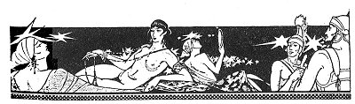

  
[Intangible Textual Heritage](../../../index)  [Classics](../../index) 
[Lucian](../index)  [Index](index)  [Previous](motc02)  [Next](motc04) 

------------------------------------------------------------------------

Mimes of the Courtesans, by Lucian \[1928\], at Intangible Textual
Heritage

------------------------------------------------------------------------

p. 9

 

<table data-align="RIGHT">
<colgroup>
<col style="width: 100%" />
</colgroup>
<tbody>
<tr class="odd">
<td data-valign="CENTER"><a href="img/00900.jpg"> 
Click to enlarge</a></td>
</tr>
</tbody>
</table>

<table data-align="LEFT">
<colgroup>
<col style="width: 100%" />
</colgroup>
<tbody>
<tr class="odd">
<td data-valign="CENTER"><a href="img/00901.jpg"> 
Click to enlarge</a></td>
</tr>
</tbody>
</table>

# THE EDUCATION OF CORINNA

 

 

p. 10 p. 11

 

|                        |
|------------------------|
| CORINNA, a little girl |
| CROBYLE, her mother    |

 

p. 12 p. 13

 

### THE EDUCATION OF CORINNA

CROBYLE

Well, Corinna, you see now that it wasn't so terrible to lose your
virginity. You have spent your first night with a man. You have earned
your first gift, no less than a hundred drachmas. With that I'll buy you
a necklace.

CORINNA

Yes, dear mother, do buy me a necklace. Let it be a necklace made of
fine, shining stones like the one Philainis wears.

CROBYLE

I promise. It will be just like the one Philainis wears. But listen: I
want to teach you how you should conduct yourself with men. Take my
words to heart, daughter. We have only your favor with men to depend on
for a living.

You can't imagine how hard it has been for us to get along since your
blessed father's death. We lacked nothing when he was alive. He had
quite a reputation as a blacksmith in the Piræus. People say

p. 14

there will never be another blacksmith like Philipinos. After his death
I sold his tongs, anvil and hammer for two hundred drachmas. We lived on
that for some time. I found work weaving and turning thread, barely
earning enough to buy bread with. I have raised you, however, my
precious little daughter. You are the only hope left me.

CORINNA

Weren't you going to say something about my hundred drachmas, mother?

CROBYLE

No, child. But I thought you were now big enough to support your tired
mother. Not only that: you can even earn enough to dress richly, to buy
yourself the newest robes of purple, and slaves.

CORINNA

What do you mean, mother? Why do you say that?

CROBYLE

Don't you understand, little fool? Why, you will earn a great deal being
attentive to nice young men, drinking in their company and going to bed
with them--for money, of course.

CORINNA (*Scandalized*)

You mean like Lyra, the daughter of Daphnis?

 

[  
Click to enlarge](img/01500.jpg)

 

p. 15

CROBYLE

Yes.

CORINNA

But she is--a courtesan!

CROBYLE

What of it? There is no harm in that. You will become rich. You are sure
to have many lovers.

CORINNA (*Weeps*)

CROBYLE

Why, Corinna! Why do you weep? Don't you see how many courtesans there
are, how they are all sought after, and how they all make money? I knew
Daphnis when she was in rags--that was before she got sense enough to
make use of her body. Look at her now! She struts like a queen, all
bespangled with gold, wearing flowery dresses, and no less than four
slaves behind her.

CORINNA

And how did she get all that, dear mother?

CROBYLE

Well, in the first place, by dressing elegantly and being amiable and
cheery with everybody. She does not giggle at any little thing, as you
do; instead, she only smiles, which is much more attractive. She treats

p. 16

shrewdly, but without double-crossing, the men that come to see her or
take her to their houses. She never approaches them first. When she is
paid to assist at a banquet, she takes care not to get drunk--it is
foolish and men can't bear it--and she does not stuff herself with food
like an imbecile, so that when she gets into bed she is in condition to
serve her lover well. She no more than touches the various dishes
served--delicately, with her fingertips, and always in silence. And she
never guzzles her wine, but drinks slowly, quietly, in gentle little
sips.

CORINNA

But supposing she is thirsty, dear mother?

CROBYLE

Especially when she is thirsty, foolish girl! And she never speaks more
than is necessary, and never pokes fun at anybody present, and has eyes
only for the man who has paid her. That is why everybody appreciates
her. Furthermore, when it is time to get into bed, she never resorts to
any obscenity, but does her task with care and loving attention. In bed,
she bears one thing in mind--to win the man and make a steady lover of
him. That is why everybody speaks highly of her. If you take this lesson
to heart and do likewise we, too, shall be rich, for she is far from
having your looks and your complexion. But I won't

p. 17

say anything more. Long may you live, little daughter, and prosper!

CORINNA

But tell me, dear mother: Will all those that will pay me be as handsome
as Eucritos, the fellow I slept with yesterday?

CROBYLE

Not all. There will be better looking fellows. And some will be very
vigorous and energetic--you know what I mean; while others will not be
quite as handsome.

CORINNA

And shall I have to give myself to the homely fellows too?

CROBYLE

Especially to them, my child. It is that class that pays best. The
beautiful kind only want to give their looks. I repeat: be careful to
attach yourself to men who pay best--if you want to have people point
you out on the street and say: "Do you see that Corinna, the daughter of
Crobyle? Do you notice how rich she became, and what happiness she
brings to her old mother? Oh, thrice happy has she rendered her, blessed
be the girl!"

What do you say, child? Will you do that? You'll do what your old mother
tells you, won't you? Ah, you

p. 18

will easily surpass the best of our courtesans. Now run and wash
yourself, child. Possibly little Eucritos will be back tonight. He has
promised to come to my little daughter. Both of you will enjoy it more
tonight.

 

------------------------------------------------------------------------

[Next: Sweetheart](motc04)
