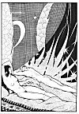

  
[Intangible Textual Heritage](../../../index)  [Classics](../../index) 
[Lucian](../index)  [Index](index)  [Previous](motc12)  [Next](motc14) 

------------------------------------------------------------------------

Mimes of the Courtesans, by Lucian \[1928\], at Intangible Textual
Heritage

------------------------------------------------------------------------

p. 109

<table data-align="RIGHT">
<colgroup>
<col style="width: 100%" />
</colgroup>
<tbody>
<tr class="odd">
<td data-valign="CENTER"><a href="img/00900.jpg"> 
Click to enlarge</a></td>
</tr>
</tbody>
</table>

<table data-align="LEFT">
<colgroup>
<col style="width: 100%" />
</colgroup>
<tbody>
<tr class="odd">
<td data-valign="CENTER"><a href="img/00901.jpg"> 
Click to enlarge</a></td>
</tr>
</tbody>
</table>

# AT NIGHT

 

p. 110 p. 111

 

|                       |
|-----------------------|
| TYPHAINA, a courtesan |
| CHARMIDES, a lover    |

 

p. 112 p. 113

 

### AT NIGHT

TYPHAINA

To hire a courtesan, pay her five drachmas, go to bed with her and then
turn your back on her and weep and groan--that is a dirty trick to play
on a woman with feelings. You found no pleasure in the wine at the
banquet table and you were the only one not to eat. You were shedding
tears; I could see that. And now you keep on sobbing like a whipped
infant. Why all the humidity, Charmides? Don't hide anything from me!
I'll at least carry away a bit of information from the one charming
night I shall ever have passed at your manly side. I am sure I shall
pass it without a wink of sleep and without

CHARMIDES

May Eros destroy me, Typhaina! I can no longer resist him. Eros is so
cruel.

TYPHAINA

It isn't me that you love--that much is certain. I am but three inches
away from you. We are both stark

p. 114

naked. And you don't seem to get excited over the fact. You repel me
when I want to take you in my arms. Why, you have even dragged your
clothes into bed and put the bundle as a dike between us, lest my fine
emotions flow over and get you wet. Tell me: Who is the lady? Possibly I
can help you. I am good at such little services.

CHARMIDES

Oh, you know her, and I think she knows you too. She is not an obscure
courtesan, you understand.

TYPHAINA

Her name, Charmides?

CHARMIDES

It is Philemation, Typhaina.

TYPHAINA

Which? There are two of them, you know. Is it that girl from the Piræus
who has just lost her maidenhead and is at present the mistress of
Damyllos, the son of the Strategus? Or is it the woman that people have
nicknamed "Pagis, the Snare"?

CHARMIDES

The latter. Hers is the bad genius that has captured me. I am obsessed
by a passion for Pagis.

[  
Click to enlarge](img/11400.jpg)

p. 115

TYPHAINA

By Aphrodite! I wouldn't have come if I had known you called me in order
to get even with that carcass of a Philemation. And now the cock has
crowed thrice. I shall go my way.

CHARMIDES

Not so fast, Typhaina. If what you say of Philemation is true, I refer
to the wig, her complexion and those queer spots, I can no longer bear
to look at her.

TYPHAINA

Ask your mother. She might have seen her at the baths. As for her age,
your grandfather, if he is still alive, will provide you with correct
information.

CHARMIDES

In that case, there is little need of the dike you have joked about.
Wait. I'll get my clothes out of the bed. Now, let us embrace and kiss,
and we will couple up like good children. Goodbye, Philemation! My
respects to your age and experience. Ah, what smooth thighs are yours,
Typhaina! What joy must lie buried between them!

------------------------------------------------------------------------

[Next: A Poor Sailor's Love](motc14)
