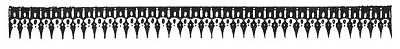
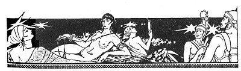
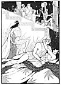
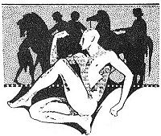

  
[Intangible Textual Heritage](../../../index)  [Classics](../../index) 
[Lucian](../index)  [Index](index)  [Previous](motc14)  [Next](motc16) 

------------------------------------------------------------------------

Mimes of the Courtesans, by Lucian \[1928\], at Intangible Textual
Heritage

------------------------------------------------------------------------

p. 126 p. 127

<table data-align="RIGHT">
<colgroup>
<col style="width: 100%" />
</colgroup>
<tbody>
<tr class="odd">
<td data-valign="CENTER"><a href="img/00900.jpg"> 
Click to enlarge</a></td>
</tr>
</tbody>
</table>

<table data-align="LEFT">
<colgroup>
<col style="width: 100%" />
</colgroup>
<tbody>
<tr class="odd">
<td data-valign="CENTER"><a href="img/00901.jpg"> 
Click to enlarge</a></td>
</tr>
</tbody>
</table>

# A MOTHER'S ADVICE

 

p. 128 p. 129

 

|                       |
|-----------------------|
| PHILINNA, a courtesan |
| HER WISE MOTHER       |

 

p. 130 p. 131

### A MOTHER'S ADVICE

MOTHER

You must have been crazy yesterday, Philinna. What got into you during
the banquet? Diphilos came weeping here this morning. He told me you had
made him suffer. You were drunk. You rose from your couch in the middle
of the meal and danced, though he had ordered you to remain at his side.
After that you kissed his friend, Lamprias. And when Diphilos became
angry, you left him altogether and took Lamprias in your arms and lay
with him, while Diphilos choked with rage. And you did not sleep with
him at night. You left Diphilos to his tears and anguish. You stretched
yourself on another bed and sang all night so as to hurt him the more.

PHILINNA (*Furious*)

But he forgot to tell you what he did to me! If you knew everything, you
would not be taking his side. He left me to talk to Thais, the mistress
of Lamprias, who hadn't yet arrived. He saw that this made me unhappy.

p. 132

\[paragraph continues\] I beckoned for him
to return to my side. Instead of coming back to me, he took hold of the
tip of the lobe of Thais's ear and pulled her head backwards and gave
her such a deep, sucking kiss that she could not free her lips from his
for some time. I started to weep, but he only snickered and whispered
all kinds of things to Thais. I am sure he was talking about me, because
Thais regarded me and smiled. Then they heard Lamprias enter and they
stopped kissing and separated. I went to lie down with Diphilos; I did
not want to give him an excuse for further inattention.

Thais was the first to dance. She danced with her robe tucked up, so as
to show her legs and thighs as if she were the only person around here
having beautiful legs. When she had finished, Lamprias said not a word;
but Diphilos praised as much as he could the rhythm and movement of her
dance, and said: "Her foot is wedded to the cithara!" and "A beautiful
leg! By Adrasteia, a beautiful leg!" And he continued with many such
sayings, as if he were referring to Sosandra of Kalamis and not to that
Thais whom both of us know so well. Don't we see her in the baths?

Then Thais started to mock me and said: "If somebody at this symposium
is not ashamed of her spindle legs, let her get up and dance, too!

What else could I have done, mother? I got up

[  
Click to enlarge](img/13200.jpg)

p. 133

and danced. I wasn't going to let everybody present believe that woman
was right.

MOTHER

You are too touchy, child. You shouldn't take such things to heart.

PHILINNA

Well, everybody congratulated me on my fine dancing. Diphilos, however,
remained lying on his back. He kept on looking at the ceiling till I was
out of breath and could dance no longer.

MOTHER

And is it true that later you kissed Lamprias and that you rose from
your couch and Diphilos's side to take Lamprias in your arms? You are
silent. Indeed, that is unpardonable.

PHILINNA

I wanted to render him heartache for heartache.

MOTHER

And you did not sleep with him last night! You lay on another bed and
sang while he was in tears. Apparently you don't understand, my
daughter, that we are poor. You forget how much we have received from
Diphilos. How could we have survived the last winter if Aphrodite hadn't
sent him to us.

p. 134

PHILINNA

Must I then bear all kinds of insults?

MOTHER

Rage all you want, daughter, but don't ever mock any lover of yours. You
don't know that men stop loving when they are laughed at. You have
always been too captious with that man. Take care we do not, as the
proverb says, burst the rope by pulling it too taut.

 

------------------------------------------------------------------------

[Next: Abandoned](motc16)
