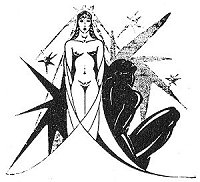

  
[Intangible Textual Heritage](../../../index)  [Classics](../../index) 
[Lucian](../index)  [Index](index)  [Previous](motc15)  [Next](motc17) 

------------------------------------------------------------------------

Mimes of the Courtesans, by Lucian \[1928\], at Intangible Textual
Heritage

------------------------------------------------------------------------

p. 135 p. 136

<table data-align="RIGHT">
<colgroup>
<col style="width: 100%" />
</colgroup>
<tbody>
<tr class="odd">
<td data-valign="CENTER"><a href="img/00900.jpg"> 
Click to enlarge</a></td>
</tr>
</tbody>
</table>

<table data-align="LEFT">
<colgroup>
<col style="width: 100%" />
</colgroup>
<tbody>
<tr class="odd">
<td data-valign="CENTER"><a href="img/00901.jpg"> 
Click to enlarge</a></td>
</tr>
</tbody>
</table>

# ABANDONED

 

 

p. 137 p. 138

 

|         |              |
|---------|--------------|
| GLYKERA | } Courtesans |
| THAIS   |              |

 

p. 139

 

### ABANDONED

GLYKERA

By the way, Thais, do you remember the Arcanian, the soldier who used to
live with Abrotonan and later fell in love with me? The fellow was
always under the purple and *chlamys*. Do you know him?

THAIS

Yes, my little Glykera, I know him. He went to bed with me last year at
the time of the feast of Demeter. What do you know about the man?

GLYKERA

That wicked Gorgona, who I thought was a friend of mine, played around
him so shrewdly that she stole him from me.

THAIS

And now he no longer visits you? Gorgona has become his mistress, eh?

GLYKERA

Yes, Thais, and I am terribly hurt.

p. 140

THAIS

That's bad, dear Glykera; but it can't be helped. Such things are to be
expected among us hetairas. You ought not to worry about it and don't
you speak ill of Gorgona. Abrotonan has said nothing bad about you in
the same situation; you are still friends. But I wonder what that
soldier sees in the woman. He must be slightly blind not to notice how
little hair she has left. Her lips are livid, almost cadaverous, and her
neck is thin. And she has bulging veins and a nose that is long, much
too long. However, there is one attractive feature about her: she is
tall and bears herself very erect. And then her rump, they say, is soft
and white, and the skin between her thighs is entirely hairless. It is
as smooth as your face. And you will concede that she has a fascinating
smile.

GLYKERA

So you believe that it is for her beauty that the Arcanian loves her?
You don't know, then, that her mother is the sorceress Chrysarion. The
witch knows the Thettalian charms and can make the moon come down to
earth. People say she flies in the air by night. It was the sorceress
who must have turned the soldier's

p. 141

head. She has made him drink certain magic potions. And now that Gorgona
hugs him between her legs.

THAIS

And your voluptuous little legs, my Glykera, will hug another. But you
may say good-bye to this man!

 

------------------------------------------------------------------------

[Next: The Philosopher](motc17)
