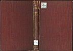
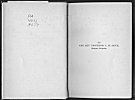

  
[Intangible Textual Heritage](../../../index)  [Classics](../../index) 
[Lucian](../index)  [Index](index)  [Next](tsg01) 

------------------------------------------------------------------------

[Buy this Book at
Amazon.com](https://www.amazon.com/exec/obidos/ASIN/B002ECE91S/internetsacredte)

------------------------------------------------------------------------

  
*The Syrian Goddess*, by Lucian, tr. by Herbert A. Strong and John
Garstang, \[1913\], at Intangible Textual Heritage

------------------------------------------------------------------------

 
[  
Click to enlarge](img/cover.jpg)  
Cover  

 
[  
Click to enlarge](img/front.jpg)  
Frontispiece.  
THE SYRIAN GODDESS, ON COINS OF HIERAPOLIS.  

*Cf*. *Figs*. [5](tsg04.htm#img_fig05), [7](tsg07.htm#img_fig07).
(*Scale* 3:4.) *See* *p*. [21](tsg04.htm#page_21).

p. i

THE SYRIAN GODDESS

p. iii

### THE

# SYRIAN GODDESS

###### BEING A TRANSLATION OF

##### *LUCIAN'S "DE DEA SYRIA," WITH*

##### *A LIFE OF LUCIAN*

###### BY

### PROFESSOR HERBERT A. STRONG, M.A. LL.D.

###### EDITED

##### *WITH NOTES AND AN INTRODUCTION*

###### BY

### JOHN GARSTANG, M.A. D.Sc.

###### AUTHOR OF "THE LAND OF THE HITTITES"

#### *WITH ILLUSTRATIONS*

#### LONDON

#### CONSTABLE & COMPANY LTD

#### 10 ORANGE STREET LEICESTER SQUARE WC

#### \[1913\]

  [  
Click to enlarge](img/title.jpg)  
Title Page  

Scanned, proofed and formatted at Intangible Textual Heritage, March,
2006, by John Bruno Hare. This text is in the public domain in the
United States because it was published prior to 1923.

p. v

 
[  
Click to enlarge](img/verso.jpg)  
Verso  

TO

THE REV. PROFESSOR A. H. SAYCE,

*Magistro Discipulus*.

------------------------------------------------------------------------

[Next: Editor's Preface](tsg01)
