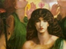

  
[Intangible Textual Heritage](../../../index)  [Classics](../../index) 
[Lucian](../index)  [Index](index)  [Previous](tsg01)  [Next](tsg03) 

------------------------------------------------------------------------

[Buy this Book at
Amazon.com](https://www.amazon.com/exec/obidos/ASIN/B002ECE91S/internetsacredte)

------------------------------------------------------------------------

  
*The Syrian Goddess*, by Lucian, tr. by Herbert A. Strong and John
Garstang, \[1913\], at Intangible Textual Heritage

------------------------------------------------------------------------

p. xi

# SUMMARY OF CONTENTS

|                                                                                                           |                                                   |
|-----------------------------------------------------------------------------------------------------------|---------------------------------------------------|
| PAGE EDITOR'S PREFACE                                                                                     | [vii](tsg01.htm#page_vii)-[ix](tsg01.htm#page_ix) |
| LIST OF ILLUSTRATIONS                                                                                     | [xiii](tsg03.htm#page_xiii)                       |
| INTRODUCTION—THE SYRIAN GODDESS IN HISTORY AND ART, BY PROFESSOR GARSTANG                                 | [1](tsg04.htm#page_1)                             |
| LIFE OF LUCIAN, BY PROFESSOR STRONG.                                                                      | [29](tsg05.htm#page_29)                           |
| LUCIAN'S TEXT: ANALYSIS OF SUBJECT-MATTER                                                                 | [39](tsg06.htm#page_39)                           |
| TRANSLATION BY PROFESSOR STRONG, WITH NOTES BY PROFESSOR GARSTANG                                         | [41](tsg07.htm#page_41)                           |
| APPENDIX-DESCRIPTIONS OF THE SITE OF HIERAPOLIS SYRIÆ, THE SACRED CITY, BY MAUNDRELL, POCOCK, AND CHESNEY | [91](tsg08.htm#page_91)                           |
| BIBLIOGRAPHY                                                                                              | [99](tsg09.htm#page_99)                           |
| INDEX                                                                                                     | [103](tsg10.htm#page_103)                         |

------------------------------------------------------------------------

[Next: List of Illustrations](tsg03)
