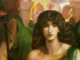

  
[Intangible Textual Heritage](../../../index)  [Classics](../../index) 
[Lucian](../index)  [Index](index)  [Previous](tsg06)  [Next](tsg08) 

------------------------------------------------------------------------

[Buy this Book at
Amazon.com](https://www.amazon.com/exec/obidos/ASIN/B002ECE91S/internetsacredte)

------------------------------------------------------------------------

  
*The Syrian Goddess*, by Lucian, tr. by Herbert A. Strong and John
Garstang, \[1913\], at Intangible Textual Heritage

------------------------------------------------------------------------

p. 41

# TRANSLATION AND NOTES.

1. There is in Syria a city not far from the
river Euphrates [1](#fn_76): it is called "the
Sacred City," and is sacred to the Assyrian Hera. [2](#fn_77) As far as I can judge this name was not
conferred upon the city when it was first settled, but originally it
bore another name. [3](#fn_78) In course of time

p. 42

the great sacrifices were held therein, and then this title was bestowed
upon it. I will speak of this city, and of what it contains. I will
speak also of the laws which govern its holy rites, of its popular
assemblies and of the sacrifices offered by its citizens. I will speak
also of all the traditions attaching to the founders of this holy place:
and of the manner of the founding of its temple. I write as an Assyrian
born [4](#fn_79) who have witnessed with mine
own eyes some of the facts which I am about to narrate: some, again, I
learnt from the priests: they occurred before my time, but I narrate
them as they were told to me.

2. The first men on earth to receive knowledge of
the gods, and to build temples and shrines and to summon meetings for
religious observances are said to have been the Egyptians. [5](#fn_80) They were the first, too, to take
cognizance

p. 43

of holy names, and to repeat sacred traditions. Not long after them the
Assyrians heard from the Egyptians their doctrines as to the gods, and
they reared temples and shrines: in these they placed statues and
images.

3. Originally the temples of the Egyptians
possessed no images. And there exist in Syria temples of a date not much
later than those of Egypt, many of which I have seen myself, for
instance, the temple of Hercules in Tyre. [6](#fn_81) This is not the Hercules of Greek legend;
but a Tyrian hero of much greater antiquity than he.

4. There is likewise in Phœnicia a temple of
great size owned by the Sidonians. They call it the temple of
Astarte. [7](#fn_82) I hold this Astarte to be
no other than the

p. 44

moon-goddess. But according to the story of one of the priests this
temple is sacred to Europa, the sister of Cadmus. She was the daughter
of Agenor, and on her disappearance from Earth the Phœnicians honoured
her with a temple and told a sacred legend about her; how that Zeus was
enamoured of her for her beauty, and changing his form into that of a
bull carried her off into Crete. [8](#fn_83)
This legend I heard from other Phœnicians as well; and the coinage
current among the Sidonians bears upon it the effigy of Europa sitting
upon a bull, none other than Zeus. [9](#fn_84)
Thus they do not agree that the temple in question is sacred to Europa.

5. The Phœnicians have also another sacred
custom, derived from Egypt, not from Assyria: it came, they say, from
Heliopolis into Phœnicia. I never witnessed this myself, but it is
important, and of great antiquity.

p. 45

 

  [  
Click to enlarge](img/fig06.jpg)  
FIG. 6.—TEMPLE AT BYBLOS.  
  
*B. M. Cat. Coins*, *Phœn. Byb*. 32.  
Date A.D. 217-8.

 

6. I saw too at Byblos a large temple, [10](#fn_85) sacred to the Byblian Aphrodite [11](#fn_86): this is the scene of the secret rites of
Adonis: I mastered these. They assert that the legend about Adonis and
the wild boar is true, [12](#fn_87) and that

p. 46

the facts occurred in their country, and in memory of this calamity they
beat their breasts and wail every year, and perform their secret ritual
amid signs of mourning through the whole countryside. When they have
finished their mourning and wailing, they sacrifice in the first place
to Adonis, as to one who has departed this life: after this they allege
that he is alive again, and exhibit his effigy to the sky. They proceed
to shave their heads, [13](#fn_88) too, like the
Egyptians on the loss of their Apis. The women who refuse to be shaved
have to submit to the following penalty, viz., to stand for the space of
an entire day in readiness to expose their persons for hire. The place
of hire is open to none but foreigners, and out of the proceeds of the
traffic of these women a sacrifice to Aphrodite is paid. [14](#fn_89)

p. 47

7. Some of the inhabitants of Byblos maintain
that the Egyptian Osiris is buried in their town, and that the public
mourning and secret rites are performed in memory not of Adonis, but of
Osiris. [15](#fn_90) I will tell you why this
story seems worthy of credence. A human head comes every year from Egypt
to Byblos, [16](#fn_91) floating on its seven
days' journey thence: the winds, by some divine instinct, waft it on its
way: it never varies from its course but goes straight to Byblos. The
whole occurrence is miraculous. It occurs every year, and it came to
pass while I was myself in Byblos, and I saw the head in that city.

8. There is, too, another marvellous portent in
the region of the Byblians. A river, flowing from Mount Libanus,
discharges itself into the sea: this river bears the name of
Adonis. [17](#fn_92) Every year regularly it is
tinged

p. 48

with blood, and loses its proper colour before it falls into the sea: it
dyes the sea, to a large space, red: [18](#fn_93) and thus announces their time of mourning
to the Byblians. Their story is that during these days Adonis is
wounded, and that the river's nature is changed by the blood which flows
into its waters; and that it takes its name from this blood. Such is the
legend vulgarly accepted: but a man of Byblos, who seemed to me to be
telling the truth, told me another reason for this marvellous change. He
spoke as follows: "This river, my friend and guest, passes through the
Libanus: now this Libanus abounds in red earth. The violent winds which
blow regularly on those days bring down into the river a quantity of
earth resembling vermilion. It is this earth that turns the river to
red. And thus the change in the river's colour is due, not to blood as
they affirm, but to the nature of the soil." [19](#fn_94) This was the story of the Byblian. But
even assuming that he spoke the truth, yet there certainly seems to me
something supernatural in the regular coincidence of the wind and the
colouring of the river.

9. I went up also from Byblos into the Libanus, a
single day's journey, as I had heard that there was an ancient temple of
Aphrodite there founded by Cinyras.

p. 49

\[paragraph continues\] I saw the
temple, [20](#fn_95) and it was indeed old.
These then are the ancient great temples of Syria.

10. Of all these temples, and they are numerous
indeed, none seems to me greater than those found in the sacred city; no
shrine seems to me more holy, no region more hallowed. They possess some
splendid masterpieces, some venerable offerings, many rare sights, many
striking statues, and the gods make their presence felt in no doubtful
way. The statues sweat, and move, and utter oracles, and a shout has
often been raised when the temple was closed; it has been heard by many.
And more: this temple is the principal source of their wealth, as I can
vouch. For much money comes to them from Arabia, and from the Phœnicians
and the Babylonians: the Cilicians, too, and the Assyrians bring their
tribute. [21](#fn_96) And I saw with my own eyes
treasures stored away privately in the temple; many garments, and other
valuables, which are exchanged for silver or gold. Nowhere among mankind
are so many festivals and sacred assemblies instituted as among them.

p. 50

11. On enquiring the number of years since the
temple was founded, and whom they deemed the goddess to be, many tales
were told to me, some of which were sacred, and some public property;
some, again, were absolutely fabulous; others were mere barbarians'
tales; others again tallied with the Greek accounts. All these I am
ready to narrate, though I withhold my acceptance of some.

12. The people, then, allege that it was
Deukalion or Sisythus who founded the temple; I mean the Deukalion in
whose time the great flood occurred. I have heard the story about
Deukalion as the Greeks narrate it from the Greeks themselves. The story
runs as follows: The present race of men was not the first to be
created. The first generation perished to a man; the present is a second
creation. This generation became a vast multitude, owing to Deukalion.
Of the men of the original creation they tell this tale: they were
rebellious, and wilful, and performed unholy deeds, disregarding the
sanctity of oaths and hospitality, and behaving cruelly to suppliants;
and it was for these misdeeds that the great destruction fell upon them.
Straightway the earth discharged a vast volume of water, and the rivers
of heaven came down in streams and the sea mounted high. Thus everything
became water, and all men perished; Deukalion alone was saved for
another generation, on the score of his wisdom and piety. The manner of
his salvation was as follows: He placed his children and his wives in an
ark of vast size, and he himself also entered in. Now, when he had
embarked, there came to him wild boars and horses, and generations of
lions and serpents, and all the other beasts which roam the earth, all
in couples. He welcomed them all. Nor did they harm him; and friendship
remained amongst them as

p. 51

\[paragraph continues\] Zeus himself
ordained. These, one and all, floated in this ark as long as the flood
remained. This is the legend of Deukalion as told by the Greeks. [22](#fn_97)

13. But a further story is told by the men of
Hierapolis, and a wonderful one it is; they say that in their country a
mighty chasm appeared which received all the water, and that Deukalion
on this occurrence reared altars and founded a temple to Juno above this
chasm. I have actually seen this chasm, it lies beneath the temple and
is of very small dimensions. If it was once of large size, and was
afterwards reduced to its present small dimensions, I know not: but the
chasm which I saw is certainly very small. They maintain that their tale
is proved by the following occurrence; twice in every year the water
comes from the sea to the temple. This water is brought by the priests;
but besides them, all Syria and Arabia and many from beyond the
Euphrates

p. 52

go down to the sea; one and all bring its water which they first pour
out in the temple; [23](#fn_98) then this water
passes down into the chasm which, small though it be, holds a vast
quantity of water. Thus then they act, and they declare that the
following law was passed by Deukalion in that temple, in order that it
might be an everlasting remembrance at once of the visitation and of its
alleviation.

14. Others again maintain that Semiramis [24](#fn_99) of Babylon, who has left many mighty
works in Asia, founded this edifice as well; nor did she dedicate it to
Hera, but to her own mother, whose name was Derceto. [25](#fn_100) Now,

p. 53

\[paragraph continues\] I have seen the
semblance of Derceto in Phœnicia, and a wonderful sight it is; one half
is a woman, but

p. 54

the part which extends from the thighs to the feet ends in a fish's
tail. [26](#fn_101) The effigy, however, which
is at Hierapolis is a complete woman. [27](#fn_102) The reasons for this story are plain to
understand; they deem fishes holy objects, [28](#fn_103) and never touch them, while of birds
they use

p. 55

all but pigeons for food; the pigeon is in their eyes sacred. [29](#fn_104) It appears to them then that what we
have described was done in honour of Derceto and Semiramis. The former,
because Derceto has the form of a fish; the latter, because the lower
half of Semiramis takes the form of a pigeon. I, however, should
probably conclude that the temple in question belongs to Semiramis; that
the shrine is Derceto's I can in no wise believe, since even amongst the
Egyptians there are some who will not touch fish as food, and they
certainly do not observe this restriction in favour of Derceto.

15. There is, however, another sacred story
which I had from the lips of a wise man—that the goddess was Rhea, and
the shrine the work of Attes. Now this Attes was by nation a Lydian, and
he first taught the sacred mysteries of Rhea. [30](#fn_105) The ritual of the Phrygians and the
Lydians and the Samothracians was entirely learnt from Attes. For when
Rhea deprived him of his powers, he put off his manly garb and assumed
the

p. 56

appearance of a woman and her dress, [31](#fn_106) and roaming over the whole earth he
performed his mysterious rites, narrating his sufferings and chanting
the praises of Rhea. In the course of his wanderings he passed also into
Syria. Now, when the men from beyond Euphrates would neither receive him
nor his mysteries, [32](#fn_107) he reared a
temple to himself on this very spot. The tokens of this fact are as
follows: She is drawn by lions, she holds a drum in her hand and carries
a tower on her head, just as the Lydians make Rhea to do. [33](#fn_108) He also affirmed that the Galli who are
in the temple in no case castrate themselves in honour of Juno, but of
Rhea, and this in imitation of Attes. All this seems to me more

p. 57

specious than true, for I have heard a different and more credible
reason given for their castration.

16. I approve of the remarks about the temple
made by those who in the main accept the theories of the Greeks:
according to these the goddess is Hera, but the work was carried out by
Dionysus, [34](#fn_109) the son of Semele:
Dionysus visited Syria on his journey to Aethiopia. There are in the
temple many tokens that Dionysus was its actual founder: for instance,
barbaric raiment, Indian precious stones, and elephants' tusks brought
by Dionysus from the Aethiopians. Further, a pair of phalli of great
size are seen standing in the vestibule, bearing the inscription, "I,
Dionysus, dedicated these phalli to Hera my stepmother." This proof
satisfies me. And I will describe another curiosity to be found in this
temple, a sacred symbol of Dionysus. The Greeks erect phalli in honour
of Dionysus, and on these they carry, singular to say, mannikins made of
wood, with enormous pudenda; they call these puppets. There is this
further curiosity in the temple: as you enter, on the right hand, a
small brazen statue meets your eye of a man in a sitting posture, with
parts of monstrous size.

p. 58

17. These are the legends concerning the
founders of the temple. I will proceed to speak of the edifice itself
and its position: how it was built and who built it. They affirm that
the temple as it exists now is not that which was built originally: the
primitive temple fell to pieces in the course of time: the present one
they say was the work of Stratonice, the wife of the king of the
Assyrians. [35](#fn_110) This I take to be the
Stratonice of whom her stepson was enamoured, and the skill of a doctor
detected the intrigue: for the lover, overpowered by the malady of his
passion, bewildered by the thought of his shameful caprice, lay sick in
silence. He lay sick, and though no ache was in any limb, yet his colour
was gone, and his frame was growing frailer day by day. The doctor,
seeing that he was suffering from no definite disease, perceived that
his malady was none other than love. Many are the symptoms of secret
love: languor of vision, change in the voice and complexion, and
frequent tears.

p. 59

\[paragraph continues\] The doctor, aware
of this, acted as follows: he laid his hand on the heart of the young
man, and summoned all the domestics in the household. The patient
remained tranquil and unmoved on the entrance of the rest, but when his
stepmother carne in he grew pale and fell to sweating and trembling, and
his heart beat violently. These symptoms betrayed his passion to the
doctor.

18. The doctor proceeded to adopt the following
cure: Summoning the young man's father, who was racked by anxiety, he
explained to him that the young man's malady was no normal malady, but a
wrongful action: "he has no painful symptoms; he is possessed by love
and madness. He longs to possess what he will never obtain; he loves my
wife, whom I will never give up." This was the trick of the wise
physician. The father straightway begged the doctor by his prudence and
professional skill not to let his son perish. "His malady depended not
on his will; it was involuntary. Pray then do not you let your jealousy
bring grief on the whole realm, and do not, dear doctor, draw
unpopularity on your profession." Such was the unwitting father's
request. The doctor replied: "Your request is scandalous. You would
deprive me of my wife and outrage the honour of a medical man. I put it
to you, what would be your conduct, since you are deprecating mine, if
your wife were the object of his guilty love?" He replied that he would
not spare his own wife nor would he begrudge his son his life, even
though that son were enamoured of his own stepmother: losing one's wife
was a less misfortune than losing one's son. The doctor on hearing this
said: "Why then offer me these entreaties? In good truth, your wife is
the object of his love. What I said to you was all a made-up story." The
father

p. 60

followed this advice, and handed over his wife and his kingdom to his
son, and he himself departed into the region of Babylonia and founded a
city on the Euphrates which bore his name: and there he died. Thus it
was that our wise doctor detected and cured the malady.

19. Now this Stratonice, when still married to
her former husband, saw in a vision Hera exhorting her to rear a temple
to this goddess at Hierapolis. Should she neglect to obey, she was
menaced by the goddess with manifold evils. The queen began by
disregarding the dream, but later, when seized by a dangerous illness,
she told the vision to her husband, and appeased Hera, and undertook to
raise the temple. Hardly had she recovered when she was despatched by
her husband to Hierapolis, and a large sum of money with her, and a
large army too, partly to aid in the building operations and partly to
ensure her safety. He summoned one of her friends called Combabus, a
young man of handsome presence, and said, "Combabus, I know thee for an
honest man, and of all my friends I love thee best, and I commend thee
greatly alike for thy wisdom and for thy goodwill which thou hast shown
to us. At the present moment I have need of all thy confidence, and thus
I wish thee to accompany my wife, and to carry out my work, and to
perform the sacrifices due, and to command my army. On my return great
honour shall fall to thee. Combabus begged and prayed not to be
despatched, and not to be entrusted with matters far above his
powers—moneys, the lady, the holy work: not merely so, but he feared
lest in the future some jealousy might make itself felt as to his
relations with Stratonice, as he was unaccompanied should he consent to
escort her.

20. The king, however, refused to be moved; so
Combabus prayed as an alternative that a respite of

p. 61

seven days might be granted him: after that interval he was willing to
be despatched after attending to his immediate needs. On obtaining this
respite, which was willingly granted, he departed to his house, and
throwing himself on the ground, he thus deplored his lot: "Unhappy me!
Why this confidence in myself? To what end is this journey, whose
results I already see? I am young and the lady whom I escort is fair.
This will prove a great and mighty disaster, unless I remove entirely
the cause of the evil. Thus I must even perform a mighty deed which will
heal all my fears." Saying this he unmanned himself, and he stowed away
the mutilated pudenda in a little vessel together with myrrh and honey
and spices of various sorts. He sealed this vessel up with a ring which
lie wore; and finally he proceeded to dress his wound. As soon as he
deemed himself fit to travel he made his way to the king, and before a
large company reached the vessel forth and spoke as follows: "Master!
This my most precious treasure was stored up in my house, and I loved it
well: but now that I am entering on a long journey, I will set it in thy
keeping. Do thou keep it well: for it is dearer to me than gold and more
precious to me than life. On my return I shall receive it again." The
king was pleased to receive the vessel, and after sealing it with
another seal he entrusted it to his treasurers to keep.

21. So Combabus from this time forth continued
his journey in peace. Arrived at Hierapolis they built the temple with
all diligence, and three years passed while they were at their task.
Meantime the event came to pass which Combabus had feared. Stratonice
began to love him who had been her companion for so long a time: her
love passed into an overpowering passion. Those of

p. 62

\[paragraph continues\] Hierapolis affirm
that Hera was the willing cause of this trouble: she knew full well that
Combabus was an upright man, but she wished to wreak her wrath on
Stratonice for her unwillingness to undertake the building of the
temple.

22\. The queen was at first coy and tried to hide her passion, but when
her trouble left her no longer any repose, she openly displayed her
irritation and wept the whole day long, and called out repeatedly for
Combabus: Combabus was everything to her. At last, in despair at her
impotency to master her passion, she sought a suitable occasion for
supplicating his love. She was too cautious to admit her passion to a
stranger, but her modesty prevented her from facing the situation.
Finally she hits on this plan; that she should confront him after she
should have drunk deeply of wine; for courage rises after drinking and a
repulse seems then less degrading, and actions performed under the
influence of wine are set down to ignorance. Thus she acted as she
thought best. After supper she entered the chamber in which Combabus
dwelt, and besought him, embracing his knees, and she avowed her guilty
love. He heard her words with disgust and rejected her advances,
reproaching her with drunkenness. She, however, threatened that she
would bring on him a great calamity; on which he trembled, and he told
her all his story and narrated all that he had done and finally
disclosed to her the manifest proofs of his statement. When the queen
witnessed this unexpected proof her passion indeed was quenched, but she
never forgot her love, but in all her intercourse she cherished the
solace of her unavailing affection. The memory of this love is still
alive at Hierapolis and is maintained in this way; the women still are
enamoured of the Galli, and the Galli again love the women with

p. 63

passion; but there is no jealousy at all, and this love passes among
them for a holy passion.

23. The king was well informed by Stratonice as
to her doings at Hierapolis, for many who came thence brought the tale
of her doings. The monarch was deeply moved by the tidings, and before
the work was finished summoned Combabus to his presence. Others narrate
with respect to this a circumstance wholly untrue; that Stratonice
finding her prayers repulsed wrote with her own hand to her husband and
accused Combabus of making an attempt upon her modesty; and what the
Greeks allege about their Stheneboea and about Phaedra the Cnosian the
Assyrians tell in the same way about Stratonice. For my part I do not
believe that either Stheneboea nor Phaedra acted thus if Phaedra really
loved Hippolytus. However, let the old version remain for what it is
worth.

24. When, however, the news was brought to
Hierapolis, Combabus took count of the charge and departed in a spirit
of full confidence, conscious that the visible proof necessary for his
defence had been left in the city his home. On his arrival the king
immediately put him in prison under strict guard. Then in the presence
of the friends of the accused who had been present when Combabus was
commissioned to depart, the king summoned him into open court and began
to accuse him of adultery and evil lust; and deeply moved, recounting
the confidence he had reposed in his favourite and his long friendship,
he arraigned Combabus on three distinct charges: first, that he was an
adulterer, secondly, that he had broken his trust, finally, that he had
blasphemed the goddess by acting thus while engaged in her service. Many
of the bystanders bore witness against him, saying that they had seen
the guilty pair embracing.

p. 64

\[paragraph continues\] It was finally
agreed that Combabus was worthy of death as his evil deeds had merited.

25. He had stood up to this point in silence,
but as he was being led to his fate, he spoke out, and demanded the
restoration of his pledge, affirming that he was to be killed not for
rebellious conduct against his king, nor for any violation of the king's
married life, but solely because of the king's eagerness to possess what
he had deposited at the royal court at his departure. The king thereon
summoned his treasurer and bade him bring forth what he had committed to
his custody. On its production, Combabus removed the seal and displayed
the contents of the vessel, and showed how he himself had suffered
thereby; adding, "This is just what I feared, O King, when thou didst
send me on that errand: I left with a heavy heart, and I did my duty,
constrained by sheer necessity. I obeyed my lord and master to mine own
undoing. Such as I am, I stand accused of a crime which none but a man
in every sense could have committed. The king cried out in amazement at
these words, embraced Combabus and said with tears, "What great ruin,
Combabus, hast thou wrought upon thyself? What monstrous deed of ill
hast thou, alone of men, wrought to thy sorrow? I cannot praise thee,
rash spirit, for enduring to suffer this outrage; would that thou hadst
never borne it; would that I had never seen its proofs! I needed not
this thy defence. But since the deity bath willed it thus, I will grant
thee, first and foremost, as thy revenge, the death of the informers:
and next there shall follow a mighty gift, a store of silver and
countless gold, and raiment of Assyria, and steeds from the royal stud.
Thou shalt enter freely to us unannounced and none shall withstand thee:
none shall keep thee from my sight, even

p. 65

were I by my wife's side." Thus he spake, and thus he acted; the
informers were led off straightway to their execution; Combabus was
laden with gifts, and the king's attachment to him was increased. No one
6f the Assyrians was deemed equal in wisdom and in fortune to Combabus.

26. On his request that he might complete what
was unfinished in the construction of the temple—for he had left it
unfinished—he was despatched anew; and he completed the temple, and
there he abode. To mark his sense of the virtue and good deeds of his
architect, the king granted him a brazen statue of himself to stand in
the temple of his construction. And even to the present day this brazen
statue is seen standing in the temple, the work of Hermocles of Rhodes.
Its form is that of a woman, but the garments are those of a man. [36](#fn_111) It is said, too, that his most intimate
friends, as a proof of their sympathy, castrated themselves like him,
and chose the same manner of life. Others there are who bring gods into
the story and affirm that Combabus was beloved by Hera; and that it was
she who inspired many with the idea of castrating themselves, so that
her lover should not be the only one to lament the loss of his virility.

27. Meantime the custom once adopted remains
even to-day, and many persons every year castrate themselves and lose
their virile powers: whether it be out of sympathy with Combabus, or to
find favour with Hera. They certainly castrate themselves, and then
cease to wear man's garb; they don women's raiment and perform

p. 66

women's tasks. [37](#fn_112) I have heard the
origin of this ascribed to Combabus as well, for the following event
occurred to him. A certain foreign woman who had joined a sacred
assembly, beholding a human form of extreme beauty and dressed in man's
attire, became violently enamoured of him: after discovering that he was
unsexed, she took away her life. Combabus accordingly in despair at his
incapacity for love, donned woman's attire, that no woman in future
might be deceived in the same way. This is the reason of the female
attire of the Galli. Enough of Combabus and his story: in the course of
my story I shall make mention of the Galli, and of their castration, and
of the methods employed to effect it, and of the burial rites wherewith
they are buried, and the reasons why they have no ingress to the temple;
but before this I am inclined to speak of the site of the temple and of
its size: and so I will even speak.

28. The place whereon the temple is placed is a
hill: [38](#fn_113) it lies nearly in the
centre of the city, and is surrounded by a double wall. [39](#fn_114) Of the two walls the one is ancient;

p. 67

the other is not much older than our own times. The entrance to the
temple faces the north; its size is about a hundred fathoms. [40](#fn_115) In this entrance those phalli stand
which Dionysus erected: [41](#fn_116) they
stand thirty fathoms high.

p. 68

\[paragraph continues\] Into one of these
a man mounts twice every year, and he abides on the summit of the
phallus for the space of seven days. The reason of this ascent is given
as follows: The people believe that the man who is aloft holds converse
with the gods, and prays for good fortune for the whole of Syria, and
that the gods from their neighbourhood hear his prayers. Others allege
that this takes place in memory of the great calamity of Deukalion's
time, when men climbed up to mountain tops and to the highest trees, in
terror of the mass of waters. To me all this seems highly improbable,
and I think that they observe this custom in honour of Dionysus, and I
conjecture this from the following fact, that all those who rear phalli
to Dionysus take care to place mannikins of wood on the phalli; the
reason of this I cannot say, but it seems to me that the ascent is made
in imitation of the wooden mannikin.

29. To proceed, the ascent is made in this way;
the man throws round himself and the phallus a small chain; afterwards
he climbs up by means of pieces of wood attached to the phallus large
enough to admit the end of his foot. As he mounts he jerks the chain up
his own length, as a driver his reins. Those who have not seen this
process, but who have seen those who have to climb palm trees in Arabia,
or in Egypt, or any other place, will understand what I mean. When he
has climbed to the top, he lets down a different chain, a long one, and
drags up anything that he wants, such as wood, clothing, and vases; he
binds these together and sits upon them, as it were, on a nest, and he
remains there for the space of time that I have mentioned. Many

p. 69

visitors bring him gold and silver, and some bring brass; then those who
have brought these offerings leave them and depart, and each visitor
gives his name. A bystander shouts the name up; and he on hearing the
name utters a prayer for each donor; between the prayers he raises a
sound on a brazen instrument which, on being shaken, gives forth a loud
and grating noise. He never sleeps; for if at any time sleep surprises
him, a scorpion creeps up and wakes him, and stings him severely; this
is the penalty for wrongfully sleeping. This story about the scorpion is
a sacred one, and one of the mysteries of religion; whether it is true I
cannot say, but, as it seems to me, his wakefulness is in no small
degree due to his fear of falling. So much then for the climbers of the
phalli. As for the temple, it looks to the rising sun. [42](#fn_117)

30. In appearance, and in workmanship, it is
like the temples which they build in Ionia, the foundation rises from
the earth to the space of two fathoms, and on this rests the temple. The
ascent to the temple is built of wood and not particularly wide; as you
mount, even the great hall exhibits a wonderful spectacle and it is
ornamented with golden doors. The temple within is ablaze with gold and
the ceiling in its entirety is golden. There falls upon you also a
divine fragrance such as is attributed to the region of Arabia, which
breathes on you with a refreshing influence as you mount the long steps,
and even when you have departed this fragrance clings to you; nay, your
very raiment retains long that sweet odour, and it will ever remain in
your memory.

31. But the temple within is not uniform. A
special

p. 70

sacred shrine is reared within it; the ascent to this likewise is not
steep, nor is it fitted with doors, but is entirely open as you approach
it. The great temple is open to all; the sacred shrine to the priests
alone and not to all even of these, but only to those who are deemed
nearest to the gods and who have the charge of the entire administration
of the sacred rites. In this shrine are placed the statues, one of which
is Hera, the other Zeus, though they call him by another name. Both of
these are golden, both are sitting; Hera is supported by lions, Zeus is
sitting on bulls. The effigy of Zeus recalls Zeus in all its details—his
head, his robes, his throne; nor even if you wished it could you take
him for another deity. [43](#fn_118)

  [  
Click to enlarge](img/fig07.jpg)  
FIG. 7.—THE GOD AND GODDESS OF HIERAPOLIS.  
(From a Coin of the 3rd cent. A.D.). Scale 2:1.  

p. 71

32. Hera, however, as you look at her will
recall to you a variety of forms. Speaking generally she is undoubtedly
Hera, but she has something of the attributes of Athene, and of
Aphrodite, and of Selene, and of Rhea, and of Artemis, and of Nemesis,
and of The Fates. In one of her hands she holds a sceptre, in the other
a distaff; on her head she bears rays and a tower and she has a girdle
wherewith they adorn none but Aphrodite of the sky. [44](#fn_119) And without she is gilt with gold, and
gems of

p. 72

great price adorn her, some white, some sea-green, others wine-dark,
others flashing like fire. Besides these there are many onyxes from
Sardinia and the jacinth and emeralds, the offerings of the Egyptians
and of the Indians, Ethiopians, Medes, Armenians, and Babylonians. But
the greatest wonder of all I will proceed to tell: she bears a gem on
her head called a Lychnis; it takes its name from its attribute. From
this stone flashes a great light in the night-time, so that the whole
temple gleams brightly as by the light of myriads of candles, but in the
day-time the brightness grows faint; the gem has the likeness of a
bright fire. There is also another

  [  
Click to enlarge](img/fig08.jpg)  
FIG. 8.—THE PHRYGIAN GODDESS (KYBELE) IN THE WEST.  
(From a Roman Lamp.)  

p. 73

marvel in this image: if you stand over against it, it looks you in the
face, and as you pass it the gaze still follows you, and if another
approaching from a different quarter looks at it, he is similarly
affected.

33. Between the two there stands another image
of gold, no part of it resembling the others. This possesses no special
form of its own, but recalls the characteristics of other gods. The
Assyrians themselves speak of it [as](errata.htm#1) a symbol, but they
have assigned to it no definite name. They have nothing to tell us about
its origin, nor its form: some refer it to Dionysus; others to
Deukalion; others to Semiramis; for its summit is crowned by a golden
pigeon, [45](#fn_120) and this is why they
allege that it is the effigy of Semiramis. It is taken down to the sea
twice in every year to bring up the water of which I have spoken. [46](#fn_121)

p. 74

34. In the body of the temple, as you enter,
there stands on the left hand side, a throne for the Sun god; but there
is no image upon it, for the effigies of the Sun and Moon are not
exhibited. I have learnt, however, the reasons of this practice. They
say that religion does not forbid making effigies of the other deities,
for the outward form of these deities is known to all; but the Sun and
Moon are plain for all to see, and all men behold them. What boots it,
therefore, to make effigies of those deities who offer themselves for
all to gaze on?

35. Behind this throne stands an effigy of
Apollo of an unusual character. All other sculptors think of Apollo as a
youth, and represent him in the flower of his age. These artificers
alone exhibit the Apollo of their statuary as bearded. They justify
their action, and criticise the Greeks and others who set up Apollo as a
boy, and appease him in that guise. Their reason is that it is a mark of
ignorance to assign imperfect forms to the gods, and they look on youth
as imperfection. They have also introduced another strange novelty in
sculpture: they, and they alone, represent Apollo as robed. [47](#fn_122)

p. 75

36. I have much to say about his works, and I
will tell what is most worthy of admiration. First I will

p. 76

speak of the oracle. There are many oracles among the Greeks, and many,
too, among the Egyptians, and again in Libya and in Asia there are many
too. But these speak not, save by the mouth of priests and prophets:
this one is moved by its own impulse, and carries out the divining
process to the very end. The manner of his divination is the following:
When he is desirous of uttering an oracle, he first stirs in his seat,
and the priests straightway raise him up. Should they fail to raise him
up, he sweats, and moves more violently than ever.

p. 77

\[paragraph continues\] When they approach
him and bear him up, [48](#fn_123) he drives
them round in a circle, and leaps on one after another. At last the high
priest confronts him, and questions him on every subject. The god, if he
disapproves of any action proposed, retreats into the background; if,
however, he happens to approve it, he drives his bearers forward as if
they were horses. It is thus that they gather the oracles, and they
undertake nothing public or private without this preliminary. This god,
too, speaks about the symbol, and points out when it is the due season
for the expedition of which I spoke in connexion therewith.

37. I will speak of another wonder, too, which
he performed in my presence. The priests were raising him aloft, but he
left them on the ground, and was born aloft himself alone.

38. Behind Apollo is the statue of Atlas; [49](#fn_124) behind that, the statue of Hermes and
Eilithyia.

39. Such, then, are the interior decorations of
the temple; outside of it there stands a great altar of brass.

p. 78

\[paragraph continues\] It contains also
countless other brazen effigies of kings and priests. I will mention
those which seem most worthy of remembrance. To the left of the temple
stands the image of Semiramis, pointing with her right hand to the
temple. That image was erected to commemorate the following occurrence:
The queen had issued a decree that all the Syrians should worship her as
a deity, adding that they were to take no count of the others, not
excepting even Hera; and they obeyed her decree. Afterwards, however,
when disease and misfortune and grief were inflicted on her, she calmed
down from her frenzied infatuation, and avowed herself a mere mortal,
and ordered her subjects to turn again to Hera. This is why she stands
to-day in this posture, pointing out Hera as the goddess whose grace is
to be won, and confessing that she is not a goddess, but that Hera is
indeed such.

40. I saw also the effigy of Helen, and of
Hecuba, and of Andromache, and of Paris, and of Achilles. I saw also the
statue of Nireus, the son of Aglaia, and of Philomela and Procne while
yet women, and Tereus changed into a bird; and another effigy of
Semiramis and one of Combabus and one of Stratonice of special beauty,
and one of Alexander like to this. Sardanapalus stands by his side in a
different form and in a different garb.

41. In the great court oxen of great size
browsed horses, too, are there, and eagles and bears and lions, who
never hurt mankind but are all sacred and all tame. [50](#fn_125)

p. 79

42. Many priests also are in attendance, some of
whom sacrifice the victims, others bring libations, others are called
fire-bearers, and others altar attendants. In my presence more than 300
of these were present at a sacrifice; all had vestments of white and
wore caps on their heads. Every year a new high priest is
appointed. [51](#fn_126) He, and he alone, is
clad in purple and crowned with a golden tiara.

43. Besides this there is another multitude of
holy men, pipers, flute players, [52](#fn_127)
and Galli; and women frenzied and fanatic. [53](#fn_128)

p. 80

44. A sacrifice is offered up twice every day,
and they are all present at this: To Zeus they sacrifice in silence,
neither chanting nor playing, but when they sacrifice to Hera they sing,
they pipe, and shake rattles. About this ceremony they could tell me
nothing certain. [54](#fn_129)

45. There is too a lake [55](#fn_130) in the same place, not far

p. 81

from the temple in which many sacred fishes of different kinds are
reared. [56](#fn_131) Some of these grow to a
great size; they are called by names, and approach when called. I saw
one of these ornamented with gold, and on its back fin a golden design
was dedicated to the temple. I have often seen this fish, and he
certainly carried this design.

46. The depth of the lake is immense. I never
tested it myself, but they say that it is in depth more than 200
fathoms. In the midst of this lake stands an altar of stone. You would
think at first sight that it was floating and moving in the water, and
many deem that it is so. The truth seems to me that it is supported by a
column of great size, based on the bottom of the lake. It is always
decked with ribbons, and spices are therein, and many every day swim in
the lake with crowns on their heads performing their acts of adoration.

47. At this lake great assemblies meet, and
these are called descents into the lake because all their deities go
down into this lake, amongst whom Hera [57](#fn_132) first advances

p. 82

so that Zeus may not see the fish first, for if this were to happen they
say that one and all would perish. And Zeus comes indeed intending to
see these fish, but she, standing before him, keeps hint at bay, and
with many supplications holds him off.

48. But the greatest of these sacred assemblies
are those held on the sea coast. [58](#fn_133)
About these, however, I have nothing certain to say. I was never present
at their celebrations, nor did I undertake the journey thither; but I
did see what they do on their return, and I will at once tell you. Each
member of the assembly carries a vessel full of water. The vessels are
sealed with wax; those who carry the water do not unseal the vessels and
then pour out the water; but there is a certain holy cock [59](#fn_134) who dwells hard by the lake. This bird,
on

p. 83

receiving the vessels from the bearers, inspects the seal, and after
receiving a reward for this action he breaks the thread and picks away
the wax, and many minae are collected by the cock by this operation.
After this the bearers carry the water into the temple and pour it
forth, and they depart when the sacrifice is finished.

49. The greatest of the festivals that they
celebrate is that held in the opening of spring; some call this the
Pyre, others the Lamp. On this occasion the sacrifice is performed in
this way. They cut down tall trees and set them up in the court; then
they bring goats and sheep and cattle and hang them living to the trees;
they add to these birds and garments and gold and silver work. After all
is finished, they carry the gods around the trees and set fire
under; [60](#fn_135) in a moment all is in a
blaze. To

p. 84

this solemn rite a great multitude flocks from Syria and all the regions
around. Each brings his own god and the statues which each has of his
own gods.

50. On certain days a multitude flocks into the
temple, and the Galli in great numbers, sacred as they are, perform the
ceremonies of the men and gash their arms and turn their backs to be
lashed. [61](#fn_136) Many bystanders play on
the pipes the while many beat drums; others sing divine and sacred
songs. All this performance takes place outside the temple, and those
engaged in the ceremony enter not into the temple.

51. During these days they are made Galli. As
the Galli sing and celebrate their orgies, frenzy falls on many of them
and many who had come as mere spectators afterwards are found to have
committed the great act. I will narrate what they do. Any young man who
has resolved on this action, strips off his clothes, and with a loud
shout bursts into the midst of the crowd, and picks up a sword from a
number of swords which I suppose have been kept ready for many years for
this purpose. He takes it and castrates himself [62](#fn_137) and then runs wild through the city,
bearing in his hands what he has cut off. He casts it into any house at
will, and from

p. 85

this house he receives women's raiment and ornaments. [63](#fn_138) Thus they act during their ceremonies
of castration.

52. The Galli, when dead, are not buried like
other men, but when a Gallus dies his companions carry him out into the
suburbs, and laying him out on the bier on which they had carried him
they cover him with stones, and after this return home. They wait then
for seven days, after which they enter the temple. Should they enter
before this they would be guilty of blasphemy.

53. The laws which they observe are the
following: Anyone who has seen a corpse may not enter the temple the
same day; but afterwards, when he has purified himself, he enters. But
those who are of the family of the corpse wait for thirty days, and
after shaving their heads they enter the temple, but before they have
done this it is forbidden.

54. They sacrifice bulls and cows alike and
goats and sheep; [64](#fn_139) pigs alone,
which they abominate, are neither sacrificed nor eaten. Others look on
swine without disgust, but as holy animals. [65](#fn_140) Of birds the dove seems

p. 86

the most holy to them, [66](#fn_141) nor do
they think it right to harm these birds, and if anyone have harmed them

p. 87

unknowingly they are unholy for that day, and so when the pigeons dwell
with the men they enter their rooms and commonly feed on the ground.

55. I will speak, too, about those who come to
these sacred meetings and of what they do. As soon as a man comes to
Hierapolis he shaves his head and his eyebrows; [67](#fn_142) afterwards he sacrifices a sheep [68](#fn_143) and cuts up its flesh and eats it; he
then lays the fleece on the ground, places his knee on it, but puts the
feet and head of the animal on his own head and at the same time he
prays that the gods may vouchsafe to receive him, and he promises a
greater victim hereafter. When this is performed he crowns his head with
a garland and the heads of all those engaged in the same procession.
Starting from his house he passes into the road, previously bathing
himself and drinking cold water. He always sleeps on the ground, for he
may not enter his bed till the completion of his journey.

56. In the city of Hierapolis a public host
receives him, suspecting nothing, for there are special hosts attached
to each city, and these receive each guest according to his country.
These are called by the Assyrians teachers, because they teach them all
the solemn rites.

p. 88

57. They sacrifice victims not in the temple
itself, but when the sacrificer has placed his victim at the altar and
poured a libation [69](#fn_144) he brings the
animal home alive, and returning to his own house he slays his victim
and utters prayers.

58. There is also another method of sacrifice,
as follows: They adorn live victims with ribbons and throw them headlong
down from the temple's entrance, and these naturally die after their
fall. Some actually throw their own children down, not as they do the
cattle, but they sew them into a sack and toss them down, visiting them
with curses and declaring that they are not their children, but are
cows. [70](#fn_145)

59. They all tattoo themselves—some on the hands

p. 89

and some on the neck—and so it comes that all the Assyrians bear
stigmata. [71](#fn_146)

60. They have another curious custom, in which
they agree with the Trœzenians alone of the Greeks. I will explain this
too. The Trœzenians have made a law for their maidens and youths alike
never to marry till they have dedicated their locks to Hippolytus; and
this they do. It is the same at Hierapolis. The young men dedicate the
first growth on their chin, then they let down the locks of the maidens,
which have been sacred from their birth; they then cut these off [72](#fn_147) in the temple and place them in
vessels, some in silver vessels, some in gold, and after placing these
in the temple and inscribing the name on the vessel they depart. I
performed this act myself when a youth, and my hair remains still in the
temple, with my name on the vessel.

------------------------------------------------------------------------

### Footnotes

[41:1](tsg07.htm#fr_76) Identified with the
ruins of modern Mumbidj, on a route from Aleppo to the junction of the
Sajur River with the Euphrates, from which point it is distant 14½ miles
(23 kilometres). *Cf*. Smith's *Dict. of Greek and Roman
Geog*.—HIERAPOLIS. The distance accords with that given by a fifth
century pilgrim, ? Etheria \[Silvia\]; *cf*. *Corp. Script. Eccl. Lat.*,
xxxix. p. 61, cited by Hogarth, *Jour. Hell. Stud.*, xiv. (1907-8), p.
183. Strabo (xvi. i. 28) gives the distance as four *schœni* from the
river. For early explorers' descriptions of the site, see quotations in
the Appendix, pp. [92](tsg08.htm#page_92)-[95](tsg08.htm#page_95). Many
of the fine remains of Roman, Saracenic, Seljukian and Moslem times are
now in ruins, but the sacred lake and other features are still to be
seen (see note [55](#fn_130)).

[41:2](tsg07.htm#fr_77) *Cf*. §
[31](tsg07.htm#an_31). By the words "Assyrian Hera" Lucian tersely
identifies the goddess and distinguishes her attributes:—"Hera," because
mated (§ 31) to a "Zeus ", "Assyrian," because she is to be
distinguished from the classical conception of the deity. For this use
of the term Assyrian in the sense of North Syrian (or Aramaean), *cf*.
Rob.-Smith, *Eng. Hist. Rev.*, 1887, pp. 312, 313; and note Lucian's
reference to himself below as an "Assyrian born." On the name of the
goddess, Atargatis, which appears on local coins and is mentioned by
Strabo, Pliny, Macrobius, etc., see Introduction, pp.
[1](tsg04.htm#page_1), [21](tsg04.htm#page_21); and note [25](#fn_100)
below.

[41:3](tsg07.htm#fr_78) Its name in Hittite and
subsequent Assyrian period has not been recognised. "Bambyce" seems to
be the earliest name substantiated, and it came to be called
"Hierapolis" ("the sacred city") by the Greeks. Strabo (xvi. i. 28)
mentions another name, Edessa, but this is an obvious error. Pliny
states that the local Syrian name was Mabog, *Nat. Hist.* v. 23 (19), §
81 (Ed. Detlefsen).

[42:4](tsg07.htm#fr_79) "An Assyrian
born"—actually born about A.D. 125 at Samsat, on the Euphrates. The
place in Hittite times, of which there are traces \[*cf*. Land of the
Hittites (hereafter cited *L. H.*), pp. 130, 131; *Corp. Inscr. Hit.*
(1900), p. 14, pl. xvii.; Humann and Puchstein, *Reisen*, Atlas, pl.
xlix. 1-3\], was on the Mitannian and later the Assyrian frontier, and
by the Assyrians several times attacked, as in 1120 B.C. and again about
885 B.C. About 750 B.C. it was in possession of the Vannic kings, and it
was finally annexed to the Assyrian empire about 743 B.C. Nineveh fell
to the Medes in 606. After the period of Persian domination it became
first capital of the province of Commagene in the Greek kingdom of
Syria. The district was later ruled by independent princes of Seleucid
extraction. Subsequently the seat of government was transferred to
Hierapolis.

[42:5](tsg07.htm#fr_80) Archæological research
hardly bears out this statement. *Cf*. *inter alia* Hilprecht,
*Exploration in Bible Lands* (1903); King and Hall, *Egypt and Western
Asia in the Light of Recent Discoveries* (1907). *Cf*. Herodotus, ii. 2
*et seq*.

[43:6](tsg07.htm#fr_81) Hercules of Tyre. *Cf*.
Herodotus, ii. 44, who records the local tradition that the temple was
2,300 years old, and convinced himself that this Hercules was a god of
very great antiquity. Rawlinson (*Hist. of Phœnicia*, p. 330) points out
his identity with Melkarth, who originally represented one aspect of
Baal. Similarly the Hittite god represented in the rock sculpture at
Ivriz in Asia Minor (*L. H.*, pl. lvii. and pp. 192-195) was identified
by the Greeks with Hercules; and is recognised by Frazer (*Adonis, Attis
and Osiris*, p. 97) as identical with the Baal of Tarsus. *Cf*. also
Ramsay, *Luke the Physician*, pp. 171-179, and a note in his *Pauline
and other Studies*, pp. 172-173, and note [47](#fn_122) below.

[43:7](tsg07.htm#fr_82) The Phœnician Astarte
\[‘Astart\], the goddess of productivity in Nature, particularly in the
animal world, and hence the guardian of births. Like the Dea Syria, she
is differentiated only by local custom or tradition from other aspects
of the Mother-goddess. As the natural consort and counterpart of Baal,
who embodied the generative principle, "bringing all things to life
everywhere," and thus regarded as the sun-god, she was queen of heaven,
and hence the moon-goddess. Another symbolism connected with the p. 44 legend which follows makes her the Cow-goddess
in relation to the Bull-god. *Cf*. Robertson-Smith, *Religion of the
Semites*, p. 477. These purely feminine attributions reflect a
patriarchal state of society, with the male god dominant. (*Cf*. the
interesting remarks by Rob. Smith in the *Eng. Hist. Rev.*, 1887, p.
316.) Among the Greeks and Romans, who recognised in Baal their Zeus or
Jupiter, the goddess appeared most like to Aphrodite or Venus, whose
prototype she was. She is the Ashtoreth for whom Solomon erected a
shrine (2 Kings, ii. 5, 33), which was defiled by Josiah (2 Kings,
xxiii. 13), who "brake in pieces the images and cut down the groves." In
cult and in name she is the local form of the Babylonian Ishtar, see
Introduction, pp. [1](tsg04.htm#page_1), [16](tsg04.htm#page_16).

[44:8](tsg07.htm#fr_83) *Cf*. Herodotus, i. 4,
iv. 45; Pausanias, vii. 4, i.; ix. 19, i., etc.

[44:9](tsg07.htm#fr_84) Zeus, as a bull-god; see
also the allusion in § [31](tsg07.htm#an_31), where the "Zeus" of
Hierapolis is represented sitting on bulls, as a counterpart to the
goddess who is seated on lions. For the identification of the Hittite
"Zeus" with the bull, see Introduction, pp. [5](tsg04.htm#page_5),
[10](tsg04.htm#page_10); and Figs. [2](tsg04.htm#img_fig02),
[3](tsg04.htm#img_fig03); *cf*. Fig. [7](#img_fig07).

[45:10](tsg07.htm#fr_85) *Cf*. "The city stood
on a height a little distance from the sea" (Strabo, xvi. ii. 18). The
temple is figured on coins from the site (see our illustration, Fig.
[6](#img_fig06); and *cf*. Hill on "Some Græco-Phœnician Shrines," in
*Jour. Hell. Stud.*, xxxi., 1911, pl. iii., No. 16, etc.). The outer
court was approached by steps, and its interior was screened to view
from without. It had a façade of columns, and was enclosed by a
pilastered wall or cloister. It was open to the sky and a conical
obelisk rising from the interior symbolised the cult. The sanctuary was
raised by a further flight of steps; its approach was ornamented with
pilasters, cornice and pediment, and a roof protected the altar and
shrine within (*cf*. Perrot and Chipiez, *Histoire*, iii. 60, Engl.
transl. *Phœn*., p. 61; Rawlinson, *Phœnicia*, p. 146; Evans, *Mykenæan
Tree and Pillar Cult*, p. 40; Frazer, *Adonis*, p. 11, note 1, with
bibl.). The temples at Hierapolis and at Carchemish were similarly
approached by steps.

[45:11](tsg07.htm#fr_86) Differing, if at all,
only by local attributes from the Sidonian Astarte. *Cf*. Cicero, *De
natura deorum*, iii. 23, 59; also see, for a useful summary of the
argument, Bennett, *Relig. Cults associated with the Amazons* (New York,
1912), p. 50.

[45:12](tsg07.htm#fr_87) For the myth of Adonis,
with bibl., see Frazer, *Adonis, Attis, and Osiris*, Ch. i. p. 46 The legend of the wild boar does not survive
in the story of Tammuz, but it appears in one version of the death of
Attis. It suggests a totemistic origin.

[46:13](tsg07.htm#fr_88) *Cf*. §§
[55](tsg07.htm#an_55) and [60](tsg07.htm#an_60) below. On the custom of
hair-offering among the Semites, *cf*. Robertson-Smith, *Relig.
Semites*, p. 325 *ff*.; also Frazer, *Adonis*, etc., p. 34.

[46:14](tsg07.htm#fr_89) A custom of similar
character commonly attached itself to the worship of the Great Mother in
her various forms (*cf*. Herod. i. 199; Strabo, xv. i. 20), being
regarded as an honourable devotion to her service (Strabo, xi. xiv. 16);
it was obligatory in Lydia (Herodotus, i. 93). *Cf*., *inter alia*,
Ramsay, *Cities and Bishoprics of Phrygia*, i. 94, 115; Cumont, in
*Pauly's Real-Encyclopädie* (Wissowa), 1901, iv., DEA SYRIA, col. 2242;
Frazer, *Fortnightly Review*, Dec., 1904, p. 985. For the survival of
the custom on old Hittite sites, *cf*. Strabo, xii. iii. 32, 34, 36;
*ibid*. ii. 3, etc.). Belin de Ballu, *Œuvres de Lucien*, v. p. 141, n.
1, cites a similar custom obligatory before marriage (Chez les Angiles,
peuples d’Afrique, dont parla Pomponius Méla, liv. I, ch. 8). *Cf*. also
p. 46 the comprehensive review of the question
by Farnell, *Greece and Babylon*, p. 269 *ff*, and the valuable *résumé*
by Cumont in his *Religions Orientales*, p. 319, n. 41. The significance
of the connection with a stranger as a relic of exogamy is discussed by
Perrot and Chipiez, *Histoire de l’Art, Phénicie*, pp. 258-261, and
developed by S. Reinach, *Myth. Cultes*, I. (1905), p. 79. But *cf*.
Frazer, *Adonis*, etc., p. 50 *ff*.

[47:15](tsg07.htm#fr_90) The apparent identity
is discussed by Frazer, *Adonis, Attis, and Osiris*, pp. 357, etc. Prof.
Newberry tells us that there are instructive points of relationship
traceable in the early evidences of the Cult of Osiris in Egypt. The
familiar conception of Osiris, however, as King of the Dead, is, in our
opinion, traceable to ancestor- and king-worship.

[47:16](tsg07.htm#fr_91) *Cf*. Plutarch, *Isis
et Osiris*, pp. 12-20 *et seq*. The legend is rendered by Frazer, *op.
cit.*, pp. 270-273.

[47:17](tsg07.htm#fr_92) The Adonis, or *Nahr
Ibrahim*, is a short river flowing down from the Lebanon through
precipitous gorges rich in foliage, and entering the sea just south of
Gebal (Byblos), a p. 48 short distance only
northwards from Beyrout. All visitors are impressed by the grandeur and
beauty of its valley, particularly in the higher reaches.

[48:18](tsg07.htm#fr_93) *Cf*. Maundrell,
*Journey from Aleppo to Jerusalem*, (1699, 6th edit., p. 35), March 17:
"The water was stained to a surprising redness, and as we observed in
travelling, had discoloured the sea a great way into a reddish hue,
occasioned doubtless by a sort of minium, or red earth, washed into the
river by the violence of the rain."

[48:19](tsg07.htm#fr_94) This is the correct
explanation.

[49:20](tsg07.htm#fr_95) Probably at Aphaca, now
Afka, near the source of the *Nahr Ibrahim*, where the cult was
maintained until the time of Constantine, who destroyed the shrine owing
to the licentious nature of the orgies in vogue (Eusebius, *Vita
Constantina*, iii. 55). At the present day little survives of the
ancient buildings except some Roman ruins.

[49:21](tsg07.htm#fr_96) This widespread tribute
to the shrine of Hierapolis at once reveals the Dea Syria as an aspect
of the Great Mother, who under various names was worshipped in the
several countries mentioned by Lucian, namely, in Arabia as ‘Athtar \[a
male equivalent, *vide* Robertson-Smith, *Relig. Semites*, p. 58\], in
Phœnicia as ‘Astart (Ashtoreth), in Babylonia and Assyria (in varying
characters) as Ishtar. Hierapolis, with its hordes of pilgrims, its
living worship and frenzied ceremonies, must have been like the Mecca of
to-day.

[51:22](tsg07.htm#fr_97) This version of the
deluge, though associated by Lucian's Greek informants with Deucalion,
is clearly of eastern origin, having little resemblance to the Greek
legend, and much in common with the Babylonian versions, viz., the story
of Xisuthros, recorded by Berosus, and partly preserved; the legend of
Tsīt-napishtim in the epic of Gilgamesh, preserved on seventh century
tablets from the library of Assurbanipal (and independently appearing on
tablets of a king of the first dynasty of Babylon, dating from about
2I00 B.C.); and lastly with the Biblical story of Noah in Genesis. A
fundamental difference is that in the Greek legend only Deucalion and
Pyrrha were saved, and mankind was subsequently renewed miraculously in
response to the oracle of Themis. Lucian's account of the animals coming
in couples has its parallel in the Babylonian text: "With all living
seed of every kind I filled it, . . . the cattle of the field, and the
beasts of the field, . . . all of them I brought in" (transl. by King,
*Babylonian Religion*, p. 132. *q.v.*).

[52:23](tsg07.htm#fr_98) For a further reference
to this custom, see § [48](tsg07.htm#an_48). "The Sea" in this regard is
to be interpreted as the Euphrates River, as explained by Philostratus,
*Vita Apol.*, i. 20; of. Rob. Smith, *Engl. Hist. Rev.*, 1887, p. 312.

[52:24](tsg07.htm#fr_99) Semiramis, mythical
founder with Ninus of Nineveh; daughter of the fish goddess Derceto;
confused in myth or identified with Ishtar (Astarte). The legends of
Semiramis are given by Diodorus (ap. Ctesias), II. i. The historical
character of Semiramis and her identity with Sammuṙamat, wife of
Samsi-Adad (*c*. B.C. 820)—son of the Assyrian king Shalmeneser
II.—mother of Adad-nirari III., and the development of the myth from
historical origins, have been recently demonstrated by Lehmann-Haupt,
"Die Hist. Semiramis and ihre Zeit" (*D. O. G.*, Publ. Tübingen, 1910),
on the basis of a new inscription of hers found at Assur, together with
that from Nimroud, in which her name appears. The student will find
early but instructive contributions on the subject by Rob.-Smith and
Sayce in the *Engl. Hist. Rev.*, 1887, p. 303, and 1888, p. 504.

[52:25](tsg07.htm#fr_100) Derceto, identified
with Atargatis by Pliny, *Nat. Hist.* v. 19; indeed, the two names are
linguistically similar. That Atargatis was the name of the goddess
worshipped at Hierapolis is stated by Strabo (xvi. i. 27), and confirmed
by the local coins and other sources (see Introduction, [p.
21](tsg04.htm#page_21), and note [57](tsg04.htm#fn_56)). Atargatis,
according to the p. 53 scholiast on
Germanicus' "Aratus," was of local origins, being born in the Euphrates,
like Aphrodite from the foam of the sea. (*Cf*. Rob.-Smith, *Relig.
Semites*, p. 175, and notes on § [45](tsg07.htm#an_45) below.) The name
Atargatis is a compound of ATHAR (Phœn. ‘Astart, Heb. ‘Ashtoreth) with
‘ATTI or ‘ATTAH (*vide* Kœnig in Hasting's *Abrig. Dict.*, p. 70 b); or
in Aramaic ‘AT̅H̅AR and ‘AT̅H̅E (*cf*. Ed. Meyer, *Geschichte des
Alterthums*, i., 1st ed., p. 246, § 205 *ff*). Frazer (*Adonis, etc.*,
pp. 529, 130) points out that the compound according to this derivation
includes the name of the Cilician goddess ‘Atheh, consort of Baal, as
well as that of Astarte or Ishtar, amounting thus to Ishtar-Atheh, the
latter being presumably a Cilician aspect of the former. Thus far there
is no difficulty; but Pliny further describes the goddess as "monstrous"
(*prodigiosa*), and his identification with Derceto suggests the
familiar fish goddess of Askalon. Moreover, travellers have seen local
representations of the characteristic "mermaid" form (see note
[26](#fn_101)). Yet in what follows Lucian is careful to distinguish
Derceto from the "Hera" of Hierapolis, who is seated on a lion-throne (§
[31](tsg07.htm#an_31)), and never assumes any fish-like or other
monstrous aspect on the local coins. (*Cf*. also Dussaud, in *Rev.
Archéologique*, 5904, ii. p. 258.) Assuming the identity of Atargatis
with Derceto to be correct, it is more consistent with Lucian's
observations (§§ I, [14](tsg07.htm#an_14)-[16](tsg07.htm#an_16),
[31](tsg07.htm#an_31), [32](tsg07.htm#an_32)), and with the argument
developed in our Introduction, to see embodied in Atargatis that local
aspect of the great Nature-goddess that typified the productive powers
of waters (in generating fishes, etc.), and that in this capacity she
was accorded at Hierapolis a separate shrine and rites, which none the
less formed a part of the general worship of the Universal Mother. It is
interesting to speculate how all strains of evidence would be reconciled
and explained if it could be shown that "Atheh" was really a local
fish-goddess. On the whole question, see further Cumont, "Dea Syria," in
Pauly's *Real-Encyclopädie* (Wissowa), 1901, iv., col. 2236, ff.

[54:26](tsg07.htm#fr_101) *Cf*. Maundrell,
*Journey from Aleppo to the Euphrates* (1699), relates that he saw "on
the side of a large well a stone with three figures carved on it, in
*Basso Relievo*. They were two Syrens, which, twining their fishy tails
together, made a seat, on which was placed sitting a naked woman, her
arms and the Syrens on each side mutually entwined" (Appendix, [p.
91](tsg08.htm#page_91)). This sculpture was apparently seen also by
Pocock, who describes it as a stone about four feet long and three wide,
on which there was a relief of two winged persons holding a sheet behind
a woman, a little over her head; they seem to carry her on their fishy
tails which join together, and were probably designed to represent the
Zephyrs, carrying Venus to the sea (quoted in the Appendix, [p.
93](tsg08.htm#page_93)).

Other famous Syrian shrines of Derceto were at Carnion and Askelon, and
at the latter also her effigy represented a mermaid (Hastings, *Abr.
Dict.*, p. 70). On the general subject, see Cumont, in *Pauly's
Real-Ency.*, "Dea Syria," iv., col. 2237; Robertson-Smith, *Religion of
the Semites*, pp. 174-5; also Dussaud, *op. cit.*, p. 243.

[54:27](tsg07.htm#fr_102) We take this to refer
to the effigy of the Dea Syria (*vide* § [31](tsg07.htm#an_31), etc.).
We must not forget, however, the small figure of the naked goddess
supported by "mermaids" noticed by Maundrell and Pocock.

[54:28](tsg07.htm#fr_103) *Cf*. §
[45](tsg07.htm#an_45), and see note [56](#fn_131). The origins of this
custom are interestingly discussed by Cumont, Les *Religions
Orientales*, p. 357, note 36, where he quotes Ramsay in support of his
contention that the poor quality of the fish was the underlying cause of
this apparent "totemic prohibition." But see Dussaud, *Rev. Arch.*,
1904, ii. 247. See also Belin de Ballu, in his *Œuvres de Lucien*
(Paris, 1789), p. 149, note 2. Ancient superstitions and uses are
recited by Pliny, *Nat. Hist.* xxxii. 16.

[55:29](tsg07.htm#fr_104) See §
[54](tsg07.htm#an_54) and note [65](#fn_140).

[55:30](tsg07.htm#fr_105) RHEA.—Not the Cretan
goddess (Diod. v. 66), but Kybele, with whom the Greeks settled in Asia
Minor identified her (Strabo, x. iii. 15; Farnell, Cults, iii. vi.). For
the Minoan goddess, see especially Evans, *The Palace of Knossos*,
*Annual British School at Athens* (1900-1901), pp. 29, 30; and his
*Mykenæan Tree and Pillar Cult*, § 22. On the cult of the goddess in
Asia Minor, see especially Ramsay, in numerous works (Bibl. *L. H.*, pp.
393-4), *e.g.*, *Jour. R. Asiatic Soc.*, 1883, and in Hastings' *Dict.
Bib.*, extra vol., p. 122 *ff*. The points of resemblance to Atargatis,
and the relationship of both with the Hittite goddess, are discussed in
our Introduction, pp. [20](tsg04.htm#page_20), [26](tsg04.htm#page_26),
and note [69](#fn_144). (*Cf*. also Farnell, *Greece and Babylon*, pp.
62-63.) On the cult transferred to Italy, see Cumont, *Oriental Relig.
in Rom. Pag.*, 1911, p. 46 *ff*., and our Illustration, Fig.
[8](#img_fig08), [p. 72](#page_72).

[56:31](tsg07.htm#fr_106) See also §§ 27, 51.
*Cf*. the legends that Dionysus received woman's clothes from Rhea at
Cybela (Apollod. iii. v. 1); and that Hercules, having yielded up his
weapons, including his axe, received woman's dress from Omphale (Ovid,
*Fasti*, ii. 305 *ff*; Diodorus, iv. ii.; etc.).

[56:32](tsg07.htm#fr_107) It is instructive to
note that the Mitannians, who occupied the eastern side of the Euphrates
in the fifteenth and fourteenth centuries B.C., though in some way
related to the Hittites, embraced ethnic elements whose deities were
radically different, including the Vedic cycle, Mithras, Varuna, etc.
*Cf*. Winckler, *Milted. d. Deut. Orient. Ges.*, No. 35 (Dec., 1907), p.
51 (transl. Williams, *Liv. Ann. Arch.*, iv. p. 93, Extract xxiv.). In
post-Hittite times the increasing tendency to local development must
have emphasised the distinction between the Assyrian and the Phrygian
conceptions of the goddess.

[56:33](tsg07.htm#fr_108) *Cf*. §
[32](tsg07.htm#an_32), etc., where Lucian states that she holds a
sceptre in one hand and a distaff in the other, and illustration, [p.
70](#page_70). The "tower on her head," *i.e.*, mural crown, emblematic
of the goddess as protectress of her cities, is an invariable feature on
all but the latest coins, where it sometimes degenerates (see
Frontispiece, Nos. r, 8). Compare the chief Hittite goddess (see Fig.
[1](tsg04.htm#img_fig01)), and Kybele or Rhea (Fig. [8](#img_fig08), [p.
72](#page_72)), who is described as *turrita* by Lucretius.

[57:34](tsg07.htm#fr_109) *Cf*. Diod., iv.
(i.). On the cult of Dionysus, *cf*. Farnell, *Cults*, v. His legends,
rites and mysteries largely borrowed from Asia Minor (Furtwängler in
Roscher's *Lexikon*). Identified with Attis and Adonis by Socrates and
Plutarch; and with Osiris also by Herodotus (*cf*. Frazer, *op. cit.*,
p. 357). Macrobius recognises all four as sun-gods.

On the further reference to mannikins, see Hartmann, "Ein Phallobates,"
in *Jahrbuch d. K. Deut. Archä. Inst.*, xxvii., 1912 (i.), p. 54. For
this reference we are indebted to Professor Bosanquet. Dragendorff seems
to us to rightly doubt this writer's chief inference (*loc. cit.* in an
editorial note at the end).

[58:35](tsg07.htm#fr_110) The stories of
Stratonice and of Combabus which follow, §§
[17](tsg07.htm#an_17)-[25](tsg07.htm#an_25), are not of special
interest. They seem to include garbled local details from the legends of
Istar and Tammuz, and to be introduced as the fulfilment of Lucian's
wish to explain the origin of emasculation and other customs among the
Galli (see end of § [15](tsg07.htm#an_15)). None the less, Stratonice is
a recognisable historical character, wife of Seleucus Nicator (of
Antioch), at the close of the third century B.C., and Movers (i., p.
687) has urged the identity of Combabus with the god of Hierapolis. On
the resemblance of the name to the Elamite *Khumbaba*, *cf*. Ungnad, *D.
Gilgamesch-Epos*, p. 77, n. For this reference we are indebted to
Professor Lehmann-Haupt. Six (*Num. Chron.*, 1878, p. 117) explains the
main feature of Lucian's story in these words: ". . . la reine se fit
initier aux actes religieux; et prit part aux cérémonies que célébraient
les Syriens en l’honneur de leur déesse."

[65:36](tsg07.htm#fr_111) It would be
inconsistent with what Lucian says in § [27](tsg07.htm#an_27) and
elsewhere on the dress of the Galli to believe that this brazen statue
really represented Combabus. His description suggests rather the figure
of an Amazon.

[66:37](tsg07.htm#fr_112) *Cf*. §
[15](tsg07.htm#an_15) and, especially, § [51](tsg07.htm#an_51) below.

[66:38](tsg07.htm#fr_113) The exact position is
now a matter of doubt (see the extracts in the Appendix ([p.
94](tsg08.htm#page_94)) and Hogarth in *Jour. Hell. Stud.*, xiv. p.
189). Pocock says: "About two hundred paces within the east gate there
is raised ground, on which probably stood a temple of the Syrian goddess
Atargatis. . . . I conjectured it to be about 200 feet in front. . . . I
observed a low wall running from it to the gate . . . (*cf*. note
[42](#fn_117), § [29](tsg07.htm#an_29)). It is probable that all the
space north of the temple belonged to it."

[66:39](tsg07.htm#fr_114) So the wall
surrounding the royal Syro-Hittite city of Senjerli was doubled (Von
Luschan and others, *Ausgr. in Sendschirli*, Berlin, 1893, etc.);
likewise that of the Hittite township on Songrus Eyuk at Sakje Geuzi
(*Liv. Annals of Arch.* v. 65). No traces of the original walls of
Hierapolis p. 67 remain: those described by
our earliest travellers seem to be of Byzantine type. \[See Appendix,
pp. [91](tsg08.htm#page_91), [93](tsg08.htm#page_93),
[96](tsg08.htm#page_96).\]

[67:40](tsg07.htm#fr_115) The ὄργυια = 4
πήχεις, *i.e.*, 6 feet 1 inch. There is some general correspondence
between the details supplied by Lucian and by Pocock. If the latter
rightly judged the position we may infer that the temple was 600 feet in
length, with a frontage of about 200 feet.

[67:41](tsg07.htm#fr_116) Above, §
[16](tsg07.htm#an_16). Similarly twin pillars were erected in the temple
of Hercules at Tyre (Herodotus, ii. 44), and in the temple of Solomon at
Jerusalem (1 Kings, vii. 15, 21), "eighteen cubits high apiece right and
left of the porch." At Paphos it would appear from the coins that single
pillars stood in the side chapels as well as the twin pillars and cone
in the sanctuary. Gold models from Mykenæ show pairs of horns at the
base and top of such pillars (Schuchhardt, *Schliemann's Excavations*,
p. 199, fig. 183), suggesting emblems of generative power, and hence in
this sense a phallic motive. On top of the horns is the dove, the emblem
of the Goddess Mother. The question of original motive, however, is
controversial. *Cf*. Evans, "Mykenæan Tree and Pillar Cult" (*Jour.
Hell. Stud.*, 1907, pp. 99-203); Ramsay, "*Relig. of Asia Minor*," in
Hastings' *Dict. Bible*, extra vol., p. 111; and the phallic character
is disputed by Rob.-Smith, *Relig. Sem.*, p. 457. For the pillar cult in
Asia Minor, see Ramsay, *loc. cit.* The pillar does not appear on
Hittite mural decoration; but there is a remarkable monument at
Fassiler, in Asia Minor, nearly 8 yards high, the width narrowing from 8
yards at the bottom to 1 yard at the top. Upon the base is carved a
group showing a great figure upon two lions, with a smaller figure
between the latter. The design has obvious Hittite characteristics, but
the execution is crude (Ramsay, *Cities of St. Paul*, p. 134, fig. 7;
*L. H.* pp. 175-176).

This class of emblem is to be distinguished from the sacred p. 68 cones of the goddess in Syria and Asia Minor,
such as are found at Mallus, Perga, Byblus, etc., *cf*. Fig.
[6](#img_fig06), [p. 45](#page_45).

[69:42](tsg07.htm#fr_117) *cf*. §
[28](tsg07.htm#an_28), where Lucian says that the entrance faced the
north.

[70:43](tsg07.htm#fr_118) See the design upon
the remarkably instructive coin p. 71 now at
Vienna, reproduced in Fig. [7](#img_fig07). On the identification of
"Hera," the lion goddess, and "Zeus," the bull-god, in the Hittite
pantheon, see Introduction, pp. [8](tsg04.htm#page_8) *ff*., and Figs.
[2](tsg04.htm#img_fig02), [3](tsg04.htm#img_fig03),
[4](tsg04.htm#img_fig04). Macrobius speaks of them as "Hadad" and
"Atargatis," names confirmed by inscriptions found at Delos (see [p.
25](tsg04.htm#page_25)). Lucian's description of the sanctuary, with its
common shrine of "Hera" and "Zeus," and the details by which he
distinguishes these deities, form the basis of our argument in the
Introduction (pp. [11](tsg04.htm#page_11), [23](tsg04.htm#page_23),
[27](tsg04.htm#page_27)), that this god and goddess are identical with
the chief Hittite male and female deities, who are "mated" in the
sculptures at Yasily Kaya. The historical inference is that the origins
of the temple date from the period of Hittite supremacy; and this
conclusion is in seeming agreement with what Lucian says in §
[17](tsg07.htm#an_17) of the antiquity of the original temple.
Subsequently, as the Hittite power declined, their god lost
predominance, and the cult of the Mother Goddess developed its local
tendencies. The rites and institutions in the worship at Hierapolis
which Lucian now proceeds to describe are naturally those of his own
time, but here and there (as in §§ [44](tsg07.htm#an_44),
[47](tsg07.htm#an_47)) traces of the original dual nature of the cult
may be detected.

[71:44](tsg07.htm#fr_119) This description of
the effigy distinguishes the original goddess from the naked or partly
clad goddess, with hands to her breasts, with which she is commonly
identified in later symbolism and modern interpretation. It accords,
moreover, well with the pictures of the goddess upon coins, on which she
is always fully clothed and usually girdled. p.
72 (See Introduction, [p. 15](tsg04.htm#page_15); also
[Frontispiece](tsg00.htm#img_front) and Figs. [5](tsg04.htm#img_fig05),
[7](#img_fig07).) For a familiar aspect of Rhea (Kybele) see our
illustration, Fig. 8, taken from a Roman lamp, published in Smith's
*Small. Class. Dict.*—RHEA. A similar design appears on several lamps in
the British Museum. For the girdle in Hittite art, see *L. H.*, p. 112
(Marash), p. 527 (Carchemish), etc.

[73:45](tsg07.htm#fr_120) This object, "with
characteristics of the other gods," etc., is hardly explained by the
later structure of Roman character which appears upon the coin of the
third century A.D. (*cf*. Fig.[7](#img_fig07), and [p.
23](tsg04.htm#page_23)); but in sculptures at Fraktin in Southern Asia
Minor (*L. H.*, xlvii.) there are two groups. In the one there is a
shrine and image of a god, whom a warrior-priest seems to be
worshipping. In the other the Great Mother is enthroned, with a
priestess pouring out an oblation before her. In each case between the
deity and the worshipper there rises a special form of altar, with
pedestal and flat round top (see Fig. [4](tsg04.htm#img_fig04), [p.
24](tsg04.htm#page_24)). The pedestal takes the form of a human body,
from waist downwards, being swathed by many cross folds of a fringed
cloth or garment. Upon the top is perched a dove or pigeon. The bird
appears similarly placed on a similar altar at Yarre (Crowfoot, *Jour.
Hell. Stud.* xix., 1899, fig. 4, pp. 40-45). The altar is shown
conventionally at Eyuk (see Fig. 3). For the dove in Hittite symbolism,
see note [65](#fn_140), and Introduction, pp. [14](tsg04.htm#page_14),
[15](tsg04.htm#page_15).

[73:46](tsg07.htm#fr_121) See above, §
[13](tsg07.htm#an_13), and below, § [48](tsg07.htm#an_48).

[74:47](tsg07.htm#fr_122) It may reasonably be
suspected that the empty throne for the sun-god (§
[34](tsg07.htm#an_34)) was in reality an altar to this "bearded and
robed Apollo." It is also clear that Lucian regards this form of the god
as native; and it is of interest to consider what Oriental or Syrian
deity is indicated, and for what reasons he became identified in the
Greek mind with Apollo.

In the first place it is important to recall a passage from Macrobius,
which amplifies Lucian's account and seems to confirm our surmise. In
the *Saturnalia* (I. xvii. §§ 66, 67) he says: "The Hierapolitans, a
Syrian people, assign all the powers and attributes of the sun to a
bearded image which they call Apollo. His face is represented with a
long p. 75 pointed beard, and he wears a
*calathos* on his head. His body is protected with a breastplate. In his
right hand he holds upright a spear, on the top of which is a small
image of Victory; in his left is something like a flower. From the top
of his shoulders there hangs down behind a cloak bordered with serpents.
. . . Near him are eagles, represented as in flight: at his feet is the
image of a woman, with two other female forms right and left; a dragon
enfolds them with his coils." With the last sentence of this extract we
are not concerned: it possibly refers to features of the shrine added
since Lucian's days. We are left then with the conception of a native
solar divinity, bearded and robed, and identified on general grounds
with Apollo. Why, then, with Apollo?

The beard presents no difficulty, for in early art the Greek Apollo was
frequently represented with this feature (*e.g.*, see Farnell, *Cults*,
figs. xvii. and xxiii. and p. 329). In myth Apollo was twin-brother of
Artemis; and in the *Iliad* he was definitely allied with the Trojans.
Further, the attribute λύκιος or λύκειος suggests to some scholars an
origin in Lycia; while others derive him from the East or from Egypt.
However that may be, most scholars are agreed that some aspects of the
god are associated with primitive Nature-worship, and there is a general
suspicion of an Oriental or Asiatic element in his cult. (See especially
the Oxford lectures of Wilamowitz, 1908, "Apollo," p. 30 ff.) This
conclusion seems to be supported by the character and seasons of his
festivals in Greece. In particular, the Theophania at Delphi,
celebrating the return of the sun at springtime, and the πυανέψια at
Athens, the harvest-thanksgiving, while natural to any pastoral country,
are particularly apposite to the worship of the Great Mother. (For
similar festivals in Hittite rites, *cf*. *L. H.*, pp. 239, 359) Indeed,
in § [49](tsg07.htm#an_49), Lucian describes a great festival of the
springtime, at which noticeably goats, sheep and cattle were sacrificed;
and horses are included in the list of sacred animals in §
[41](tsg07.htm#an_41).

p. 76There are, then, elements in the Cult of
Apollo that had long been familiar to the nature-worshippers of Northern
Syria and Asia Minor. The object suggesting a flower (*floris species*)
in the hand of this god indicates, as Macrobius says, a god of
vegetation; and possibly it replaced something more definitive, like
ears of corn. The calathos we have seen already (note [33](#fn_108)) to
reflect the ancient conical hat of the Hittite age, and the spear is
found in the hand of the warrior-god of Karabel, and in other examples
of Hittite art (*L. H.*, pl. lxxv.). Now the local deity who most nearly
combined these various attributes would be Sandan (or Sandes), who is
figured on the Hittite sculpture of Ivriz (*L. H.*, pl. lvii.) as a god
of agriculture, with corn and grapes; he is bearded and wears the
Hittite dress and hat. There he was identified by the Greeks with
Hercules. Professor Frazer has shown (*op. cit.*, pp. 110, 151 ff.) that
Sandan bore to Baal much the same relation as the Hittite "Atys" to
their "Zeus." But the youthful god, after the fall of the Hatti and
their chief god, seems to have filled in the popular mind the place of
the father god also, and to have become more and more identified with
him (*cf*. Frazer, *op. cit.*, p. 236; *L. H.*, p. 360), like Atys with
Zeus (Farnell, *Cults*, i., pp. 36, 37). In this way our Sandan-Atys
might come to be regarded quite naturally as a sun-god (like
Hadad-Zeus); and hence we should obtain a reasonable explanation for the
identification of this deity with Apollo.

[77:48](tsg07.htm#fr_123) The image of the god
is borne aloft on the shoulders of his priests in the Hittite sanctuary
near Boghaz-Keui (*L. H.*, pl. lxv. and p. 239). Strabo (xii. iii. 32)
relates a similar custom at Comana (Pontus) at the Exodi of the Goddess,
also (xv. iii. 15) in the worship by the Persian settlers of Omanus at
Zela in Cappadocia. So, too, the statue of Hadad in Assyria is shown
borne by his priests on a representation from Nineveh (Layard,
*Nineveh*, ii., 1849, pl. f. p. 451); and Macrobius (*Sat*. i. 17) tells
us that the image of the analogous god of Heliopolis (*cf*. n. 26, p.
70) was carried about in a similar manner on a bier.

[77:49](tsg07.htm#fr_124) Incidentally it is
noteworthy that the group of emblems which distinguishes the king-priest
at Boghaz-Keui (*L. H.*, pls. lxviii., lxxi.) is enclosed by columns
which separate the celestial emblem, the winged disc, from the
terrestrial, the boot. (*Cf*. Hom., *Odyssey*, i. 52.)

[78:50](tsg07.htm#fr_125) The ox and lion have
been already noticed as sacred to the Hittite chief god and goddess,
with whom they arc associated in religious art. (*Cf*. *L. H.*, pls.
xliv., lxv.) The eagle appears (*a*) at Boghaz-Keui and at Eyuk as a
double eagle identified with twin goddesses (*L. H.*, pl. lxv. p. 79 and p. 269); and (*b*) in the gigantic carving
near Yamoola (*L. H.*, pl. xlix.), where it is triumphing, it would
seem, over lions. An inscription of Boghaz-Keui refers to a "house" or
"temple of the eagle" (*Jour. R. A. S.*, 1909, p. 971). This bird would
naturally seem to be an appropriate emblem of Zeus-Hadad, but there is
nothing to substantiate this probability. The horse appears on Hittite
sculptures only in an ordinary capacity; but in Anatolia in general
developed sacred attributes. (*Cf*. Ramsay, "*Relig. of Asia Minor*," in
Hastings' *Dict. Bibl.*, extra vol., p. 115 b.)

[79:51](tsg07.htm#fr_126) The cap and "toga" of
the priesthood on the Hittite sculptures distinguish them always from
the deities and the people who are familiarly represented as wearing the
tall conical hat, *e.g.*, the chief priests of Boghaz-Keui (*L. H.*,
pls. lxviii., lxxi.), the king-priest at Eyuk (*ibid*., pl. lxxii.), and
at Sakje Geuzi, in Syria (pl. lxxxi.). On the election of the High
Priest by the local worshippers compare the similar custom in vogue at
the temple of Hadad and Atargatis at Delos (*Bull. Corr. Hell*., 1882,
p. 486).

[79:52](tsg07.htm#fr_127) *Cf*. the sculptures
of Eyuk (*L. H.*, pl. lxxiii.), where three musicians are represented,
with trumpet, bag-pipe and guitar. A lyre is figured in a sculpture from
Marash (Humann and Puckstein, *Reisen*—Atlas, pl. xlvii. No. 2), and a
guitar-player in the mural decorations of Senjerli (*Ausgrab*. III., pl.
xxxviii.).

[79:53](tsg07.htm#fr_128) *Cf*. the accounts of
Strabo concerning the temples at p. 80 Comana
of Cappadocia (bk. xii. ii. 3), where he states that it contained great
multitudes of worshippers and temple servants, of the latter at the time
he was there at least 6,000. So, too, at Venasa, in the "temple of Zeus"
(Strabo, xii. ii. 6). *Cf*. the sculptures of Eyuk (*L. H.*, pl.
lxxii.), where a number of priest-servants are represented in different
avocations. On the rock-walls of the sanctuary near Boghaz-Keui numerous
women as well as men are represented in the train of the male and female
goddesses respectively; and in the small shrine of the youthful god
which adjoins it there is a further group of men who, like those
without, seem to be taking part in a ceremonial dance in rapid movement,
with their sickles held aloft (*L. H.*, pl. lxix. and pp. 220, 227).

[80:54](tsg07.htm#fr_129) Notwithstanding the
differences of ritual, the association of "Zeus" and "Hera" together in
this paragraph is again significant of the original dual character of
the cult.

[80:55](tsg07.htm#fr_130) The sacred lake is
still conspicuous. *Cf*. Maundrell, *op. cit.* p. 154: "On the west side
is a deep pit, of about 100 yards diameter; it . . . seemed to have had
great buildings all round it, with the pillars and ruins of which it is
now almost filled up, . . . but . . . there was still water in it."
Chesney, *Exped. Euphrat.* i. 516: "a rocky hollow." Hogarth (*Jour.
Hell. Stud.* xiv. p. 187) describes also "the scanty remains of a
stepped quay wall or revetment, with water stairs at intervals."

The Hittite river-gods are invoked in witness of their treaty with Egypt
(c. 1271 B.C.). *Cf*. also Ramsay, *Luke the Physician*, pp. 171 *et
seq*.; *Pauline and other Studies*, pp. 172, 173. On the general
question of sacred waters in Syria, see Robertson-Smith, *op. cit.* pp.
170-172; Frazer, *op. cit.* pp. 22-23.

[81:56](tsg07.htm#fr_131) See also §
[14](tsg07.htm#an_14), n. [28](#fn_103). No local tradition of this
seems to survive, but Xenophon (*Anabasis*, I. iv. 9) records a parallel
case of "tame fish looked upon as gods" in the Chalus, near Aleppo.
Modern instances near Doliche, just north of Aintab, and elsewhere in
Syria, are described by Cumont (*Oriental Relig.*, p. 245, note 36) and
Hogarth (*op. cit.*, p. 188). So also near the mosque of Edessa (Sachau,
*Reise*, p. 196); and in Asia Minor, at Tavshanli, on the Rhyndacus,
sacred fish are still preserved in a large cistern (Cumont, *loc. cit.*,
ap. Munro).

Atargatis, according to the form of the legend given by the scholiast on
Germanicus' "Aratus" was born of an egg which the sacred fishes found in
the Euphrates and pushed ashore. On the general subject, see
Robertson-Smith, *op. cit.* p. 292, also pp. 174-175 and 219.

[81:57](tsg07.htm#fr_132) *Cf*. the legend that
Hera bathed in the Chaboras, a p. 82
Mesopotamian tributary of the Euphrates, after her marriage with Zeus
(Ælian, *Nat. Animalium*, xii. 30). The further reference to fishes
implies their sanctity to the goddess, and to this extent reveals
Atargatis as a fish-goddess (see note [25](#fn_100)). This is, however,
clearly not her chief character at Hierapolis.

[82:58](tsg07.htm#fr_133) On the local use of
the word "sea," meaning thereby the Euphrates, see note [23](#fn_98). On
the further subject of the narrative, *cf*. §§ [13](tsg07.htm#an_13),
[36](tsg07.htm#an_36). It is of interest to notice that Pliny (*Nat.
Hist.* xxxi. 37) describes a method of filtering sea water into empty
sealed vessels.

[82:59](tsg07.htm#fr_134) Ἀλεκτρυὼν ἱπός. The
narrative is unintelligible unless we suppose that the words by allusion
or textual change signify some special priestly office. Thus Blunt
(*Works of Lucian*, London: Briscoe, 1711, p. 267) translates "a sacred
cock, or priest, called Alectryo." Is it possible that the word in this
sense was in common vogue, on the analogy of the Latin *Gallus*, a cock?
(*Cf*. an inscription on an urn in the Lateran Museum at Rome, cited by
Frazer, *op. cit.* p. 233, on which the cock is used as p. 83 emblem of the Attis-priest, with a punning
reference to the word.) Belin de Ballu, in his translation (Paris,
1789), v. 178, following Paulmier de Grentruéuil, unhesitatingly
substitutes Γάλλος, and translates accordingly.

[83:60](tsg07.htm#fr_135) In this festival of
the Pyre at Heliopolis one or two details may profitably be noticed. The
"tall trees" suggest the pine, sacred to Attis. (*Cf*., *inter alia*,
Farnell, Cults, p. 645, and Frazer, *op. cit.*, p. 222.) It is possible
that in the sculptures of Boghaz-Keui the objects on which the high
priest stands (*L. H.*, pl. lxviii.) are indeed fir-cones. Goats and
sheep we have seen led to sacrifice at Eyuk; the former animal is
frequently represented in association with the Hittite chief god, and
was no doubt sacred to him. "Cattle" indicate the bull, the emblem of
the great god, and the cow with which his consort might be reciprocally
identified. *Cf*. Pausanias (XI., iii. 7), where the bull and cow are
seen to be sacred to Zeus and Hera respectively; and compare especially
the details of the Dædala with this holocaust. The hanging of garments
or shreds of them on trees near sacred places, or trees themselves, is a
common practice in the East and in Egypt to-day. (*Cf*. also Rob.-Smith,
*op. cit.*, p. 335.) p. 84 In the last words
of the paragraph it is significant that no special mention is made of a
goddess in connection with this rite.

[84:61](tsg07.htm#fr_136) *Cf*. the rites
surviving in the worship of Kybele and Attis in Rome. For a description
and bibliog., see Cumont, *op. cit.*, ch. iii., Asia Minor, p. 46 *ff*.,
and Frazer, *op. cit.*, p. 233.

[84:62](tsg07.htm#fr_137) On this custom, which
is specially characteristic of the worship of the goddess, see, *inter
alia*, Frazer, *op. cit.*, p. 224; Farnell, *Greece and Babylon*, pp.
256, 257; also our Introduction, [p. 3](tsg04.htm#page_3), n.
[10](tsg04.htm#fn_9)

[85:63](tsg07.htm#fr_138) *Cf*. §
[15](tsg07.htm#an_15), above, n. [7](tsg04.htm#fn_6). On the general
aspect of this custom, see, especially, Frazer, *op. cit.*, Appendix iv.
p. 428.

[85:64](tsg07.htm#fr_139) No actual act of
sacrifice is represented in Hittite art, though at Eyuk and Malâtia
goats and rams are seen led to the altar of the god. The general subject
of burnt sacrifice and holocausts among the Semites is discussed fully
by Rob.-Smith, *op. cit.*, x. xi., and numerous special rites of extreme
interest are described by Frazer, *op. cit.* On the sacred animals of
Asia Minor, see also Ramsay, *Relig. of Asia Minor*, *op. cit.*, pp.
114, etc.

[85:65](tsg07.htm#fr_140) On the sanctity and
abhorrence of the pig, see especially, Ramsay, *op. cit.* p. 115 b, and
*Hist. Geog. of Asia Minor*, p. 32, where he points out that the Halys
River divided these two points of view. See also Robertson-Smith, *op.
cit.* pp. 153, 392, n., 448; and the discussion of his theory of p. 86 Adonis as a swine-god by Farnell, *Cults*, p.
645. For the swine in connection with the Cult of Set in Egypt, *cf*.
Newberry, in *Klio*, xii. (1912), p. 397 ff.

[86:66](tsg07.htm#fr_141) *Cf*. also §
[16](tsg07.htm#an_16). This statement is confirmed by Xenophon,
Anabasis, I. iv. 9. According to Ælian (Nat. Ann. iv. 2), the dove was
an especially sacred companion to Astarte, and this is borne out by
archaic clay figurines of the goddess from Phœnicia, Asia Minor, Rhodes,
Delos, Athens and Etruria. These are ascribed to "Aphrodite" by
Fürtwangler (Roscher's *Lexikon f. Griech. u. Röm. Mythologie*, p. 410,
*q.v.*); but are indistinguishable as to character and provenance from
the original deity. (*Cf*. also Ed. Meyer, in the same, art. Astarte.)
In Babylonian and Assyrian art and mythology the bird does not seem to
appear in the same inseparable association with Ishtar, though we have
the suggestive passage: "Like a lonely dove, I rest" (Pinches, *op.
cit.*, col. iii. ll. 1, 2). On this point Mr. L. W. King writes: "In the
earlier periods there is no evidence that a bird was associated with
Ishtar, and I have little doubt that the association was a comparatively
late addition to her cult. Of course the myth of the Allatu bird is
early, but can hardly be connected with the symbolic or votive bird
under her Phœnician form" (Letter dated Sept. 7, 1912). Diodorus relates
how the child Semiramis was fed by doves, and how eventually she took
flight to heaven in the appearance of this bird.

In Hittite art of Asia Minor, however, the bird appears in association
with the enshrined Goddess-mother, at Yarre (*Jour. Hell. Stud.* xix.
fig. 4), at Fraktin (Fig. [7](#img_fig07)), and in two carvings from
Marash (*L. H.*, pp. 119, 151, 164).

In glyptic art the evidence of association is confirmatory (see Hayes
Ward, *Seal Cylinders of Western Asia*, pp. 293, etc., especially Nos.
898, 904, 908, 943). With the naked goddess, who may be of Syrian
origins (*ibid*. p. 162), and is found represented on a sculpture of
Carchemish p. 87 (*L. H.*, p. 128), but not
elsewhere on Hittite monuments, the bird appears only sporadically.

Among the Semites the pigeon was peculiarly sacred (Robertson-Smith,
*op. cit.* p. 294), and sacrificed only on special occasions (*ibid*. p.
219; *cf*. also Leviticus xix. 4, 49 Numbers, vi. 10). The sacred
character of the bird does not seem to survive in any form.

[87:67](tsg07.htm#fr_142) *Cf*. §
[60](tsg07.htm#an_60).

[87:68](tsg07.htm#fr_143) *Cf*. especially
Rob.-Smith, *op. cit.* p. 477 *ff*.

[88:69](tsg07.htm#fr_144) The libation is a
feature of Hittite worship represented on several sculptures, *e.g.*, at
Fraktin and at Malâtia (see Fig. [1](tsg04.htm#img_fig01), [p.
5](tsg04.htm#page_5)). At the latter place live animals (rams) are shown
in the sculpture (*L. H.*, pl. xliv.) behind the priest, being led by an
attendant. This is not shown in our illustration, in which also the
Hittite hieroglyphics are omitted from the field for the sake of
clearness. These sculptures have been lately removed, it is reported, to
Constantinople.

[88:70](tsg07.htm#fr_145) The special character
of this sacrifice is strongly suggestive of a totemistic influence. On
the general aspect of human sacrifice among the Semites, *cf*.
Rob.-Smith, *op. cit.*, pp. 371, 464. On human sacrifice in the Cult of
Dionysus, *cf*. Frazer, *op. cit.*, p. 332. Children were sacrificed to
Moloch, who was identified with Cronos, an original deity of vegetation
(*cf*. Farnell, Culls, p. 28, n.). Attempts have been made (*cf*.
Dussaud, *Rev. Arch.*, *loc. cit.*, ap. Movers; Six, *Rev. Num.*, *loc.
cit.*) to identify the god of Hierapolis with Cronos. While we cannot
accept the theory, this field of enquiry is attractive; and the
suggested identity might arise in myth by grouping the god as father of
the goddess's son in a natural triad.

[89:71](tsg07.htm#fr_146) *Cf*. Pliny, *Nat.
Hist.*, vi. 4, and xxii. 2. On this subject, *cf*. Rob.-Smith, *op.
cit.*, p. 334, note 1. In the Sudan, according to Bruce, some of the
tribes tattooed their stomachs, sides and backs, as with fish-scales.
Professor Strong reminds us that there have been found a number of
bodies of Nubians of the time of the Middle Empire (*c*. 2000 B.C.) with
definite tattooing; and the patterns pricked upon the skin of these
desiccated bodies were identical with those painted on the dolls buried
with them. *Cf*. Dr. Elliot Smith, *The Ancient Egyptians*, p. 56.

[89:72](tsg07.htm#fr_147) See also §
[55](tsg07.htm#an_55), where a first act of the pilgrim is to shave his
head; and § [6](tsg07.htm#an_6), where it appears that at Byblos the
female locks could be sacrificed as an alternative to offering their own
persons. At Trœzene, according to Pausanias (xxxii.), the custom was to
sacrifice the hair before marriage. In Catullus, Ode lxvi., Berenice
dedicates her hair to Venus. On the general question, see
Robertson-Smith, *op. cit.*, p. 329.

------------------------------------------------------------------------

[Next: Appendix](tsg08)
