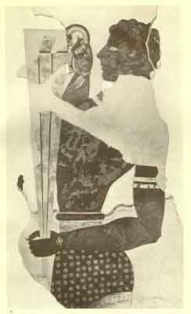
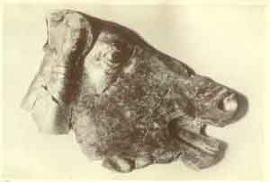
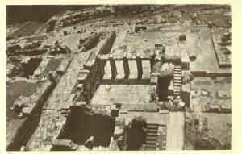
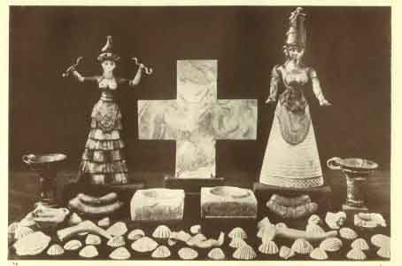

  
[Intangible Textual Heritage](../../index)  [Classics](../index) 
[Index](index)  [Previous](moc10)  [Next](moc12) 

------------------------------------------------------------------------

[Buy this Book at
Amazon.com](https://www.amazon.com/exec/obidos/ASIN/B002BA5ITU/internetsacredte)

------------------------------------------------------------------------

  
*Myths of Crete and Pre-Hellenic Europe*, by Donald A. Mackenzie,
\[1917\], at Intangible Textual Heritage

------------------------------------------------------------------------

p. 115

# CHAPTER VI

### The Great Palace of Knossos

Early Discoveries in Crete--How "Tattered Legends" have been
"reclothed"--Dramatic Revelations at Knossos--Famous Fresco of the
Cup-bearer--Pre-Hellenic Peoples not Barbarians--The Kheftiu of the
Egyptian Texts--Phœnicians' Blue Dye came from Crete--Blue Robes of
"Lost Atlantis" People--The Throne and Council Chamber of Minos--How Men
were judged--Plaster Relief of Sacred Bull--Traces of Earlier Palace--A
Visit to the Knossos--"Wooden Walls" of the Island Kingdom--Official,
Religious, and Domestic Quarters--Frescoes in Queen's Megaron--Boxing
and Dancing in the "Theatral Area"--Drainage Systems of Crete and
Sumeria--Phæacians of Homer as the Cretans--Glimpses of Palace Life from
the *Odyssey*--Votive Offerings in Shrines and Caves--How Queen Victoria
honoured an Ancient Custom--Sacred Animals and Symbols----Snake Goddess
and Priestess--How Cretan Ladies were dressed--Greek and Maltese
Crosses--The Star Form of Isis.

"THE ancient history of Crete", it used to be customary to write,
"begins with the heroic or fabulous times. Historians and poets tell us
of a king called Minos, who lived before the Trojan War. Then comes the
well-known story of the Minotaur, Theseus, and Ariadne." The solar
symbolists disposed of the various legends as poetic fictions.

The controversy aroused by the discoveries of Schliemann at Mycenæ and
Tiryns was being waged with vigour and feeling when a native Cretan
excavated at Knossos a few great jars and fragments of pottery of
Mycenæan character. The spot was afterwards visited by several
archæologists, including Dr. Schliemann and Dr. Dörpfeld, and a
preliminary investigation brought to

p. 116

light undoubted indications that the remains of an ancient palace,
partly built of gypsum, lay beneath the accumulated debris of ages. It
was impossible, however, to make satisfactory arrangements with the
local proprietors or the Turkish Government. The view expressed by Mr.
W. J. Stillman, that the ruins were those of the famous Labyrinth, did
not attract much attention.

In 1883 some peasants in the eastern part of the island happened upon
ancient votive objects in the Dictæan cave, which they had been in the
habit of utilizing as a shelter for their goats. These they put on the
market, and as there was a great demand for them, a brisk trade in
Cretan antiquities sprang up. Archæologists were again drawn to the
island, and excavations which did not produce great results were
conducted in front of the cave. This made the peasants redouble their
efforts to supply a growing demand, and as they met with much success
the archæologists became more and more impressed by the possibilities of
the island as an area for conducting important research work. In 1894
Sir Arthur Evans and Mr. Hogarth paid a visit to Crete, and examined
both the site of Knossos and the Dictæan cave. The times were
inauspicious for their mission, for the island was seething with revolt
against the Turkish authorities. Sir Arthur, however, was able to effect
the purchase of part of the Knossos ground, having become convinced that
great discoveries remained to be made. What interested him most at the
time were the indications afforded by mysterious signs on blocks of
gypsum of a system of hitherto unknown prehistoric writing. It was not,
however, until 1900 that he was able to acquire by purchase the entire
site of Knossos and conduct excavations on an extensive scale.

During the interval, further investigations were conducted

p. 117

by different archæologists at the Dictæan cave, which is
double-chambered. Inscribed tablets and other finds came to light, but
all research work had to be abandoned in 1897, when it was found that
the upper cave was blocked with fallen rock. The political unrest on the
island, besides, made it unsafe for foreigners to pursue even the
peaceful occupation of digging for ancient pottery and figurines of
bronze and lead.

In 1900, however, Sir Arthur Evans operating at Knossos, and Mr. Hogarth
at the Dictæan cave, achieved results which more than fulfilled their
most sanguine hopes. What they accomplished was to reveal traces of an
ancient and high civilization, of which the Mycenæan appeared to be an
offshoot. No such important discovery had been made since Schliemann,
twenty-five years previously, unearthed the graves he so confidently
believed to be those of Agamemnon and his companions. "Here again", as
Mr. Asquith said at the annual meeting of the subscribers to the British
School at Athens, [1](#fn_151) "scepticism
received an ugly blow. Legends", he added, "which had become somewhat
ragged and tattered have been decently reclothed. The mountain on which
Zeus was supposed to have rested from his labours, and the palace in
which Minos invented the science of jurisprudence, are being brought out
of the region of myth into the domain of possible reality."

Sir Arthur Evans went to Crete as a trained and experienced
archæologist, and was assisted from the beginning, in March, 1900, by
Dr. Duncan Mackenzie, who had already distinguished himself by his
excavations on the island of Melos, and Mr. Fyfe, the British School of
Athens architect. A large staff of workers was employed, and by the time
the season's work was concluded

p. 118

in June a considerable portion of the Knossos palace was laid bare.

Among the most remarkable finds were the wall paintings that decorated
the plastered walls of the palace corridors and apartments. These did
more to arouse public interest in pre-Hellenic civilization than even
the burnt city of Troy or the gold masks of kings in the graves at
Mycenæ. Here were wonderful pictures of ancient life vividly portrayed,
of highly civilized Europeans who were contemporaries of the early
Biblical Pharaohs, and lived in splendour and luxury long centuries
before Solomon employed the skilled artisans of Phœnicia to decorate his
temple and palace. And what manner of people were they? Not rude
barbarians awaiting the dawn of Hellenic civilization, but men and women
with refined faces and graceful forms, whose costumes resembled neither
those of the Egyptians, Greeks, nor Romans. There was a note of
modernity in this antique and realistic art and the manners of life it
portrayed. The ladies with their puffed sleeves, narrow waists, and
flounced skirts, might well have walked, not from a Cretan palace, but
some Paris *salon* of the 'eighties and 'nineties.

In his first popular account of his excavations, Sir Arthur Evans gave a
vivid description of his dramatic discovery of the fresco named the
"cup-bearer".

"The colours", he wrote, "were almost as brilliant as when laid down
over three thousand years before. For the first time the true
portraiture of a man of this mysterious Mycenæan race rises before us.
There was something very impressive in this vision of brilliant youth
and of male beauty, recalled after so long an interval to our upper air
from what had been till yesterday a forgotten world. Even our untutored
Cretan workmen felt the spell and fascination.

 

 

THE CUP-BEARER, KNOSSOS

From a photograph kindly lent by Sir Arthur Evans

 

p. 119

They, indeed, regarded the discovery of such a painting in the bosom of
the earth as nothing less than miraculous, and saw in it the 'icon' of a
saint! The removal of the fresco required a delicate and laborious
process of under-plastering, which necessitated its being watched at
night, and old Manolis, one of the most trustworthy of our gang, was
told off for the purpose. Somehow or other he fell asleep, but the
wrathful saint appeared to him in a dream. Waking with a start, he was
conscious of a mysterious presence; the animals round began to low and
neigh, and there were visions about; 'φαντάξει {Greek *fantáksei*}', he
said, in summing up his experiences next morning, 'The whole place
spooks!' [1](#fn_152)

This life-sized figure of a youth remains in a wonderful state of
preservation from the thighs upwards, and is a feature of Candia museum.
He carries in front a long pointed vessel, adorned with silver and gold,
with "wine foam" at the brim, one raised hand grasping the handle and
the other clutching it at the tapering end. His face is finely depicted
in profile, the well-proportioned features are quite modern, and he is
clean-shaved; the forehead is ample, the eyes dark, and the hair black
and curly. Sir Arthur Evans thinks the skull is of "brachycephalic"
(broad-headed) type; others regard it as "mesacephalic" (medium). Round
the neck is a necklace of silver, and there is an car-ring in the only
ear shown, which appears to be mounted with a blue stone. There is an
armlet on the upper part of the right arm, and a bracelet with what
appears to be a seal round the left wrist, which looks just like the
"wristlet-watch" worn at the present day. The body is well developed,
and the waist tightened by a girdle. He wears a closely-fitting
loin-cloth, which is richly embroidered.

p. 120

Before the famous figure was reached, the excavators had laid bare a
paved corridor nearly 4 yards wide. The left wall retained traces of
plaster which had been decorated with a continuous fresco of a
procession of male and female dignitaries. None of the faces, however,
survived. It was noted that the figures resembled closely those of the
"Keftiu" depicted in Egyptian tombs.

An interesting feature of these and other frescoes was the evidence they
afforded of the use of a blue dye among the Cretans. Some male figures
wore bright-blue robes, and others white robes bordered with blue.
Apparently the Phœnicians were not the first to utilize the famous dyes
which have long been so closely associated with them. Proofs were
subsequently forthcoming to place this belief beyond doubt. Long before
the Phœnicians supplanted the Cretans as sea-traders the islanders
produced bright-blue garments, which were worn, it would appear, on
special ceremonial occasions. It is of interest to note in this
connection that the inhabitants of Plato's Atlantis had a similar
custom. After the bull was sacrificed, and the sacred cup deposited in
the temple of the gods, and "the fire round the sacrifice had been
cooled, all of them dressed themselves in beautiful dark-blue robes . .
. and then mutually judged one another as respects any accusations of
transgressing the laws. After the acts of judgment were over, when day
came, they inscribed their decisions on a golden tablet, and deposited
them as memorials, together with their dresses." [1](#fn_153)

A hoard of inscribed clay tablets was discovered by Evans in a
bath-shaped terra-cotta receptacle within a small chamber. These were
embedded in charcoal, indicating that they had been placed in a wooden
box which at some period was destroyed by fire.

p. 121

As the work of excavation made progress, many remarkable discoveries
were made in that first season which appealed to the imaginations of
scientists and workers alike. The glimpses of life afforded by
fragmentary frescoes set the ghosts of vanished Cretans walking once
again; the wind rustling through the disinterred ruins by night seemed
"like light footfalls of spirits" passing up and down the stately
corridors; the past "out of her deep heart spoke". By day

There streamed a sunlight vapour, like the standard  
            Of some ætherial host;  
            Whilst from all the coast  
Louder and louder, gathering round, there wandered  
Over the oracular woods and divine sea  
Prophesyings which grew articulate.

The prophesyings of the excavators were no vain dreams; with dramatic
swiftness they were revealed almost as soon as they were conceived.
Confidently search was made for tangible evidence that this palace had
been occupied by the legendary Minos, or one of the kings who bore that
name or title, when his very council chamber was unearthed, and the most
ancient throne in Europe brought to light.

In the heart of the palace this priceless relic of an antique
civilization had lain buried in debris all through the ages that saw the
coming and going of Homer's heroes, the rise and fall of Assyria, the
fading beauty of Babylon, the flickering loveliness of Egypt, Persian
splendour, the glory of Greece and the grandeur of Rome. The kings that
sat in it had long faded into the region of myth and fancy; it was
believed by wise scholars that they never existed at all. And here was
the royal throne to tell another story!

p. 122

The "Throne Room" was situated between the upper part of the spacious
central court of the palace and the "long gallery" of the western wing.
It was entered, however, from the court alone. Those who sought the
presence of the king had first to pass through a small ante-room about
seven yards square, the rubble walls of which, the excavators found, had
been plastered with day and faced with stucco made beautiful by artists
who were skilled draughtsmen and brilliant colourists.

Stone benches were ranged round the walls of the council chamber, and
between two of these on the north side stood the gypsum throne of the
king on a raised slab. Here sat the Minos surrounded by his high
officers of state. There is seating accommodation for about twenty on
the benches.

The throne, which was found intact, is of graceful form. It presents an
interesting contrast to that on which the statue of the Egyptian King
Kafra of Pyramid fame is seated. Its back, which is higher and less
severe. has an undulating outline, and resembles somewhat an oak leaf.
The base broadens downward from the seat, which is hollowed to fit the
body comfortably, and the sides are gracefully carved, the "double
moulded arch" in front resembling "late Gothic" designs.

To this chamber may have been led such a wanderer as brave Ulysses, who
desired to accelerate his return to his native home. He would have found
the grave Minos enthroned amidst his councillors, who sat "side by side
on polished stones", and perhaps heard him sneak like the Phæacian king
in the *Odyssey*:--

             Chiefs and Senators! I speak  
The dictates of my mind, therefore attend.  
This guest, unknown to me, hath, wand'ring found  
My palace, either from the East arrived.p.
123  
Or from some nation on our western side.  
Safe conduct home he asks, and our consent  
Here wishes ratified, whose quick return  
Be it our part, as usual, to promote;  
For at no time the stranger, from what coast  
Soe'er, who hath resorted to our doors,  
Hath long complained of his detention here.  
Haste--draw ye down into the sacred Deep  
A vessel of prime speed, and, from among  
The people, fifty and two youths select,  
Approved the best; then, lashing fast the oars,  
Leave her, that at my palace ye may make  
Short feast, for which myself will all provide.  
Thus I enjoin the crew, but as for these  
Of sceptred rank, I bid them all alike  
To my own board, that here we may regale  
The stranger nobly, and let none refuse.  
Call, too, Demodocus, the bard divine,  
To share my banquet, whom the gods have blest  
With pow'rs of song delectable, unmatch'd  
By any, when his genius once is fired. [1](#fn_154)

Opposite the "high seat" of Minos in the "Throne Room" was a shallow
tank with stone breastwork. Its use is uncertain. The theory that
ambassadors and others washed here while awaiting the king is not
convincing; there were bath-rooms elsewhere in the vast palace in which
travel-wearied men could refresh and cleanse themselves. Perhaps it was
simply part of the decorative scheme. Fish may have been kept here to
give a touch of realism to the scenes painted on the stucco-plastered
walls. Traces survive of a riverside fresco, with reeds and grasses and
budding flowers beside flowing waters, which must have imparted to the
chamber an air of repose. On either side of the door were two gleaming
griffins, crested with peacock's plumes, "showing", says Sir Arthur
Evans,

p. 124

"that this Indian fowl was known to the East Mediterranean world long
before the days of Solomon". A flowery landscape formed a
strangely-contrasting background, with ferns and palm-trees fringing the
soft blue stream.

Before this chamber was swept by the fire which destroyed the palace, it
must have been at once stately and beautiful. No doubt the benches were
strewn with richly-embroidered rugs and cushions to complete the
brilliant colour scheme of which fragmentary traces survive. The throne
appears to have been richly decorated. "The whole face of the gypsum",
writes Sir Arthur Evans, "had been coated with a fine white plaster
wash, and this again coloured in various ways. The seat showed distinct
remains of a brilliant red colour. A minute examination of the back
disclosed the fact that fine lines had been traced on it such as are
also visible on the wall frescoes, a technical device, borrowed from
Egyptian practice, for guiding the artist's hands. It would appear,
therefore, that the back of the throne had been once decorated with an
elaborate colour design." [1](#fn_155) The
paved floor was also, apparently, set in a border of gypsum covered with
plaster and richly adorned.

Another interesting early find was the "wine cellar" of the palace--or
rather the "cellars". In the lengthy corridors were found intact rows of
great jars from which wine was drawn by the "cup-bearers" for the feast,
and oil was likewise stored. Worthy of special mention is also the
painted plaster relief of a bull which dignified the wall of one of the
chambers. "It is life-sized, or somewhat over", its discoverer wrote at
the time. "The eye has an extraordinary prominence, its pupil is yellow
and the iris a bright-red, of which narrower bands again

 

 

PAINTED PLASTER RELIEF--BULL'S HEAD--KNOSSOS

From a photograph kindly lent by Sir Arthur Evans

 

p. 125

appear encircling the white towards the lower circumference of the ball.
The horn is of greyish hue. . . . Such as it is, this painted relief is
the most magnificent monument of Mycenæan plastic art that has come down
to our time. The rendering of the bull, for which the artists of this
period showed so great a predilection, is full of life and spirit. It
combines in a high degree naturalism with grandeur, and it is no
exaggeration to say that no figure of a bull at once so powerful and so
true was produced by later classical art." [1](#fn_156)

The first season's discoveries made it evident that the palace had been
of great dimensions and splendour. Nothing was found to indicate that it
flourished after the Mycenæan period. It had evidently been destroyed by
fire in pre-Hellenic times, before the thirteenth century B.C. Traces
were also found of a still earlier palace, below which were the layers
of the Neolithic (Late Stone Age) period. Regretfully Sir Arthur Evans
had to suspend operations in June 1900 on such a promising site, owing
to the malarious conditions and distressing dust-clouds raised by the
south wind from Libya. Nine brief weeks, however, had revealed enough to
satisfy even so fortunate an archæologist as Sir Arthur, who had the
luck of Schliemann combined happily with richer experience and technical
skill. No doubt could any longer remain that a great pre-Homeric
civilization had flourished in Crete, and that Minos had been rescued
from the fairyland of the solar symbolists to take his place once again
among the mighty monarchs of the great days of old.

Were it possible for us, by waving the wand of a magician, to conjure
before our eyes this wonderful palace, as it existed when Queen
Hatshepsut reigned over Egypt and Thothmes III was fretting to seize the
reins of

p. 126

power, we should be first of all impressed by the modernity of its
aspect.

We are guided from the sea-shore, like the hero of the *Odyssey*, who
visited the dwelling of Alcinous, the Phæacian king, by a goddess in
human guise. At a favourable point of vantage on the poplar-fringed
highway, we are afforded the first glimpse of the palace of Knossos. It
is situated beside a river [1](#fn_157) on a
low hill in the midst of a fertile valley, about 3½ miles from Candia.
The dominating feature of the landscape is sacred Mount Juktas, with its
notched peak. It seems as if the "hammer god" had intended to shape the
mountain like an Egyptian pyramid, and, having finished one side,
abandoned the task soon after beginning to splinter out the other.

The palace, which is approached by paved roadways, has a flat roof and
forms a rough square, each side being about 130 yards long. No walls
surround it. Crete, like "old England", is protected by its navy--its
"wooden walls". The Minos kings have suppressed the island pirates who
were wont to fall upon unprotected towns and plunder them, and hold
command of the sea. [2](#fn_158)

We enter the palace by the north gate, passing groups of soldiers on
sentry duty. A comparatively small force could defend the narrow way
between the massive walls which lead us to the great Central Court. Note
these little towers and guard-houses, from which they could discharge
their arrows against raiders. There are dark dungeons beneath us, over
20 feet deep, in which prisoners are fretting their lives away, thinking
of "Fatherland, of child, and wife, and slave", and "the wandering
fields of barren foam" on which they had ventured to defy the might of
Minos.

p. 127

The Central Court in the middle of the palace is over 60 yards long and
about 30 yards wide. On the eastern side are the private apartments of
the royal family, but these are not entered from the Court, but along
mazy corridors which are elsewhere approached. The first door on the
western side leads us through an ante-room to the Throne Room. Farther
down, and near the centre of the Court, is the shrine of the Snake
goddess. Behind it are the west and east Pillar Rooms and the room
containing temple repositories; these apartments appear to have a
religious significance. Farther south is the large "Court of the Altar".
We pass out of the Court at the northern end, and penetrate the western
wing of the palace. We find it is divided about the middle by the "Long
Gallery". Walking southward, we pass, on the right, numerous store
rooms, until we reach an entrance leading to the sacred apartments
behind the shrine of the Snake goddess. It has already dawned upon us
that we are in a labyrinthine building, if not the real Labyrinth with
its intricate and tortuous passages through which the famous Theseus was
able to wander freely and extricate himself from with the aid of the
clue given to him by the princess Ariadne. One apartment leads to
another, and when our progress is arrested by blind alleys we turn back
and find it difficult, without the help of a guide, to return to the
Long Gallery that opens on the zigzag route back to the Central Court.
The eastern wing is similarly of mazy character. In the southern part of
it are reception rooms, living-rooms, bedrooms, and bath-rooms. These
include the "Hall of the Colonnades", the "Hall of the Double Axes", the
"Queen's Megaron", and the "Room of the Plaster Couch". [1](#fn_159) Stairways lead to the upper stories.

The rooms assigned to the ladies are approached

p. 128

through a dark "dog's-leg corridor". We enter the "Queen's Megaron" and
are silenced by its wonderful beauty. The paved floor is overlaid with
embroidered rugs, and has a richly-coloured "surround" of painted
plaster. Frescoes adorn the walls. Here is a woodland scene with a
brilliantly-plumaged bird in flight. On the north, side is the whirling
figure of a bright-eyed dancing girl, her long hair floating out on
either side in rippling bird-wing curves, her arms responding to the
rise and fall of the music. She leans slightly forward, poised on one
foot. She wears a yellow jacket with short arms, with a zigzag border of
red and blue. Other dancers are tripping near her. Beyond these are the
musicians. [1](#fn_160) We are reminded of one
of the scenes on the famous shield of Achilles:--

There, too, the skilful artist's hand had wrought,  
With curious workmanship, a mazy dance,  
Like that which Daedalus in Knossos erst  
At fair-hair'd [2](#fn_161) Ariadne's bidding
framed.  
There, laying on each other's wrist their hand,  
Bright youths and many suitor'd maidens danced:  
In fair white linen these; in tunics those  
Well woven, shining soft with fragrant oils . . .  
Now whirl'd they round with nimble practised feet,  
Easy, as when a potter, seated, turns  
A wheel, new fashioned by his skilful hand,  
And spins it round, to prove if true it run:  
Now featly mov'd in well-beseeming ranks.  
A numerous crowd, around, the lovely dance  
Survey'd, delighted. [3](#fn_162)

Another fresco is a picturesque study of sub-marine life. Fish dart to
and fro above the ocean floor about

p. 129

two great snouted dolphins, the air bubbles darting from their fins and
tails to indicate that they are in motion. [1](#fn_163)

In the Queen's Megaton the Cretan ladies are wont to chatter over their
needlework during the heat of the day. They admire the works of art on
the walls, and discuss the merits of the various draughtsmen who reside
elsewhere in the palace. Note how little furniture they require. They
won't have anything that is not absolutely necessary in their rooms, and
what they have is beautiful. The charm of wide spaces appeals to them. A
broad fresco must not be interrupted by ornaments that might distract
attention from such a masterpiece. It is sufficient in itself to fill a
large part of the room.

Visitors who arrive dusty and weary are conducted to the bath-room,
which is entered through a door at the north-west corner. Its walls are
plainly painted, but relieved from the commonplace by a broad dado of
flowing spirals with rosette centres. Portable tubs are provided, and
attendants spray water over those who use them.

We pass from this, the south-eastern, to the northeastern wing, and find
it is occupied by artistic craftsmen who are continually employed in
beautifying the palace. Art is under royal patronage. Here, too, are the
rooms of musicians. Farther on are the butlers; these provide the stores
for the cooks, who occupy the domestic quarters south of the Queen's
Megaton and beneath it.

Once again the guards permit us to walk along the corridor of the north
entrance, and we turn from their guard-houses and sentinel-boxes to
visit the "Theatral Area" at the north-western corner of the palace. On

p. 130

two sides are tiers of stone steps on which spectators seat themselves.
One is the royal "grand stand", and it has accommodation for about 200
people; the other is reserved for young people. The crowds stand round
about in a circle behind the wooden barriers. Sometimes the attraction
is an athletic display. Boxers and wrestlers are popular. Here, too, the
dancers display their skill when the king calls upon them to "tread the
circus with harmonious steps." Their dances have a religious
significance.

Turning southward from the Theatral Area we walk along the broad west
court outside the palace. It is paved and terraced. Almost the whole of
this outer portion of the western wing is occupied by stores, and the
court is the market-place. Here come the traders who sell their fruit
and vegetables and wares; and here too those who pay their taxes in
kind. Officials and merchants pass to and fro; here is a great
consignment of goods from Egypt which is being unpacked. The scribes are
busy checking invoices, and issuing orders for its disposal. A group of
young people gather round a sailor, who is accompanied by a native
Egyptian, and fills their ears with wonderful stories regarding the
river Nile and the great cities on its banks.

Our steps are directed to the southern side of the palace. Here is the
door leading to the "Court of the Altar" and other sacred rooms. Farther
on is the "Court of the Sanctuary" in the southern part of the east
wing. Workmen are busy near us extending the palace beyond the royal
apartments.

We have now taken a rapid survey of the great square palace of Knossos.
There are many details, however, that have escaped our notice. The
Cretans were not only great builders, but also experienced sanitary
engineers.

 

 

A GLIMPSE OF THE EXCAVATED REMAINS OF THE PALACE OF KNOSSOS

 

p. 131

An excellent drainage system was one of the remarkable features of the
palace. Terra-cotta drain-pipes, which might have been made yesterday,
connect water-flushed closets "of almost modern type", and bath-rooms
with a great square drain which workmen could enter to effect repairs
through "manholes". Rain water was introduced into the palace, and its
flow automatically controlled.

Crete, however, was not alone in anticipating modern sanitary methods.
Long before the Late Minoan period, which began about 1700 B.C., the
Sumero-Babylonians had a drainage system. Drains and culverts have been
excavated at Nippur in stratum which dates before the reign of Sargon I
(*c*. 2650 B.C.), as well as at Surghul, near Lagash, Fara, the site of
Shuruppak, and elsewhere. It is uncertain, however, whether the Cretans
derived their elaborate drainage system from Sumeria. What remains
clear, however, is that on the island kingdom, and in cities of the
Tigro-Euphratean valley, the problem of how to prevent the spread of
water-borne diseases had been dealt with on scientific lines.

A glimpse of such a palace as that of Knossos, if not of this palace
itself, is obtained in the *Odyssey*, and in that part from which
quotation has been made in dealing with the "Throne Room".

Ulysses (Odysseus), the wanderer, is cast ashore on the island of
Scheria, the seat of the Phæacians, "who of old, upon a time, dwelt in
spacious Hypereia". Dr. Drerup [1](#fn_164) and
Professor Burrows [2](#fn_165) have
independently arrived at the conclusion that Scheria is Crete, Hypereia
being Sicily, "and that the origin of the Odyssey is to be sought for in
Crete". Burrows adds: "It can be at once granted that attention has been
unduly concentrated on Ithaca, Leukias, and Corcyra, while the numerous
references

p. 132

in the *Odyssey* [1](#fn_166) to the topography
of Crete have been neglected". Dr. Drerup draws attention to a most
suggestive passage in the seventh book, in which the secret is "let
out." The Phæacian King, Alcinous, promises that his seamen will convey
the shipwrecked stranger to his home, "even though it be much farther
than Euboea, which", he explains, "certain of our men say is the
farthest of lands, they who saw it, when they carried Rhadamanthus of
the fair hair, to visit Tityos, son of Gaia". [2](#fn_167) Now Rhadamanthus was the brother of the
Cretan King Minos. "What was he doing in Corcyra?" asks Professor
Burrows. "The Phæacians," adds the same writer, "themselves mariners,
artists, feasters, dancers, are surely the Minoans of Crete."

Ulysses (Odysseus) is found on the sea-coast by the princess Nausicaa.
She provides him with clothing and food, and says--

Up stranger! seek the city. I will lead  
Thy steps towards my royal father's house  
Where all Phæacia's nobles thou shalt see.

Her proposal is to lead him to her father's farm, where he will gaze on
the safe harbour in which

                        Our gallant barks  
Line all the road, each stationed in her place,  
And where, adjoining close the splendid fane  
Of Neptune, [3](#fn_168) stands the forum with
huge stones  
From quarries hither drawn, constructed strong,  
In which the rigging of their barks they keep  
Sail cloth and cordage, and make smooth their oars.

She intends to leave him at this point, fearing that the sailors might
ask, "Who is this that goes with Nausicaa?

p. 133

and cast imputations on her character. Apparently the gossips were as
troublesome in those times as in our own. She adds naively:

                          I should blame  
A virgin guilty of such conduct much,  
Myself, who reckless of her parent's will  
Should so familiar with a man consort,  
Ere celebration of her spousal rites.

The princess then advises the wanderer to make his way from the royal
home farm to the palace:--

Ask where Alcinous dwells, my valiant sire.  
Well known is his abode, so that with ease  
A child might lead thee to it.

When he is received within the court he should at once seek the queen,
her mother.

She beside a column sits  
In the hearth's blaze, twirling her fleecy threads  
Tinged with sea purple, bright, magnificent!  
With all her maidens orderly behind.

If he makes direct appeal to this royal lady he will be sure to "win a
glad return to his island home".

The wanderer is much impressed by the gorgeous palace of the Phæacian
king, towards which he is led by the grey-eyed goddess Athene, who
assumed the guise of a girl carrying a pitcher. He pauses on the
threshold, gazing with wonder on the inner walls covered with brass and
surrounded by a blue dado. Doors are of gold and the door-posts of
silver. He has a glimpse of a feasting chamber; the seats against the
wall are covered with mantles of "subtlest warp", the "work of many a
female hand". There the Phæacians are wont to sit eating and drinking in
the flare of the torches held in the hands of golden figures of young
men.

p. 134

Fifty handmaidens attend on the King and Queen. Some grind the golden
corn in millstones. Others sit spinning and weaving with fingers

                          Restless as leaves  
Of lofty poplars fluttering in the breeze.

So closely do they weave linen that oil will fall off it. just as the
Phæacian men are skilled beyond others as mariners, so are the women the
most accomplished at the loom. The goddess Athene has given them much
wisdom as workers, and richest fancy.

Outside the courtyard of the palace is a large garden surrounded by a
hedge. There grows many a luxuriant and lofty tree.

Pomegranate, pear, the apple blushing bright,  
The honied fig, and unctuous olive smooth.  
Those fruits, nor winter's cold nor summer's heat  
Fear ever, fail not, wither not, but hang  
Perennial . . .  
Pears after pears to full dimensions swell,  
Figs follow figs, grapes clust'ring grow again.  
Where clusters grew, and (every apple stript)  
The boughs soon tempt the gath'rer as before.  
There too, well-rooted, and of fruit profuse,  
His vineyard grows . . .  
                      On the garden's verge extreme  
Flow'rs of all hues smile all the year, arranged  
With neatest art judicious, and amid  
The lovely scene two fountains welling forth,  
One visits, into every part diffus'd  
The garden ground, the other soft beneath  
The threshold steals into the palace court,  
Whence ev'ry citizen his vase supplies.

The wanderer, having gazed with wonder about him, enters the palace. He
sees men pouring out wine to keen-eyed Hermes, the slayer of Argos,
before retiring

p. 135

for the night. Athene again comes to his aid, and wraps him in a mist so
that he passes, unseen by anyone, until he reaches the queen. He tells
her of his plight, and asks for safe conduct to his native land, and the
great lady takes pity on him. The wanderer is given food and wine.
Before he retires to rest he relates to King Alcinous how he was cast on
the island shore and conducted to the farm by the princess. Recognizing
that the girl has compromised herself, his majesty offers her in
marriage to the stranger, promising

House would I give thee and possessions too  
Were such thy choice.

He adds, however, that if he prefers to return home no man in Phæacia
"shall by force detain thee". The wanderer's decision is, "Grant to me
to visit my native shores again". So the matter ends. Odysseus is
conducted to

                          a fleecy couch  
Under the portico, with purple rugs  
Resplendent, and with arras spread beneath  
And over all with cloaks of shaggy pile.

The king and queen retire to an "inner chamber".

Next morning the king and his counsellors assemble as indicated in the
description of the Throne Room of Knossos palace, and arrangements are
completed to give Odysseus a safe conduct home. Before he goes a feast
is held, at which "the beloved minstrel", Demodocus, sings of the Trojan
war. Then a visit is paid to the "Theatral Area", where athletes display
feats of strength. A young man challenges the stranger boastfully.
Roused to wrath by his speech, Odysseus says:

I am not, as thou sayest,  
A novice in these sports but took the lead p.
136  
In all, while youth and strength were on my side.  
But I am now in bands of sorrow held,  
And of misfortune, having much endured  
In war, and buffeting the boist'rous waves.

He, however, flung a quoit and broke all records. Then he challenged the
young man who taunted him

To box, to wrestle with me, or to run . . .  
There is no game athletic in the use  
Of all mankind, too difficult for me.

The challenge is not accepted, however. Then the king says:

We boast not much the boxer's skill, nor yet  
The wrestler's; but light-footed in the race  
Are we, and navigators well informed.  
Our pleasures are the feast, the harp, the dance  
Garments for change, the tepid bath, the bed.  
Come, ye Phæacians, beyond others skilled  
To tread the circus with harmonious steps,  
Come play before us; that our guest arrived  
In his own country, may inform his friends  
How far in seamanship we all excel,  
In running, in the dance, and in the song. [1](#fn_169)

In these passages we probably have, as some authorities think, real
Cretan memories. It is uncertain whether or not actual Cretan poems were
utilized in the Odyssey. Professor Burrows suggests that the glories of
the palace of Alcinous "were sung by men who had heard of them as living
realities, even if they had not themselves seen them; men who had walked
the palaces (Knossos and Phæstos) perhaps, if not as their masters, at
least as mercenaries or freebooters". [2](#fn_170)

It will be noted that Alcinous says the Phæacians do

p. 137

not boast much of the skill of their boxers. Yet the Cretan pugilists
are found depicted in seal impressions, on vases, &c., suggesting that
they were regarded with pride as peerless exponents of the "manly
sport". It may be, however, that in the last period (Late Minoan III)
the island boxers were surpassed by those among the more muscular
northerners, who were settled in Crete in increasing numbers. "Late
Minoan III", writes Professor Burrows, "is a long period, and marks the
successive stages of a gradually decaying culture." The "Cretan
memories" in the Homeric poems "refer to Late Minoan III". [1](#fn_171) Apparently the islanders were still
famous as skilled mariners, while their dancing was much admired; but as
athletes and warriors they had to acknowledge the superiority of the
less cultured invaders who had descended on their shores.

Reference has been made to the sacred rooms in the great palace of
Knossos. Unlike the Egyptians, the Cretans erected no temples. Their
religious ceremonies were conducted in their homes, on their fields, and
beside sacred mountain caves. Sir Arthur Evans discovered in the
south-eastern part of the palace, near the ladies' rooms, a little
shrine which could not have accommodated more than a few persons.

Another shrine was entered from the Central Court to the south of the
Throne Room in the western wing. It would appear that this part of the
palace was invested with special sanctity. In one of the apartments were
found superficial cists in the pavement. The first two had been rifled.
Then an undisturbed one was located and opened. It contained a large
number of what appeared to be deposits of religious character--vessels
containing burnt corn which had been offered to a deity or

p. 138

to deities, tablets, libation tables, and so on. Fragments of faience
(native porcelain) had figures of goddesses, cows and calves, goats and
kids, and floral and other designs. A number of cockles and other
sea-shells artificially tinted in various colours also came to light.
Apparently these cists answered the same purpose as sacred caves in
which religious offerings were placed.

This custom of effecting a ceremonial connection with a holy place still
survives in our own country. Portions of clothing are attached to trees
overhanging wishing and curative wells. and coins and pins are also
dropped into them. "Pin wells", sometimes called "Penny wells", are not
uncommon. In some cases nails are driven into the tree. Special mention
may be made of the well and tree of Isle Maree, on Loch Maree, in the
Scottish county of Ross and Cromarty. It was visited on a Sunday in
September, 1877, by the late Queen Victoria. Her Majesty read a short
sermon to her gillies, and afterwards, with a smile, attached an
offering to the wishing tree. Such offerings are never removed, for it
is believed that a terrible misfortune would befall the individual who
committed such an act of desecration. In ancient Egypt offerings were
made at tombs, and in Babylonia votive figures of deities mounted on
nails were driven into sacred shrines.

Seal impressions, which have been found in the Cretan palace cists, are
of special interest. Among the designs were figures of owls, doves,
ducks, goats, dogs, lions seizing prey, horned sheep, gods and
goddesses. Flowers, sea-shells, houses, &c., were also depicted. One
clay impression of a boxer suggests that it was deposited by the
pugilist himself to ensure his good luck at a great competition in the
Theatral Area. The shells suggest that sailors desired protection. One
seal of undoubted

 

 

A CRETAN SHRINE: RESTORED BY SIR ARTHUR EVANS

Snake Goddesses, or goddesses and priestess, "fetish cross", shells,
libation jugs, stones hollowed for holding offerings, &c.

 

p. 139

maritime significance shows a man in a boat attacking a dog-headed
sea-monster. The floral seals were probably offerings to the earth
mother in Spring. No doubt the cow suckling its calf and the goat its
kid were fertility symbols.

The faience relief of the wild goat and its young is one of the triumphs
of Cretan art. It is of pale-green colour, with dark sepia markings. The
animals are as lifelike as those depicted in the Palæolithic
cave-drawings. One of the kids is sucking in crouched posture, and the
other bleats impatiently in front. The nimble-footed mother has passed
with erect head and widely-opened eyes. She is the watchful protector
and constant nourisher of her young--a symbol of maternity. The cow and
calf is also a fine composition. Commenting on these, Sir Arthur Evans
says that "in beauty of modelling and in living interest, Egyptian,
Phœnician, and, it must be added, classical Greek . . . are far
surpassed by the Minoan artist".

Among the marine subjects in faience is one showing two flying fish (the
"sea swallows" of the modern Greeks) swimming between rocks and over
sea-shells lying on the sand.

Nothing, however, among these votive deposits can surpass in living
interest the faience figures of the Snake goddess and her priestess. The
former is a semi-anthropomorphic figure with the ears of a cow or some
other animal. The exaggerated ear suggests "Broad Ear", one of the
members of the family of the Sumerian sea-god Ea. She may have been thus
depicted to remind her worshippers that she was ever ready to hear their
petitions. On the other hand, it is not improbable that she had at one
time the head of a cow or sow. Demeter at Phigalia was horse-headed, and
there were serpents in her hair.

p. 140

\[paragraph continues\] This goddess of
Crete has a high head-dress of spiral pattern, round which a serpent has
enfolded itself, and apparently its head, which is missing, protruded in
front like the uræus on the Egyptian "helmets" of royalty. Another snake
is grasped by the head in her right hand and by the tail in the left,
and its body lies wriggling along her outstretched arms, and over her
shoulders, forming a loop behind, which narrows at her waist and widens
out below it. Other two snakes are twined round her hips below the
waist. These reptiles are of green colour with purple-brown spots.
Evidently they are symbols of fertility and growth of vegetation. The
goddess is attired in a bell-shaped skirt suspended from her "wasp
waist", and a short-sleeved, tight-fitting jacket bodice, with short
sleeves, open in front to display her ample breasts. Her skin is white,
her eyes dark: she wears a necklace round her neck, and her hair falls
down behind but only to her shoulders, being gathered up in a fringed
arrangement at the back of the head.

The priestess, or votary, has her arms lifted in the Egyptian attitude
of adoration. In each hand she grasps a small wriggling snake. A stiff
girdle entwines her narrow waist. Unfortunately the head is missing. The
jacket bodice is similar to that of the goddess, and the breasts are
also ample and bare. "The skirt", writes Lady Evans, "consists of seven
flounces fastened apparently on a 'foundation', so that the hem of each
flounce falls just over the head of the one below it. . . . Over this
skirt is worn a double apron or 'polonaise' similar to that of the
goddess, but not falling so deeply, and not so richly ornamented. The
main surface is covered with a reticulated pattern, each reticulation
being filled with horizontal lines in its upper half. The general effect
is that of a check or small plaid. . . . The whole costume

p. 141

of both figures seems to consist of garments carefully sewn and fitted
to the shape without any trace of flowing draperies. [1](#fn_172)

Among the symbols, which had evidently a religious significance, are the
"horns of consecration", the sacred pillars and trees, the double axe,
the "swastika" (crux gammata), a square cross with staff handles, and
the plain equal-limbed cross. These are represented on seals, in
faience, and on stones. Sir Arthur Evans suggests that a small marble
cross he discovered--he calls it a "fetish cross"--occupied a central
position in the Cretan shrine of the mother goddess. "A cross of
orthodox Greek shape", he says, "was not only a religious symbol of
Minoan cult, but seems to be traceable in later offshoots of the Minoan
religion from Gaza to Eryx". He adds: "It must, moreover, be borne in
mind that the equal-limbed eastern cross retains the symbolic form of
the primitive star sign, as we see it attached to the service of the
Minoan divinities. . . . The cross as a symbol or amulet was also known
among the Babylonians and Assyrians. It appears on cylinders (according
to Professor Sayce, of the Kassite period), apparently as a sign of
divinity. As an amulet on Assyrian necklaces it is seen associated, as
on the Palaikastro (Crete) mould, with a rayed (solar) and a semi-lunar
emblem--in other words it once more represents a star." The Maltese
cross first appears on Elamite pottery of the Neolithic Age: it was
introduced into Babylonia at a later period. In Egypt it figures
prominently n the famous floret coronet of a Middle Kingdom princess
which was found at Dashur, and is believed by some authorities to be of
Hittite origin.

If the Cretan cross was an astral symbol, it would appear that the snake
or dove goddess was associated, like

p. 142

the Egyptian Isis and the Babylonian Ishtar, with Sirius or some other
star which was connected with the food supply. The rising of Sirius in
Egypt coincides with the beginning of the Mile flood. It appears on the
"night of the drop". The star form of the bereaved Isis lets fall the
first tear for Osiris, and as the body moisture of deities has
fertilizing and creative properties, it causes the river to increase in
volume so that the land may be rendered capable of bearing abundant
crops. Osiris springs up in season as the rejuvenated corn spirit.

Other sites in Crete will be dealt with in the chapters which follow.
But before dealing with these in detail, it will be of interest to glean
evidence from the general finds regarding the early stages of
civilization on the island and the first peoples who settled there, and
also to compare the beliefs that obtained among the various peoples of
the ancient race who, having adopted the agricultural mode of life, laid
the foundations of great civilizations, among which that of Crete was so
brilliant an example.

------------------------------------------------------------------------

### Footnotes

[117:1](moc11.htm#fr_151) London, 30th October,
1900.

[119:1](moc11.htm#fr_152) *Monthly Review*,
March, 1901, p. 124.

[120:1](moc11.htm#fr_153) *The Critias*, Sec.
XV

[123:1](moc11.htm#fr_154) Cowper's *Odyssey*,
VIII, 30-54.

[124:1](moc11.htm#fr_155) The Annual of the
British School at Athens, Vol. VI, p. 38.

[125:1](moc11.htm#fr_156) Annual of the British
School at Athens, Vol. VI, pp. 52-3.

[126:1](moc11.htm#fr_157) The river used to
flow nearer the palace site than it does at present.

[126:2](moc11.htm#fr_158) *Thucydides*, I, 2-4.

[127:1](moc11.htm#fr_159) These and other names
were given to the apartments by Sir Arthur Evans.

[128:1](moc11.htm#fr_160) Only one dancing
figure has survived of this fresco.

[128:2](moc11.htm#fr_161) Or "Ariadne of the
lovely tresses".

[128:3](moc11.htm#fr_162) *Iliad*, XVIII, 590
*et seq*. (Derby's translation).

[129:1](moc11.htm#fr_163) These dolphins
resemble closely the so-called "swimming elephants" on Scottish
sculptured stones. Like the doves they had evidently a religious
significance. Pausanias tells of a Demeter which held in one hand a
dolphin and in another a dove.

[131:1](moc11.htm#fr_164) *Homer* (1903), pp.
130 *et seq*.

[131:2](moc11.htm#fr_165) *The Discoveries in
Crete* (1907), pp. 207 *et seq*.

[132:1](moc11.htm#fr_166) III, 291-300; XIX,
172-9, 188-9, 200, 338.

[132:2](moc11.htm#fr_167) Butcher and Lang's
*Odyssey*, p. 113.

[132:3](moc11.htm#fr_168) Poseidon in the
original.

[136:1](moc11.htm#fr_169) Extracts from the
Odyssey, Books VII and VIII (Cowper's translation).

[136:2](moc11.htm#fr_170) The Discoveries in
Crete, p. 209.

[137:1](moc11.htm#fr_171) *The Discoveries in
Crete*, pp. 209-10.

[141:1](moc11.htm#fr_172) *The Annual of the
British School at Athens*, Vol. IX, pp. 74 *et seq*.

------------------------------------------------------------------------

[Next: Chapter VII. Races and Myths of Neolithic Crete](moc12)
