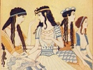
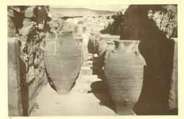
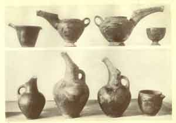
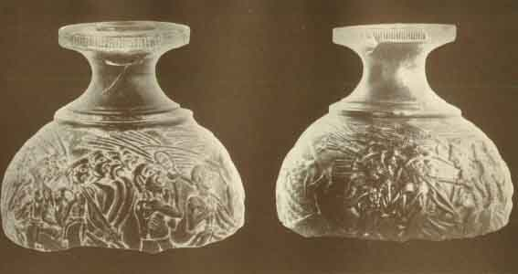

  
[Intangible Textual Heritage](../../index)  [Classics](../index) 
[Index](index)  [Previous](moc13)  [Next](moc15) 

------------------------------------------------------------------------

[Buy this Book at
Amazon.com](https://www.amazon.com/exec/obidos/ASIN/B002BA5ITU/internetsacredte)

------------------------------------------------------------------------

  
*Myths of Crete and Pre-Hellenic Europe*, by Donald A. Mackenzie,
\[1917\], at Intangible Textual Heritage

------------------------------------------------------------------------

p. 191

# CHAPTER IX

### Growth of Cretan Culture and Commerce

Cretan Origin of Ægean Civilization--The Historic Periods--Cretan and
Egyptian Chronologies --Egyptian Evidence of Early Shipping-- Pottery as
Evidence of Racial Drifts--Asiatic Invasions--The Libyans and Early
Cretans--Evidence of Imported Sea-shells--Physical Features of
Crete--Prevailing Air-currents--Why Ægean Mariners sailed by
Night--Homeric References to Night Voyages--Fertility of Crete--Its
Natural Beauties--Life on Sea-coast and among the Mountains--Corn and
Wine Harvests--Surplus Products for Early Commerce--Glimpses of Early
Minoan Times--Relations with Egypt in Pyramid Period--Story of the Stone
jars--Invention of Potter's Wheel--Borrowings from Egypt--Cretan Ceramic
Development--Problem of Sea Routes--Cretans as Ha-nebu and Keftiu.

THE discoveries in Crete have proved conclusively that its pre-Hellenic
culture was of great antiquity and local growth. It had developed with
unbroken continuity from Neolithic times, and so pronounced was its
individual character that it could borrow from contemporary
civilizations without suffering loss of identity.

Cretan civilization was immensely older than Mycenæan. Indeed it had
reached its "Golden Age" before Mycenæ assumed any degree of importance
as a cultural centre. This fact has compelled archæologists to select a
new name which could be appropriately applied to it. Professor Reisch
favours "Ægean", and, all things considered, this generic term appears
to be the most appropriate. It takes into account the obscure influences
which were at work during the lengthy Neolithic Period, when independent
communities were settled on various islands

p. 192

and on points on the mainland and had begun to trade one with another.
The Island of Melos, for instance, as we have seen, was exporting
obsidian and importing in exchange apparently the products of other
localities. The influence of environment was directing into new lines
the common form of culture derived from the North African homeland by
the predominant race.

Mycenæan civilization is placed in its proper perspective by referring
to it as a late stage of Ægean. On the other hand, Cretan was an early
and local form of it. "In Crete", says Mr. H. R. Hall, "it first
developed, then spreading northwards it absorbed the kindred culture of
the islands, and perhaps the Peloponnese; then it won Central Greece
north of the Isthmus from its probably alien aborigines, becoming there
'Mycenæan', and finally, when its own end was near, forced its way into
Thessaly, having already reached the Troad in one direction, Cyprus (and
Philistia later) in another, Sicily and Messapia in another." [1](#fn_248)

Sir Arthur Evans has divided the history of Ægean civilization in Crete
into three main periods, named after the legendary king, or Dynasties of
kings, called Minos. These are:

Early Minoan.  
Middle Minoan.  
Late Minoan.

Each of these periods has also been divided into three stages: Early
Minoan I, Early Minoan II, Early Minoan III, and so on to Late Minoan
III.

The Minoan Age begins with the introduction of bronze, which occurred,
however, long after Ægean civilization had assumed distinctive form.
Crete was then

p. 193

able to borrow and adapt to its own use the inventions of other
countries, and yet maintain the individuality of its local institutions
and art products. The introduction of bronze stimulated its industries,
but caused no more change in its national characteristics than has been
effected in China by the introduction of electric lighting in our own
day.

Cretan archæologists as a whole are agreed as to the order and relative
duration of the various historic periods, and most of them have adopted
the system of Sir Arthur Evans. Nor do they differ greatly regarding the
approximate dating of these. It has even been found possible, although
the local script cannot yet be read, to frame a provisional
chronological system based on the Berlin system of minimum dating, so as
to fit the story of Crete into the history of the ancient world.
Important clues have been forthcoming in this connection. From an early
period trading relations existed between the island kingdom and the
Delta coast, and various manufactured articles were consequently
exchanged, as well as wheat and barley, oil and skins, and other
perishable goods. The discovery in the deposits assigned to different
and well-marked historic phases, of Egyptian products in Crete and
Cretan products in Egypt, has made it possible for archæologists to
ascertain which periods in either country were contemporaneous.

"With the help of Egyptian synchronisms", writes Mr. H. R. Hall, "we
know that the Minoan civilization was nearly, if not quite, as old as
the Egyptian. . . . If we date the beginnings of Egyptian history about
3500 B.C., we have not long to wait before we find indisputable traces
of connection between Egypt and Crete." [1](#fn_249)

Early Minoan I begins, therefore, some time after the

p. 194

legendary Pharaoh Mena united by conquest Upper and Lower Egypt and
founded the First Dynasty, and before the great pyramids near Cairo were
erected. About the same period the Sumerian civilization of Babylonia
was beginning to flourish, and the Hatti tribe of the Hittite
confederacy had established itself in Anatolia.

Early Minoan II extended from about the period of the Fourth to that of
the Sixth Egyptian Dynasty: that is from the Pyramid Age till the close
of the Old Kingdom Period.

Early Minoan III covers the dark age of early Egyptian history extending
from the Seventh till the Eleventh Dynasties.

Middle Minoan I commenced early in the Eleventh Dynasty Period. Middle
Minoan II flourished during the part of the Twelfth and part of the
Thirteenth Dynasties; and Middle Minoan III came to an end during the
early period of the Hyksos occupation of Egypt.

The Late Minoan Period was the "Golden Age" of Crete. It began before
the Hyksos were expelled from Egypt, and attained its highest splendour
during the Eighteenth Egyptian Dynasty. During Late Minoan II, Thothmes
III of Egypt received gifts from the island kingdom as well as from the
Hittites. Late Minoan III was an age of decline. Foreigners were in
occupation of Crete, and the mainland towns of Tiryns and Mycenæ were
flourishing and influential. Ægean civilization had thus reached the
Mycenæan stage. Iron was coming into use; the sixth city of Troy had
been built. It was the Age of Homer's heroes. At the close of the
Mycenæan period of the Ægean Age the northern conquerors of Greece were
inaugurating the Hellenic era. "The so-called miracle of the rise of
Hellenism, early in the first millennium B.C., is to be explained",
writes Mr. D. G.

p. 195

Hogarth, "by the re-invigoration of aboriginal societies settled for
long previous ages in the Ægean area, and possessed of an ancient
tradition and instinct of culture. . . . This process was chiefly due to
the blood and influence of an immigrant population of less impaired
vigour, which had long been cognizant of and participant in the
mid-European culture, and was itself, both in origin and development,
related to the elder society of the Ægean area." [1](#fn_250)

At what period Crete began to trade with Egypt it is as yet impossible
to ascertain with certainty. Professor Flinders Petrie [2](#fn_251) found, in the lowest levels of the
temple at Abydos, black pottery which he concluded came from Crete on
account of its close resemblance to fragments discovered by Sir Arthur
Evans in the Late Neolithic deposits of Knossos. He also characterized
as Ægean several vases and pieces of painted pottery discovered in tombs
of the First Dynasty. He maintained further that the Cretan and other
foreign imports were brought to Egypt in the galleys depicted on
pre-Dynastic vases.

This view has not found general acceptance. It has been urged that the
galleys were ordinary Nile boats. "They have deck shelters", writes Mr.
Hall, "just like the model funerary boats of the Middle Kingdom tombs,
and they carry women on board. On one vase a woman is depicted waiting,
with her hands above her head; it may well be that they actually
represent the ferry boats of the dead. They carry purely Egyptian
emblems. Now, we know of the Egyptians that they were never seafarers;
they disliked the sea, and they held the seafaring inhabitants of the
Delta coast in abomination: it was never the Egyptians who went to Crete
in the early days or later. . . . Finally, the boats are represented
amid ostriches,

p. 196

oryxes, mountains, and palm-trees: that is to say, they are sailing on
the Nile with the desert hills and their denizens on either hand." [1](#fn_252)

All that seems certain in this connection is that shipping was already
well advanced in pre-Dynastic times. There is no evidence to show
whether the seafarers on the Delta coast, or in Crete, possessed
superior galleys to those used by the navigators of the Nile. No doubt
they did. The Cretans who went to Melos for obsidian must have found it
necessary to build galleys capable of withstanding the buffetings of
wind and wave in the Ægean Sea. In fact, the early settlers could not
have reached Crete unless they had superior craft to the prehistoric
dahabeeyahs and feluccas of the Nile. It is possible, therefore, as
Professor Flinders Petrie thinks, that oil and skins were carried across
the Mediterranean from Crete in pre-Dynastic times, and exchanged for
the corn and beans of Egypt. But on this point the evidence afforded by
the pottery cannot be held to be conclusive.

The dark pottery with geometric designs belongs to a class of widespread
distribution. Specimens with similar decorations, but of different
texture, have been found as far apart as Anau by the Pumpelly
expeditions, which conducted important researches in Russian and Chinese
Turkestan, at Susa, the ancient capital of Elam, in Persia, at Hittite
sites at Sakje Geuzi in North Syria, in Cappadocia and Boghaz'köi, and
at points in the Balkan Peninsula. The black pottery of pre-Dynastic
Egypt and Neolithic Crete may, therefore, have come from Anatolia. Some
hold, indeed, that it has an ethnic significance. Mr. Pumpelly's view is
that the Central Asian oases were the sources of Western Asiatic
culture, but the evidence he brings forward in this connection is of
somewhat slight

 

 

MAGAZINE OF JARS AND KASELLES, KNOSSOS

The Jars ("pithoi") are made of decorated earthenware and are of huge
size. The "kaselles" are the small square openings in the floor of the
magazine, evidently used at one time for storage purposes.

 

p. 197

character and hardly justifies his theory that Egypt and Babylonia
derived their knowledge how to grow barley and wheat, and actually
received certain breeds of domesticated animals, from this part of the
world. As we have seen, cattle were domesticated in southern France in
the Aurignacian period of the Palæolithic Age, before the Fourth Glacial
Epoch.

Mr. Pumpelly [1](#fn_253) has, however,
demonstrated that climatic changes which took place in the Transcaspian
oasis caused the early civilization, of which he discovered important
traces, to vanish entirely. The "Kurgans" were buried by drifting sand,
and the agriculturists and pastoralists had therefore to migrate in
search of "fresh woods and pastures new". It may be that their movements
are indicated by the various finds of black pottery. Communities of the
wanderers may have settled in Elam and Anatolia, and drifted into Egypt
through Syria, and towards Crete through the Balkans. Professor Elliot
Smith says that "a definitely alien strain made its appearance in the
people of Egypt during the Early Dynastic period, and left its indelible
impress in their physical traits for all time. The heterogeneous
features appear in a form so pronounced as to justify the positive
assertion that the alien element in the mixture was neither Egyptian nor
did it belong to any of the kindred peoples. It was something quite
foreign and certainly Asiatic in origin--that variety which Von Luschan
has called Armenoid." [2](#fn_254) If the
Anatolian "broad-heads" were the distributors of the black pottery
obtained from the cast, representatives of their stock may have reached
Crete as well as Egypt before the introduction of metal-working. The
evidence obtained from graves shows that they were pressing westward

p. 198

into Europe long before the close of the Neolithic Period, although not
in such great numbers as in the Copper and Bronze Ages.

Another view of the problem has been urged by Dr. Duncan Mackenzie. He
considers it probable that while the Libyans were developing the
black-topped style of pottery "the allied Neolithic people of the Ægean,
in a wider European context, were creating the peculiar style of black
hand-polished ware typical, for that early period, of the Ægean. Well on
in this Neolithic epoch", he says, "must come the Egyptian-looking
black-topped ware found in the Copper Age tombs of Cyprus, whose
significance in this connection was first pointed out by Furtwangler as
being a new indication of race connection between the Egyptian and East
Mediterranean of that period, and of a northward movement of the Libyan
race consequent upon, and caused by, the first appearance of the
Egyptians proper in the Nile land. If, as is likely, this northward
movement began before the Ægean civilization had attained to such
consistency in itself and such influence outwards as could have had any
definite echo in Egypt, then we should have sufficient explanation of
the fact that of imported remains in Egypt none from the Ægean region go
back to this early period." [1](#fn_255) The
pottery with geometric designs found by Professor Flinders Petrie at
Abydos may therefore have come from North Africa.

It will thus be seen that the problem as to whether Crete traded with
Egypt in Late Neolithic and the earliest Minoan times must be left in
the realm of conjecture. What seems certain, however, is that the island
kingdom received cultural influences directly or indirectly either from
North Africa or Anatolia at an early period in its

p. 199

history. This could not have occurred without navigation being well
advanced. But, although such a conclusion seems highly probable, it
would be rash to build upon it in absence of direct evidence regarding
the existence of the regular and constant exchange of commodities, and
the influence which would consequently be exercised in the development
of art. "We can hardly as yet", writes Mr. H. R. Hall, "speak of
relations between Egyptian and Ægean Art in Neolithic days, though it is
by no means certain that such relations did not then exist, especially
since there is a probability that the Ægean civilization was ultimately
derived, in far-away Neolithic times, from that of Egypt, or rather from
one of the primitive elements that went to form Egyptian culture." [1](#fn_256) It should be mentioned, however, that a
piece of ivory was found in Neolithic strata at Phæstos, in Crete. It
may have come from Egypt. Shells have also been discovered by Italian
archæologists in the caves of Liguria, which do not belong to the north
Mediterranean coast, but are common along the Libyan coast. These are
wave-worn and were probably carried to Italy by early navigators, but
whether these were Neolithic or Early Minoan Cretans is uncertain.

The makers of pottery with geometric designs must have regarded
sea-washed Crete as a veritable Paradise, whether they came from Libyan
grasslands fringing yellow desert, or the Delta region with its seasonal
plagues, or from the uplands of Anatolia where in winter the passes are
often snow-blocked. Quite a variety of climates is offered by the
picturesque island, with its great mountain spine fretted by peaks which
rise from 5000 to 8000 feet above the sea-level, its sloping forests of
pine and oak and chestnut, and its sheltered valleys where grow the

p. 200

olive and fig and vine. A sharp contrast is afforded by even its
northern and southern shores, especially in winter, when the former is
chilled by bleak winds from the mainland, and the latter is as balmy as
the North African coast. During the greater part of the year the
prevailing winds blow alternately from the north-east and north-west,
and from the south-west and the south. The northern winds, ever welcomed
through the ages in Egypt, attain greatest velocity in late winter and
whiten the mountains of Crete with the snows they retain until July,
while the currents from the south come chiefly during the months of
autumn and early winter. Easterly and westerly breezes are invariably
light and of short duration. "The cold current rushing over the easy
north slope of the Balkan, and through the Rumelian gap, gathers force",
writes Mr. D. G. Hogarth, [1](#fn_257) "as it
nears the African vacuum. Local relief shelters the Adriatic coasts, and
to some extent western Macedonia, Thessaly, and Bœotia; but Attica
receives a full draught through the depression between its low hills,
Pentelicus and Hymettus; and the isles, especially Crete, are scourged
to such purpose that the higher vegetation in many districts will only
grow in triangular patches to southward of sheltering rocks. The
counter-current blows off the Sahara with terrific energy for almost as
many days annually as the steppe wind; but the high relief of Crete
breaks its force from the Ægean, and it is on the slopes of the White
Mountains, Kedros, Psiloriti and Lasithi, and the western coasts and
isles of Greece that it expends the most of its storms and rains." The
north wind, however, brings more moisture to the peninsula. But the
rainfall diminishes towards the south) "till little is left to Attica or
the Cyclad isles but a hard cold current of more bracing and stimulating
sort for the

p. 201

healthy human frame than is found anywhere else in the area of the
Nearer East".

Between July and September the north-east or northwest wind falls in the
late afternoon, and then "the overheated land begins to suck a current
off the cooler sea--that familiar *inbat* breeze which, after a short
interval of stillness following midday, sets the caiques dancing in
every Levantine harbour". At midnight the land breeze commences to blow
seaward.

Early navigators among the isles must have soon learned to take
advantage of morning and evening breezes as they passed from harbour to
harbour with their commodities.. In the *Odyssey* [1](#fn_258) the wanderer Odysseus spends his last
day among the Phæacians on the isle of Scheria longing for the sun to
set. He

                          to the radiant sun  
Turned wistful eyes, anxious for his decline.

After supper he was escorted to the vessel which was to convey him to
Ithaca. Ere the port was cleared he "silent laid him down", and when the
rowers

With lusty strokes upturned the flashing waves,  
His eyelids, soon, sleep, falling as a dew,  
Closed fast.

All night long the vessel sped like a falcon, "swiftest of the fowls of
heaven".

The brightest star of heaven, precursor chief  
Of day-spring, now arose, when at the isle  
(Her voyage soon performed) the bark arrived. [2](#fn_259)

Telemachus also sails at midnight, when

               blue-eyed Pallas from the west  
Called forth propitious breezes; fresh they curled  
The sable deep, and, sounding, swept the waves . . .

p. 202

A land breeze filled the canvas . . .  
Thus all night long the galley, and till dawn,  
Had brightened into day, cleared swift the flood. [1](#fn_260)

In early spring navigation is perilous in the Ægean, and even in summer
winds may veer suddenly without warning. It was a *meltem* or summer
gale that caused the ship on which St. Paul was being carried to Italy
to meet with disaster. The "south wind blew softly", and "they sailed
close by Crete". [2](#fn_261) Then arose "a
tempestuous wind called Euroclydon", a hard north-eastern which comes in
violent gusts and covers the heaving bays with sheets of foam. "And when
the ship was caught," says the Biblical narrative, "and could not bear
up into the wind, we let her drive." The meltem was encountered by the
captain of the vessel, who paid so little heed to St. Paul's warning, in
late autumn, when, as was wonted to be said, "sailing was now dangerous
because the fast was now already past". [3](#fn_262)

Classic legends of heroes who were shipwrecked like Odysseus, and of sea
monsters and syrens, are eloquent of the perils which the sea rovers of
the Ægean confronted with unflinching courage and increasing skill wrung
from hard experience. But as man has ever achieved greatest progress
when confronted by difficulties, the islanders became the first traders
on the Mediterranean. They were lauded for their seamanship in song and
story--those self-confident men so proud and cold, of whom the goddess
Athene spoke to Odysseus, the wanderer, when on the Island of Scheria:

Mark no man; question no man; for the sight  
Of strangers is unusual here, and cold

\[

p. 203

The welcome by this people shown to such.  
They, trusting in swift ships, by the free grant  
Of Neptune traverse his wide waters, borne  
As if on wings, or with the speed of thought. [1](#fn_263)

In early Minoan times Crete must have proved as attractive to settlers
as it did to traveller Lithgow in 1609, when, describing the plain of
Khania, in the north-west, he wrote: "Trust me, I told along these rocks
at one time, and within my sight, some sixty-seven villages; but when I
entered the valley, I could not find a foote of ground unmanured, save a
narrow passage way wherein I was, the olives, pomegranates, dates,
figges, oranges, lemmons, and pomi del Adamo, growing all through other,
and at the rootes of which trees grew wheate, malvasie, muscadine,
leaticke wines, grenadiers, carnobiers, mellones, and all other sortes
of fruites, and hearbes the earth can yeld to man, that for beauty,
pleasure and profit it may easily be surnamed the garden of the whole
universe, being the goodliest plot, the diamond sparke, and the
honeyspot of all Candy (Crete). There is no land more temperate for
ayre, for it hath a double spring tyde; no soyle more fertile, and
therefore it is called the combat of Bacchus and Ceres; no region or
valley more hospitable, in regard of the sea having such a noble haven
cut through its bosome, being as it were the very resting-place of
Neptune."

The year is divided into three seasons. After the gales and rainstorms
of Winter comes in March a luxuriant and balmy Spring, when fragrant and
many-coloured wild flowers, anciently sacred to the Earth Mother, bloom
everywhere in great profusion. Flocks and herds that were "wintered" in
the valleys are driven once again to the uplands, where rich fresh
herbage springs up in

p. 204

abundance. Rivers and streams flash in the sunshine; torrents leap
gladly among the rocks, and the sound of falling waters mingles with the
constant hum of insects and the songs of melodious birds. In April
turtle doves are numerous in passage; in Crete as in Egypt and Babylonia
they were associated in other days with the goddess of love.

When the grey dusk blots out the splendour of sunset, and the olive
warblers are silenced in the olive groves, the nightingale's sweet
"jug-jug" and clear pensive carol ripples through the shadowy woodlands.
The shepherd who has ascended the mountain slopes to his summer shelter
does not hear the songster of night, but at dawn he is awakened by the
wise thrush which "sings its song twice over", and ere long in the
growing brightness his heart rejoices to hear once again the
full-throated chorus of blackbirds and linnets and woodlarks in leafy
woods. where silent lizards come out to listen to the pipes of Pan,
where rough satyrs dance merrily, and wide-eyed nymphs peer shyly
through congregated trees and whispering water reeds at the human
intruders of their solitudes. Higher up the slopes are scented
pine-woods that murmur in the breeze like the everlasting sea. Spring
comes slowly up this way. Beyond the forest zone the snow retreats
grudgingly, and is replaced by the bright foliage of Alpine plants in
sheltered nooks, and especially on the southern mountain face. When the
glistening diadem of snow is robbed from Mount Ida, and no storm-cloud
comes nigh, its bald crest looms greyly across the blue Mediterranean.

There are villages on bracing upland valleys, and in these the
present-day descendants of the ancient Cretans lead simple and secluded
lives, like the earliest pastoralists. Herding their flocks, they climb
shelves of rasping

p. 205

rock, wearing the quaint skin boots with protruding heel and toe pieces
that were invented by their remote ancestors. Hither may have come by
preference many of the booted Anatolians who were attracted to the
island in Minoan times. In midsummer, when the valleys beneath are
parched with heat, and their fields and gardens must needs be irrigated,
a temperate climate prevails on the plateaus. The nights are cool and
refreshing, and amidst the hushed silence of the mountains the voices of
men who guard their flocks can be heard calling from great distances
through the rarefied air, when the Sphakiots, who claim to be
descendants of the Dorians, come to raid the sheepfolds.

It is on these uplands, where Artemis still cares for her nimble-footed
herds, that the greatest activity is displayed in Spring-time and early
Summer. In the rich alluvial valleys the small farmers have not much
else to do than to survey their growing crops. Their fields were
ploughed and sown before the "storm season" came on, and they secured
ample nourishment from the drenching rains. The harvest falls in May on
these lower grounds, but on the uplands it cannot be gathered in before
July. After crops are threshed and stored, the fruit is ripe for
plucking; then grape juice flows crimson from the wine press, and sweet
oil from golden olives.

In ancient times Crete yielded a rich surplus of its products which was
available for purposes of trade. Ships were loaded with skins and wine
and oil, dried fish and sponges, dried fruits and sacks of barley, which
were bartered for the commodities of other lands. The seamen visited
island after island in the Ægean sea, and they ventured westward to
Sicily; the mainland of Greece was but a day's journey; eastward lay the
shores of Anatolia, where the second city of Troy had rich gifts to
offer in

p. 206

exchange for heavy cargoes. In time Egypt attracted the fearless
mariners. It lay towards the south-east, and when favourable winds were
blowing could be reached in the space of two or three days. They may
have heard of this rich and wonderful land on the Syrian coast, or
perhaps there were Cretan traditions regarding it. Birds that flew
thither may have guided them. In the story of Uenuamen, the Egyptian
emissary who was forced to remain in Cyprus, that melancholy man
laments, gazing across the sea, "Seest thou not the birds which fly,
which fly back unto Egypt? Look at them; they go unto the cool canal.
And how long do I remain abandoned here!" [1](#fn_264) Let us follow the island mariners to the
homeland of their ancestors, voyaging in the track of migrating birds.

In the Cretan period, Early Minoan I, is embraced the Third Egyptian
Dynasty (C. 2980-2900 B.C.). A change had taken place in the
administration of Egypt, Pharaoh Zoser having transferred his court from
the south to Memphis, the London of the Nile Valley. He was the builder
of the first pyramid-the step pyramid of Sakkara; and his activities
extended to Sinai, whither he sent annual expeditions to work the copper
mines. Early Cretan traders must have returned home with wonderful
stories of his great achievements. But they were doubtless more greatly
impressed by the tireless Pharaoh Sneferu, who did so much to strengthen
and consolidate united Egypt. He battled against Asian hordes which
invaded the Delta region, constructed roads there, and fortified
strategic points on the eastern frontier. This monarch built great river
vessels for purposes of trade and defence, some of which were over a
hundred and seventy feet long. As he also dispatched on one occasion, as
he duly recorded, a fleet of forty ships to the Syrian coast to

p. 207

obtain cedars from Lebanon, it is evident that Mediterranean navigation
had been well advanced ere his time. He may have been not only familiar
with the achievements of Cretan mariners, but perhaps even employed
them.

Sneferu was the last king of his line. The Fourth Dynasty (*c*.
2900-2750 B.C.) produced the stern and masterful Pharaohs--Khufu,
Khafra, and Menkaura--who erected the immense pyramids near Cairo. In
this Age imposing royal statues were carved from material as hard as
diorite, that of Khafra being one of the triumphs of Egyptian art.

Direct evidence of Crete's connection with Egypt during this, the Old
Kingdom, period is of scanty character. It is not to be wondered,
however, that such should be the case. The marvel is that any traces at
all should survive of trading relations conducted at such a remote
period.

To emphasize the importance of the few significant finds that have
enabled the Sherlock Holmeses of Archæology to prove that such relations
did exist, it should be explained that after copper came into use in
Egypt, fine stone working became possible, and developed rapidly. The
invention of the copper drill enabled workmen to construct shapely
bowls, vases, jars, platters, and other vessels of porphyry, diorite,
alabaster, and other suitable stones. Craftsmen took evident delight in
their handiwork. In one of the tomb scenes, two of them are depicted
squatting on the ground drilling out stone vessels. The artist imparted
to their faces an expression of self-conscious reserve which suggests
that they were accustomed to hear their praises sounded and took pride
in their skill. Hieroglyphics placed between the figures record a
characteristic conversation. "This is a very

p. 208

beautiful vessel," says one, and his comrade replies, "It is,
indeed." [1](#fn_265)

These stone vessels were in great demand, and displaced in the market
the rough hand-made pottery, which consequently deteriorated in quality;
evidently it was manufactured chiefly for sale to the poorer classes,
and) as burial rites have ever been of conservative character, to be
placed in graves. The same thing happened in Crete after the
introduction of metal. There, too, stone vessels caused much
unemployment among the potters, and less skill was displayed by those
who supplied cheap vessels of baked clay to a declining market.

It is of special interest to find in this connection that the Cretan
stone vases among Early Minoan relics show points of resemblance to
those of Egypt. The most important evidence, however, is derived from
strata of Middle Minoan I. Some fragments of carinated bowls belonging
to this period resemble closely characteristic Egyptian carinated bowls
of the Third and Fourth Dynasties. The Cretan vessels were made of
Liparite imported from the Lipari islands, which are situated to the
north of Sicily, and were apparently visited by the adventurous mariners
of Crete in Early Minoan times. No doubt can remain that these Cretan
bowls were copies of Egyptian models, and these were probably carried
direct from the land of the Pharaohs.

The copper drill, which filled the hearts of Egyptian potters with
despair, was in time surpassed by a more wonderful mechanical
contrivance, which ultimately restored the prestige and popularity of
their ancient craft. Sometime during the Fourth Dynasty, when the
industries were being stimulated by the Pyramid -building activities of
the Pharaohs, and inventive minds were constantly

 

EARLY MINOAN POTTERY, INCLUDING EXAMPLES WITH "BEAK" OR "TEAPOT SPOUTS"

(FROM VASILIKI).

p. 209

directed towards the solution of difficult problems with purpose to
simplify and expedite the work of construction, an ingenious craftsman
produced the potter's wheel. He was probably a citizen of busy Memphis.
As much is suggested by the fact that the new invention was afterwards
associated with Ptah, the god of that city, and his southern form,
Khnumu, of the First cataract colony of artisans. These deities were
depicted shaping the sun and moon and the first man and woman on the
potter's wheel. The discoveries and inventions of pious worshippers were
always attributed to the culture deity.

As the shapely products of the potter's wheel had to be burned with more
care than the old hand-made articles, the problem of firing was solved
by the introduction of the enclosed furnace. Results were then obtained
which placed the workmanship of the stone-vessel workers in the shade.
One can imagine the proud inventor carrying his wonderful jars and vases
to the royal palace to receive the congratulations of the Pharaoh, and
perhaps a decoration of which he was richly deserving.

The new pottery attained speedy and widespread popularity. Both in Egypt
and Crete the potters first imitated the vessels of stone and metal.
Indeed the Early Minoan workers, when they decorated their productions,
painted imitation rivets on the handles. The Cretan *Schnabelkannen*
(vase form), with "beak spout", "bridge spout", or "teapot spout", had
been evidently modelled on similar copper and stone vases of the
Egyptian Old Kingdom Period. Trading relations between the Cretans and
the Nilotic peoples must therefore have been of a direct and intimate
character.

But although Crete thus borrowed from Egypt, just as any modern country
may borrow an invention from another, its civilization maintained its
strictly local

p. 210

character. It was because the island craftsmen had attained a high
degree of skill that they were able to adopt new methods, and contribute
to the general growth of culture. They were not mere imitators who
slavishly copied the methods of their neighbours. Their own inventions
were in turn borrowed by others.

The study of Cretan pottery shows that its culture was of local growth
and that development was not due merely to outside influence, although
outside influences may have at periods provided the stimulus which
caused craftsmen to produce something new and improve upon what was
being done elsewhere. The spirit of rivalry involved has ever made for
progress.

Dr. Duncan Mackenzie, who has acted as Sir Arthur Evans's "lieutenant"
in Crete, and is "the chief authority on Early Cretan pottery", as
Professor Burrows says, [1](#fn_266) was the
first to deal with the development of ceramic art of the island in a
manner which has thrown much light on the growth of its civilization.
The American and Italian archæologists acknowledge freely his influence
and example as an accurate observer, and constantly refer to his
"masterly analysis" of Knossian ceramic art. He has woven a wonderful
narrative from the collection of fragments dug out of the soil, setting
in order what had for so long been confused and obscure. [2](#fn_267)

Trial pits were sunk at various points on the hill of Knossos and inside
the palace, with purpose to ascertain the contents and depth of the
Neolithic stratum. It was found that the average thickness from the
virgin soil upwards was about six metres, the greatest being eight. In
the lowest layer, fragments were obtained of a "sooty grey" pottery
which had been hand-polished outside and

p. 211

inside. The primitive potters made vessels of rough shape from poorly
sifted clay, which had neither necks nor differentiated bases: there was
no decoration. The second metre yielded a similar ware, but a few
fragments were found to be ornamented with geometrical designs, the
V-shaped zigzag being either filled in with or surrounded by dots. Some
authorities believe that this geometric motive is of northern origin. It
appears on Late Neolithic and Bronze Age pottery in our own country and
throughout the continent.

In the third and fourth metres a small percentage of the fragments are
incised. Then in the fifth metre appears a new development. The incised
geometric designs are found to be filled with gypsum or chalk. Here
begins the "light on dark" ornamentation of Cretan pottery. This style
of pottery has been found in the first stratum of Troy and also in
Egypt. Whether it was imported into the Nile Valley from Crete or Asia
Minor is, however, uncertain. The evidence afforded indicates either a
racial drift from some cultural centre, or the existence of commercial
connections between widely separated districts at a remote period in the
Neolithic Age. The interval represented by this stratum was of a lengthy
duration.

Another new development occurs in the fifth metre. The commonest
primitive ware, which shows gradually improving workmanship, is no
longer wholly plain. After the vessels were polished, some of the
potters began to decorate them with waved rills which gave a rippling
aspect to the surface. This style of ornamentation increased in
popularity during the period represented by the sixth metre, and was not
only effected on the outsides of vessels, but also inside the jutting
rims.

We now approach the close of the Neolithic Period.

p. 212

The pottery increases in quantity, and among the new forms which appear
are cups which are evidently the prototypes of the Kamares vessels of a
later age.

In the seventh metre we are in the period of transition between the
Stone and Bronze Ages. It comes up to the level of the floor of the
first Knossian palace, and as the ground was levelled before this
building was erected, the eighth metre of the Early Minoan Period
appears to have been swept away. Fragments of it may have become mixed
with those in the seventh stratum.

The seventh metre is of special interest because it contains the
earliest specimens of painted ware. The potters who ornamented their
vessels with white-filled geometric incised designs, began to paint them
instead. This departure opened up endless possibilities of development.
At first the early zigzags were imitated, but in time new decorative
motives evolved, and then came a free use of various colours, with
variations of "light on dark" and "dark on light" designs. Varnish was
also used to give a more lustrous surface than was obtained by
hand-polishing. This early painted and varnished ware was hand-made. In
the Latest Neolithic Period, however, the clay was finely sifted and
well baked. Instead of being dark, like the earlier productions, it was
of a bright brick-red colour. Apparently the enclosed furnace had come
into use in Crete before the introduction of the potter's wheel. It was
when the potters succeeded in baking this red ware that the "dark on
light" designs came into use.

At Phæstos similar results were forthcoming from a pit sunk below the
palace floor. The hill had been levelled prior to the erection of the
palace, and only 5½ metres of the strata remained. "I was able", writes
Mosso, who conducted this excavation, "to confirm the result of Dr.

 

 

THE "HARVESTER VASE" (STONE) FOUND AT AGHIA TRIADHA

(See full description in Chapter XII, page 287-289)

 

p. 213

\[paragraph continues\] Mackenzie's
investigation of the black pottery upon the virgin soil being plain. A
little higher appears pottery with decoration of punctured dots and
lines. In a later period the decoration of the pottery becomes more
complex; imitation of basket-work is found, and the deeply incised lines
are filled with white chalk. The vases become more elegant, and have
decoration in white on a black ground. This pottery is identical with
that found in the Troad and in Sicily." [1](#fn_268)

When Cretan pottery attained its highest development in the Middle
Minoan Period, it found a ready market in Egypt, which never produced
ware so richly coloured or elaborately ornamented. In another direction
the Cretans also surpassed their teachers. This was in the carving of
vessels of stone. The island craftsmen began by imitating Nilotic forms,
but used a softer material which allowed their artists freer play. The
greatest surviving triumph of Cretan decoration on stone is the
so-called Harvester vase from Aghia Triadha, near Phæstos. With
consummate skill the artist depicted upon it a procession of men
marching four deep, who are evidently taking part in some ceremony. One
of the figures holds in his right hand an Egyptian sistrum, and is
followed by a number of lusty singers. The drawing is entirely devoid of
Egyptian conventionalism, and possesses a degree of naturalism which is
typically Cretan. It is a spirited impression of an emotional group of
human beings, and strikes quite a modern note. These stone vases were
manufactured in Crete long after the new pottery had displaced stone and
metal vessels as articles of everyday use. It is believed they were
covered with thin layers of gold, and could have been purchased only by
wealthy persons.

Another direct connection between Egypt and Crete

p. 214

is the button seal. It came into use in Crete during the Early Minoan II
and III Periods. Mr. H. R. Hall thinks it passed from the island to the
Nile valley, where the cylinder seal had long been the popular form. Sir
Arthur Evans, on the other hand, is inclined to regard it as being of
Delta origin. Be that as it may, there can be no doubt it is a relic of
direct trade oversea between the two peoples.

The interesting problem here arises: By what route did the Cretans
navigate their vessels to the Egyptian coast? One view is that they
sailed across the open sea to the Libyan coast and the Delta, and
another that their route was along the Asiatic coast by Cyprus. Mr. H.
R. Hall has pointed out in this connection that the Mediterranean tribes
"who attacked Egypt in the reign of Rameses III actually did take the
longer route". He grants that single ships might have directly crossed
the sea. but says that "the probability remains that the longer and
safer route was the original one by which connection was first
established, and that it was not until the approximate position of
either Egypt or Sicily was well known that the direct route could be
first dared". [1](#fn_269)

It is probable that the Cretan mariners first came into touch with the
coast population of Egypt, who were known as the *Haau*, that is, "fen
men" or "swamp men". They were a seafaring folk, and were regarded by
the Dynastic Egyptians as aliens. The magical spells of the "Book of the
Dead" were forbidden to them. About the time of the Sixth Dynasty
references are made to the Ha-nebu, which meant "all the northerners".
In the Eighteenth Dynasty it was applied to signify the Anatolians and
the inhabitants of Greece. The early Cretans may have been called the
*Ha-nebu* also. A more direct and later term

p. 215

applied to them was the *Keftiu*. Maspero has suggested that *Keftiu*
signified the people and *Keftiu* the land. According to Hall, *Keftiu*
is the same expression as *Kefti*, "signifying 'at the back of', or
'behind'; i.e. the land Keftiu. was the 'hinterland', the 'Back of
Beyond' to the Egyptians". [1](#fn_270) In the
Bible Crete is referred to as Caphtor.

Figures of the Keftiu in Egyptian tombs of the Empire Period are
typically Cretan, with wasp waists and girdle and Minoan kilt, and hair
falling over the shoulders in pleated tails. They carry vessels of
Cretan shape with characteristic decorations. Towards the end of the
Eighteenth Dynasty the racial designation Keftiu drops out of use, and
names of tribes are given. By that time the island had been overrun by
conquerors from the mainland who sacked and destroyed the palaces and
overthrew the Knossian Dynasty.

------------------------------------------------------------------------

### Footnotes

[192:1](moc14.htm#fr_248) *The Journal of
Egyptian Archæology*, Vol. I, p. iii (April, 1914).

[193:1](moc14.htm#fr_249) *The Journal of
Egyptian Archæology*, Vol. I, pp. 111, 112 (April, 1914).

[195:1](moc14.htm#fr_250) *Ionia and the East*,
p. 99 (1909).

[195:2](moc14.htm#fr_251) *Abydos*, Vol. II, p.
38.

[196:1](moc14.htm#fr_252) Journal of Hellenic
Studies, Vol. XXV., pp. 321 *et seq*.

[197:1](moc14.htm#fr_253) See also *The Pulse
of Asia*, by Professor Huntington, a member of the staff of the Pumpelly
Expedition in Turkestan.

[197:2](moc14.htm#fr_254) *The Ancient
Egyptians*, pp. 95, 96.

[198:1](moc14.htm#fr_255) *Journal of Hellenic
Studies*, Vol. XXIII, pp. 155 *et seq*.

[199:1](moc14.htm#fr_256) *Journal of Egyptian
Archæology*, Vol. I, p. 110, and *Journal of Hellenic Studies*, Vol.
XXV, p. 337.

[200:1](moc14.htm#fr_257) *The Nearer East*,
pp. 99 *et seq*.

[201:1](moc14.htm#fr_258) Book XIII.

[201:2](moc14.htm#fr_259) Cowper's translation.

[202:1](moc14.htm#fr_260) *Odyssey*, Book II
(Cowper's translation), 530-53.

[202:2](moc14.htm#fr_261) *Acts*, xxvii.

[202:3](moc14.htm#fr_262) *Ibid*., xxvii, 9.
The fast was the great day of atonement in the month of September.

[203:1](moc14.htm#fr_263) *Odyssey*, Book VII
(Cowper's translation), 39-44.

[206:1](moc14.htm#fr_264) King and Hall's
*Egyptian and Western Asia in the Light of Recent Discoveries*, p. 430.

[208:1](moc14.htm#fr_265) Breasted's
translation, *A History of Egypt*, p. 96.

[210:1](moc14.htm#fr_266) *The Discoveries in
Crete*, p. 48.

[210:2](moc14.htm#fr_267) Journal of Hellenic
Studies, XXIII and subsequent volumes.

[213:1](moc14.htm#fr_268) *Palaces of Crete*,
p. 25.

[214:1](moc14.htm#fr_269) *The Annual of the
British School at Athens*, VIII, pp. 157-8.

[215:1](moc14.htm#fr_270) *The Annual of the
British School at Athens*, VIII, pp. 159-60.

------------------------------------------------------------------------

[Next: Chapter X. Trading Relations with Troy](moc15)
