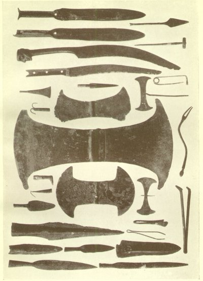
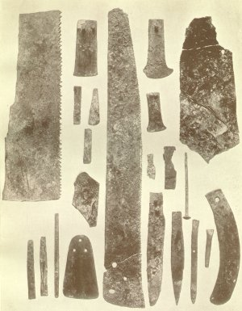
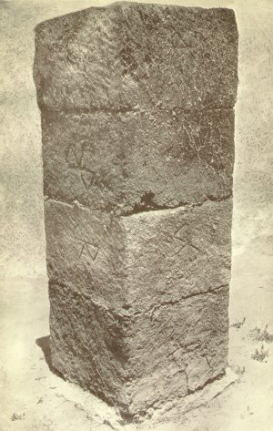

  
[Intangible Textual Heritage](../../index)  [Classics](../index) 
[Index](index)  [Previous](moc17)  [Next](moc19) 

------------------------------------------------------------------------

[Buy this Book at
Amazon.com](https://www.amazon.com/exec/obidos/ASIN/B002BA5ITU/internetsacredte)

------------------------------------------------------------------------

  
*Myths of Crete and Pre-Hellenic Europe*, by Donald A. Mackenzie,
\[1917\], at Intangible Textual Heritage

------------------------------------------------------------------------

p. 293

# CHAPTER XIII

### Cave Deities and their Symbols

Demeter and the Nameless Fates--Forms of Mother-goddess--The "Eagle
Lady" with Snake Girdle--Prototype of Hittite and Assyrian "Winged
Disk"--How Composite Monsters became Symbols--The Caves of Zeus--Lasithi
Plateau--The Dictæan Votive Offerings--The Chariot of a Deity--Cave of
Kamares--The Plain of Nida--Sacred Cave of Mount Ida--Mountain Religion
--Well Worship--The "Seven Sleepers" Belief--Cretan Tammuz a Cave God
--Pillar Symbols in Crete, Egypt, and Babylonia--Pillars as Mountains
and "World Spines"--The Osirian Spine Amulet--Tree and Pillar
Worship--"Horns of Consecration" as Sky Pillars--Double-axe
Symbol--Spirits in Weapons--The God of the Axe.

"THE Cretans say", Diodorus Siculus wrote, "that the honours rendered to
the gods, the sacrifices and mysteries, are of Cretan origin, and other
nations took them from them. Demeter passed from the Isle of Crete into
Attica, then into Sicily, and thence into Egypt, carrying with her the
cultivation of corn." [1](#fn_339)

On the other hand Herodotus, writing of the Pelasgi, says: "In early
times the Pelasgi, as I know by information I got at Dodona, offered
sacrifices of all kinds and prayed to the gods, but had no distinct
names or appellations for them, since they had never heard of any. They
called them gods (θεοὶ {Greek *ðeoì*}, disposers) because they had
arranged all things in such a beautiful order. After a long lapse of
time, the names of the gods came to Greece from Egypt, and the Pelasgi
learnt them, only as yet they knew nothing of Bacchus, of whom they
first heard at a much later date. " [2](#fn_340)

p. 294

There is, no doubt, a kernel of real historical truth in these
traditions. The Demeter to whom Diodorus refers is not, of course, the
beautiful goddess whom the Grecian sculptors conceived of, but rather
the Phigalian cave monster, the black horse-headed fury with snakes
hissing from amidst her tangled locks. In early times she had many
forms--terrible and mystical forms. Some idea of these is obtained from
the study of the seal impressions discovered by Mr. Hogarth at Zakro. In
one phase she is the eagle lady"--a woman with prominent breasts,
widespread wings, and an eagle's head, wearing the snake waist girdle
and the bell-shaped gown, or simply an eagle with a fan tall., and
nothing human but her breasts. Several seal specimens show that this
primitive form developed into a symbol which may have been a prototype
of the Hittite winged disk and the Assyrian disk of Ashur. One is a
column with fan tall and surmounted by winged human breasts, above which
is a round beehive-shaped cap; others are variants, and then comes a
fully developed symbolic object, with breasts represented by double
spiral coils resting on a double bee-hive-shaped body with double
outspread wings.

In another phase the goddess has a goat's head, wings, a short columnar
body, and spreading skirt. A god is similarly depicted with pants and
waist girdle. A ram's head appears on another seal impression of like
character, and in a variant the head of a "sea horse". Winged sphinxes
recall Egyptian forms. Of special interest is a bull-head deity with
female breasts, wings, crouched-up legs and fan tail, which may have
been bisexual. This form tends also to grow into a decorative symbol.
The Minotaur was a bull-headed god.

Composite monsters include deities with human bodies and lions' heads
resembling those of Egypt, two dogs'

p. 295

heads divided by a wing and united by a fan tail, a female sphinx with
human breasts, butterfly wings and lion's legs, a human head with wings
and lion's legs, and so on. The form of the Hittite and later Russian
double-headed eagle is suggested by a conventionalized lion's head with
birds' heads protruding from the ears, curving inward in opposition. In
almost all cases the animal and composite animal forms tend to become
decorative symbols.

The "Black Demeter" of Phigalia was, as has been indicated, associated
with cave worship. In Crete there were many sacred caves. Of these the
two most famous were those reputed in classical traditions to be the
birthplace of Zeus. One is on Mount Ida and the other on Mount Dicte.

It is possible that these rival caves were sacred to rival cults.
Beneath Mount Dicte was situated the city of Lyttos, which was,
according to legend, hostile to Knossos and an ally of Gortyna. In
references of this character there may be memories of ancient
inter-state rivalries in Minoan Crete which survived into the Hellenic
Period.

Hesiod, [1](#fn_341) dealing with the Zeus
birth-legend, relates that the goddess Rhea carried her babe to Lyttos.
Other writers were familiar with the legend that Zeus was nursed in the
Dictæan cave. Diodorus [2](#fn_342) apparently
endeavoured to reconcile the conflicting claims on behalf of the Dictæan
and Idæan sanctuaries by stating that the god was first concealed in the
one and then transferred to the other to be educated.

According to Dionysius of Halicarnassus [3](#fn_343) it was the Dictæan cave which Minos
entered to receive from Zeus the code of Cretan laws. Lucian states that
Europa, the mother of Minos, was carried thither by Zeus, his father,
who had abducted her. [4](#fn_344)

p. 296

To visit the Dictæan cave we must first reach the upland plain of
Lasithi, to the south-east of Knossos, which is about 5 miles long, and
roughly half that in breadth, and has an elevation above the sea-level
of some 3000 feet. Mountains surround it on every side, the highest
peaks being Aphendis Sarakinos (Mount Dicte), which rises to 5223 feet,
and Selena to the north-east, which is almost as lofty. A river
traverses the plain from end to end, and is fed by many hill torrents.
It finds no valley outlet, but pours into a great cavern towards the
north-west. According to local belief, it appears again lower down as
the river Aposelemis, which enters the sea a few miles east of Candia.

This upland is approached from the west across the Pediadhan Plain,
situated at an elevation of about 200 feet; the mule track then winds
its way sheer up the mountain face. From the east the traveller leaves
the western shore of the Gulf of Mirabello, and following the valley of
the river Kalopotamos, makes a similarly difficult ascent by a zigzag
path.

The Lasithi plain, embosomed among sublime mountains, is exceedingly
fertile and comparatively populous. The climate resembles that of the
more favoured parts of Switzerland. Neither olive trees nor carob trees
grow upon it, but the vine flourishes and the grain crops are excellent.
The nightingale which pipes so sweetly in lower valleys is here unheard.
At morn and sweet eventide, however, the thrush and the blackbird carol
amidst the pear and apple trees. On yonder grassy slopes are the
familiar wild flowers of temperate climes, including the homely yellow
buttercup. The winter is somewhat severe, and it is customary when it
approaches to drive flocks and herds to the lower valleys, where they
are sheltered and fed until the advent of Spring.

 

 

WEAPONS AND IMPLEMENTS, IN BRONZE, FROM THE DICTEAN CAVE

Including double axes, spear-heads, knives, daggers, fish hooks, fibula,
tweezers, gimlet, &c.

 

p. 297

On one of the ridges of Mount Dicte are the ruins of the city of Lyttos,
and on another, right opposite, the modern village of Psychro. Five
hundred feet above Psychro is the double cavern associated with the
legends of Zeus--the famous Dictæan cave. As far back as the "eighties"
it was known to contain archaeological relics. The earliest finds were
made by goatherds who were accustomed to shelter in it, and after these
passed into the hands of dealers, various archæologists paid visits to
Psychro and the cave. It was not, however, until 1900 that thorough and
systematic exploration of it was conducted by Mr. D. G. Hogarth.

This accomplished archæologist did not achieve success without
overcoming considerable difficulties. Rock-falls had occurred in the
cave, and he had to have recourse to blasting operations. Besides, part
of it is ever flooded. "Water flowing in from the east has", writes Mr.
Hogarth, "penetrated in two directions right and left. The main flow to
southward has excavated an abyss, which falls at first sheer and then
slopes steeply for some 200 feet in all to an icy pool, out of which
rises a forest of stalactites." [1](#fn_345)

Inside the cave were found portions of walls, a paved way, and bits of
sawn marble an inch thick which may have covered it, an altar-like
edifice beside which lay a small stone "table of offerings" and
fragments of about thirty other "tables", lamps, cups, broken vases and
ashes. Professor Myres found one of the cave "tables" in 1896, and
another was purchased from dealers by Sir Arthur Evans in the same year.

The deposit, which was deepest and least disturbed in the north-west
part of the upper cave, was divided by strata of pottery fragments and
animal bones, between which lay ash and carbonized matter. The oldest
pottery

p. 298

was of the Kamares (Middle Minoan) variety. In the surface layer were
lamps of the Roman period and a silver Byzantine cross, indicating that
long after the cave ceased to attract crowds of votaries, the memory of
its sacred character survived among the people. Terra-cotta figurines
were also found.

When the upper cave was thoroughly explored, Mr. Hogarth prepared to
take his departure. Before leaving, however, he sent some of the workers
down the steep slope to conduct a search in the lower cave. Here, to the
astonishment of everyone, a great archæological harvest awaited the
gleaners. Hundreds of metal offerings were lying in the mud around and
below the water, and among the niches formed by stalagmite, some being
almost enclosed like flies in amber. In two days the lower cave was
cleared. "Four days later", Mr. Hogarth relates, "I took all the bronze
pieces, amounting to nearly 500, the objects in gold, hard stone, ivory,
bone and terra-cotta, a selection of the stone tables of offerings and
of the pottery and specimens of skulls, horns and bones found in the
upper Grot, to Candia. What I left under the care of the village
(Psychro) officials included no fewer than 550 unbroken specimens of the
common type of little wheel-made plain cup, all obviously new at the
time they were deposited in the cave, and a great store of bones." [1](#fn_346)

The bronze figurines of human shape are of both sexes. They are usually
posed in devotional attitudes, and may represent votaries or deities, or
include both. One figurine is clearly Egyptian. It wears the high double
plumes of the god Ra, and seems to have been deposited about 900 B.C. by
some pious wanderer who believed, perhaps, that the Theban deity and the
Cretan

p. 299

Zeus were identical. Animal figurines include rams, bulls, and oxen. An
ox and a ram with projections from their shoulders fit into a miniature
chariot which may have been a god's vehicle. On a gem in Sir Arthur
Evans's collection a chariot is drawn by goats, as was the car of Thor,
the Germanic Zeus. Models of weapons are comparatively numerous. These
include the double axe, lance-heads, darts, and knives. A knife with a
slightly curved blade has a human head finely carved at the end of the
handle. Among the ivory and bone ornaments special interest attaches to
"three volute-like objects" which, as Mr. Hogarth remarks, "are closely
paralleled by Bosnian fibula plates". They also suggest the well-known
"spectacle" symbols on Scottish sculptured stones. Hairpins, needles,
and brooches figure among the finds.

There are two conspicuous caves on the slopes of Mount Ida, in which
votive offerings were deposited. The first, on the southern side, is
situated above the village of Kamares, and is faintly visible from
Phæstos. Professor Myres explored it in the "nineties" and found, among
other relics, the first specimens of the now famous "Kamares pottery".
The other cave, towards the north. east, has been identified as the
rival of the one on Mount Dicte. In front of it a colossal altar was
carved out of the rock, but at what period there can be no certainty.
Professor Halbherr, who conducted excavations here, was less successful
than Mr. Hogarth. He obtained, however, a number of votive offerings in
terra-cotta and bronze. The latter, which include shields, come down to
the ninth and perhaps even the eighth centuries B.C., and show strong
traces of Dorian influence.

This Zeus cave on Mount Ida can be approached from the romantic plane of
Nida or Nitha, which lies about 5 miles east of the central peak of Ida
at an elevation of

p. 300

over 3000 feet. It is about 2 miles long and ½ mile broad. The snow
vanishes in the month of May. The secluded upland is then covered with
fresh green pasture, to which shepherds drive their flocks, as did their
ancestors in ancient days, when the grass in the lower valleys withers
in the great summer heat. Yellow wild flowers of the buttercup variety
are as thick in the grass as are poppies in some fields of corn. This
fact may have given rise to the classic legend that the sheep which
graze on Nida plain acquire golden teeth. Modern shepherds say that the
pollen of the wild flowers does leave on the teeth of their sheep a
perceptible yellow stain. Travellers who have climbed up to the plain
speak with enthusiasm of its cool, bracing atmosphere, and the clear
starry nights of wonderful listening silence amidst the serenity and
grandeur of the mountains. Ancient Cretans who worshipped their deities
in such places must have experienced the feelings of awe and devotion
that so profoundly impress the mind in lofty solitudes "far from the
madding crowd's ignoble strife".

The practice of performing religious and magical ceremonies in caves
goes back, as we have seen (Chapters I and II), to remote Palæolithic
times, when the huntsmen dwelt in them, buried their dead in them, and
in some drew figures of animals and demons or gods on roofs and walls.
In Crete, caves were sanctuaries in the Neolithic Age. The cave of
Skalais at Præsos, for instance, has yielded Neolithic as well as
Kamares pottery. No votive offerings earlier than Middle Minoan have
been found in the Dictæan cave. The lowest stratum begins with that
period. Outside in the terrace deposit the Neolithic fragments were
apparently deposited by water. What seems probable is that the Lasithi
plain was a mountain lake in Neolithic times, and that it gradually
subsided as its river found a

 

 

BRONZE IMPLEMENTS FROM GOURNIA

The group shown above was taken from a carpenter's kit which had been
concealed in a house in Gournia. The implements include axes, chisels,
adzes, nails, &c.

 

p. 301

subterranean outlet. For a considerable interval afterwards the cave may
have been completely filled with water. If so, it was probably regarded
as sacred on that account. Elsewhere sacred caves have invariably wells,
and some of these are supposed to be possessed of curative properties.
Drops of water falling from roofs are said to cure deafness, restore
fading eyesight, and heal wounds. In these islands "wishing wells"
receive offerings of pins and other objects, especially on May Day. Rags
of clothing are attached also to trees or bushes overhanging wells
anciently sacred. This practice obtains in Crete as well as in the
British Isles and throughout Western Europe. Writing at Aghia Triadha,
Angelo Mosso has recorded: "Every day . . . I passed a curious tree
covered with fetishes. . . . Near a ruined church stands an olive-tree
hung with bits of rag which the peasants tie on the branches, hundreds
of shreds of every colour, worn by rain and wind. . . . I asked what the
curious decoration of the tree was, and was told that anyone who
suffered from malarial fever binds it to the tree with a shred of his
clothing, a handkerchief, or a ribbon, and says a prayer, hoping to be
cured thereby. . . . Witchcraft is common in Crete. Rags and dirty bits
of stuff, into which the witches profess to have banished diseases, are
constantly found in the walls of churches." [1](#fn_347) Here we have one reason why offerings
were deposited in caves and thrown into the fire at Petsofa, near
Palaikastro. The "wishers" affected a ceremonial connection with a
sacred place to "switch on" the good influence and "switch off" the evil
influence, which was negatived by being bound.

The "seven sleepers" of various countries lie in sacred caves. They
appear to be identical with the spirits of vegetation, which slumber
during the winter and return

p. 302

in spring. At the beginning of each year the Greeks held a festival
which was called "the awakening of Hercules". The god returned, like
Tammuz, from the underworld to bring fertility to the earth. Deities of
this class were supposed to be born anew every spring. Mr. Bosanquet
found at Palaikastro, in the Hellenic temple of Jupiter Dicteon, a grey
marble tablet with the following inscription:--

"Hail, O great child, son of Kronos, omnipotent, who cometh yearly to
Dicta seated on the hyena, escorted by demons. Accept the song which we
raise to thee accompanied by the lyre and flute, standing round thy
altar, O benefactor.

In this place the Cured received thee, O immortal child, from the hands
of thy mother Rhea." [1](#fn_348)

Evidently the cave-god of Crete, whom the Hellenes identified with their
Zeus, was supposed to awake from his underworld sleep each year. In
other words, the Earth Mother gave birth to him in the mountain
sanctuary. This young god is found associated with the goddess on Cretan
seals. It has been shown in a previous chapter that there also existed a
variant myth about a young goddess which survived in the
Demeter-Persephone legend. At what period the myth of Rhea and her son
was introduced we have no knowledge. It was possibly of Anatolian
origin. The Phrygian Kybele-Attis myth is of similar character.

It would appear that we have traces in Crete of more than one religious
cult. But behind all the developed conceptions and imported beliefs lay,
apparently, the background of primitive religion which the earliest
settlers had brought with them and adapted to local needs. The oldest
religious practices survived, no doubt, among the

p. 303

masses of the people, just as the practice of tying rags on the
olive-tree at some spot anciently sacred survives at the present day.

The comparative study of Cretan religious symbols tends to show that,
like the Pelasgians, the Minoans worshipped deities of the
underworld-the "hidden deities" of Egyptian religion--who were "Fates"
or "Disposers", and were originally nameless. That is, they worshipped
the spirits of nature and the spirits of ancestors. These symbols
include pillars, the "horns of consecration", and the double axe. Withal
there were sacred wells and mountains and sacred animals associated with
the "Great Mother" which were represented in symbols, as is shown by the
evidence of the seal impressions.

The worship of pillars seems to have been connected with the worship of
trees and mountains. In Egypt it was believed by certain cults that the
iron vault of heaven. was supported by two mountains. "Out of one
mountain. came the sun every morning, and into the other he entered.
every evening. The mountain of sunrise was called Bakhau, and the
mountain of sunset Manu." [1](#fn_349) Another
theory was that the sky rested on two pillars, and a later one, which
obtained, however, before the pyramid texts; were inscribed, set forth
that there were four pillars"--the pillars of Shu"--one at each cardinal
point. The pillars in time were regarded as the sceptres of the gods of
the four quarters. According to the teachings of the Ra sun cult, the
cave-like openings which the sun entered. at evening and emerged from at
morning were guarded. by lions, or the deities with lions' bodies and
human heads which the Greeks called "sphinxes". The northern Egyptian
lion-god was Aker.

In Babylonia it was believed that the sky was supported

p. 304

by the world-surrounding chain of hills. Reference is made in the
Gilgamesh epic to the mountain of Mashu or Mashi; that is, "the mountain
of the Sunset". Its cave-like entrance is guarded by scorpion-men, or a
scorpion-man and a scorpion-woman.

Their backs mount up to the rampart of heaven,  
And their foreparts reach down beneath Arallu (the Under-world) . . .  
From sunrise to sunset they guard the sun. [1](#fn_350)

There was a door on the cave, and Gilgamesh was allowed to pass through
it to penetrate the dark tunnel leading to the Sea of Death, which only
Shamash (the Sun) could cross. [2](#fn_351)
Gilgamesh was the first "opener of the way". Like the Indian Yama and
the Egyptian Apuatu (Osiris) he discovered the path leading to Paradise,
and discovered how mortals could be ferried over the dreaded sea.

The symbols of the Babylonian gods Ea, Anu, and Enlil were tiarras, or
mountain-like cones, resembling somewhat the bee-hive-shaped caps on the
Zakro sealings. Temples were erected like pillars or peaks. Ea's temple
at Eridu, like that of Merodach at Babylon, was called E-sagila, which
signifies "temple of the high head", or "the lofty house". Enlil's
temple was E-kur, "mountain house". Various deities were symbolized as
pillars surmounted by heads. Nergal's symbol was a lion's head on a
pillar, Zamama's a vulture's head on a pillar, Merodach's a lance-head
on a pillar, and so on. Anshar, "the most high", was, in astronomical
lore, the polar star, which was figured as a he-goat, or satyr, on the
summit of the peak of heaven. The Assyrian Ashur was sometimes
symbolized by a disk enclosing a feather-robed archer,

p. 305

resting on a bull's head, with spreading horns, on the summit of a
standard.

Ea, in one of the myths, built the world "as an architect builds a
house". [1](#fn_352) According to the *Rigveda*
the Aryo-Indian god Indra similarly constructed the house of the
universe, which appears to have been supported by the "world
tree". [2](#fn_353) The world-supporting tree,
Ygdrasil, figures in Teutonic mythology. Mount Meru, the Indian Olympus,
which supports the Paradise of Indra, is "the world spine". In Egypt the
*ded* (*dad*, or *tet*) amulet is the spine of Osiris in his character
as the world-god.

According to Wiedemann *ded* means "firm", "established". This amulet
was laid on the neck of the mummy to ensure resurrection. In Chapter CLV
in the Book of the Dead the picture of the symbol is given, and the
deceased, addressing Osiris, says: "Thy back (backbone) is thine, thou
who art of the still heart (Osiris) . . . I bring unto thee the ded,
whereupon thou rejoicest. These are the words to speak over a gilded
*ded* made from the heart of the sycamore and placed on the neck of the
glorified one." [3](#fn_354)

The *ded* symbol is a pillar surmounted by four crossbars. Budge says
that these bars "are intended to indicate the four branches of a
roof-tree of a house which were turned to the four cardinal points". In
the story of the search made by Isis for the slain Osiris it is related
that a tree grew round his body and completely enclosed it. The King of
Byblus had this tree cut down and made it a pillar for the roof of his
house. Isis flew round the pillar in the form of a swallow, and was
permitted subsequently to carry it away.

p. 306

The body of Osiris was afterwards dismembered by Set, but Isis collected
the portions. The backbone was found at the Nilotic city of Daddu or
Tettu. At this cult centre Osiris was "lord of the pillars", and the
hieroglyphic signs of the city include two Osirian pillars with
cross-bars. Here a great festival, which the Pharaoh attended, was held
once a year, and observance was made of the solemn ceremony of setting
up "the pillar symbol of the backbone of Osiris". [1](#fn_355) Like the amulet, the pillar may have
been made from "the heart" of the sycamore tree.

In his fusion with the world-god Ptah, Osiris was invariably represented
as a mummy grasping in his hands in front of him a staff surmounted by
the *ded* cross-bars, and the *ankh* or life symbol.

Bata, the hero of a well-known Egyptian folk-tale, who is evidently an
early form of Osiris, exists for a time as a blossom on a tree-top, then
as a bull, and then as two trees which grew up on either side of the
entrance to the King's palace. [2](#fn_356)

It will thus be seen that the sacred pillar, tree, or mountain was the
god, or the spine of the god, which supported the universe. As the
world-god Ptah sits on a mountain, his head supports the sky, and his
feet reach to the underworld.

The idea that a spine was a charm for stability in life and death is
probably of great antiquity. Spines of fish were laid on the bodies of
the dead in Palæolithic times. In Crete the necklaces made from the
vertebræ of an ox, or sheep, had, no doubt, a magical significance. The
Ligurian and Cretan Neolithic people who carried home portions of the
backbones of whales may have believed

p. 307

that by doing so they prolonged their lives and charmed their dwellings
against attack and disaster.

The dolmens and the single standing-stones--the archæological
"Bethels"--which were set up in the Neolithic and Bronze Ages throughout
Europe, may have been symbols of the god of the pillars, as well as
"spirit-houses" of the dead. In India standing-stones are usually
erected below trees. The tree spirit may have been believed to sleep for
part of the year in the stone.

A mass of evidence has accumulated to indicate that pillars, mountains,
and trees were worshipped in Crete, pre-Hellenic Greece, and Anatolia.
The "Lion's Gate" of Mycenæ shows two lions supporting the sacred
pillar. They are evidently, like the Egyptian lions, the guardians of
the world deity. Cretan seals depict the mother goddess on a
mountain-top supported similarly by a couple of lions, and also standing
or seated between a lion and a lioness. The Cretan pillar is seen
similarly guarded by lions, griffins, bulls, sphinxes, or wild goats.
When the sacred tree is shown like the pillar, animals guard it also. An
intaglio seal shows water-demons on either side of a sacred tree,
heraldically opposed, and holding jugs above the branches. These demons
have been compared to the Egyptian hippopotamus goddess Taurt. The
Babylonian lion-headed eagle, a form of Nin Girsu (Tammuz), which
figures on the silver vase of a Sumerian King of Lagash, is supported by
two lions, on the backs of which its claws rest. The Anatolian goddess
Kedesh, who was imported into Egypt in the Empire Period, stands nude on
the back of a lion. The lion was evidently the symbol of the earth, and
the various figures of lions devouring animals, found in various
countries, probably symbolized the earth receiving its propitiatory
sacrifice. Myths about the mother-serpent (the earth-serpent) attacking
and disabling

p. 308

the eagle may have been connected with a similar belief.

Sir Arthur Evans, who first threw light on the significance of the
pillar and other symbols of Crete, [1](#fn_357)
believes that tree and pillar worship in Palestine and Anatolia was
"taken over from the older stock" by Semites and Hittites. A later
infusion of Minoan ideas into Anatolia and Palestine was caused by the
colonizing Philistines, Carians, and Lycians who were of Ægean origin.

"The undoubted parallelism observable between the tree and pillar cult
of the Mycenæan (Ægean) and that of the Semitic world", writes Sir
Arthur Evans, "should be always regarded from this broad aspect. . . .
The coincidences that we find, so far as they are to be explained by the
general resemblance presented by a parallel stage of religious
evolution, may be regarded as parallel survivals due to ethnic elements
with European affinities which on the east Mediterranean shores largely
underlay the Semitic. . . . The worship of the sacred stone or pillar
known as *Ma<u>ss</u>êba* or *no<u>s</u>b* is very characteristic of
Semitic religion." There were also Semitic sacred hills and sacred
trees. The two pillars, supporting the Philistine temple of Dagon, which
were pulled down by Samson, no doubt had a sacred character. In
Scandinavian legends the sacred tree supports the chief's dwelling.
Sigmund, Volsung's son, draws from the house tree, called "Branstock",
the magic sword which Odin thrust into it, saying: "He who draws the
sword from the stock shall have it as a gift from me, and it will stand
him in good stead". [2](#fn_358)

In Crete altars and tables of offerings were supported on pillars. On
seals a columnar form was sometimes

p. 309

given, as has been indicated, to animal-headed deities. Pillars were
actually worshipped, being the abodes of spirits. On a cylinder from
Mycenæ, for instance, a male figure is posed in an attitude of adoration
before "five columns of architectural character with vertical and spiral
flutings". No doubt the pillars of Egyptian and Grecian temples had
originally a religious significance. In Christian churches ancient Pagan
symbols have been perpetuated as architectural conventions. The cock,
which was supposed to be a charm against demons, and consequently
perched as a sentinel on the "world tree" of Teutonic Mythology, still
appears on spires, where it indicates how the wind blows. In Scottish
Mythology the north wind brings the evil spirits and the south wind the
good spirits. "Shut the windows towards the north, and open the windows
towards the south, and do not let the fire go out", is an instruction
given in a folk-tale by a man who desires his house to be guarded
against the visits of demons. The Teutonic Jotuns were in the east. Thor
always went eastward to wage war against them.

The "horns of consecration" were originally the horns of the sacred bull
or sacred cow. In Egypt the cow-goddess Hathor was a world-deity. Heaven
rested on her back, and the under part of her body, which is usually
shown covered with stars, formed the firmament. Her four legs were thus
the sky pillars. Another belief was that the sky rested on the horns of
the sacred animals. Thus we find a reference in the "Book of That which
is in the Underworld" to the "Horn of the West", [1](#fn_359) apparently the same as the "pillar of
the west" and "Sunset-Hill". The sun-god Ra, who absorbed the attributes
of all other deities, is referred to in the "Pyramid Texts" as the deity
with "four horns, one toward each of the cardinal

p. 310

points". [1](#fn_360) In Crete the horns were
of great ritual importance. "At times". Sir Arthur Evans writes, [2](#fn_361) "these have the appearance of being
actually horns of oxen, but more generally they seem to be a
conventional imitation of what must be regarded as unquestionably the
original type-that is, a kind of impost or base terminating at the two
ends in two horn-like excrescences. Sometimes this cult object appears
on the altar. At other times it rises above the entablature of an
archway connected with a sacred tree or on the roof of a shrine. It is
frequently set at the foot of sacred trees." Occasionally the double axe
is surmounted on a staff between the horns. A horned cult object in
terra-cotta, with the eye symbol of Anatolian pottery painted on the
base, was found in one of the Cretan votive caves. The horned symbol has
been found associated with early Bronze Age relics in Sardinia, Italy,
Switzerland, Spain, and the Balearic Islands, which were probably the
Cassiterides Islands in which tin was found. It may be that the Cretan
symbol was distributed by early sea-traders. In Syria the altar of
Astarte had horns. The "horns of the altar" are referred to in the
Bible.

The double-axe symbol was evidently of remote origin. Weapons were in
the animistic stage of primitive culture believed to be possessed of
spirits, and were given individual names. "Every weapon has its demon"
is an ancient Gaelic axiom. The sword of the Scoto-Irish folk-hero
Finn-mac-Coul was called "Mac-an-Luin". In the Indian epic, the
*Mahábhárata*, the warrior Arjuna receives a celestial weapon from the
god Shiva. "And that weapon then began to wait upon Arjuna", the
narrative proceeds.

And the gods and the Danavas (Titans) beheld that

 

 

PILLAR AT KNOSSOS, INCISED WITH DOUBLE-AXE SYMBOLS

 

p. 311

terrible weapon in its embodied form stay by the side of Arjuna of
immeasurable energy." [1](#fn_362) Rama of the
*Rámáyana* is adored by the spirits of his celestial weapons. [2](#fn_363) The Indian weapons were all named.

That this belief goes back to Palæolithic times is suggested by the
evidence of Egypt. "The common word given by the Egyptians to God, and
god, and spirits of every kind, and beings of all sorts, and kinds, and
forms, which were supposed to possess any superhuman or supernatural
power, was", says Professor Budge, "'Neter'. The hieroglyph used as the
determinative of this word, and also as an ideograph, is the axe with a
handle. The common word for goddess is Netert." Professor Budge shows
that "from the texts wherein the hieroglyphics are coloured it is
tolerably clear that the axe head was fastened to its handle by means of
thongs of leather". [3](#fn_364) As holes were
bored in axes at an early period, Mr. Legge considers that the
fastenings indicate that the symbolic use of the axe "goes back to the
Neolithic and perhaps the Palæolithic Age". He adds: "It is now, I
think, generally accepted that the use of the stone axe precedes that of
the flint arrow-head or flint knife; and it thoroughly agrees with the
little we know of the workings of the mind of primitive man that this,
the first weapon that came into his hands, should have been the first
material object to which he offered worship". An axe is worshipped by a
priest in Chaldæan garb on an Assyrian agate cylinder. The axe also
appears as a symbol "in the prehistoric remains of the funereal caves of
the Marne, of Scandinavia and America". [4](#fn_365) We have already alluded to its
appearance on the standing-stones of Brittany, and to

p. 312

the theory that Labyrinth is derived from *Labrys*, "the axe". Professor
Maspero shows that in Egyptian "a town *neterit* is 'a divine town'; an
arm *neteri* is 'a divine arm'". He adds that "*neteri* is employed
metaphorically in Egyptian as is 'divine' in French". [1](#fn_366)

Votive axes, too small for use, have been found in Cretan graves and
sanctuaries. The earliest form was the single flat axe: the
double-headed axe was first made after copper came into use. Mosso gives
interesting particulars regarding votive axes found on the Continent.
Some of these are of a friable sandstone, and could have served no
practical purpose. [2](#fn_367) Small axes,
which were pierced for suspension, were used as charms in Malta and
elsewhere. The sacred axe survives to the present day in the Congo.

------------------------------------------------------------------------

### Footnotes

[293:1](moc18.htm#fr_339) *Diodorus Siculus*,
V. 77.

[293:2](moc18.htm#fr_340) *Herodotus*, II, 52.

[295:1](moc18.htm#fr_341) *Theog*., V, 477.

[295:2](moc18.htm#fr_342) V, 170.

[295:3](moc18.htm#fr_343) *Ant. Rom*., II, 61.

[295:4](moc18.htm#fr_344) *Dial. Mar*., XV, 3.

[297:1](moc18.htm#fr_345) *Annual of the
British School at Athens*, VI, 96.

[298:1](moc18.htm#fr_346) Annual of the British
School at Athens, VI, p. 101.

[301:1](moc18.htm#fr_347) *The Palaces of Crete
and their Builders*, pp. 200-1.

[302:1](moc18.htm#fr_348) *Palaces of Crete and
their Builders*, A. Mosso, pp. 201, 202.

[303:1](moc18.htm#fr_349) *The Gods of the
Egyptians*, E. Wallis Budge, Vol. I, pp. 156, 157

[304:1](moc18.htm#fr_350) King's *Babylonian
Religion*, p. 166.

[304:2](moc18.htm#fr_351) *Babylonian Myth and
Legend*, p. 177.

[305:1](moc18.htm#fr_352) *Jastrow's Religious
Belief in Babylonia and Assyria*, p. 88.

[305:2](moc18.htm#fr_353) *Indian Myth and
Legend*, p. 10.

[305:3](moc18.htm#fr_354) *Religion of the
Ancient Egyptians*, A. Wiedemann, p. 290.

[306:1](moc18.htm#fr_355) Budge's *Gods of the
Egyptians*, Vol. II, p. 122.

[306:2](moc18.htm#fr_356) *Egyptian Myth and
Legend*, pp. 53 *et seq*.

[308:1](moc18.htm#fr_357) "Mycenæan Tree and
Pillar Cult and its Mediterranean Relations". in *The Journal of
Hellenic Studies*, Vol. XXI, pp. 99 *et seq*.

[308:2](moc18.htm#fr_358) *Teutonic Myth and
Legend*, pp. 289 *et seq*.

[309:1](moc18.htm#fr_359) *The Gods of the
Egyptians*, Vol. I, p. 205.

[310:1](moc18.htm#fr_360) *Development of
Religion and Thought in Ancient Egypt*, J. H. Breasted, p. 116.

[310:2](moc18.htm#fr_361) *Journal of Hellenic
Studies*, Vol. XXI, p. 135 et seq.

[311:1](moc18.htm#fr_362) "Vana Parva" section
(Roy's translation), p. 127.

[311:2](moc18.htm#fr_363) *Indian Myth and
Legend*, pp. 256 and 381.

[311:3](moc18.htm#fr_364) *The Gods of the
Egyptians*, E. Wallis Budge, Vol. I, pp. 63 *et seq*.

[311:4](moc18.htm#fr_365) *Proceedings of the
Society of Biblical Archæology*, Vol. XXI, pp. 310, 311.

[312:1](moc18.htm#fr_366) *Etudes de Mythologie
et d'Archéologie Egyptiennes*, Tome II, p. 215.

[312:2](moc18.htm#fr_367) *The Dawn of
Mediterranean Civilization*, pp. 132 *et seq*.

------------------------------------------------------------------------

[Next: Chapter XIV. Decline of Crete and Rise of Greece](moc19)
