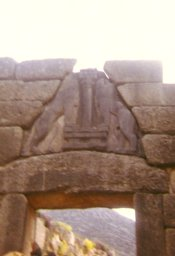

  
[Intangible Textual Heritage](../../index)  [Classics](../index) 

------------------------------------------------------------------------

[Buy this Book at
Amazon.com](https://www.amazon.com/exec/obidos/ASIN/0520021630/internetsacredte)

------------------------------------------------------------------------

<table width="75%">
<colgroup>
<col style="width: 50%" />
<col style="width: 50%" />
</colgroup>
<tbody>
<tr class="odd">
<td width="50%" data-valign="CENTER"> 
</td>
<td width="50%" data-valign="CENTER"><h1 id="the-mycenaean-origin-of-greek-mythology" data-align="CENTER">The Mycenaean Origin of Greek Mythology</h1>
<h2 id="by-martin-p.-nilsson" data-align="CENTER">by Martin P. Nilsson</h2>
<h4 id="copyright-not-renewed" data-align="CENTER">[1932, Copyright not renewed]</h4></td>
</tr>
</tbody>
</table>

------------------------------------------------------------------------

|                                                                                                                           |
|---------------------------------------------------------------------------------------------------------------------------|
|  |

This is a study of the origins of classical Greek mythology in the
Mycenaean era, which preceded the era of Homer, Hesiod and the
dramatists by several hundred years, separated by a dark age. In the
19th century, the 'Comparative' school explained Greek mythology in
terms of parallels with other mythologies such as the Celtic, Germanic
and Indian. This was counterpoised by a 'Euhemerist' school, which tried
to find historical basis for all mythological incidents. Nilsson, who
wrote in the mid-20th century, steered between these two schools,
instead looking for historic and prehistoric evidence for the evolution
of the Greek mythological cycles, particularly attempting to match up
archaeological evidence of Mycenaean occupation with localized myths
such as the Theseus, the Thebes myths, Heracles and Mount Olympus.

------------------------------------------------------------------------

[Title Page](mog00)  
[Contents](mog01)  
[Chapter I. How Old is Greek Mythology?](mog02)  

### Chapter II. Mycenaean Centers and Mythological Centers

[Chapter II: Introduction](mog03)  
[1. Argolis](mog04)  
[2. Laconia](mog05)  
[3. The Dominion of Pylos](mog06)  
[4. The Rest of the Peloponnese](mog07)  
[5. The Ionian Islands](mog08)  
[6. Southern Boeotia](mog09)  
[7. Northern Boeotia and Thessaly](mog10)  
[8. Attica](mog11)  
[9. Conclusion](mog12)  

 

[Chapter III. Heracles](mog13)  
[Chapter IV. Olympus](mog14)  
[Index](mog15)  
