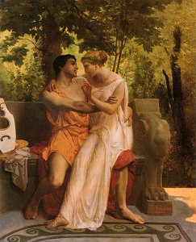

  
[Intangible Textual Heritage](../../../index)  [Classics](../../index) 
[Ovid](../index) 

------------------------------------------------------------------------

[Buy this Book at
Amazon.com](https://www.amazon.com/exec/obidos/ASIN/1417905824/internetsacredte)

------------------------------------------------------------------------

<table width="75%">
<colgroup>
<col style="width: 50%" />
<col style="width: 50%" />
</colgroup>
<tbody>
<tr class="odd">
<td width="50%" data-valign="TOP"></td>
<td width="50%" data-valign="CENTER"><h1 id="the-love-books-of-ovid" data-align="CENTER">The Love Books of Ovid</h1>
<h4 id="translated-by-j.-lewis-may" data-align="CENTER">Translated by J. Lewis May</h4>
<h4 id="section" data-align="CENTER">[1930]</h4></td>
</tr>
</tbody>
</table>

------------------------------------------------------------------------

[Contents](#contents)    [Start Reading](lboo00)

|                                                                                                                           |
|---------------------------------------------------------------------------------------------------------------------------|
|  |

This is Julian May's translation of Ovid's 'erotic' works: The Amores
(the Loves), Ars Amatoria (the Art of Love), Remedia Amoris (The Cure
for Love) and the fragmentary Medicamina Faciei Feminae (Women's Facial
Cosmetics). This version was published in 1930 in a 'limited' edition
with sensual art deco illustrations by Jean de Bosschere.

In the Amores, published about 18 BCE, Ovid portrays the evolution of an
affair with a married woman named Corinna. It is unclear as to whether
this is fictional or autobiographical, but it is obviously based on the
experiences of a sophisticated lover. The Ars Amatoria, published about
1 BCE, is a guidebook for seduction; it includes many tips and tricks
which would not be out of place in a modern dating manual, while giving
intimate vignettes of daily life in Ancient Rome. The first two books
are written from a male point of view; the last book, which was probably
written at a later date, is addressed to women. It is believed that this
work, which celebrates extramarital sex, was one of the reasons that
Ovid was banished by the Emperor Augustus, who was attempting to promote
a more austere morality.

This edition has parallel Latin text (which was not included in the
original book).

------------------------------------------------------------------------

[Title Page](lboo00)  
[Introduction: I](lboo01)  
[Introduction: II](lboo02)  
[Introduction: III](lboo03)  
[Introduction: IV](lboo04)  
[Contents,](lboo05)  
[List of Illustrations](lbooill)  
[The Loves: Book I](lboo06)  
[Elegy I: The Poet Explains How It Is He Comes To Sing Of Love Instead
Of Battles](lboo07)  
[Elegy II: The Triumph Of Love.](lboo08)  
[Elegy III: He Commends Himself To His Mistress By The Merits Of His
Poetry, The Purity Of His Morals, And By The Vow Of His Unchangeable
Fidelity.](lboo09)  
[Elegy IV: Ovid, His Mistress And Her Husband Are All Bidden To The Same
Supper. He Gives His Mistress A Code By Which They Can Testify Their
Love For Each Other, Beneath Her Husband's Very Eyes.](lboo10)  
[Elegy V: His Delight At Having Obtained Corinna's Favours](lboo11)  
[Elegy VI: He Conjures The Porter To Open The Door Of His Mistress's
House.](lboo12)  
[Elegy VII: He Curses Himself For Having Maltreated His
Mistress.](lboo13)  
[Elegy VIII: He Curses A Certain Old Woman Of The Town Whom He Overhears
Instructing His Mistress In The Arts Of A Courtesan.](lboo14)  
[Elegy IX: He Compareth Love With War.](lboo15)  
[Elegy X: He Endeavours To Dissuade His Mistress From Becoming A
Courtesan.](lboo16)  
[Elegy XI: He Asks Nape To Deliver A Love-letter To Her
Mistress.](lboo17)  
[Elegy XII: He Calls Down Curses On The Tablets Which Bring Him Word Of
His Mistress's Refusal.](lboo18)  
[Elegy XIII: He Entreats The Dawn To Hasten Not Her Coming.](lboo19)  
[Elegy XIV: To His Mistress, Who, Contrary To His Counsel, Dyed Her Hair
With Noxious Compositions, And Has Nearly Become Bald.](lboo20)  
[Elegy XV: The Poets Alone Are Immortal.](lboo21)  
[The Loves: Book II](lboo22)  
[Elegy I: He Tells Wherefore, Instead Of The Wars Of The Giants, Which
He Had Commenced, He Is Constrained To Sing Of Love.](lboo23)  
[Elegy II: To The Eunuch Bagoas, Begging Him To Give Him Access To The
Fair One Committed To His Charge.](lboo24)  
[Elegy III: He Appeals Once More To Bagoas, Who Had Proved
Inflexible.](lboo25)  
[Elegy IV: He Confesses His Inclination For Love And His Admiration For
All Manner Of Women.](lboo26)  
[Elegy V: He Upbraids His Mistress Whom He His Detected Acting Falsely
Towards Him.](lboo27)  
[Elegy VI: He Laments The Death Of The Parrot He Had Given To His
Mistress.](lboo28)  
[Elegy VII: He Assures Corinna That He Has Never Had Any Guilty Commerce
With Cypassis, Her Maid.](lboo29)  
[Elegy VIII: He Asks Cypassis How In The World Corinna Could Have Found
Them Out.](lboo30)  
[Elegy IX: He Beseeches Cupid Not To Discharge All His Arrows At Him
Alone.](lboo31)  
[Elegy X: He Tells Græcinus How, Despite What He Says To The Contrary,
It Is Possible To Be In Love With Two Women At The Same Time.](lboo32)  
[Elegy XI: He Seeks To Dissuade Corinna From Going To Baiæ.](lboo33)  
[Elegy XII: He Rejoices At Having At Last Won The Favours Of
Corinna.](lboo34)  
[Elegy XIII: He Beseeches Isis To Come To The Aid Of Corinna In Her
Confinement.](lboo35)  
[Elegy XIV: On Corinna's Recovery He Writes To Her Again Concerning Her
Attempt At Abortion And Tells Her How Naughty She Has Been.](lboo36)  
[Elegy XV: To The Ring Which He Is Sending To His Mistress.](lboo37)  
[Elegy XVI: To Corinna, Beseeching Her To Visit Him In His Country Home
At Sulmo.](lboo38)  
[Elegy XVII: He Complains To Corinna That She Is Too Conceited About Her
Good Looks.](lboo39)  
[Elegy XVIII: To Macer: To Whom He Excuses Himself For Giving Himself Up
Wholly To Erotic Verse.](lboo40)  
[Elegy XIX: To A Man With Whose Wife He Was In Love.](lboo41)  
[The Loves: Book III](lboo42)  
[Elegy I: The Tragic And The Elegiac Muse Strive For The Possession Of
Ovid.](lboo43)  
[Elegy II: The Circus.](lboo44)  
[Elegy III: To His Mistress, Whom He Has Found To Be
Forsworn.](lboo45)  
[Elegy IV: He Urges A Husband Not To Keep So Strict A Watch On His
Wife.](lboo46)  
[Elegy V: A Dream.](lboo47)  
[Elegy VI: To A River Which Has Overflowed Its Banks And Hindered The
Poet, Who Was Hastening To His Mistress.](lboo48)  
[Elegy VII: The Poet Reproaches Himself For Having Failed In His Duty
Towards His Mistress.](lboo49)  
[Elegy VIII: To His Mistress, Complaining That She His Given Preference
To A Wealthier Rival.](lboo50)  
[Elegy IX: On The Death Of Tibullus.](lboo51)  
[Elegy X: He Complains To Ceres That, During Her Festival, He Is Not
Suffered To Share His Mistress' Couch.](lboo52)  
[Elegy XI: Weary At Length Of His Mistress' Infidelities, He Swears That
He Will Love Her No Longer.](lboo53)  
[Elegy XII: He Laments That His Poems Have Made His Mistress Too Well
Known.](lboo54)  
[Elegy XIII: The Festival Of Juno At Falisci.](lboo55)  
[Elegy XIV: To His Mistress.](lboo56)  
[Elegy XV: He Bids Farewell To His Wanton Muse, To Court One, More
Austere.](lboo57)  
[The Art of Love: Book I](lboo58)  
[The Art of Love: Book II](lboo59)  
[The Art of Love: Book III](lboo60)  
[Love's Cure](lboo61)  
[The Art Of Beauty](lboo62)  
