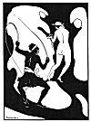

  
[Intangible Textual Heritage](../../../index)  [Classics](../../index) 
[Ovid](../index)  [Index](index)  [Previous](lboo28)  [Next](lboo30) 

------------------------------------------------------------------------

[Buy this Book at
Amazon.com](https://www.amazon.com/exec/obidos/ASIN/1417905824/internetsacredte)

------------------------------------------------------------------------

## ELEGY VII:

### HE ASSURES CORINNA THAT HE HAS NEVER HAD ANY GUILTY COMMERCE WITH CYPASSIS, HER MAID.

<table data-border="0" width="100%">
<colgroup>
<col style="width: 33%" />
<col style="width: 33%" />
<col style="width: 33%" />
</colgroup>
<tbody>
<tr class="odd">
<td data-valign="top" width="44%">
Oh, are you always going to be bringing some charge against me? No sooner have I succeeded in rebutting one than you trump up another. I'm sick of this perpetual bickering. If I happen to run my eye along the topmost tier of the theatre, you'll be sure to pick one woman out of the crowd

p. 44

there and make her a pretext for some more nagging. If a woman merely glances in my direction, and I don't look back at her, my indifference, you'll say, is all put on; there's something between us right enough. If I say anything nice about a woman, you immediately start tearing your hair; if I say anything nasty, well, you say it's just a blind. If I'm looking well, it's because I leave you alone; and if I'm not, I'm dying of love for someone else. I shouldn't so much mind if I had really done something. It's easier to put up with troubles you've brought on yourself; but you upbraid me without rhyme or reason, and your fatal proclivity for believing the worst about everybody, weakens whatever effect your fulminations might otherwise have had. Look at that poor old long-eared donkey there; he doesn't mend his pace, for all their whackings.

And now you've got another grievance. It's your smart little maid, Cypassis, with whom I am supposed to have misconducted myself this time, is it? And in your bed, too. Now if ever I feel inclined to go astray, the gods forbid that I should do so with a servant-girl. What man would ever willingly have relations with a slave or want to fondle a back all covered with weals? And, mark you, this particular slave is the one that gives the finishing touches to your hair, whose clever fingers make you look so irresistible; and I am supposed to go philandering with someone who thinks there's not a woman like you in the world? Is it likely? I should only get snubbed for my pains, and she'd tell you all about it. No, I swear by Venus and by the bow of her wingèd boy, I'm innocent of the charge you bring against me.
</td>
<td data-valign="top" width="9%">
 
</td>
<td data-valign="top" width="44%">
Ergo sufficiam reus in nova crimina semper? 
    ut vincam, totiens dimicuisse piget. 
sive ego marmorei respexi summa theatri, 
    eligis e multis, unde dolere velis; 
candida seu tacito vidit me femina vultu, 
    in vultu tacitas arguis esse notas. 
siquam laudavi, misero petis ungue capillos; 
    si culpo, crimen dissimulare putas. 
sive bonus color est, in te quoque frigidus esse, 
    seu malus, alterius dicor amore mori. 
Atque ego peccati vellem mihi conscius essem! 
    aequo animo poenam, qui meruere, ferunt; 
nunc temere insimulas credendoque omnia frustra 
    ipsa vetas iram pondus habere tuam. 
adspice, ut auritus miserandae sortis asellus 
    adsiduo domitus verbere lentus eat! 
Ecce novum crimen! sollers ornare Cypassis 
    obicitur dominae contemerasse torum. 
di melius, quam me, si sit peccasse libido, 
    sordida contemptae sortis amica iuvet! 
quis Veneris famulae conubia liber inire 
    tergaque conplecti verbere secta velit? 
adde, quod ornandis illa est operata capillis 
    et tibi perdocta est grata ministra manu-- 
scilicet ancillam, quae tam tibi fida, rogarem! 
    quid, nisi ut indicio iuncta repulsa foret? 
per Venerem iuro puerique volatilis arcus, 
    me non admissi criminis esse reum!
</td>
</tr>
</tbody>
</table>

[  
Click to enlarge](img/04400.jpg)  
A BACK COVERED WITH WEALS  

------------------------------------------------------------------------

[Next: Elegy VIII: He Asks Cypassis How In The World Corinna Could Have
Found Them Out.](lboo30)
