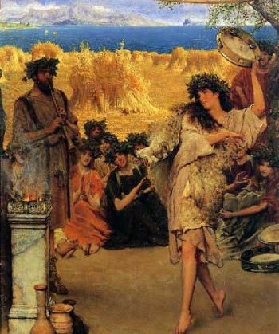

  
[Intangible Textual Heritage](../../index)  [Classics](../index) 

------------------------------------------------------------------------

[Buy this Book at
Amazon.com](https://www.amazon.com/exec/obidos/ASIN/0691015147/internetsacredte)

------------------------------------------------------------------------

<table width="75%">
<colgroup>
<col style="width: 50%" />
<col style="width: 50%" />
</colgroup>
<tbody>
<tr class="odd">
<td width="50%" data-valign="TOP"> 
A Dancing Bacchante at Harvest Time, by Alma-Tadema Lawrence [1880] (Public Domain Image)</td>
<td width="50%" data-valign="CENTER"><h5 id="the-first-two-chapters-of" data-align="CENTER"><em>The First Two Chapters of</em></h5>
<h1 id="progelomena-to-the-study-of-greek-religion" data-align="CENTER">Progelomena to the Study of Greek Religion</h1>
<h2 id="by-jane-ellen-harrison" data-align="CENTER">by Jane Ellen Harrison</h2>
<h4 id="section" data-align="CENTER">[1922]</h4></td>
</tr>
</tbody>
</table>

------------------------------------------------------------------------

[Contents](#contents)    [Start Reading](pgr00)    [Page Index](pageidx)

------------------------------------------------------------------------

|                                                                                                                           |
|---------------------------------------------------------------------------------------------------------------------------|
|  |

This is an in-progress etext of this book. So far I have finished the
first two chapters, up to page 76 of 682. Long passages in Greek have
been omitted (marked by ...), but incidental words and shorter passage
are transcribed in [Unicode](../../unicode). I hope to finish this
extraordinarily difficult proof job at some point but have no specific
schedule for its completion.--*J.B. Hare, May 7th, 2008*.

------------------------------------------------------------------------

 [Title Page and Front Matter](pgr00)  
[Introduction](pgr01)  
[Table of Contents](pgr02)  
[Chapter I. Olympian and Chthonic Ritual](pgr03)  
[Chapter II. The Anthesteria](pgr04)  
[Chapter III. Harvest Festivals](pgr05)  
