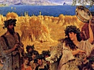

  
[Intangible Textual Heritage](../../index)  [Classics](../index) 
[Index](index)  [Previous](pgr01)  [Next](pgr03) 

------------------------------------------------------------------------

[Buy this Book at
Amazon.com](https://www.amazon.com/exec/obidos/ASIN/0691015147/internetsacredte)

------------------------------------------------------------------------

  
The First Two Chapters of *Prolegomena to the Study of Greek Religion*,
by Jane Ellen Harrison, \[1922\], at Intangible Textual Heritage

------------------------------------------------------------------------

p. xvii

# TABLE OF CONTENTS.

### CHAPTER I.

### OLYMPIAN AND CHTHONIC RITUAL.

Mr Raskin on the absence of fear in the Greek genius. Religion, to
writers of the fifth century B.C., mainly a matter of festivals. In the
*Euthyphron* religion is 'doing business with the gods,' a form of
'tendance' (θεραπεία). Contrast of \`g deisidaimonía\`, fear of
spirits.' Plutarch on 'fear of spirits.' Distinction drawn by Isocrates
and others between Olympian and apotropaic ritual. Contrast between
'Tendance' (θεραπεία) and 'Aversion' (ἀποτροπή). Sacrifice to Zeus in
Homer is a banquet shared. Contrast of the ritual of the Diasia. The
holocaust or uneaten sacrifice. Ritual of the Diasia addressed primarily
to an underworld snake. Superposition of the Homeric Zeus. Evidence of
art. The 'Dian' fleece, not the 'fleece of Zeus' but the fleece of
magical purification. Examination of the Attic calendar. The names of
festivals not connected with the names of Olympian divinities. The
ritual of these festivals belongs to a more primitive stratum than that
of the Olympians, pp. [1](pgr03.htm#page_1)-[31](pgr03.htm#page_31).

### CHAPTER II.

### THE ANTHESTERIA. THE RITUAL OP GHOSTS AND SPRITES.

The Anthesteria, ostensibly dedicated to Dionysos, a spring festival of
the revocation and aversion of ghosts. Examination of the rites of the
three days. Meaning of the Chytroi, the Choes and the Pithoigia.
Derivation of the word *Anthesteria*. Rites of purgation among the
Romans in February. The Feralia and Lupercalia. The 'ritual of devotion'
(ἐναγισμοί). Contrast of θύειν and . The word θύειν used of burnt
sacrifice to the Olympians, the word ἐναγίζειν of 'devotion' to
underworld deities. The ritual of ἀπόνιμμα. Gist of the word ἐναγίζειν
is purgation by means of placation of ghosts. Contrast of ἱερεῖον, the
victim sacrificed and eaten, with σφάγιον, the victim sacrificed and
'devoted.' The σφάγια in use for the taking of oaths, for purification,
for omens, for sacrifice to winds and other underworld powers. Elements
of 'tendance' in the ritual of 'aversion,' pp.
[32](pgr04.htm#page_32)-[76](pgr04.htm#page_76).

p. xviii

### CHAPTER III.

### HARVEST FESTIVALS. THE THARGELIA, KALLYNTERIA, PLYNTERIA.

The Thargelia an early summer festival of first-fruits. The Eiresione.
Object of the offering of first-fruits a release from taboo. The
Australian Intichiuma. Removal of taboo developes into idea of
consecration, dedication, sacrifice. The material of sacrifice. The god
fares as the worshipper, but sometimes, from conservatism, fares worse.
Instances in ritual of survival of primitive foods. The οὐλοχύται, the
pelanos and the nephalia. The fireless sacrifice. The bringing in of
first-fruits preceded by ceremonies of purification. The pharmakos.
Details of the ritual. The pharmakos only incidentally a 'human
sacrifice.' Its object physical and spiritual purgation. Meaning of the
term. The pharmakos in Egypt, at Chaeronea, at Marseilles. Analogous
ceremonies. The Charila at Delphi. The Bouphonia. The Stepterion.
Further ceremonies of purification. The Kallynteria, Plynteria,
Vestalia. General conclusion: in the Thargelia the gist of sacrifice is
purification, a magical cleansing as a preparation for the incoming of
first-fruits, pp. -.

### CHAPTER IV.

### THE WOMEN'S FESTIVALS. THESMOPHORIA, ARREPHORIA, SKIROPHORIA, STENIA, HALOA.

Importance of these festivals as containing the germ of 'Mysteries.'
Detailed examination of the ritual of the Thesmophoria. The Kathodos and
Anodos, the Nesteia, the Kalligeneia. Gist of the rites the magical
impulsion of fertility by burying *sacra* in the ground. Magical rites
preceded by purification and fasting. Analogy of Arrephoria, Skirophoria
and Stenia with Thesmophoria. Meaning of the word Thesmophoria, the
carrying of magical sacra. Magical spells, curses and law. θεσμός and
νόμος. The curse and the law. The Dirae of Teos. The Haloa, a festival
of the threshing-floor, later taken over by Dionysos. Tabooed foods.
Eleusinian Mysteries a primitive harvest-festival. Order of the ritual.
The pig of purification. Other rites of purification. The *tokens* of
the mysteries. Ancient confessions rather of the nature of *Confiteor*
than *Credo*. The fast and the partaking of the *kykeon*. The
Kernophoria. Ancient mysteries in their earliest form consist of the
tasting of first-fruits and the handling of *sacra* after preliminary
purification, pp. -.

p. xix

### CHAPTER V.

### THE DEMONOLOGY OF GHOSTS, SPRITES AND BOGEYS.

Primitive demonology constantly in flux. Various connotations of the
word Ker. The Ker as evil sprite, the Ker as bacillus of disease. The
Keres of Old Age and Death. The Ker as Harpy and Wind-Daimon. The Ker as
Fate in Homer and Hesiod. The Ker as Gorgon. Origin of the Gorgoneion.
Apotropaic masks. The Gorgon developed from the Gorgoneion. The Graiae.
The Evil Eye. The Ker as Siren. The Sirens of Homer. Problem of the
bird-form in art. The Siren as midday daimon. The Siren on funeral
monuments. The bird-form of the soul in Greece and Egypt. Plato's
Sirens. The Ker as Sphinx. Mantic aspect of Sphinx. The Sphinx as
Man-slaying Ker, as Funeral Monument. The Ker as Erinys. The Erinyes as
angry Keres. Erinys an adjectival epithet. The Erinyes primarily the
ghosts of slain men crying for vengeance. The Erinyes developed by Homer
and Herakleitos into abstract ministers of vengeance. The Erinyes of
Aeschylus more primitive than the Erinyes of Homer. The blood-curse in
the *Choephoroi*. The Erinyes of the stage. The Erinyes analogous to
Gorgons and Harpies, but not identical. The wingless Erinyes of
Aeschylus. The winged Erinyes of later art. The Poinae. The Erinys as
snake. The *Semnai Theai*. New cult at Athens. New underworld ritual.
The transformation of Erinyes into Semnai Theai. The Eumenides at
Colonos, at Megalopolis, at Argos, pp. -.

### CHAPTER VI.

### THE MAKING OF A GODDESS.

Anthropomorphism. Gradual elimination of animal forms. The gods begin to
mirror human relations and at first those of 'matriarchal' type. The
Mother and the Maid, two forms of one woman-goddess. The Great Mother as
Πότνια θηρῶν, as Kourotrophos. Influence of agriculture. Relation of
women to primitive agriculture. Demeter and Kore as Mother and Maid
rather than Mother and Daughter. Gradual predominance of the Maid over
the Mother. The Anodos of the Maiden. Influence of mimetic agricultural
rites. The evidence of vase-paintings. Pandora Mother and Maid. The
Hesiodic story. The Maiden-Trinities. Origin of Trinities from the
duality of Mother and Maid. Korai, Charites, Aglaurides, Nymphs. The
Judgment of Paris a rivalry of three dominant Korai-- Hera, Athene and
Aphrodite. Evidence of vase-paintings. Development of Athene, her snake-
and bird-forms. Athene finally a frigid impersonation of Athens.
Development of Aphrodite. Myth of her sea-birth. Its origin in a ritual
bath. The Ludovisi throne. Ultimate dominance of the mother-form of
Aphrodite as Genetrix. Hera as maiden. Her marriage with Zeus. Intrusion
of Olympian 'patriarchal' cults on the worship of the Mother and the
Maid. Evidence from art, pp. -.

p. xx

### CHAPTER VII.

### THE MAKING OF A GOD.

The passage from ghost to god more plainly seen in the cult of heroes
than in that of heroines. Instances from heroine-worship. Helen and
Hebe. The hero as snake. Origin of the bearded snake. Heroes called by
adjectival cultus-titles rather than personal names. The 'nameless' gods
of the Pelasgians. The name 'hero' adjectival. Origin of supposed
'euphemistic' titles. The 'Blameless' Aigisthos. The 'Blameless'
Salmoneus. Antagonism between the gods proper of the Olympian system and
local heroes. Beneficence of the heroes. Asklepios and the heroes of
healing. Asklepios originally a hero-snake. Evidence of votive reliefs.
Amynos and Dexion. The 'Hero-Feasts.' Cult of Hippolytus. Zeus Philios.
Hero-Feasts lead to Theoxenia. Type of the Hero-Feast taken over by
Dionysos. Evidence from reliefs, pp. -.

### CHAPTER VIII.

### DIONYSOS.

Mystical character of the religion of Dionysos. Dionysos an immigrant
Thracian. The legend of Lycurgus. Historical testimony. In Euripides
Dionysos an oriental. Explanation of apparent discrepancy. The Satyrs.
Analogy with the Centaurs. The Satyrs represent an indigenous people who
became worshippers of Dionysos. Cheiron the good Centaur. The Maenads
not merely mythological. The Thyiades of historical times. The Maenads,
Thyiades, Bacchants, women possessed by Dionysos. They are the nurses of
the god and worship him as Liknites. Dionysos son of Semele. Semele the
Earth-Mother. Cult of thunder-smitten places. Dionysos son of Zeus. Zeus
adopts Dionysos as god of the grape. Examination of the titles Bromios,
Braites, Sabazios. All three are titles of a god of a cereal intoxicant.
The cereal intoxicant preceded in the North the intoxicant made from the
grape. Tragedy the song of the cereal drink. Dionysos emerges from
obscurity as god of the grape. Dionysos the tree and vegetation god.
Evidence of art. The 'Principle of Moisture.' Dionysos the Bull-god.
Animal incarnations. The 'return to nature.' Dithyrambos and the
Dithyramb. Dithyrambos the Mystery-Babe. Plutarch on the Dithyramb.
Possible association with the Bee-Maidens, the Thriae. Moderation of the
Greek in the use of wine. Sacramentalism of eating and drinking. The
ecstasy of aceticism, pp. -.

p. xxi

### CHAPTER IX.

### ORPHEUS.

Problem of relation between Orpheus and Dionysos. Analogy and contrast
between the two. Orpheus a Thracian; a magical musician. Possible Cretan
origin of Orpheus. The island route from Crete to Thrace. The death of
Orpheus. Representations on vase-paintings. Orpheus an enemy of the
Maenads. His burial and the cult at his tomb. His oracle at Lesbos. His
relation to Apollo. Orpheus a real man, a reformer, and possibly a
martyr; heroized but never deified. Orpheus as reformer of Bacchic
rites. Influence of Orphism at Athens. New impulse brought by Orphism
into Greek religion. Spiritualization of the old Dionysiac doctrine of
divine possession. Contrast with the anthropomorphism of Homer and
Pindar. Consecration the keynote of Orphic religion, pp. -.

### CHAPTER X.

### ORPHIC AND DIONYSIAC MYSTERIES.

Our chief source a fragment of the *Cretans* of Euripides. The Idaean
Zeus the same as Zagreus. The *Omophagia* or feast of raw flesh. The
bull-victim. Bull-worship in Crete. The Minotaur. Evidence of Clement of
Alexandria as to the Omophagia. Narrative of Firmicus Maternas.
Analogous Omophagia among primitive Arabs. Account of Nilus. Sacramental
union with the god by eating his flesh. Reminiscences of human sacrifice
in Greek tradition. The Titans and the infant Zagreus. The Titans
white-earth men. The smearing with gypsum. The Orphic doctrine of the
dismembered god. The Mountain Mother. Her image on a Cretan seal
impression. The Kouretes her attendants. The final consecration of the
mystic. Meaning of the word ὁσιωθείς, 'consecrated.' Orphic taboos.
Orphic formalism. Parody of Orphic rites of initiation in the *Clouds*
of Aristophanes. The 'shady side' of Orphism. The Liknophoria. Dionysos
Liknites. Symbolism of the *liknon*. Purification, rebirth. The *liknon*
and the Homeric *ptyon*. The *liknon* in marriage ceremonies. The Sacred
Marriage. Orphic elements in Eleusinian Ritual. Iacchos at Eleusis. The
Liknophoria at Eleusis. The Sacred Marriage and the Sacred Birth at
Eleusis. Thessalian influence, Brimo. Thracian influence, Eumolpos.
Dionysos at Eleusis. As child, and as grown man. The pantomime element
in the cult of Dionysos. Its influence on the Eleusinian Mysteries, pp.
-.

p. xxii

### CHAPTER XI.

### ORPHIC ESCHATOLOGY.

The tablets our chief source for Orphic doctrines. Their *provenance*
and general character. The Petelia tablet of the British Museum.
Analogous tablets from Crete. The Well of Mnemosyne. Parallels in Fiji
and Egypt. Lethe in Greek Literature. Lethe in the ritual of Trophonios.
The river of Eunoë, Good Consciousness, in Dante. The Sybaris tablets.
The tablet of Caecilia Secundina. The confession of Ritual Acts on the
Sybaris tablets. The attainment of divinity through purification. The
escape from the Wheel. The kid and the milk. The formulary of adoption.
Eschatology on Orphic vases from Lower Italy. Orpheus in Hades. The
tortured criminals. Development by Orphism of doctrine of eternal
punishment. The Danaides and the Uninitiated, pp. -.

### CHAPTER XII.

### ORPHIC COSMOGONY.

Orphic theology as seen in the Hymns. The World-Egg. Use of Eggs in
Orphic ritual of purification. Birth of Eros from World-Egg. Complex
origin of Orphic Eros. Eros as Herm. Eros as Ker of life. Evidence of
art. Eros as Ephebos. Eros and the Earth-Mother. Eros present at the
Anodos. Evidence of art. The Mystery-cult at Phlya, the birthplace of
Euripides. Pythagorean revival of the cult of the Mother. The mystic
Eros as Phanes and Protogonos. *Contaminatio* of Eros and Dionysos.
Popular Orphism on vases from Thebes. Eros as Proteurhythmos. The
divinities of Orphism are demons rather than gods. Orphism resumed, pp.
-.

|                                         |       |
|-----------------------------------------|-------|
| CRITICAL APPENDIX ON THE ORPHIC TABLETS | pp. - |
| INDEX OF CLASSICAL PASSAGES             | pp. - |
| INDEX                                   |       |
|        I. Greek                         | pp. , |
|        II. General                      | pp. - |

------------------------------------------------------------------------

[Next: Chapter I. Olympian and Chthonic Ritual](pgr03)
