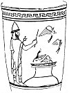

  
[Intangible Textual Heritage](../../index)  [Classics](../index) 
[Index](index)  [Previous](pgr03)  [Next](pgr05) 

------------------------------------------------------------------------

[Buy this Book at
Amazon.com](https://www.amazon.com/exec/obidos/ASIN/0691015147/internetsacredte)

------------------------------------------------------------------------

  
The First Two Chapters of *Prolegomena to the Study of Greek Religion*,
by Jane Ellen Harrison, \[1922\], at Intangible Textual Heritage

------------------------------------------------------------------------

p. 32

### CHAPTER II.

### THE ANTHESTERIA.

#### THE RITUAL OF GHOSTS AND SPIRITS.

OUR examination of the unpromising Diasia has so far led us to the
following significant, if somewhat vague, results. The festival in all
probability did not originally belong to Zeus, but to a being called
Meilichios, a snake god or demon. The worship of this being was
characterized by nightly ceremonies, holocausts which the sun might not
behold; it was gloomy in character, potent for purification. The name of
the festival is probably associated with *dirae*, curses, imprecations.

The Diasia, gloomy though it is, is a spring festival and its
significance will be yet more plainly apparent if we examine another,
*the* other spring festival of the Greeks, i.e. the Anthesteria, which
gives its name to the first spring month Anthesterion.

If we know little about the Diasia; about the Anthesteria [1](#fn_54) we know much. Apollodorus, quoted by
Harpocration, tells us that the whole festival collectively was called
*Anthesteria*, that it was celebrated in honour of Dionysos, and that
its several parts, i.e. its successive days, were known as Pithoigia
(cask-opening), Choes (cups), Chytroi (pots). The exact date of the
festival is fixed, the three successive days falling from the 11th to
the 13th of Anthesterion [2](#fn_55).

p. 33

On the first day, the 11th of Anthesterion, i.e. the Pithoigia,
Plutarch [1](#fn_56)' tells us 'they broached
the new wine at Athens. It was an ancient custom,' he adds, 'to offer
some of it as a libation before they drank it, praying at the same time
that the use of the drug (φαρμάκου might be rendered harmless and
beneficial to them.' This is a clear case of the offering of
first-fruits [2](#fn_57). Among his own people,
the Boeotians, Plutarch adds, 'the day was called the day of the Good
Spirit [3](#fn_58), the Agathos Daimon, and to
him they made offerings. The month itself was known as Prostaterios.'
The scholiast to Hesiod [4](#fn_59) tells us
that the festival was an ancestral one (ἐν τοῖς πατρίοις), and that it
was not allowable to hinder either household slaves or hired servants
from partaking of the wine.

The casks once opened, the revel set in and lasted through the next day
(the Choes or Cups) and on through the third (the Chytroi or Pots). The
day of the Choes seems to have been the climax, and sometimes gave its
name to the whole festival.

It is needless to dwell on all the details of what was in intent a three
days' fair. A 'Pardon' in the Brittany of to-day affords perhaps the
nearest modern analogy. The children have holidays, fairings are bought,
friends are feasted, the sophists get their fees, the servants generally
are disorganized, and every one down to the small boys, as many a
vase-painting tells us, is more or less drunk. There is a drinking
contest presided over by the King Archon, he who first drains his cup
gets a cake, each man crowns his cup with a garland and deposits the
wreath in keeping of the priestess of the sanctuary of Dionysos in the
Marshes. On the day of the *Cups* takes place the august ceremony of the
wedding of the wife of the King Archon to the god Dionysos. On that day
alone in all the year the temple of Dionysos is opened [5](#fn_60).

On the third day, the *Chytroi* or Pots, there was a dramatic
contest [6](#fn_61) known as Χύτρινοι,
Pot-contests. During this third day the revel went on;
Aristophanes [7](#fn_62) has left us the

p. 34

picture of the drunken mob thronging the streets at the holy Pot-Feast:

'O brood of the mere and the spring,  
 Gather together and sing  
    From the depths of your throat  
    By the side of the boat  
 Coäx, as we move in a ring.

 As in Limnae we sang the divine  
 Nyseïan Giver of Wine,  
    When the people in lots  
    With their sanctified Pots  
 Came reeling around my shrine.'

The scholiast on the *Acharnians* [1](#fn_63), a
play which gives us a lively picture of the festival, says that the
Choes and the Chytroi were celebrated on one day. The different days and
acts of the whole Anthesteria were doubtless not sharply divided, and if
each day was reckoned from sunrise to sunset confusion would easily
arise.

 

So far a cursory inspection clearly shows that the Anthesteria was a
wine-festival in honour of Dionysos. Moreover we have the definite
statement of Thucydides [2](#fn_64) that 'the
more ancient Dionysia were celebrated on the 12th day of the month
Anthesterion in the temple of Dionysos in the Marshes.' The reference
can only be to the Choes, so that the festival of the Choes seems
actually to have borne the name Dionysia. Harpocration [3](#fn_65) goes even further; he says, quoting
Apollodorus, that 'the whole month was sacred to Dionysos.'

A more searching examination of the sources reveals beneath the surface
rejoicings, as in the case of the Diasia, another and more primitive
ritual, and a ritual of widely different significance. It has escaped no
student of Greek festivals that through the Anthesteria there ran 'a
note of sadness.' Things were not altogether so merry as they seemed.
This has been variously explained, as due to the 'natural melancholy of
the spring,' or more recently as evidence of the fact that Dionysos had
his 'chthonic side' and was the 'Lord of souls.' A simpler explanation
lies at the door.

The clue to the real gist of the Anthesteria is afforded by

p. 35

a piece of ritual performed on the last day, the *Chytroi*. The Greeks
had a proverbial expression spoken, we are told, of those who 'on all
occasions demand a repetition of favours received.' It ran as follows:
'Out of the doors! ye Keres; it is no longer Anthesteria.' Suidas [1](#fn_66) has preserved for us its true
signification; it was spoken, he says, 'implying that in the Anthesteria
the ghosts are going about in the city.' From this fragmentary statement
the mandate, it is clear, must have been spoken at the close of the
festival, so we cannot be wrong in placing it as the last act of the
Chytroi.

The statement of Suidas in itself makes the significance of the words
abundantly clear, but close parallels are not wanting in the ritual of
other races. The Lemuria at Rome is a case in point. According to
Ovid [2](#fn_67) each father of a family as the
festival came round had to lay the ghosts of his house after a curious
and complex fashion. When midnight was come and all was still, he arose
and standing with bare feet he made a special sign with his fingers and
thumb to keep off any ghost. Thrice he washes his hands in spring water,
then he turns round and takes black beans into his mouth; with face
averted he spits them away, and as he spits them says, ' These I send
forth, with these beans I redeem myself and mine.' Nine times he speaks,
and looks not back. The ghost, they believe, picks them up and follows
behind if no one looks. Again he touches the water and strikes the brass
of Temesa and begs the ghost to leave his house. When nine times he has
said, 'Shades of my fathers, depart' (Manes exite paterni!),

p. 36

he looks back and holds that the rite has been duly done. We cannot
impute to the Anthesteria all the crude minutiae of the Lemuria, but the
content is clearly the same--the expulsion of ancestral ghosts. The
Lemuria took place not in the spring but in the early summer, May--a
time at which ceremonies of purification were much needed.

A second striking parallel is recorded by Mr Tylor [1](#fn_68). He says of a like Sclavonic custom, 'when
the meal was over the priest rose from the table and hunted out the
souls of the dead like fleas with these words: "Ye have eaten and drunk,
souls, now go, now go".' Dr Oldenberg [2](#fn_69) calls attention to another analogy. In
sacrifices in India to the dead the souls of ancestors are first
invoked, then bidden to depart, and even invited to return again after
the prescribed lapse of a month.

The formula used at the close of the Anthesteria is in itself ample
proof that the Anthesteria was a festival of All Souls; here at last we
know for certain what was dimly shadowed in the Diasia, that some
portion at least of the ritual of the month' Anthesterion was addressed
to the powers of the underworld, and that these powers were primarily
the ghosts of the dead. The evidence is not however confined to an
isolated proverbial formulary. The remaining ritual of the Chytroi
confirms it. Before they were bidden to depart the ghosts were feasted
and after significant fashion.

 

The scholiast on Aristophanes [3](#fn_70)
commenting on the words τοῖς ἱεροῖσι Χύτροισι, 'at the holy Pot-feast,'
explains the ceremonies as follows: 'The Chytroi is a feast among the
Athenians; the cause on account of which it is celebrated is explained
by Theopompos who writes thus: . . . . . "They have the custom of
sacrificing at this feast, not to any of the Olympian gods at all, but
to Hermes Chthonios"; and again in explaining the wordχύτρα, pot: "And
of the pot which all the citizens cook none of the priests tastes,

p. 37

they do this on the (13th) day"; and again: "Those present appease
Hermes on behalf of the dead".' The scholiast on another passage in
Aristophanes [1](#fn_71) says substantially the
same, but adds, again on the authority of Theopompos, that the practice
of cooking the dish of seeds was observed by those who were saved from
the deluge on behalf of those who perished. The deluge is of course
introduced from a desire to get mythological precedent; the
all-important points are that the χύτρα, the dish of grain and seeds,
was offered to none of the Olympians, not even to Dionysos in whose
honour the festival was ostensibly celebrated, but only to Hermes
Chthonios, Hermes of the Underworld, and that of this sacrifice *no man
tasted*. It was no sacrifice of communion, but like the holocaust made
over utterly to dread chthonic powers, and behind this notion of
sacrifice to the underworld deities lay the still earlier notion that it
was dead men's food, a supper for the souls.

Before we leave the χύτρα it is necessary to examine more precisely the
name of the day, Chytroi. August Mommsen [2](#fn_72) has emphasized the fact, too much
neglected, that the name of the festival is masculine, οἱ χύτροι not αἱ
χύτραι. The feminine form χύτραι means pots artificially made; the
masculine form χύτροι, which occurs far less frequently, means in
ordinary parlance natural pots, i.e. holes in the ground.
Pausanias [3](#fn_73) speaks of a certain
natural bath at Thermopylae which the country people called 'the Chytroi
of the women'; and Herodotos [4](#fn_74)
describes it in the same terms. Theophrastos [5](#fn_75) in his *History of Plants* speaks of a
certain plant as growing in a place between the Kephisos and the Melas,
the place being called Pelekania, i.e. certain hollows in the marsh, the
so-called Pot-holes.' Hesychius [6](#fn_76),
interpreting οἱ χύτρινοι, says they are 'the hollow places of the earth
through which springs come up.' The word κολυμβήθρα itself, in classical
Greek a natural pool, became in mediaeval Greek a font, and it may be

p. 38

noted that the natural chasms that occur in western Yorkshire still
locally bear the name of 'Pots.'

It is possible therefore that the festival took its name from natural
holes in the ground in the district of the Limnae where it was
celebrated, a district to this day riddled with Turkish cisterns made of
great earthen jars (πίθοι). Such holes may have been used for graves,
and were in many parts of Greece regarded as the constant haunt of
ghosts going up and down. They were perhaps the prototypes of the
'chasms in the earth' seen in the vision of Er [1](#fn_77). Near akin were the megara or chasms of
Demeter at Potniae [2](#fn_78), and the clefts
on and about the Pnyx where the women celebrated the Thesmophoria ().
Such chasms would be the natural sanctuaries of a Ge and ghost cult.

It is obvious that the two forms χύτροι and χύτραι would easily pass
over into each other, and it is hard to say which came first. It is also
to be noted that, though the masculine form more often means natural
hole, it is also used for artificial pot. Pollux [3](#fn_79), in discussing 'the vessels used by
cooks,' says that when Delphilos speaks of the big pot (χύτρον μέγαν) at
the cook's, he clearly means the χύτρα, not the foot-pan (χυτρόμοδα).
Though the form χύτροι ultimately established itself, the associations
of χύτρα, artificial pot, seem to have prevailed, and these associations
are important and must be noted.

Hesychius [4](#fn_80) says that by φαρμακή is
meant the χύτρα which they prepared for those who cleansed the cities.
From the scholiast on the *Choephoroi* of Aeschylus [5](#fn_81) we learn that the Athenians purified their
houses with a censer made of a pot; 'this they threw away at the meeting
of three ways and went away without turning back: Here we have of course
the origin of 'Hecate's suppers.' These were primarily not feasts for
the goddess but purification ceremonies, of which, as no mortal might
taste them, it was supposed an infernal goddess partook. The day of the
Chytroi was a day of such purifications. From some such notion arose the
Aristophanic word ἐγχυτρίζειν, 'to pot,' i.e. to utterly ruin and
destroy, to make away with. The scholiast [6](#fn_82) explains it as

p. 39

referring to the practice of exposing children, but Suidas [1](#fn_83) knows of another meaning; he says the
ἐγχυτρίστριαι were those 'women who purified the unclean, pouring upon
them the blood of the victim,' and also those who 'poured libations to
the dead,' those in a word who performed ceremonies of placation and
purgation.

 

It is curious that, though most modern writers from Crusius onwards have
recognised that the Chytroi was a *dies nefastus* and in the main a
festival of ghosts, this day has been separated off from the rest of the
Anthesteria, and the two previous days have been regarded as purely
drinking festivals:--the Pithoigia the opening of the wine-cask, the
Choes the drinking of the wine-cups. And yet for the second day, the
Choes, literary testimony is explicit. Spite of the drinking contest,
the flower-wreathed cups and the wedding of Dionysos, all joyful
elements of the service of the wine-god, the Choes was a *dies
nefastus*, an unlucky day, a day to be observed with apotropaic
precautions. Photius [2](#fn_84), in explaining
the words μιαρὰ ἡμέρα, 'day of pollution,' says such a day occurred 'in
the Choes in the month of Anthesterion, in which (i.e. during the Choes)
they believed that the spirits of the dead rose up again. From early
morning they used to chew buckthorn and anointed their doors with
pitch.' Buckthorn, known to modern botanists as *Rhamnus catharticus*,
is a plant of purgative properties. The ancient Athenian, like the
modern savage, believed that such plants have the power of keeping off
evil spirits, or rather perhaps of ejecting them when already in
possession: Chewing a substance was naturally a thorough and efficient
way of assimilating its virtues. The priestess of Apollo chewed the
laurel leaf. It seems possible that she may have primarily had to do
this rather as a means of ejecting the bad spirits than to obtain
inspiration from the good. Fasting is a substantial safe-guard, but
purgation more drastically effective. The prophylactic properties of
*rhamnus*, buckthorn, were well known to the ancients. Dioscorides [3](#fn_85) in his *Materia Medica* 

p. 40

writes, 'it is said that branches of this plant attached to doors or
hung up outside repel the evil arts of magicians.' Possibly, in addition
to the chewing of buckthorn, branches of it were fastened to doors at
the festival of the Choes, and served the same purpose as the pitch.
Pitch, Photius tells us in commenting on *rhamnus*, was on account of
its special purity used also to drive away sprites at the birth of a
child--always a perilous moment [1](#fn_86)

It is not easy to imagine an enlightened citizen of the Athens of the
fifth century B.C., an Aeschylus, a Pericles, chewing buckthorn from
early dawn to keep off the ghosts of his ancestors, but custom in such
matters has an iron hand. If the masters of the house shirked the
chewing of buckthorn, the servants would see to it that the doors were
at least anointed with pitch; it is best to be on the safe side in these
matters, and there is the public opinion of conservative neighbours to
be considered. Be this as it may, it is quite clear that the day of the
*Choes* was a day of ghosts like the day of the *Chytroi*.

But, if the ceremonies of the Choes clearly indicate the 'unlucky'
nature of the day, what is to be made of the name? Nothing, as it
stands. *Choes*, *Cups*, are undeniably cheerful. But, as in the case of
Chytroi, there *may* have been a confusion between approximate forms;
the two words χοή, funeral libation, and χοῦς, cup, have a common stem
χοϝ. May not χόες have superimposed itself on χοαί, wine-cups upon
funeral libations? A scholiast on Aristophanes [2](#fn_87) seems to indicate some such a
*contaminatio*. In explaining the word χοάς, he says the meaning is
'pourings forth, offerings to the dead or libations. An oracle was
issued that they must offer libations (χοάς) yearly to those of the
Aetolians who had died, and celebrate the festival so called.' Here the
name of a festival Χοάς is oxytone, and though we cannot

p. 41

assume that it was identical with the Athenian Choes, it looks as if
there was some confusion as to the two analogous forms.

If we view the Choes as Χοαί, the Cups as *Libations*, the anomalous
and, as it stands, artificial connection of Orestes with the festival
becomes at once clear. At the drinking bout of the Choes, we learn from
Athenaeus [1](#fn_88) and other authorities, the
singular custom prevailed that each man should drink by himself. A
mythological reason was sought to account for this, and the story was
told [2](#fn_89) that Orestes, polluted by the
blood of his mother, came to Athens at the time of the celebration of
the Choes. The reigning king, variously called Pandion and Phanodemus,
wished to show him hospitality, but religious scruple forbade him to let
a man polluted enter the Sanctuaries or drink with those ceremonially
clean. He therefore ordered the Sanctuaries to be shut and a measure of
wine (χοῦς) to be set before each man severally, and bade them, when
they had finished drinking, not to offer up the garlands with which they
had been crowned in the Sanctuaries, because they had been under the
same roof with Orestes; but he bade each man place his wreath round his
own cup, and so bring them to the priestess at the precinct of the
Limnae. That done, they were to perform the remaining sacrifices in the
Sanctuary. From this, Athenaeus adds, the festival got the name of
*Cups*. The mad Orestes in the *Iphigenia in Tauris* [3](#fn_90) tells the same tale and naïvely states
that, though he was hurt by the procedure, he dare not ask the reason,
knowing it all too well.

The whole account is transparently aetiological. Some mythological
precedent is desired for the drinking bout of the Choes, based as it was
on a ceremony of funeral libations; it is sought and found or rather
invented in the canonical story of Orestes, and he is made to say in a
fashion almost too foolish even for a madman:

'And this I learn, that my mishaps became  
 A rite for the Athenians; and Pallas' folk  
 Have still this custom that they reverence  
 The Choan vessel.'

If we suppose that the Cups (χόες) were originally Libations (χοαί), the
somewhat strained punctilio of the host becomes at least intelligible.
Orestes is polluted by the guilt (ἄγος) of his

p. 42

mother's blood, he finds the people in the Limnae [1](#fn_91), close to the Areopagos, celebrating the
Χοαί, the libations to the dead; till he is purified from kindred blood
he cannot join: all is simple and clear.

If the Choes were in intent χοαί, the Cups *Libations*, the ceremony has
an interesting parallel in a rite performed at the Eleusinian mysteries.
Athenaeus [2](#fn_92), in discussing various
shapes of cups says: 'The plemochoë is an earthen vessel shaped like a
top that stands fairly steady; some call it, Pamphilos tells us, the
cotyliscus. And they use it at Eleusis on the last day of the mysteries,
which takes its name Plemochoai from the cup. On this day they fill two
plemochoae and set them up, the one towards the East, the other towards
the West, and pronounce over them a magic formula. The author of the
*Peirithous* mentions them, whether he be Ktesias the Tyrant or
Euripides, as follows:

"That these plemochoae down the Chthonian chasm  
 With words well-omened we may pour."'

It is at least significant that a compound of the word χοή should both
give its name to a festival day and to a vessel used in chthonic ritual.

The Chytroi and Choes then bear unmistakeably a character of gloom, and
in their primary content are festivals of ghosts. But what of the
Pithoigia? Surely this day is all revel and jollity, all for Dionysus?

 

Had we been dependent on literature alone, such would have been our
inevitable conclusion. In Plutarch's account of the Pithoigia ([p.
33](#page_33)), the earliest and fullest we possess, there is no hint of
any worship other than that of the wine-god, no hint of possible gloom.
Eustathius [3](#fn_93) indeed tells of a
Pithoigia or Jar-opening which was 'not of a festal character, but in
every respect unlucky,' but this is the Pithoigia, the Jar-opening, of
Pandora. Here we have a hint that a Pithoigia need not be an opening of
wine-jars; there are other jars, other openings, but save for the
existence of one small fragile monument the significance of the hint
would have escaped us.

p. 43

In the vase-painting in [fig. 7](#img_007) from a lekythos in the
University Museum of Jena [1](#fn_94) we see a
Pithoigia

<table data-align="RIGHT">
<colgroup>
<col style="width: 100%" />
</colgroup>
<tbody>
<tr class="odd">
<td data-valign="CENTER"><a href="img/007.jpg"> 
Click to enlarge</a> 
FIG. 7 
</td>
</tr>
</tbody>
</table>

of quite other and more solemn intent. A large *pithos* is sunk deep
into the ground. It has served as a grave. In primitive days many a man,
Diogenes-like, lived the ' life of the jar' ζωὴ πίθου), but not from
philosophy, rather from dire necessity. During the Peloponnesian war,
when the city was crowded with refugees, a jar (πιθάκνη) was a welcome
shelter [2](#fn_95). A man's home during his
life is apt to be his grave in death. In the Dipylon Cemetery at Athens,
at Aphidna [3](#fn_96), at Corfu, at Thoricus,
and in many another burying place, such grave *pithoi* have come to
light. From the grave-jar in [fig. 7](#img_007) the lid has been
removed; out of it have escaped, fluttering upward, two winged Keres or
souls, a third soul is in the act of emerging, a fourth is diving
headlong back into the jar. Hermes Psychopompos, with his magic staff in
his hand, is evoking, *re*voking the souls. The picture is a speaking
commentary on the Anthesteria; we seem to hear the mandate Out of the
doors! ye souls; it is no longer Anthesteria!' The Pithoigia of the
Anthesteria is the primitive Pithoigia of the *grave*-jars, later
overlaid by the Pithoigia of the wine-jars.

The vase-painting in [fig. 7](#img_007) must not be regarded as an
actual conscious representation of the Athenian rite performed on the
first day of the *Anthesteria*. It is more general in content; it is in
fact simply a representation of ideas familiar to every Greek, that the
*pithos* was a grave-jar, that from such grave-jars souls

p. 44

escaped and to them necessarily returned, and that Hermes was
Psychopompos, Evoker and Revoker of souls. The vase-painting is in fact
only another form of the scene so often represented on Athenian white
lekythoi, in which the souls flutter round the grave-stele. The grave
jar is but the earlier form of sepulture; the little winged figures, the
Keres, are identical in both classes of vase-painting.

The nature of these Keres will be further analysed when we come to the
discussion of primitive demonology. For the present it is enough to note
that the Keres in the vase-paintings and the Keres of the Anthesteria
are regarded as simply souls of dead men, whereas the little winged
phantoms that escape from Pandora's jar are indeed ghosts, but ghosts
regarded rather as noisome sprites than as spirits; they are the source
of disease and death rather than dead men's souls. The jar of Pandora is
not so much a grave as a store-house of evil; the *pithos* as
store-house not only of wine but of grain and all manner of provisions
was familiar to the Greeks. The ordinary *pithos* was pointed at the
base and buried permanently in the earth like a Turkish cistern; a row
of such pithoi, like those recently unearthed at Cnossus, might serve
equally as a wine-cellar or a granary or a cemetery.

 

The attributes of Hermes in the vase-painting in [fig. 7](#img_007)are
noticeable. In one hand he holds his familiar herald's staff, the
kerykeion. But, and this is the interesting point, he is not using it;
it is held in the left hand, inert; it is merely attributive, present
out of convention. The real implement of his agency in revoking the
souls is held uplifted in the right hand; it is his rhabdos, his magic
wand.

This *rhabdos* is, I think, clearly to be distinguished from the
kerykeion, though ultimately the two became contaminated. The kerykeion
or herald's staff is in intent a king's sceptre held by the herald as
deputy; it is a staff, a walking-stick, a βάκτρον, by which you are
supported; the *rhabdos* is a simple rod, even a pliable twig, a thing
not by which you are supported but with which you sway others. It is in
a word the enchanter's wand.

It is with a rhabdos that Circe [1](#fn_97)
transforms the comrades of

p. 45

\[paragraph continues\] Odysseus into
swine; it is as magical as the magic potion they drink:

'Straight with her rhabdos smote she them and penned
them in the sties.'

With the rhabdos Hermes [1](#fn_98) led the
ghosts of the slain suitors to Hades. He held in his hand

'His rhabdos fair and golden wherewith he lulls to
rest  
 The eyes of men whoso he will, and others by his hest  
 He wakes from sleep. He stirred the ghosts; they followed to their
doom  
 And gibbered like the bats that throng and gibber in the gloom.'

This magic wand became the attribute of all who hold sway over the dead.
It is the wand, not the sceptre, that is the token of life or death, as
Pindar [2](#fn_99) shows:

'Nor did Hades the king  
 Forget his wand to wave  
 Whereby he doth bring  
 Shapes of men dying  
 Adown the hollow roadway of the grave.'

The rhabdos as magic wand was πεισίβροτος, *enchanter* of the dead,
before it became as sceptre πεισίβροτος, *ruler* of mortals.

Eustathius tells us in the passage already discussed [3](#fn_100), that the kerykeion was also called
πομπός, conductor, and that it was carried in the hands of those who
performed ceremonies of purification. He is trying, it will be
remembered, to derive the words διοπομπεῖν and ἀποδιοπομπεῖν. When an
ancient author is trying to derive words, we are bound to accept his
statements only with the utmost caution; still in this particular
instance there seems no reason for suspecting the statement that the
kerykeion was called πομπός; it is dragged in quite gratuitously, and
does not help out the proposed derivation. What Eustathius says is this:
'At the end of the month Maimakterion they perform ceremonies of
sending, among which was the carrying of the magic fleece, and there
take

p. 46

place then throwings out of purifications at the crossways, and they
hold in their hands the *pompos* (i.e. conductor), which they say is the
kerykeion, the attribute of Hermes.' The object of the whole ceremony is
'to send out polluted things.' It is, I think, significant that the
kerykeion, or rather to be strictly accurate the rhabdos [1](#fn_101), was carried in apotropaic ceremonies,
presumably with a view to exorcise bad spirits, which as will appear
later were regarded as the source of all impurities. It is the other
face of revocation; the rhabdos is used either for the raising or the
laying of ghosts, for the induction (ἐπαγωγή) of good spirits, for the
exorcism (ἀποτροπή) of bad.

In discussing the Anthesteria on a previous occasion [2](#fn_102), I felt confident that in the opening of
the grave-jars we had the complete solution of the difficulty of the
unlucky character of the day Pithoigia. It seems to me now in the light
of further investigation that another ritual element may have gone to
its determination.

Plutarch [3](#fn_103), in discussing the nature
of the sacred objects committed to the care of the Vestal Virgins, makes
the following notable statement: 'Those who pretend to have most special
knowledge about them (i.e. the Vestal Virgins) assert that there are set
there two jars (πίθοι) of no great size, of which the one is open and
empty, the other full and sealed up, and neither of them may be seen
except by these all-holy virgins. But others think that this is false,
and that the idea arose from the fact that the maidens then placed most
of their sacred things in two jars, and hid them underground below the
temple of Quirinus, and that the place even now is called from that by
the title *Pithisci* (Doliola).' We have two other notices of these
Doliola. Varro [4](#fn_104) says: 'The place
which is called Doliola is at the Cloaca Maxuma, where people are not
allowed to spit. It is so called from the jars beneath the earth. Two
accounts are given of these jars: some

p. 47

say they contain the bones of dead bodies, others that after the death
of Numa Pompilius certain sacred objects (religiosa quaedam) were buried
there.' Festus [1](#fn_105) gives substantially
the same account, but he says that the sacred objects were buried there
when the Gauls invaded the city.

Of jars containing 'sacra' we have in Greece no knowledge, but it is
significant to find that Zeus, who was the heir to so much antique
ritual, had on his threshold in Olympus two jars, one containing good
the other evil [2](#fn_106):

'Jars twain upon Zeus' threshold ever stood;  
 One holds his gifts of evil, one of good.'

With some such notion as that of the Pithoigia must have been connected
the ceremony of the opening of the *mundus* or round pit on the
Palatine. Festus [3](#fn_107) tells us that on
three days in the year, August 24, October 5, November 6, the *lapis
manalis* that covered it was removed. Varro, quoted by Macrobius [4](#fn_108), adds: 'when the *mundus* is open, the
gate of the doleful underworld gods is open.'

 

It has been shown that the ritual of each of the several days points
determinedly ghost-wards. The names in each case *admit* at least of
chthonic interpretation. It remains to examine the collective name
*Anthesteria*.

The ancients sought and found what was to them a satisfactory etymology.
Istros, writing in the third century B.C. and quoted by Harpocration,
says that Anthesterion is the blossoming month because then 'the most of
the things that spring from the earth blossom forth [5](#fn_109).' The *Etymologicon Magnum* [6](#fn_110) offers an easy-going alternative: feast
and month bear their names either because the earth then began to
blossom, or because they offered flowers at the festival.

It was not the habit of those days to trouble about 'verb-stems' and
'nouns of the agent in τηρ,' but it is surprising to find that the
dubious guess hazarded by Istros should have passed so long

p. 48

unchallenged by modern science, the more so as flowers have but a
general and accidental connection with the ritual of the feast. Are
scholars really content with an etymology that makes of the Anthesteria
the festival of those who 'did the flowers'?

In a recent paper in the *Hellenic Journal* [1](#fn_111) Dr A. W. Verrall has faced the
difficulty and offered a new solution. The names of festivals, he points
out, are no exception to the rule that nouns in τηριο are normally
formed from verb-stems through the 'noun of the agent' in τηρ, and take
their sense from the action described by the verb, as σωτήριος,
λυτήριος, βουλευτήριον. In like fashion the names of festivals ending in
τηρια describe the action in which the ceremony consisted, or with which
it was chiefly connected. Thus ἀνακλητήρια is a feast or ceremony of
ἀνάκλησις, ἀνακαλυπτήρια of ἀνακάλυψις and so on. *Prima facie* then a
derivation of *Anthesteria* should start from the assumption that the
stem is verbal.

'But we need not assume that the verbal stem is ἀνθεσ- Perhaps ἀνθεσ-
itself needs analysis; and for the first syllable there is an obviously
possible origin in the preposition ἀν- (ἀνά), of which so many examples
(e.g. = ἀνάθεμα) are preserved in the poets. The verb-stem will then be
θεσ-, which is in fact a verb-stem and has more than one meaning. The
meaning which would perhaps in any case have suggested itself first, and
which now seems especially attractive, is that which appears in the
archaic verb θέσασθαι or θέσσασάθαι *to pray* or *pray for* [2](#fn_112), and in the adjectives πολύθεστος and
ἀπόθστος. Prayers and invocations addressed to the dead were a regular
part of the proceedings by which they were brought back to the world of
the living. The compound would, after the analogy of άνακαλεῖν and the
like, bear the sense to *raise by prayer* or *to recall by prayer*,
literally "to pray up " or "pray back." And ἀνθεστήρια, derived from
ἀναθέσσασθαι, would be the *feast of revocation*, the name, as usual,
signifying the action in which the ceremony consisted and which was the
object of it [3](#fn_113).'

In connection with this new and illuminating etymology, it is
interesting to note that even in their misguided derivation from

p. 49

\[paragraph continues\] the ancients
themselves lay stress not so much on the flowers as on the rising
up [1](#fn_114), the ἀνθεῖν ἐκ τῆς γῆς. Under
the word Ἄνθεια the *Etymologicon Magnum* says 'a title of Hera when she
sends up (ἀνίησι) fruits,' where there seems a haunting of the true
meaning though none of the *form* [2](#fn_115).

Dr Verrall declines to assert positively the derivation of *Anthesteria*
he propounds, but a second philological argument brings certain
conviction. Mr R. A. Neil suggests that the root which appears in Greek
as θες may appear as *fes fer* in Latin. This gives us the delightful
equation or rather analogy ἀν-θεσ-τήρια, *in-fer-iae*. Of course
*inferiae* is usually taken as from *inferi*, *infra* etc., but no Latin
word ought to have medial *f* except when preceded by a separable
prefix. To make certainty more certain we have the Feralia, the festival
of All Souls, kept from the 13th to the 21st of the month of Fe(b)ruary.
The month of *purification* is the month of rites to the dead, in a word
*purgation is the placation of souls*. This is true for Latin and Greek
alike and will emerge more clearly when we come to study in detail the
ritual of the month of February.

#### ANTHESTERION AND FEBRUARY.

The general analogy between the months of Anthesterion and February, and
the fact that both alike were unlucky and given over to the service of
the dead, was clear to the ancients themselves. The scholiast on
Lucian's Timon [3](#fn_116), commenting on the
word *Diasia*, says: 'The day is unlucky . . . there were among the
Greeks certain days which brought with them complete idleness

p. 50

and cessation of business, and which were called unlucky (ἀποφράδες). On
these days no one would accost any one else, and friends would
positively have no dealings with each other, and even sanctuaries were
not used. These times were so accounted on the analogy of the month of
February, when also it was the custom to sacrifice to those below, and
all that month was dedicated to the dead and accompanied by gloom,
everything going on in an unusual fashion just as the Athenians
celebrated the Diasia in gloom.' Clearly to the scholiast the Diasia is
but one element of a month given over to the dead.

The meaning of Anthesterion, the significance of its ceremonies, have
been effectively overlaid by the wine-god and his flower garlands, but
with the Romans there was no such superposition and consequently no
misunderstanding. They clearly realized two things, that February was
the month of the dead, and that it was the month of purification.
Plutarch in his *Roman Questions* [1](#fn_117)
asks 'Why was Decimus Brutus wont to sacrifice to the dead in December,
whereas all other Romans offered libations and sacrifices to the dead in
the month of February?' In his twenty-fifth Question [2](#fn_118), while discussing the reasons why the
days following respectively the Calends, Nones and Ides of each month
were unlucky, he tells us that the Romans 'used to consecrate the first
month of the year to the Olympian gods, but the second to the gods of
the earth, arid in this second month (February) they were wont to
practise certain purifications and to sacrifice to the dead.'
Athenaeus [3](#fn_119) states that 'Juba the
Mauretanian said that the month of February was so called from the
terrors of the lower world, with regard to means taken for riddance from
such alarms at the time when the winter is at its height, and it is the
custom to offer libations to the dead on several days.' Juba the
Mauretanian must have known quite well that in February the winter was
not at its height. He states correctly the fact that February was a
month devoted to ceremonies for the riddance of terrors from the under-

p. 51

world, but carelessly adds an impossible reason for the selection of
this particular month.

 

Ovid is of all witnesses the most weighty because his testimony is in
part unconscious. In the opening words of the second book of the
*Fasti* [1](#fn_120), after an invocation to
Janus, he goes straight to the question of what the Romans meant by the
word *februum*; he notes that the term was applied to many things, wool,
a branch from a pine-tree, grain roasted with salt, and finally
concludes that any thing by which the soul was purged was called by his
rude ancestors *februum*.'

'Denique quodcumque est, quo pectora nostra
piantur,  
   Hoc apud intonsos nomen habebat avos.'

The month he feels sure got its name from these 'februa' or
purifications, but he asks 'was it because the Luperci purified all the
soil with the strips of skin and accounted that a purification or
atonement, or was it because when the *dies ferale*s were accomplished
then *owing to the fact that the dead were appeased* there was a season
of purity?'

'Mensis ab his dictus secta quia pelle Luperci  
  Omne solum lustrant idque piamen habent?  
Aut quia placatis sunt tempora pura sepulcris,  
  Tunc cum ferales praeteriere dies?'

Both the ceremonials, the Lupercalia and the Feralia, were, he knows,
cathartic: that Fe(b)rua and Feralia were etymologically and
significantly the same naturally he does not guess. Still less could he
conjecture that etymologically February and Anthesterion are in
substance one.

The two great February festivals [2](#fn_121)
to which Ovid alludes are of course the Feralia and the Lupercalia,
celebrated respectively on the 21st and 15th of February.

The Feralia was but the climax of a series of days beginning on Feb.
13th and devoted to ceremonies of the worship of ancestors, Parentalia.
It is curious that, though the Lemuria (May 9-13) were marked as
Nefasti, none of the days of the Parentalia were so marked: still from
the 13th to the 21st marriages were forbidden,

p. 52

temples closed, and magistrates appeared without their insignia; clearly
there was some lingering dread of ghosts that might be about. Parentalia
and Feralia alike were ceremonies wholly devoted to the placation of
ghosts.

In the Lupercalia, on the other hand, it is purification rather than
placation that is the prominent feature in the rites. Much in the
Lupercalia is obscure, and especially the origin of its name, but one
ritual element is quite certain. Goats and a dog were sacrificed, two
youths girt themselves in the skins of the slain goats, they held in
their hands strips of the hides of the victims. They ran round a certain
prescribed portion of the city, and as they ran smote the women they met
with the strips of shin. These strips of skin were among the things
known as *februa*, *purifiers*, and by their purifying power they became
fertility charms.

'Forget not in your speed, Antonius,  
 To touch Calpurnia, for our elders say  
 The barren touchèd in this holy chase  
 Shake off their sterile curses [1](#fn_122).'

There has been much needless discussion as to whether in ceremonies
where striking and beating occur the object is to drive out evil spirits
or to stimulate the powers of fertility. Primitive man does not so
narrowly scrutinize and analyse his motives. To strike with a sacred
thing, whether with a strip of skin from a victim or a twig from a holy
tree, was to apply what the savage of to-day would call 'good medicine.'
Precisely how it worked, whether by expulsion or impulsion, is no
business of his.

When the Catholic makes the sacred sign of the Cross over his food, is
he, need he be, quite clear as to whether he does it to induce good or
to exorcise evil? The peasant mother of to-day may beat her boy partly
with a view to stirring his dormant moral impulses, but it is also, as
she is careful to explain, with intent to 'beat the mischief out of
him.' In the third Mime of Herondas [2](#fn_123) the mother is explicit as to the
expulsive virtue of beating. Her boy is a gambler and a dunce, so she
begs the schoolmaster to

'Thrash him upon his shoulders till his spirit,  
 Bad thing, is left just hovering on his lips.'

p. 53

She is in the usual primitive dilemma: his spirit is bad but it is his
life; it is kill and cure.

The strips of goat-skin were *februa* [1](#fn_124), purifying, and thereby fertility
charms. As such they cast sudden illumination on the 'magic fleece'
already discussed. The animal sacrificed, be it sheep or goat or dog, is
itself a placation to ghosts or underworld powers; hence its skin
becomes of magical effect: the deduction is easy, almost inevitable. The
primary gist of the sacrifice is to appease and hence keep off evil
spirits; it is these evil spirits that impair fertility: in a word
*purification is the placation of ghosts*.

The question 'What was purity to the ancients?' is thus seen to be
answered almost before it is asked. Purity was not spiritual purity in
our sense--that is foreign to any primitive habit of thought, nor was it
physical purity or cleanliness--it was possible to be covered from head
to foot with mud and yet be ceremonially pure. But so oddly does the
cycle of thought come round, that the purity of which the ancients knew
*was*, though in a widely different sense, *spiritual* purity, i.e.
freedom from bad spirits and their maleficent influence. To get rid of
these spirits was to undergo purification. In the month of February and
Anthesterion the Roman or Greek might, *mutatis mutandis*, have chanted
our Lenten hymn:

'Christian, dost thou see them  
 On the holy ground  
 How the hosts of Midian  
 Prowl and prowl around?  
 Christian, up and smite them!'

Till the coming of the new religion of Dionysos, the Greek notion of
purity seems not to have advanced beyond this negative combative
attitude, this notion of spiritual forces outside and against them.

 

The question yet remains 'Why did this purification need to take place
in the spring?' The answer is clear. Why did our own near ancestors have
spring cleanings?

'Winter rains and ruins are over  
And all the season of snows and sins, . . .  
While in green underwood and cover  
*Blossom by blossom the Spring begins*.'

p. 54

Winter is a reckless time with its Christmas and its Saturnalia. There
is little for the primitive agriculturist to do and less to fear. The
fruits of the earth have died down, the gods have done their worst. But
when the dead earth begins to awake and put forth bud and blossom, then
the ghosts too have their spring time, then is the moment to propitiate
the dead below the earth. Ghosts were placated that fertility might be
promoted, fertility of the earth and of man himself.

 

It is true that the primitive rites of February and Anthesterion, of
Romans and Greeks, were in the main of 'riddance.' The ghosts, it would
seem from the ritual of the Choes and Chytroi, the chewing of buckthorn,
anointing with pitch, the mandate to depart, were feared as evil
influences to be averted; but there is curious evidence to show that at
the time of the Anthesteria the coming of the ghosts was regarded as a
direct promotion of fertility. Athenaeus [1](#fn_125), quoting the Commentaries of
Hegesander [2](#fn_126), tells us of a curious
tradition among the natives of Apollonia in Chalkis. 'Around Apollonia
of Chalkidike there flow two rivers, the Ammites and the Olynthiacus and
both fall into the lake Bolbe. And on the river Olynthiacus stands a
monument of Olynthus, son of Herakles and Bolbe. And the natives say
that in the months of Elaphebolion and Anthesterion the river rises
because Bolbe sends the fish apopyris to Olynthus, and at that season an
immense shoal of fish passes from the lake to the river Olynthus. The
river is a shallow one, scarcely overpassing the ankles, but
nevertheless so great a shoal of the fish arrives that the inhabitants
round about can all of them lay up sufficient store of salt fish for
their needs. And it is a wonderful fact that they never pass by the
monument of Olynthus. They say that formerly the people of Apollonia
used to perform the accustomed rites to the dead in the month of
Elaphebolion, but now they do them in Anthesterion, and that on this
account the fish come up in those months only in which they are wont to
do honour to the dead.' Here clearly the dead hero is the source of
national wealth, the honours done him are the direct impulsion to
fertility. The gloomy rites of *aversion* tend to pass over into a
cheerful, hopeful ceremonial of 'tendance.'

p. 55

To resume, the Anthesteria was primarily a Feast of All Souls: it
later [1](#fn_127) became a revel of Dionysos,
and at the revel men wreathed their cups with flowers, but, save for a
vague and unscientific etymology, we have no particle of evidence that
the Anthesteria was ever a Feast of Flowers. The transition from the
revocation of ghosts with its dire association to a drunken revel may
seem harsh, but human nature is always ready for the shift from Fast to
Feast, witness our own Good Friday holiday.

### THE RITUAL OF Ἐναγισμοί.

In the light of the ceremonies of the spring month February and
Anthesterion, it is now possible to advance a step in the understanding
of Greek ritual terminology and through it of Greek religious thought.

In the first chapter the broad distinction was established between
sacrifice to the Olympians of the upper air--sacrifice which involved
communion with the worshipper, and sacrifice to chthonic powers which
forbade this communion--in which the sacrifice was wholly made over to
the object of sacrifice. The first, the Olympian sacrifice, is expressed
by two terms, θύειν and ἱερεύειν; the second, if the sacrifice is burnt,
by ὁλοκαυτεῖν, and as will presently be seen by σφάζειν, also more
generally by the term ἐναγίζειν.

As regards the Olympian terms, it is only necessary to say definitely
what has already been implied, that θύειν strictly is applicable only to
the portion of the sacrifice that was actually burnt with a view to
sublimation, that it might reach the gods in the upper air; whilst
ἱερεύειν applies rather to the portion unburnt, which was sacred indeed,
as its name implies, to the gods, but was actually eaten in communion by
the worshipper. With the growing prevalence of burnt sacrifice and the
increasing popularity of the Olympians and their service, the word θύειν
came to cover the whole field of sacrifice, and in late and careless
writers is used for any form of sacrifice burnt or unburnt without any
consciousness of its primary meaning.

The term ἱερεύειν is strictly used only of the sacrifice of an animal;
ἱερεῖον is the animal victim. Among the Homeric Greeks

p. 56

sacrifice and the flesh feast that followed were so intimately connected
that the one almost implied the other; the ἱερεῖον, the animal victim,
was the material for the κρεοδαισία, the flesh feast. So prominent in
the Homeric mind was the element of feasting the worshipper that the
feast is sometimes the only stated object. Thus Odysseus [1](#fn_128) gives command to Telemachus and his
thralls:

'Now get you to my well-built house, the best of all
the swine  
 Take you and quickly *sacrifice* that straightway we may dine.'

Here the object is the meal, though incidentally sacrifice to the gods
is implied. It is not that on the occasion of sacrifice to the gods man
solemnly communicates, but that when man would eat his fill of flesh
food he piously remembers the gods and burns a little of it that it may
reach them and incline their hearts to beneficence.

In the Homeric sacrifice there is communion, but not of any mystical
kind; there is no question of partaking of the life and body of the god,
only of dining with him. Mystical communion existed in Greece, but, as
will be later seen, it was part of the worship of a god quite other than
these Homeric Olympians, the god Dionysos.

 

Before we leave the ἱερεῖον, the animal sacrificed and eaten, one word
of caution is necessary. It is sometimes argued that animal sacrifice,
as contrasted with the simpler offerings of grain and fruits, is the
mark of a later and more luxurious social state. Such was the view of
Porphyry [2](#fn_129) the vegetarian.
Flesh-eating and flesh sacrifice is to him the mark of a cruel and
barbarous licence. Such too was the view of Eustathius [3](#fn_130). In commenting on the of οὐλοχύται, the
barley grain scattered, he says, 'after the offering of barley grain
came sacrifices and the eating of meat at sacrifices, because after the
discovery of necessary foods the luxury of a meat diet and imported
innovations in food were invented.' As a generalization this is false to
facts; it depends on the environment of a race whether man will first
eat vegetable or animal food; but as regards the particular case of the
Greeks themselves, the observations of Porphyry and Eustathius are
broadly true. The primitive

p. 57

dwellers in Greece and round the Mediterranean generally lived mainly on
vegetarian diet, diversified by fish, and the custom of flesh-eating in
large quantities was an innovation brought from without [1](#fn_131) (ἐπείσακτον). Athenaeus [2](#fn_132) in his first book discusses the various
kinds of food, and dwells with constant astonishment on the flesh-eating
habits of the Achaean heroes of Homer. He quotes the comic poet Eubulos
as asking

'I pray you, when did Homer ever make  
 An Achaean chief eat fish? ’tis always flesh,  
 And roasted too, not boiled.'

Achaean chiefs, he notes--and in this they resemble their northern
descendants--'do not care for made-dishes, kickshaws and the like. Homer
sets before them only roast meat, and for the most part beef, such as
would put life into them, body and soul.' It is true Athenaeus is
arguing about the simplicity of the Homeric as contrasted with later
Greek life, but the fact he states is beyond dispute, i.e. that the
Homeric diet was mainly of flesh and unlike the vegetarian and fish diet
of the ordinary Greek. Given a flesh diet for man, and the sacrifice of
flesh to the gods he makes in his own image follows.

The terms θύειν and ἱερεύειν belong then to sacrifice regarded as a
feast; it remains to consider the term ἐναγίζειν, in the definition of
which we come, I think, to the fullest understanding of the ideas of the
lower stratum of Greek religion.

 

First it is necessary to establish the fact that in usage the terms
θύειν and ἐναγίζειν are clearly distinguished. A passage in Pausanias is
for this purpose of capital importance. Pausanias is visiting a
sanctuary of Herakles at Sicyon. He makes the following
observations [3](#fn_133): 'In the matter of
sacrifice they are accustomed

p. 58

to do as follows. They say that Phaestos, when he came to Sicyon, found
the Sicyonians devoting offerings to Heracles as to a hero. But Phaestos
would do nothing of the kind, but would sacrifice to him as to a god.
And even now the Sicyonians, when they slay a lamb and burn the thighs
upon the altar, eat a portion of the flesh as though it were a
sacrificial victim, and another part of the flesh they make over as to a
hero.' The passage is not easy to translate, because we have no English
equivalent for ἐναγίζειν. I have translated the word by 'devote' because
it connotes entire dedication--part of the sacrifice is shared, eaten by
the worshipper in common with Heracles regarded as a *god*, the other
part is utterly consecrated to Heracles as a hero; it is dead men's
food. Pausanias, who is often careless in his use of θύειν, here
carefully marks the distinction. The victim is an animal: part of it is
offered to an Olympian--that portion is shared; part of it is offered,
like the offerings at the *Chytroi*, to no Olympian, but to a ghost, and
of that portion no man eats.

A second passage from Pausanias adds a further element of
differentiation. At Megalopolis, Pausanias visited a sanctuary of the
Eumenides. Of their ritual he speaks as follows [1](#fn_134): 'They say that when these goddesses
would drive Orestes mad they appeared to him black, but that after he
had bitten off his finger they seemed to him white, and his senses
returned to him, and therefore he made over an offering to the black
goddesses to turn away their wrath, but to the white ones he did
sacrifice.'

Language and ritual could scarcely speak more plainly: θύειν is to the
Olympians, a joyous thanksgiving to gods who are all white and bright,
beneficent, of the upper air; ἐναγίζειν is to those below, who are black
and bad and malignant: θύειν is for θεραπεία, tendance; ἐναγίζειν for
ἀποτροπή, riddance.

 

The distinction between the two forms of ritual having been thus
definitely established, it remains to examine more closely the word
ἐναγίζειν and the ritual it expresses, that of the dead--a ritual which,
it must at this point be remembered, is also concerned with
purification.

The word ἐναγίζειν can only mean the making of or dealing

p. 59

with something that is of the nature of an ἄγος, or, as the word
sometimes appears, a ἅγος. It did not escape that acute observer of man
and his language, Archbishop Eustathius [1](#fn_135), that this word and its cognate ἅγιος,
holy, had in ancient days a double significance, that holy was not only
pure but also polluted; this, he says, 'is on account of the double
meaning of ἅγος' To put the matter into modern phraseology, ἅγος is the
thing that is *taboo*, the thing consecrated to the gods, and hence
forbidden to man, the thing 'devoted: The word lies deep down in the
ritual of ancient sacrifice and of ancient religious thought; it is the
very antithesis of communion; it is tinged with, though not quite the
equivalent of, expiation.

Fortunately we are not left to conjecture as to what was the precise
nature of the ceremonies covered by the word ἐναγίζειν. We know what was
done, though we have no English word fully to express that doing. This
fact may well remind us that we have lost not only the word but the
thought, and must be at some pains to recover it. In the discussion that
follows no translation of ἐναγίζειν will be attempted: I shall frankly
use the Greek word and thereby avoid all danger from misleading modern
connotations [2](#fn_136).

Quite accidentally, in the middle of a discourse on the various sorts of
soap and washing basins, Athenaeus [3](#fn_137)
has preserved for us a record of the exact ritual of ἐναγισμοί. After
stating that the word ἀπόνιπτρον, washing off, is applied alike to the
water in which either feet or hands are washed, he goes on to note that
the

p. 60

word ἀπόνιμμα, 'offscouring,' slightly different in form but
substantially the same in meaning, has among the Athenians a technical
ritual usage. 'The term ἀπόνιμμα is specially applied *to the ceremonies
in honour of the dead* and to *those that take place in the purification
of the polluted*.' The word translated 'polluted' is ἐναγισμός, i.e.
under or in a state of ἄγος. He then proceeds to quote from a lost
treatise on ceremonies of ἐναγισμός, the exact, details of the ritual.
'Kleidemos, in his treatise called *Exegeticus*, writes on the subject
of ἐναγισμοί as follows: "Dig a trench to the west of the tomb. Then,
look along the trench towards the west, pour down water, saying these
words: A purification for you to whom it is meet and right. Next pour
down a second time myrrh." Dorotheos adds these particulars, alleging
that the following prescription is written also in the ancestral rites
of the Eupatridae concerning the purification of suppliants: "Next
having washed himself, and the others who had disembowelled the victim
having done the same, let him take water and make purification and wash
off the blood from the suppliant who is being purified; and afterwards,
having stirred up the washing, pour it into the same place".'

The conjoint testimony of the two writers is abundantly clear: either
alone would have left us in doubt as to the real gist of the ceremony.
Kleidemos tells us that it was addressed to the dead; the trench near
the tomb, the western aspect of the setting sun, the cautious formulary,
'To you to whom it is meet and right,' all tell the same tale. It is
safest not even to name the dead, lest you stir their swift wrath. But
Kleidemos leaves us in the dark as to why they want an ἀπόνιμμα, 'an
offscouring,' water defiled: why will not pure water or water and myrrh
suffice? Dorotheos supplies the clue--those who have slain the victim
wash the blood from their hands and *wash it off him who has been
purified*, and then stirring it all up pour it into the trench. The
ghost below demands the *blood of the victim washed off from the
polluted suppliant*: when the ghost has drunk of this, then, and not
till then, there is placation and purification.

That the ghost should demand the blood of the victim is natural enough;
the ghosts in the Nekuia of the *Odyssey* 'drink the black blood' and
thereby renew their life; but in ceremonies of purification they demand
polluted water, the 'offscourings,' and

p. 61

why? The reason is clear. The victim is a surrogate for the polluted
suppliant, the blood is put upon him that he may be identified with the
victim, the ghost is deceived and placated. The ghost demands blood, not
to satisfy a physical but so to speak a spiritual thirst, the thirst for
vengeance. This thirst can only be quenched by the water polluted, the
'offscourings' [1](#fn_138) of the suppliant.

The suppliant for purification in the ritual just described was
identified with the victim, or rather perhaps we should say the victim
with the suppliant, by pouring over the suppliant the victim's blood.
There were other means of identification. It has already been seen ([p.
27](pgr03.htm#page_27)) that the suppliant sometimes put on the whole
skin of the victim, sometimes merely stood with his foot on the fleece.
Another and more attenuated form of identification was the wearing of
fillets, i.e. strands of wool confined at intervals by knots to make
them stronger. Such fillets were normally worn by suppliants and by
seers: the symbolism for suppliants is obvious, for seers evident on a
closer inspection. The seer himself was powerless, but he could by the
offering of a sacrifice to ghosts or heroes invoke the mantic dead; he
wears the symbols of this sacrifice, the wreath and the fillets. Later
their significance was forgotten, and they became mere symbols of
office. The omphalos at Delphi, itself a mantic tomb, was covered with a
net-work of wool-fillets, renewed no doubt at first with the offering of
each new victim, later copied in stone [2](#fn_139), but always the symbol of recurring
sacrifice.

The dread ceremonial of ἐναγισμός in its crudest, most barbarous form,
is very clearly shown on the vase-painting in [fig. 8](#img_008), from a
'Tyrrhenian' amphora now in the British Museum [3](#fn_140). The scene depicted is the sacrifice of
Polyxena on the tomb of Achilles. In the *Hecuba* of Euripides [4](#fn_141), Neoptolemos takes Polyxena by the hand
and leads her to the top of the

p. 62

mound, pours libations to his father, praying him to accept the
'soothing draughts,' and then cries

           'Come thou and drink the maiden's blood  
Black and unmixed.'

In the centre of the design in [fig. 8](#img_008) is the omphalos-shaped
grave [1](#fn_142), which is in fact the altar.
Right over it the sacrifice takes

  [  
Click to enlarge](img/008.jpg)  
FIG. 8.  

place. Neoptolemos, as next of kin to the slain man, is the sacrificer;
Polyxena, as next of kin to the slayer, is the sacrifice.

The ghost of the slain man drinks her blood and is appeased, and thereby
the army is purged.

The blood only is offered to the ghost--the blood is the life, and it is
vengeance, not food, the ghost cries for. It is so with the Erinyes, who
are but angry ghosts [2](#fn_143); when they
hunt Orestes they cry [3](#fn_144),

'The smell of human blood smiles wooingly.'

\[paragraph continues\] Earth polluted has
drunk a mother's blood, and they in turn

'Will gulp the living gore red from his limbs [4](#fn_145).'

When the ghost of Achilles has drunk the fresh blood of the maiden her
body will be burnt, not that it may rise as a sweet savour to the gods
above, but as a holocaust; it is a θυσία

p. 63

\[paragraph continues\] ἄδαιτος, a
sacrifice without feast. It will be burnt on the low-lying *eschara* or
portable hearth that stands on the grave. The *eschara* was by the
ancients clearly distinguished from the altar proper, the βωμός. The
*eschara*, says the scholiast on the *Phoenissae* [1](#fn_146) of Euripides, is 'accurately speaking
the trench in the earth where they offer ἐναγισμοί to those who are gone
below; the altar is that on which they sacrifice to the heavenly gods.'

Porphyry [2](#fn_147), who is learned in ritual
matters, draws the same distinction. 'To the Olympian gods they set up
temples and shrines and altars, but to the Earth-gods and to heroes,
escharas, while for those below the earth there are trenches and
megara.'

It is on an *eschara* that Clytaemnestra does her infernal service to
the Erinyes [3](#fn_148). She cries to them in
bitter reproach:

'How oft have ye from out my hands licked up  
 Wineless libations, sober offerings,  
 And on the hearth of fire banquets grim  
 By night, an hour unshared of any god!'

\[paragraph continues\] Her ritual was the
ritual of the underworld abhorred of the Olympians.

The eschara on which the holocaust to the underworld gods is burnt lies
low upon the ground; the βωμός, the altar of the Olympians, rises higher
and higher heavenwards. There is the like symbolism in the actual manner
of the slaying of the victim. Eustathius [4](#fn_149), in commenting on the sacrifice of
Chryses to Phoebus Apollo, when they 'drew back the victims’ heads,'
says 'according to the custom of the Greeks, for if they are sacrificing
to those above they bend back the neck of the sacrificial animal so that
it may look away towards the sky, but if to heroes or to the dead in
general the victim is sacrificed looking downwards.' Eustathius [5](#fn_150) again says of the prayer of Achilles,
'by looking heavenwards he expresses vividly whither the prayer is
directed, for Achilles is not praying to Zeus of the underworld, but to
Zeus of the sky.' The Christian of to-day, though he believes his God is
everywhere, yet

p. 64

uplifts his hands to pray. For the like reason the victim for the dead
was black and that for the Olympians frequently white; that for the dead
sacrificed at the setting of the sun, that for the Ouranians at the
dawn [1](#fn_151). Upon certain holocausts, as
has already been seen, the sun might not look.

The ritual of the ἐναγισμοί is then of *purgation by placation of the
spirits of the underworld*. The extreme need of primitive man for
placation is from the stain of bloodshed; purgation from this stain is
at first only obtained by the offering of the blood of the murderer
himself, then by the blood of a surrogate victim applied to him.

It is, I think, probable that at the back of many a mythological legend
that seems to us to contain what we call 'human sacrifice' there lies,
not the slaying of a victim for the pleasure of a Moloch-like god, but
simply the appeasement of an angry ghost. So long as primitive man
preserves the custom of the blood-feud, so long will he credit his dead
kinsman with passions like his own.

 

In this connection it is interesting to note some further details of the
ritual terminology of ἐναγισμοί as contrasted with that of the service
of the Olympians.

The sacrifice burnt that the Olympians may eat of it is θῦμα, the thing
burned to smoke; the sacrificial victim slain to be eaten by the
worshipper is ἱερεῖον, the holy thing; the victim slain for placation
and purification is by correct authors called by another name, it is a
σφάγιον, a thing slaughtered. The word explains itself: it is not the
sacrifice burnt, not the sacred thing killed and carved for a meal, but
simply the victim hacked and hewn to pieces. Such a victim was not even
necessarily skinned. Of what use to carefully flay a thing doomed to
utter destruction? In the Electra of Euripides [2](#fn_152) the old man describes such a σφάγιον:

'I saw upon the pyre with its black fleece  
 A sheep, the victim, and fresh blood outpoured.'

It is interesting to note in this connection that the word σφάγιον is
always used of human victims, and of such animals as

p. 65

were in use as surrogates. The term is applied to all the famous
maiden-sacrifices of mythology. Ion [1](#fn_153) asks Creousa:

'And did thy father sacrifice thy sisters?'

\[paragraph continues\] And Creousa with
greater ritual precision makes answer:

'He dared to slay them as *sphagia* for the
land.'

As a σφάγιον Polyxena [2](#fn_154) is slain on
the tomb of Achilles; she dies as an atonement, a propitiation, as
'medicine of salvation.'

The normal and most frequent use of σφάγιαwas, as in the case of
ἐναγισμοί in general, for purification by placation. In stress of great
emergency, of pestilence, of famine, and throughout historical times at
the moment before a battle, σφάγιαwere regularly offered. They seem to
have been carried round or through the person or object to be purified.
Athenaeus [3](#fn_155) records an instructive
instance. The inhabitants of Kynaetho, a village in Arcadia, neglected
the civilizing influences of dancing and feasting, and became so savage
and impious that they never met except for the purpose of quarrelling.
They perpetrated at one time a great massacre, and after this, whenever
their emissaries came to any other of the Arcadian cities, the citizens
by public proclamation bade them depart, and the Mantineans after their
departure made a purification of the city, 'leading the slaughtered
victims round the whole circuit of the district.'

As purifications the use of σφάγια needs no further comment. It is less
obvious at first why σφάγια were always employed in the taking of oaths.
The expression τέμνειν σφάγια is the equivalent of the familiar τέμνειν
ὅρκια. In the Suppliants of Euripides [4](#fn_156) Athene says to Theseus:

'Hearken whereinto thou must cut the
*sphagia*.'

\[paragraph continues\] She then bids him
write the oaths in the hollow of a tripod-cauldron and afterwards cut
the throats of the victims into the cauldron, thus clearly identifying
the oaths and the blood.

p. 66

In the ordinary ritual of the taking of oaths, the oath-taker actually
stood upon the pieces of the slaughtered animal. Pausanias [1](#fn_157), on the road between Sparta and Arcadia,
came to a place called 'Horse's Tomb.' There Tyndareus sacrificed a
horse and made Helen's suitors take an oath, causing them to stand on
the cut-up pieces of the horse,--having made them take the oath, he
buried the horse. At Stenyclerum [2](#fn_158)
in Messenia was another monument, called 'Boar's Monument,' where it was
said Herakles had given an oath to the sons of Neleus on the cut pieces
of a boar. Nor is the custom of swearing on the cut pieces recorded only
by mythology. In the Bouleuterion at Elis was an image of Zeus, of all
others,' says Pausanias [3](#fn_159), 'best
fitted to strike terror into evildoers.' Its surname was Horkios, He of
the Oath. Near this image the athletes, their fathers, brothers, and
trainers had to swear on the cut pieces of a boar that they would be
guilty of no foul play as regarded the Olympian games. Pausanias regrets
that he forgot to ask what they did with the boar after the oath had
been taken by the athletes.' He adds, 'With the men of old days the rule
was as regards a sacrificial animal on which an oath had been taken that
it should be no more accounted as eatable for men. Homer,' he says,
'shows this clearly, for the boar on the cut pieces of which Agamemnon
swore that Briseis had not been partner of his bed is represented as
being cast by the herald into the sea:

"He spake and with the pitiless bronze he cut  
 The boar's throat, and the boar Talthybios whirled,  
 And in the great wash of the hoary sea  
 He cast it to the fish for food [4](#fn_160)."

\[paragraph continues\] This in ancient
days was their custom about such matters.'

The custom of standing on the fragments of the victim points clearly to
the identification of oath-taker and sacrifice. The victim

p. 67

was hewn in bits; so if the oath-taker perjure himself will he be hewn
in bits: the victim is not eatery but made away with, utterly destroyed,
*devoted*; a like fate awaits the oath-breaker: the oath becomes in
deadly earnest a form of self-imprecation.

 

Still less obvious is it why sacrifices to the winds should uniformly
have taken the form of σφάγια rather than ἱερεῖα. At first sight the
winds would appear to be if anything Ouranian powers of the upper air,
yet it seems that sacrifices to the winds were buried, not burnt.

What astonished Pausanias [1](#fn_161) more
than anything else he saw at Methana in Troezen was a ceremony for
averting the winds. 'A wind called Lips, which rushes down from the
Saronic gulf, dries up the tender shoots of the vine. When the squall is
upon them two men take a cock, which must have all its feathers white,
tear it in two, and run round the vines in opposite directions, each of
them carrying one half of the cock. When they come back to the place
they start from they bury the cock there. This is the device they have
invented for counteracting Lips. I myself,' he adds, 'have seen the
people keeping off hail by sacrifices and incantations.' The Methanian
cock is a typical σφάγιον: it is carried round for purification, the
evil influences of the wind are somehow caught by it, in rather
proleptic fashion, and then buried away. It is really of the order of
pharmakos ceremonies, to be considered later, rather than a sacrifice
proper. For a σφάγιον we should expect the cock to be black, but on the
principle of sympathetic magic it is in this case white. The normal
sacrifice to a wind was a black animal. When in the Frogs [2](#fn_162) a storm is brewing between Aeschylus and
Euripides, and threatens to burst, Dionysos calls out:

'Bring out a ewe, boys, bring a black-fleeced ewe,  
 Here's a typhoon that's just about to burst.'

Winds were underworld gods, but when propitious they had a strong and
natural tendency to become Ouranian, and the white sacrifices with
intent to compel their beneficence would help this out. They are an
exact parallel to the black and white Eumenides already noted.
Virgil [3](#fn_163) says:

'To Storm a black sheep, white to the favouring
West.'

p. 68

Equally instructive is the account given by Pausanias [1](#fn_164) of the ceremonies performed at Titane to
soothe the winds, though with his customary vagueness Pausanias
describes them by the word θύειν when they are really ἐναγισμοί. They
are performed on one night in each year, and Pausanias adds, the priest
also 'does secret ceremonies into four pits,' soothing the fury of the
winds, and he chants over them, as they say, Medea's charms. Each of the
four winds dwelt, it is clear, as a chthonic power, in a pit; his
sacrifice was after the fashion of heroes and ghosts. It is possible,
indeed probable, that the pits were in connection with the tomb of some
hero or heroine. The sacrifice of Iphigeneia was παυσάνεμος [2](#fn_165), with power to stay the winds; that of
Polyxena at the tomb of Achilles bad the like virtue. Be that as it may,
it will be seen when we come to demonology that the winds were regarded
as ghosts, as breaths: as such their cult was necessarily chthonic.

 

Another of their functions σφάγια share with the ordinary
animal-sacrifices, the ἱερεῖα. Like the ἱερεῖα they could be used for
purposes of divination. Used as they were for purification in any great
emergency, mere economy may have suggested that they should be further
utilized for oracular purposes. The greater solemnity of σφάγια would
lend to the omens taken from them a specially portentous virtue [3](#fn_166). It is amusing to find that even
Porphyry [4](#fn_167), averse though he is to
human sacrifice, still seems to feel a dim possibility that for mantic
purposes human entrails may have special virtue. 'But it will be urged,'
he says, as though stating a possible and reasonable argument, 'that the
future may be more clearly' divined from the vitals of a man.'

Precise authors who know about ritual always distinguish between the
omens taken from ordinary animal sacrifice and those from σφάγια. Thus
Xenophon [5](#fn_168) in the *Anabasis* says,
The sacrifices (ἱερεῖα) are propitious to us, the omens favourable, the
σφάγια most propitious.' The practice of using σφάγια for omens

p. 69

before a battle would seem to have been uniform. When women, says
Eteocles [1](#fn_169), are wailing and making a
commotion, it is the part of men

'To slay the victims, take therefrom the omens  
 Before the gods, at the onset of the foe.'

It is probably to this oracular function of σφάγια that we owe the very
frequent use of the middle σφαγιάζεσθαι, as in the parallel case of
θύειν, the sacrifice by fire. For θύειν, and θύεσθαι the distinction is
familiar, and expressly stated by Ammonius [2](#fn_170): 'of those who simply sacrifice (active)
the victims the word θύουσι is used, of those who take omens from the
entrails θύονται.' The active is of the nature of thanksgiving, the
middle partakes of prayer and impulsion. In the case of σφάγια the
active is very rarely in use, and naturally, for the sacrifice of σφάγια
has in it no element of thanksgiving [3](#fn_171).

The ritual then of σφάγια and of ἐναγισμοί, of slaughter and of
purification, is based on the fear of ghosts, of ghosts and their action
on living men, whether as evil winds, or for dread portents, or for
vengeance on the broken oath, or, first and foremost, for the guilt of
shed blood. Its essence is of ἀποτροπή, *aversion*.

 

Nowhere perhaps is this instinct of aversion so clearly seen, seen in a
form where the instinct has not yet chilled and crystallized into
definite ritual, as in the account of the murder of Absyrtos by Jason
and Medea as given by Apollonius Rhodius [4](#fn_172). The murder was by a treacherous
ambuscade set for Absyrtos at the threshold

p. 70

of the temple of Artemis; Jason smites him like a bull for sacrifice,
while Medea stands by.

'So by that portal old kneeling he fell,  
 And while the last of life yet sobbed and passed,  
 Craving, clasped both hands to the wound, to hold  
 The dark blood back. But the blood reached, and sprang,  
 And, where the veilèd woman shuddered from him,  
 Lay red on the white robe and the white veil.  
 Then swift a sidelong eye, a pitiless eye,  
 The Erinys all subduing, that knoweth Sin,  
 Awoke, and saw what manner of deed was there.  
 And Aeson's son smote from that sacrifice  
 Red ravine, and three times ravined with his mouth  
 Amid the blood, and three times from him spewed  
 That horror of sin; as men that slay by guile  
 Use, to make still the raging of the dead.'

Apollonius tries to make a ritual of the awful instinct of physical
fear. The body is mangled that the angry ghost may be maimed, the blood
actually licked up that the murderer may spit it forth and rid himself
of the fell pollution. Only then can the corpse be safely buried [1](#fn_173). But it is too late, for Absyrtos has
put the blood upon Medea.

Clytaemnestra, when she murdered Agamemnon, followed the same horrid
practice of 'aversion.' Sophocles [2](#fn_174)
makes Electra say:

'She lopped his limbs as though he were a foe  
 And for libations wiped upon his head  
 The blood stains.'

By the time of Apollonius the Erinys is no longer the actual ghost but a
separate spirit of vengeance, and even the primitive ritual of aversion
is explained as a sort of tendance; the lopped limbs are ἐξάργματα,
first beginnings, a sort of hideous sacrifice to the murdered man rather
than mainly the means of maiming

p. 71

him [1](#fn_175). But the scholiast [2](#fn_176) on the *Electra* clearly explains the
gist of the ceremonial. He says these things were done 'as taking away
the force of the dead so that later they may suffer nothing fearful from
them.'

It may perhaps be felt that such instances are purely mythological, and
that fear of the ghost had wholly waned in historical times. The horrid
practice of mutilation no doubt fell into abeyance, but the fear of the
ghost and the sense that purification from guilt could only be obtained
by direct appeal to the ghost itself lived on.

The case of Pausanias gives curious evidence as to the procedure of an
educated murderer of the fifth century B.C. Pausanias [3](#fn_177) the traveller tells how his namesake
sought protection from the Goddess of the Brazen House, but failed
because he was defiled by blood. This pollution he tried by every
possible means to expiate: he had recourse to purifications of all
kinds, he made supplication to Zeus Phyxios, a being obviously akin to
Meilichios--and he resorted to the Psychagogi, the Ghost-Compellers of
Phigalia. They seem to have failed, for Plutarch [4](#fn_178) tells us he sent to Italy for experts,
and they, after they had done sacrifice, *wrenched the ghost out of the
sanctuary*.

The historical case of Pausanias is exactly parallel to that of the
mythological Orestes. Man expects that the dead man will behave as he
would behave were he yet living--pursue him for vengeance; the ghost is
an actual, almost physical reality. It needed a Euripides to see that
this ghost was a purely subjective horror, a disordered conscience. He
makes Menelaos ask the mad Orestes [5](#fn_179):

'What dost thou suffer? What disease undoes
thee?'

and Orestes makes answer:

'Conscience, for I am conscious of fell
deeds.'

p. 72

Anthropomorphism is usually regarded as a humane trait in Greek
religion; it is noted as a thing distinguishing their cultus from the
animal worship of less civilized nations. But anthropomorphism, as is
clearly seen in ghost-worship, looks both ways. To be human is not
necessarily to be humane. Man is cruel and implacable, and he makes the
ghost after his own image. Man is also foolish and easily tricked, so he
plays tricks upon the vengeful ghost, cheating him of his real meed of
the murderer's or kinsman's blood. Hence the surrogate victims, hence
the frequent substitution stories. Another element enters in. The gods,
and specially the ghost-gods, are conservative; man gets in advance of
the gods he has made, and is ashamed of the rites he once performed with
complete confidence in their rightness. Then he tries by a cheat to
reconcile his new view and his old custom. Religion, which once inspired
the best in him, lags behind, expressing the worst.

Suidas [1](#fn_180) tells a story which
curiously expresses this state of transition, this cheating of the god
to save the conscience of the worshipper. The Greeks had a proverb,
Ἔμβαρός εἰμι, 'I am Embaros,' which they used, according to Suidas, of a
'sharp man with his wits about him,' and, according to one of the
collectors of proverbs, of those who 'gave a false impression, i.e. were
out of their minds.' The origin of the proverb was as follows: There was
a sanctuary of Artemis at Munychia. A bear came into it and was killed
by the Athenians. A famine followed, and the god gave an oracle that the
famine should cease if some one would sacrifice his daughter to the
goddess. Embaros was the only man who promised to do it, on condition
that he and his family should have the priesthood for life. He disguised
his daughter and hid her in the sanctuary, and 'dressed a goat in a
garment and sacrificed it as his daughter.' The story is manifestly
aetiological, based on a ritual with a hereditary priesthood, and the
sacrifice of a surrogate goat dressed as a woman.

It is probable, though not certain, that behind the figure of the
Olympian Artemis, of the goddess who was kindly to lions' cubs and
suckling whelps,' there lay the cult of some vindictive ghost or heroine
who cried for human blood. In moments of great peril

p. 73

this belief in the vindictiveness of ghosts, a belief kept in check by
reason in the day-time, might surge up in a man's mind and haunt his
dreams by night. Plutarch [1](#fn_181) tells an
instructive story about a dream that came to Pelopidas before the battle
of Leuctra. Near the field of battle was a field where were the tombs of
the daughters of Scedasos, a local hero. The maidens, who were obviously
local nymphs, were called from the place Leuctrides. The night before
the battle, as Pelopidas was sleeping in his tent, he had a vision which
'caused him no small disturbance.' He thought he saw the maidens crying
at their tombs and cursing the Spartans, and he saw Scedasos their
father bidding him sacrifice to his daughters a maiden with auburn hair
if he wished to overcome his enemies on the morrow. Being a humane as
well as a pious man, the order seemed to him a strange and lawless one.
but none the less he told the soothsayers and the generals about it.
Some of them thought that it ought not to be neglected, and brought
forward as precedents the ancient instances of Menoiceus, son of Creon,
and Macaria, daughter of Herakles, and, in more recent times, the case
of Pherecydes the philosopher, who was put to death by the Spartans and
whose skin was preserved (no doubt as 'medicine') by their kings in
accordance with an oracle; also the case of Leonidas, who sacrificed
himself for Greece; and, lastly, the human victims sacrificed to
Dionysos Omestes before the battle of Salamis, all which cases had the
sanction of success. Moreover, they pointed out, Agesilaus, when he was
about to set sail from Aulis itself, had the same vision as Agamemnon,
and disregarding it through misplaced tenderness, came to grief in
consequence. The more advanced section of the army used the argument of
the fatherhood of God and the superior nature of the supreme deities;
such sacrifices were only fit for Typhons and Giants and inferior and
impotent demons. Pelopidas, while they were discussing the question in
the abstract, only got more and more uncomfortable, when on a sudden a
she-colt got loose from the herd and ran through the camp; the laymen
present only admired her shining red coat, her proud paces and shrill
neighing, but Theocritus the soothsayer saw the thing in his heart, and
cried aloud to Pelopidas, 'Happy man, here is the sacred victim, wait
for no

p. 74

other maiden, use the one the god has given thee.' And they took the
colt and led her to the tombs of the maidens, and prayed and wreathed
her head and cut her throat and rejoiced and published the vision of
Pelopidas and the sacrifice to the army. Whether Plutarch's story is
matter of fact or not is of little moment; it was felt to be *probable*,
or else it would never have been narrated.

 

I have purposely dwelt on the dark side of ἐναγισμοί, of the service of
the placation of ghosts, because in the vengeance of the ghost exacted
for bloodshed lies the kernel of the doctrine of purification. But since
man's whole activity is not bounded by revenge, ghosts have other and
simpler needs than that of vengeance. The service of the underworld is
not all aversion, there is also some element of tendance.

In the vase-painting in [fig. 9](#img_009), a design from a rather late

  [  
Click to enlarge](img/009.jpg)  
FIG. 9.  

red-figured krater in the Bibliothèque Nationale [1](#fn_182) in Paris, we have a representation of a
familiar scene, the raising of the ghost of

p. 75

\[paragraph continues\] Teiresias by
Odysseus, as described in the *Nekuia*. Vase-paintings of this date tend
to be rather illustrations than independent conceptions, but they
sometimes serve the purpose of vivid presentation. Odysseus [1](#fn_183) has dug the trench, he has poured the
drink-offering of mead and sweet wine and water, and sprinkled the white
meal, and he has slain the sheep; the head and feet of one of them,
seemingly a black ram, are visible above the trench. He has sat him down
sword in hand to keep off the throng of lesser ghosts, and he and his
comrades wait the up-rising of Teiresias. Out of the very trench is seen
emerging the bald ghost-like head of the seer. This is a clear case, not
of deprecation but of invocation. Teiresias by the strength of the black
blood returns to life. There is a clear reminiscence of the
ghost-raising [2](#fn_184) that went on at many
a hero's tomb, for, as will later be seen in the discussion of
hero-worship, every hero was apt to be credited with mantic powers. The
victims slain are in a sense, as Homer calls them, ἱερήια; they are
sacrificed and eaten, but eaten by a ghost. As such they have been
accompanied by offerings that could only be intended for
drink-offerings, not the ἀπόνιμμα, the offscourings, but libations of
mead and wine and pure water. Here again the ghost is made in the image
of man: the Homeric hero drinks wine in his life and demands it after
his death. The service of the dead is here very near akin to that of the
Olympians; it is no grim atonement, but at worst a bloody banquet, at
best a human feast, too human, too universal to need detailed
elucidation. It is a ritual founded on a belief deep-rooted and
long-lived; with the Greeks it was alive in Lucian's [3](#fn_185) days. Charon asks Hermes why men dig a
trench, and burn expensive feasts, and pour wine and honey into a
trench. Hermes answers that he cannot think what good it can do to those
in Hades, but 'anyhow people believe that the dead are summoned up from
below to the feast, and that they flutter round the smoke and fat and
drink the honey draught from the trench.' Here the ghosts invade the
late and popular burnt sacrifice of the Olympians, but the principle is
the same.

p. 76

The Anthesteria was a festival of ghosts, overlaid by a festival of
Dionysos [1](#fn_186), and so far the
*riddance* of ghosts by means of placation has been shown to be an
important element in ancient sacrifice and in the ancient notion of
purification. But placation of ghosts does not exhaust the content even
of ancient sacrifice: another element will appear in the festival of
early summer that has next to be considered, the *Thargelia*.

------------------------------------------------------------------------

### Footnotes

[32:1](pgr04.htm#fr_54) The sources for the
Anthesteria are collected and discussed in the Lexicons of Pauly-Wissowa
and of Daremberg and Saglio and more completely in Dr Martin Nilsson's
*Studia de Dionysus Attici*s (Lundae, 1900), which has been of great
service to me.

[32:2](pgr04.htm#fr_55) Harpocrat. s.v.

[33:1](pgr04.htm#fr_56) Plut. *Q. Symp*. III. 7.
1.

[33:2](pgr04.htm#fr_57) The gist of such
offerings will be considered under the Thargelia.

[33:3](pgr04.htm#fr_58) Plut. *Q. Symp*. VIII.
3.

[33:4](pgr04.htm#fr_59) *Op*. 368.

[33:5](pgr04.htm#fr_60) Discussed in relation to
Dionysos, see infra, Chapter VIII.

[33:6](pgr04.htm#fr_61) See [p. 76](#page_76).

[33:7](pgr04.htm#fr_62) Ar. *Ran*. 212, trans.
Mr Gilbert Murray.

[34:1](pgr04.htm#fr_63) Aristoph. *Ach*. 1076,
schol. ad loc.

[34:2](pgr04.htm#fr_64) Thucyd. II. 15.

[34:3](pgr04.htm#fr_65) Harpocrat. s.v. Χόες.

[35:1](pgr04.htm#fr_66) Suidas s.v. θύραζε· ...
Photius s.v. substantially identical.

To the information here given Zenobius (*Cent. Paroimiogr*.) adds: ....
It is fortunate that Suidas records his second conjecture, as his first
is rendered plausible by the fact that we know the household servants
were admitted to the Pithoigia. Probably in classical days κῆρες had
already become an old fashioned word for souls and the formulary may
have been easily misunderstood. Mommsen in his second edition (*Feste
der Stadt Athen*, p. 386) argues that the form κῆρες is impossible
because 'Gespenstern zeigt man nicht die Thür wie einem Bettler,' a
difficulty that will scarcely be felt by any one acquainted with
primitive customs.

[35:2](pgr04.htm#fr_67) Ovid, *Fasti* v. 443.

[36:1](pgr04.htm#fr_68) *Primitive Culture* II.
p. 40.

[36:2](pgr04.htm#fr_69) *Religion des Vedas*, p.
553.

[36:3](pgr04.htm#fr_70) Schol. ad Ar. *Ran*.
218: ... whichever be followed, the mandate of not tasting is clear.

[37:1](pgr04.htm#fr_71) Schol. ad Ar. *Ach*.
....

[37:2](pgr04.htm#fr_72) *Feste der Stadt Athen*,
p. 385.

[37:3](pgr04.htm#fr_73) P. iv. 35. 9 ....

[37:4](pgr04.htm#fr_74) Herod. VIII. 176.

[37:5](pgr04.htm#fr_75) Theoph. *Hist. Plant*.
IV. ll. 8 ....

[37:6](pgr04.htm#fr_76) Hesych. s.v. οἰ
χύτρινοι.

[38:1](pgr04.htm#fr_77) Plato, *Rep*. 614 C.

[38:2](pgr04.htm#fr_78) P. IX. 8.

[38:3](pgr04.htm#fr_79) *On*. X. 99.

[38:4](pgr04.htm#fr_80) Hesych. s.v. .

[38:5](pgr04.htm#fr_81) *v*. 96.

[38:6](pgr04.htm#fr_82) Schol. ad Ar. *Vesp*.
289.

[39:1](pgr04.htm#fr_83) Suidas s.v. ....

[39:2](pgr04.htm#fr_84) Photius s.v. ....

[39:3](pgr04.htm#fr_85) Diosc. *De mat. med*. I.
119 .... For this reference I am indebted to the kindness of Dr Frazer,
who also notes that in Ovid *spina alba*, white thorn, is p. 40 placed in a window to keep off *tristes noxas*
and *striges* (Ovid, Fasti VI. 129-163), and compares the English notion
that hawthorn keeps off witches (see *Golden Bough*, second edit. vol.
I. p. 124, note 3). Miss M. C. Harrison tells me that to this day rue
(*ruta*) is eaten on Ascension Day at Pratola Peligna and other places
in the Abruzzi, "that the witches may not come to torment our children"
(noi mangiamo la ruta affinche le streghe non vengano a tormentare le
creature nostre); see A. De Nino, *Usi Abruzzesi* I. p. 168.

[40:1](pgr04.htm#fr_86) Phot. s.v. ....

[40:2](pgr04.htm#fr_87) Schol. ad Ar. *Ach*. 961
....

[41:1](pgr04.htm#fr_88) Athen. VII. 2, p. 276.

[41:2](pgr04.htm#fr_89) Athen. x. 49, p. 437 and
Suidas s.v. Χόες.

[41:3](pgr04.htm#fr_90) Eur. *Iph. in T*. 953
seq.

[42:1](pgr04.htm#fr_91) For the topographical
question see my *Primitive Athens*, p. 83.

[42:2](pgr04.htm#fr_92) Athen. XI. 93, p. 496.

[42:3](pgr04.htm#fr_93) Eustath. ad *Il*. XXIV.
526, p. 1363. 26 οὐχ ἑορτάσιμος...ἀλλ᾽ ἐς τὸ πᾶν ἁποφράς.

[43:1](pgr04.htm#fr_94) First published by Dr
Paul Schadow, *Eine Attische Grablehythos*, Inaugural-Dissertation
(Jena, 1897), reproduced and discussed by the present writer *J.H.S.*
XX. p. 101.

[43:2](pgr04.htm#fr_95) Ar. *Eq*. 792. Mr R. A.
Neil ad loc. points out that πίθος answers to *fidelia* in etymology, to
*dolium* in meaning.

[43:3](pgr04.htm#fr_96) Dr Sam. Wide, 'Aphidna
in Nord-Attica,' *A. Mitt*. 1896, p. 398.

[44:1](pgr04.htm#fr_97) Od. x. 236.

[45:1](pgr04.htm#fr_98) *Od*. xxiv. 1-9.

[45:2](pgr04.htm#fr_99) Pind. *Ol*. IX. 33. ...

ἀκινήταν is usually rendered 'unraised' as though the sceptre were
lifted in token of kingly power. I translate by 'wave' because I believe
the action denoted is the waving or moving of a wand, not the raising of
a sceptre. The verb κινέω is, I believe, characteristic of this
wand-waving. κινέω is used in Homer (loc. cit.) τῇ δ᾽ ἄγε κινήσας. By
Pindar's time the wand and the sceptre were fused, but he is haunted by
the old connotation of magic.

[45:3](pgr04.htm#fr_100) For text, see [p.
24](pgr03.htm#page_24), note [2](pgr03.htm#fn_47).

[46:1](pgr04.htm#fr_101) Space forbids the
discussion of the whole evolution of the kerykeion. It contains elements
drawn from both sceptre and rhabdos. The rhabdos is sometimes, forked
like a divining rod: the forks were entwined in various shapes. Round
the rhabdos a snake, symbol of the underworld, was sometimes curled as
the snake is curled round the staff of Aesculapius. Ultimately the
twisted ends of the rhabdos were crystallized into curled decorative
snakes. In like fashion the frayed fringe of the leather aegis of Athene
is misunderstood and rendered as snakes. By the time of Eustathius,
kerykeion and rhabdos are not clearly differentiated.

[46:2](pgr04.htm#fr_102) *J.H.S.* XX. p. 101.

[46:3](pgr04.htm#fr_103) Plut. *Vit. Cam*. XX.

[46:4](pgr04.htm#fr_104) *Ling. Lat*. 5 § 157.

[47:1](pgr04.htm#fr_105) *Pauli excerpta ex
Lib. Pomp*. Fest. s.v. doliola.

[47:2](pgr04.htm#fr_106) *Iliad* xxiv. 527.
....

[47:3](pgr04.htm#fr_107) Fest. 154.

[47:4](pgr04.htm#fr_108) Macr. *Sat*. I. 16.
18.

[47:5](pgr04.htm#fr_109) Harpocrat. s.v. ....

[47:6](pgr04.htm#fr_110) *Etym. Mag*. s.v.
Ανθεστήρια.

[48:1](pgr04.htm#fr_111) *J.H.S.* xx. 115.

[48:2](pgr04.htm#fr_112) *Od*. x. 526.

[48:3](pgr04.htm#fr_113) My view of the
primitive significance of the root θεσ, which is perhaps primarily
rather *to conjure* than *to pray*, will appear more clearly when we
come to the discussion of the Thesmophoria.

[49:1](pgr04.htm#fr_114) Dr Wuensch in his
instructive pamphlet *Ein Frühlingsfest auf Malta* (Leipzig, 1902)
discusses a spring festival of the flowering of beans which he believes
to be analogous to the *Anthesteria*, but the rites practised are wholly
different. Dr Hiller von Gaertringen (*Festschrift für O. Benndorf*)
calls attention to the title *Anthister* which occurs in an inscription
found on Thera, but the inscription is of the second century B.C., the
festival of the 'Anthesteria' was celebrated on Thera, as indeed
wherever there was a primitive population, and *Anthister* must have
borrowed rather than lent his name.

[49:2](pgr04.htm#fr_115) Archbishop Eustathius
may have had a dim consciousness of the separable ἀνα when he says ....

[49:3](pgr04.htm#fr_116) Schol. ad Luc. *Tim*.
43 ....

[50:1](pgr04.htm#fr_117) Plut. Q. R. XXXIV.
....

[50:2](pgr04.htm#fr_118) Plut. Q. R. XXV. ....

[50:3](pgr04.htm#fr_119) Athen. III. 53 p.98
....

[51:1](pgr04.htm#fr_120) Ovid, Fasti II. 19.

[51:2](pgr04.htm#fr_121) The ceremonies of the
Lupercalia have been fully discussed by Warde-Fowler, *The Roman
Festivals*, p. 310, and very fully by Mannhardt, *Mythologische
Forschungen*, p. 72.

[52:1](pgr04.htm#fr_122) *Julius Caesar*, Act
I. Sc. 2, *v*. 6.

[52:2](pgr04.htm#fr_123) Herond. *Mim*. III. 3.

[53:1](pgr04.htm#fr_124) Serv. ad Verg. *Aen*.
VIII. 343 nam pellem ipsam capri veteres *februum* vocabant. Varro
(*Ling. Lat.* VI. 13) says that *februum* was Sabine for *purgameatem*.

[54:1](pgr04.htm#fr_125) Athen. VIII. 11 p. 334
F.

[54:2](pgr04.htm#fr_126) 3rd cent. B.C.

[55:1](pgr04.htm#fr_127) That the religion of
Dionysos came to Greece at a comparatively late date will be shown in
Chapter VIII.

[56:1](pgr04.htm#fr_128) Od. XXIV. 215 ...

[56:2](pgr04.htm#fr_129) Porph. *de Abst*. II.
passim.

[56:3](pgr04.htm#fr_130) Eust. ad *Il*. I. 449
§ 132 ....

[57:1](pgr04.htm#fr_131) Prof. Ridgeway (*Early
Age of Greece*, vol. I. p. 524) has shown (to me conclusively) that
these Homeric Achaeans were of Celtic origin and brought with them from
central Europe the flesh-roasting and flesh-eating habits of their
northern ancestors.

[57:2](pgr04.htm#fr_132) Athen. I. 46 p. 25.

[57:3](pgr04.htm#fr_133) P. u. 10. 1 .... That
the distinction between θύεινand ἐναγίζειν is no late invention of
Pausanias is shown by the fact that Herodotos (II. 43) uses the same
words and draws the same distinction though with less explicit detail.
Speaking of Herakles as god and hero, he says: ....

[58:1](pgr04.htm#fr_134) P. VIII. 34. 3 ....

[59:1](pgr04.htm#fr_135) Eust. ad *Il*. XXIII.
429, 1357. 59 ....

[59:2](pgr04.htm#fr_136) I do not deny that the
word can be translated if we are content to vary our rendering in each
various case. In the passages already discussed 'devote' is perhaps a
fair equivalent, because the contrast emphasized is with a sacrifice
shared. Sometimes the word may be rendered simply 'sacrifice to the
dead', sometimes 'purificatory sacrifice', sometimes 'expiatory
sacrifice'. No one word covers the whole field. It is this lost union of
many diverse elements that has to be recovered and is nameless.

[59:3](pgr04.htm#fr_137) Athen. IX. 78 p. 409 E
ff. ....

[61:1](pgr04.htm#fr_138) Hesych. λουτρόν· τὸ
ῥύπαρον ὕδωρ ἤγουν ἀπόνιμμα.

[61:2](pgr04.htm#fr_139) Bull. de Corr. Hell.
xxiv. p. 258.

[61:3](pgr04.htm#fr_140) Published by Mr H. B.
Walters, *J.H.S.* XVIII. 1898, p. 281, pl. XV. The class of vases known
sometimes as 'Tyrrhenian,' sometimes as Corintho-Attic, all belong to
the same period, about the middle of the sixth century B.C., and are
apparently from the same workshop.

[61:4](pgr04.htm#fr_141) Eur. Hec. 535.

[62:1](pgr04.htm#fr_142) Omphalos and tomb are
in intent the same, see *J.H.S.* XIX. p. 225.

[62:2](pgr04.htm#fr_143) The genesis of the
Erinys is discussed later, in Chapter V.

[62:3](pgr04.htm#fr_144) Aesch. *Eum*. 253.

[62:4](pgr04.htm#fr_145) Aesch. *Eum*. 264.

[63:1](pgr04.htm#fr_146) Schol. ad Eur.
*Phoen*. 284 ....

[63:2](pgr04.htm#fr_147) Porph. *de antr.
nymph*. 3.... The *megara* will be discussed later ().

[63:3](pgr04.htm#fr_148) Aesch. *Eum*. 106.

[63:4](pgr04.htm#fr_149) Eustath. ad *Il*. I.
459 § 134.

[63:5](pgr04.htm#fr_150) Eustath. § 1057, 37.

[64:1](pgr04.htm#fr_151) Schol. ad Apoll. Rhod.
I. 587 ...

[64:2](pgr04.htm#fr_152) Eur. *El*. 514.

[65:1](pgr04.htm#fr_153) Eur. Ion 277 ....

[65:2](pgr04.htm#fr_154) Eur. Her. τύμβῳ
σφάγιον.

[65:3](pgr04.htm#fr_155) Athen. XIV. 22, p. 626
....

[65:4](pgr04.htm#fr_156) Eur. Supp. 1296 ....

[66:1](pgr04.htm#fr_157) P. III. 20. 9.

[66:2](pgr04.htm#fr_158) P. IV. 15. 8.

[66:3](pgr04.htm#fr_159) P. v. 24. 10 ....
Strictly speaking Pausanias ought to have written ἐπὶ σφαγίῳ, but his
meaning is sufficiently clear. τόμια are actually σφάγια, not ἱερεῖα.
Eustathius, in discussing the sacrifice of Odysseus to the ghosts in the
Nekuia, makes the following statement: .... Pausanias in the passage
cited above (III. 20. 9) uses θύειν where σφαγιάζεσθαι would be more
correct. He makes a sort of climax of confusion when, in describing the
ritual of the hero Amphiaraos, he says (t. 34. 5): ἐστὶ καθάρσιον τῷ θεῳ
θύειν, when he should have said τῷ ηρωι σφαγιάζεσθαι.

[66:4](pgr04.htm#fr_160) *Il*. XIX. 265.

[67:1](pgr04.htm#fr_161) P. II. 34. 3.

[67:2](pgr04.htm#fr_162) Ar. *Ran*. 847.

[67:3](pgr04.htm#fr_163) Virg. *Aen*. iii. 120.

[68:1](pgr04.htm#fr_164) P. II. 12. 1.

[68:2](pgr04.htm#fr_165) Aesch. *Agam*. 214.

[68:3](pgr04.htm#fr_166) The full and somewhat
revolting details as to how omens were taken from σφάγια do not concern
us here; they are given in full by the scholiast on Eur. *Phoenissae*
1255; see P. Stengel, *Hermes*, 1899, xxxiv. p. 642.

[68:4](pgr04.htm#fr_167) Porph. *de Abst*. II.
51.

[68:5](pgr04.htm#fr_168) Xen. *Anab*. VI. 5.
21.

[69:1](pgr04.htm#fr_169) Aesch. *Sept*. 230
....

[69:2](pgr04.htm#fr_170) Ammon. p. 72 Valck.
....

[69:3](pgr04.htm#fr_171) The question of σφάγια
has been very fully discussed by Dr Paul Stengel in four papers as
follows: 'Σφάγια,' *Hermes*, 1886, xxi. p. 307; 'Miscellen,' xxv. p.
321; Prophezeiung aus der Σφάγια,' xxxi. p. 479 and xxxiv. p. 642. To
this must be added papers by the same author on ἐντέμνειν ἔντομα in the
*Zeitschrift für Gymnasial-Wesen*, 1880, p. 743, and in the *Jahrbuch
für Philologie*, 1882, p. 322, and 1883, p. 375, and on the winds,
*Hermes*, 1900, p. 626. I owe much in the matter of references to Dr
Stengel's full collection of sources, but his conclusions as stated in
'Die Sakralaltertümer' (Iwan Müller's *Handbuch der kl.
Altertumswissenschaft*, Band v. Abt. 3) seem to me to be vitiated by the
assumption that ceremonies of purification are late and foreign
importations.

[69:4](pgr04.htm#fr_172) Apoll. Rhod. iv. 470,
trans. by Mr Gilbert Murray.

[70:1](pgr04.htm#fr_173) Since the above was
written my attention has been called to Dr J. G. Frazer's paper 'On
certain Burial Customs as illustrations of the primitive theory of the
soul' (*Journal of Anthropological Institute*, vol. xv. 1885-6). After a
detailed examination of the burial rites and customs of the Greeks and
many other peoples Dr Frazer reaches the following memorable and to me
most welcome conclusion: 'In general I think we may lay down the rule
that wherever we find so-called purification by fire or water from
pollution contracted by contact with the dead we may assume with much
probability that the original intention was to place a physical barrier
of fire or water between the living and the dead, and that the
conceptions of pollution and purification are merely the fictions of a
later age invented to explain the purpose of a ceremony of which the
original intention was forgotten.'

[70:2](pgr04.htm#fr_174) Soph. *El*. 445.

[71:1](pgr04.htm#fr_175) The details described
by Suidas s.v. ἐμασχαλίσθη have a somewhat apocryphal air and are
probably due to etymology.

[71:2](pgr04.htm#fr_176) Schol. ad Soph. *El*.
445.

[71:3](pgr04.htm#fr_177) P. III. 17. 7.

[71:4](pgr04.htm#fr_178) Plut. *de ser. num.
vind*. XVIII. ....

[71:5](pgr04.htm#fr_179) Eur. *Or*. 395 ...

[72:1](pgr04.htm#fr_180) Suidas s.v. Ἔμβαρός
εἰμι, *Paroimiograph*. I. 402, App. Cent. and Eustath. ad *Il*. II. 732
§ 331.

[73:1](pgr04.htm#fr_181) Plut. Vit. *Pelop*.
xxi.

[74:1](pgr04.htm#fr_182) Cat. 422.

[75:1](pgr04.htm#fr_183) *Od*. XI. 23 ff.

[75:2](pgr04.htm#fr_184) For the ceremonials of
ghost-raising, see Dr W. G. Headlam, *Classical Review*, 1902, p. 52.

[75:3](pgr04.htm#fr_185) Luc. *Char*. 22.

[76:1](pgr04.htm#fr_186) According to Prof.
Ridgeway's recent theory (*J.H.S.* xx. 115) the drama of Dionysos took
its rise from mimetic dances at the tombs of local heroes and save for
the one element of the Satyric play was not Dionysiac. The festival of
the Anthesteria with its Pot-Contests would therefore present an easy
occasion of fusion; see my *Primitive Athens*, p. 99. Independently of
Prof. Ridgeway, Dr M. Nilsson suggests the same origin for tragedy; see
his paper on 'Totenklage und Tragödie' (from *Comment. philologae in
hon. Joh. Paulson Göteborg*, 1905) resumed in the *Archiv f.
Religionswissenschaft*, 1906, p. 286. For my own view see my
*Epilegomena*, pp. 22-26.

------------------------------------------------------------------------

[Next: Chapter III. Harvest Festivals](pgr05)
