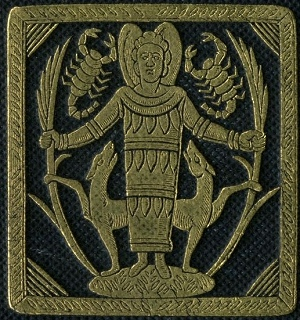

  
[Intangible Textual Heritage](../../../index)  [Classics](../../index) 
[Plutarch](../index) 

------------------------------------------------------------------------

[Buy this Book at
Amazon.com](https://www.amazon.com/exec/obidos/ASIN/142863326X/internetsacredte)

------------------------------------------------------------------------

<table width="75%">
<colgroup>
<col style="width: 50%" />
<col style="width: 50%" />
</colgroup>
<tbody>
<tr class="odd">
<td width="50%" data-valign="TOP"></td>
<td width="50%" data-valign="CENTER"><h1 id="plutarchs-morals-theosophical-essays" data-align="CENTER">Plutarch's Morals: Theosophical Essays</h1>
<h2 id="tr.-by-charles-william-king" data-align="CENTER">tr. by Charles William King</h2>
<h4 id="section" data-align="CENTER">[1908]</h4></td>
</tr>
</tbody>
</table>

------------------------------------------------------------------------

[Contents](#contents)    [Start Reading](pte00)    [Page
Index](pageidx)    [Text \[Zipped\]](pte.txt.gz)

------------------------------------------------------------------------

|                                                                                                                           |
|---------------------------------------------------------------------------------------------------------------------------|
|  |

When, therefore, they were come over against
Palodes, there being neither wind nor swell of sea, Thamus, looking out
from the stern, called out to the land what he had heard, namely, 'That
the great Pan is dead:' and hardly had he finished speaking than there
was a mighty cry, not of one, but of many voices mingled together in
wondrous manner.--On the Cessation of
Oracles, p. 93

Originally published in 1882 as part of Bohn's Classical Library, this
volume of selections from Plutarch's Moralia was translated by the 19th
century scholar of Gnostics and gemstones, Charles William King. King
also wrote [The Gnostics and Their Remains](../../../gno/gar/index).

------------------------------------------------------------------------

 [Title Page](pte00)  
[Preface](pte01)  
[Contents](pte02)  
[Description of the Woodcuts](pte03)  
[On Isis and Osiris](pte04)  
[On the Cessation of Oracles](pte05)  
[On the Pythian Responses](pte06)  
[On the E at Delphi](pte07)  
[On the Apparent Face in the Orb of the Moon](pte08)  
[On Superstition](pte09)  
[Appendix](pte10)  
[Index](pte11)  
