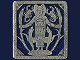

  
[Intangible Textual Heritage](../../../index)  [Classics](../../index) 
[Plutarch](../index)  [Index](index)  [Previous](pte09)  [Next](pte11) 

------------------------------------------------------------------------

[Buy this Book at
Amazon.com](https://www.amazon.com/exec/obidos/ASIN/142863326X/internetsacredte)

------------------------------------------------------------------------

  
*Plutarch's Morals: Theosophical Essays*, tr. by Charles William King,
\[1908\], at Intangible Textual Heritage

------------------------------------------------------------------------

p. 276 p. 277

### APPENDIX.

P. [190](pte07.htm#page_190).

E *for* "*Thou Art*."—The Zohar uses "*Atha*," "Thou," as a synonym for
God, in exactly the same sense that the E is here interpreted—a
declaration of His self-existence. A well-known gem (Paris), bearing the
portrait of Pescennius Niger, with a serpent placed across a burning
altar in front, has also a long inscription, chiefly in initials; but
which give, in full, the title Ο ΩΝ, "He that is," to the "Holy King
Apollo," who had restored that virtuous emperor to health. This fact is
expressed by the offering of the Serpent, that regular attribute of the
god of medicine.

P. [174](pte07.htm#page_174). *The Delphic E*.—Schliemann's little gold
model of a shrine ("Mycenæ," No. 423) presents, upon each of its three
panels, this letter, of the same form as when engraved on Roman
talismans; but laid upon its back, like the caste-mark still in use. But
the finder takes the central bar for a column, and ignores the remainder
of the figure, comparing this part to the central pillar of the famous
sculpture over the "Gate of the Lions." The sigil, thus arranged, at
once suggests the origin of Apollo's signet, the anchor—the birth-mark
of his progeny, the Seleucidæ. A symbol of undying vitality, it has been
lately found amongst the Masons’ marks cut on the ashlar of the
Templars’ Chapelle de la Courvoirie, at Langley, Côte d’Or, see Nos. 20,
21 in the copy published in the "Bulletin de la Soc. Art. de France,"
for 1881, p. 212.

p. 278

P. [269](pte09.htm#page_269). *Phylacteries*.—This solution of the
difficulty must be abandoned. I am informed, upon the highest authority,
that the phylacteries are not worn on the Sabbath, which typifying the
same idea renders the use of the minor type unnecessary. In favour of
the alternative explanation "without bending a limb," I may adduce the
fact that the Karaite Jews (who pique themselves upon the strictest
observance of the Law of Moses, rejecting all tradition) used, till our
own times, to observe the Sabbath by sitting motionless on the same seat
from its commencement to its close. Plutarch evidently is alluding to
the massacre of unresisting congregations in the Maccabæan War; after
which event the Rabbis discovered a sense in the words of Moses that
permitted resistance against attack even on the Sabbath day.

 ![\[Apollo, with the earliest Pythia,
Herophile\]](img/27800.jpg)  
\[Apollo, with the earliest Pythia, Herophile\]

------------------------------------------------------------------------

[Next: Index](pte11)
