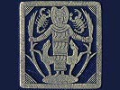

  
[Intangible Textual Heritage](../../../index)  [Classics](../../index) 
[Plutarch](../index)  [Index](index)  [Previous](pte10) 

------------------------------------------------------------------------

[Buy this Book at
Amazon.com](https://www.amazon.com/exec/obidos/ASIN/142863326X/internetsacredte)

------------------------------------------------------------------------

  
*Plutarch's Morals: Theosophical Essays*, tr. by Charles William King,
\[1908\], at Intangible Textual Heritage

------------------------------------------------------------------------

p. 279

### INDEX.

"Above" and "Below" defined, [211](pte08.htm#page_211).

Acanthians and Brasidas, Hall of, [152](pte06.htm#page_152).

Achamoth, Logos, note, [215](pte08.htm#page_215).

Adamantine pillars of Earth, [204](pte08.htm#page_204).

Admirals, statues of the, [139](pte06.htm#page_139).

Ægon of Argos, inscription of his date, [142](pte06.htm#page_142).

Æolic dialect used in an oracle, [77](pte05.htm#page_77).

Æschylus quoted, [16](pte04.htm#page_16).

Ætna, eruptions of, [212](pte08.htm#page_212).

Agesilaus, oracle given to, [149](pte06.htm#page_149).

Air, plants living on, [242](pte08.htm#page_242).

Alastores, [90](pte05.htm#page_90).

Alcæus, quoted, [73](pte05.htm#page_73).

Alexander, holding the thunderbolt, [20](pte04.htm#page_20).

Alyattes, crater-stand of, [130](pte05.htm#page_130).

Amastris, buries men alive, [274](pte09.htm#page_274).

"Ammon," whence derived, [8](pte04.htm#page_8).

Ammon's Oracle, decay of, [76](pte05.htm#page_76).

Amphiaraus, consulted by Mardonius, [77](pte05.htm#page_77).

Amulet, worn by Isis, [56](pte04.htm#page_56).

Amulets, use of, [267](pte09.htm#page_267).

Anacampsarodes, [242](pte08.htm#page_242).

Anaxagoras, of the Moon, [188](pte07.htm#page_188),
[218](pte08.htm#page_218).

Animal-forms assumed by gods, [61](pte04.htm#page_61).

Animal-worship, source of, [62](pte04.htm#page_62).

—cause of a recent civil war, *ib*.

Antigonus, joke of, [20](pte04.htm#page_20).

"Antiphraxis" of Pythagoras, [36](pte04.htm#page_36).

Antipodes, ridiculed, [206](pte08.htm#page_206).

Anubis, son of Nephthys, [38](pte04.htm#page_38). Apelles and Lysippus,
[20](pte04.htm#page_20).

Apis, conception of, [37](pte04.htm#page_37).

—the image of the soul of Osiris, [17](pte04.htm#page_17).

—tomb of, [24](pte04.htm#page_24).

"Apollo," Changed to Fire, [183](pte07.htm#page_183).

—a logician, [178](pte07.htm#page_178).

—generator of the Logos, [184](pte07.htm#page_184).

"Apollo" for "Unity," [193](pte07.htm#page_193).

Apollo, one with Sun, [151](pte06.htm#page_151).

—the same with Sun, [125](pte05.htm#page_125).

Apollo's titles, true sense of, [193](pte07.htm#page_193).

—golden top-knot, [165](pte06.htm#page_165).

—titles, [183](pte07.htm#page_183).

Archilochus quoted, [177](pte07.htm#page_177).

Aristarchus, on the Moon's magnitude, [225](pte08.htm#page_225).

Aristodemus of Ithome, [268](pte09.htm#page_268).

Argo, the boat of Osiris, [18](pte04.htm#page_18).

Ark, sacred golden, [34](pte04.htm#page_34).

Arimanios, god of Ignorance, [40](pte04.htm#page_40).

Aristagoras, quoted, [203](pte08.htm#page_203).

Aristarchus, "On Magnitudes and Distances," [209](pte08.htm#page_209).

Aristotle, on Gravitation, [104](pte05.htm#page_104).

Aristotle's "Quintessence," [185](pte07.htm#page_185).

Asbestos of Carystus, [125](pte05.htm#page_125).

Asp, why sacred, [64](pte04.htm#page_64).

Ass, type of Typhon, [25](pte04.htm#page_25).

Astrological interpretations of myths, [38](pte04.htm#page_38).

p. 280

Atheism defined, [258](pte09.htm#page_258).

Atheism and Superstition, [259](pte09.htm#page_259).

Axe of Tenedos, [150](pte06.htm#page_150).

 

Bacchus, identified with Osiris, [29](pte04.htm#page_29).

—metamorphosis of, [183](pte07.htm#page_183).

Bacis, oracles of, [148](pte06.htm#page_148).

Battus, oracle given to, [169](pte06.htm#page_169).

Beam sawn in two at Earth's centre, [206](pte08.htm#page_206).

"Bebon," title of Typhon, [43](pte04.htm#page_43).

Beetle, signet of the military class, [9](pte04.htm#page_9).

"Blue-eyed Moon," [230](pte08.htm#page_230).

—glowing coal colour of, *ib*.

Boats, vehicles of Sun and Moon, [28](pte04.htm#page_28).

Britain, visited by Demetrius, [73](pte05.htm#page_73).

British hermits, [94](pte05.htm#page_94).

Britons, living in the ocean, [200](pte08.htm#page_200).

Bronze, ancient tempering of, [139](pte06.htm#page_139).

—blue rust of Delphic, *ib*.

—native malleable, [125](pte05.htm#page_125).

Bull's foot, god with the, [29](pte04.htm#page_29).

 

Calligraphy of Imperial rescripts, [144](pte06.htm#page_144).

Cambyses kills Apis, [38](pte04.htm#page_38).

"Canopus" = a pilot, [18](pte04.htm#page_18).

Canopus, oracle at, [23](pte04.htm#page_23).

Carthaginians, their human sacrifices, [273](pte09.htm#page_273).

Cat, emblem of Moon, [55](pte04.htm#page_55).

"Centre," doctrine of the, [206](pte08.htm#page_206).

Centre, theory of the, [105](pte05.htm#page_105).

Chæremon, quoted, [164](pte06.htm#page_164).

Chaldean religion, [41](pte04.htm#page_41).

"Chemeia," pupil of the eye, [28](pte04.htm#page_28).

Chrysippus," Upon Probabilities," [106](pte05.htm#page_106).

Cilicia, governor of, [127](pte05.htm#page_127).

Coretus, discovers the Delphic oracle, [124](pte05.htm#page_124).

Clea, celebrates the Dionysea at Delphi, [29](pte04.htm#page_29).

Clearchus, quoted, [56](pte04.htm#page_56).

Cleombrotus of Lacedæmon, [73](pte05.htm#page_73).

—his discussion with the Indian hermit, [98](pte05.htm#page_98).

"Cobre dos labradores," note, [125](pte05.htm#page_125)

Cock, offered to Osiris and Anubis, [52](pte04.htm#page_52).

Coffin of Osiris, [11](pte04.htm#page_11).

Coin-types, why chosen, [150](pte06.htm#page_150).

Contrariety necessary to creation, [213](pte08.htm#page_213).

Corinthian brass, how discovered, [140](pte06.htm#page_140).

Counters, game of, [111](pte05.htm#page_111).

Crates, of Ocean, [240](pte08.htm#page_240).

Creation, Plato's theory of, [50](pte04.htm#page_50).

Crœsus’ baker, statue of, [154](pte06.htm#page_154).

Crocodile, eating of, [44](pte04.htm#page_44).

—sagacity of, [65](pte04.htm#page_65).

—type of Typhon, [43](pte04.htm#page_43).

"Crow" guides the Delians to Tagyræ, [78](pte05.htm#page_78).

Crown of the Chalcidians, [146](pte06.htm#page_146).

Cube, properties of the, [111](pte05.htm#page_111).

—type of Rest, [113](pte05.htm#page_113).

Cubical dimensions of altar, to double, [178](pte07.htm#page_178).

Cups of gold, for money, [249](pte08.htm#page_249).

Continent, the Great, [246](pte08.htm#page_246).

Cumæ, destruction of, [147](pte06.htm#page_147).

Curse, engraved on column, [7](pte04.htm#page_7).

Cydnus, swords tempered in, [123](pte05.htm#page_123).

Cypselus, Hall of, [152](pte06.htm#page_152).

 

"Dæmon," for Evil Principle, [40](pte04.htm#page_40).

"Daemons clothed in mist," Hesiod's, [119](pte05.htm#page_119).

—Greek legends about, [97](pte05.htm#page_97).

—punished for sin, [22](pte04.htm#page_22).

—raised to gods, [22](pte04.htm#page_22).

—rites connected with, [90](pte05.htm#page_90).

—seeking for human bodies, [89](pte05.htm#page_89).

—spirits separated from the body, [120](pte05.htm#page_120).

—subject to mortality, [92](pte05.htm#page_92).

—their extinction attended with storms, [94](pte05.htm#page_94).

—their origin in the Moon, [255](pte08.htm#page_255).

—theories concerning, [20](pte04.htm#page_20).

—tormented in the Moon, [245](pte08.htm#page_245).

—waiting on Saturn, [248](pte08.htm#page_248).

Death, the Second, [250](pte08.htm#page_250).

Delphi, density of air at, [141](pte06.htm#page_141).

p. 281

Delphi, rebuilt by the Romans, [171](pte06.htm#page_171).

Delphic donaria coined by the tyrants, [154](pte06.htm#page_154).

Delphic guides, [142](pte06.htm#page_142).

—oracle, how discovered, [124](pte05.htm#page_124).

—procession, [90](pte05.htm#page_90).

—prophetesses, their number, [82](pte05.htm#page_82).

Demeter, lunar deity, [250](pte08.htm#page_250).

Demetrius of Tarsus, [73](pte05.htm#page_73).

—visits the Holy Isle, [93](pte05.htm#page_93).

Depopulation of Greece, [81](pte05.htm#page_81).

Dew, daughter of Jove, [243](pte08.htm#page_243).

"Dairy of Bœotia," [171](pte06.htm#page_171).

Dice, thrown at Delphi, [189](pte07.htm#page_189).

Dictys, foster-father of Isis, [6](pte04.htm#page_6).

Didymus the Cynic, [79](pte05.htm#page_79).

Dioscuri, stars of the, [145](pte06.htm#page_145).

"Discord" of Empedocles, [212](pte08.htm#page_212).

Dog, emblem of Hermes, [9](pte04.htm#page_9).

"Dog," title of Anubis, [38](pte04.htm#page_38).

"Doors of Osiris," [24](pte04.htm#page_24).

Double-meaning of oracles, cause of, [178](pte07.htm#page_178).

Dragon haunting Tegyrae, [81](pte05.htm#page_81).

Dreams, people without, [135](pte05.htm#page_135).

—the averting of, [261](pte09.htm#page_261).

Druidical seminary (?), [248](pte08.htm#page_248).

 

E, for "Thou Art," [190](pte07.htm#page_190).

EI, true sound of E, [177](pte07.htm#page_177).

E of Delphi, the numeral Five, [180](pte07.htm#page_180).

E, why dedicated at Delphi, [174](pte07.htm#page_174).

Earless Jupiter, [65](pte04.htm#page_65).

Earth, a living creature, [215](pte08.htm#page_215).

—and Water, image of, [34](pte04.htm#page_34).

—and Water, Temple of, [156](pte06.htm#page_156).

—viewed from the Moon, [244](pte08.htm#page_244).

Earth's position, changes in, [75](pte05.htm#page_75).

—revolution taught, [203](pte08.htm#page_203).

—shadow, a cone, [226](pte08.htm#page_226).

Earthquakes, unknown in Gaul, [260](pte09.htm#page_260).

Eclipse, cause of, [219](pte08.htm#page_219).

—how produced, [204](pte08.htm#page_204).

—poetical descriptions of, [224](pte08.htm#page_224).

Egypt, once sea, [34](pte04.htm#page_34).

Egypt visited by the Greek philosophers, [8](pte04.htm#page_8).

Electrum gold in fashion, [140](pte06.htm#page_140).

Elements, how separated and distributed, [118](pte05.htm#page_118).

Elements, Plato's symbols of, [110](pte05.htm#page_110).

Emblems, explained, [9](pte04.htm#page_9).

Empedocles’ Discord and Amity, [213](pte08.htm#page_213).

—quoted, [90](pte05.htm#page_90).

—of dye-stuffs, [123](pte05.htm#page_123).

—of the tortoise, [215](pte08.htm#page_215).

—on dæmons, [22](pte04.htm#page_22).

—on eclipses, [219](pte08.htm#page_219).

—on the light of Sun and Moon, [198](pte08.htm#page_198).

—on the punishment of dæmons, [22](pte04.htm#page_22).

—on the substance of the Moon, [202](pte08.htm#page_202).

Epimenides, quoted, [72](pte05.htm#page_72).

Epitherses, his strange story, [92](pte05.htm#page_92).

Erica, overgrows the coffin of Osiris, [13](pte04.htm#page_13).

Etesian winds, [33](pte04.htm#page_33).

Eudoxus, quoted, [54](pte04.htm#page_54).

—visits Egypt, [8](pte04.htm#page_8).

Euripides’ Cyclops, [128](pte05.htm#page_128).

—lines to Archelaus, [173](pte07.htm#page_173).

Euripides, of sacrifices, [195](pte07.htm#page_195).

—on Good and Evil, [39](pte04.htm#page_39).

Evemerus, his theory, [19](pte04.htm#page_19).

Exhalation, Delphic, sometimes fatal in its action,
[135](pte05.htm#page_135).

—affecting oracles, [126](pte05.htm#page_126).

—the Delphic, its nature and action, [134](pte05.htm#page_134).

Exile of gods explained, [89](pte05.htm#page_89).

Existence, defined, [192](pte07.htm#page_192).

Eyes inserted in statues, [145](pte06.htm#page_145).

"Eyes of Horus," festival, [45](pte04.htm#page_45).

"Face in the Moon," caused by cavities in her surface,
[234](pte08.htm#page_234).

—terrifies the wicked souls, [254](pte08.htm#page_254).

—various theories about the, [198](pte08.htm#page_198).

False ideas of God, their evils, [264](pte09.htm#page_264).

p. 282

Fates, places of the Three, [257](pte08.htm#page_257).

Fig-leaf, like a crow's-foot, [74](pte05.htm#page_74).

Fish, emblem of hatred, [27](pte04.htm#page_27).

—forbidden, [5](pte04.htm#page_5), [272](pte09.htm#page_272).

Five children at a birth, [116](pte05.htm#page_116).

—gods born of Rhea, [116](pte05.htm#page_116).

—how generated, [114](pte05.htm#page_114).

—properties of the numeral,
[180](pte07.htm#page_180)-[181](pte07.htm#page_181).

—worlds, the, [100](pte05.htm#page_100).

"Fives, counting by," [115](pte05.htm#page_115).

Flax, why sacred, [4](pte04.htm#page_4).

Flute, original use of, [195](pte07.htm#page_195).

"Four," Pythagorean oath, [66](pte04.htm#page_66).

Forbidden meats, [5](pte04.htm#page_5).

Frogs and snakes, emblems of spring, [150](pte06.htm#page_150).

 

Geld, Hiero, and Thrasybulus, [158](pte06.htm#page_158).

"Generation," length of a, [85](pte05.htm#page_85).

Generative power typified, [30](pte04.htm#page_30).

Geometrical figures dedicated to gods, [26](pte04.htm#page_26).

Geometrical figures symbols of the Elements, [110](pte05.htm#page_110).

God, the true idea of,
[68](pte04.htm#page_68).

Gods, deified men, [19](pte04.htm#page_19).

Good and Evil, duration of their struggle, [41](pte04.htm#page_41).

—origin of, [39](pte04.htm#page_39).

Gradovo, exhalation at, note, [134](pte05.htm#page_134).

Grammatical problems, [79](pte05.htm#page_79).

Gravitation, theory of, [104](pte05.htm#page_104).

Greek names for Egyptian gods, [53](pte04.htm#page_53).

Guides to the Delphic donaria, [139](pte06.htm#page_139).

 

"Hades," derived by Plato, [274](pte09.htm#page_274).

—the body imprisoning the soul, [23](pte04.htm#page_23).

—whence named, [25](pte04.htm#page_25).

Human first-fruits dedicated to Apollo, [155](pte06.htm#page_155).

—sacrifices, [274](pte09.htm#page_274).

Harpocrates, birth of, [16](pte04.htm#page_16).

Hawk, type of God, [27](pte04.htm#page_27).

"He that is," title of Apollo, [124](pte05.htm#page_124).

Head of victim cursed, [26](pte04.htm#page_26).

Heat, generated by motion, [202](pte08.htm#page_202).

Hecatæus, quoted, [5](pte04.htm#page_5).

Hegesianax, on the Face in the Moon, [198](pte08.htm#page_198),
[199](pte08.htm#page_199).

Hell, description of, [263](pte09.htm#page_263).

Heraclitus, his "Harmony," [41](pte04.htm#page_41).

—of Identity, [191](pte07.htm#page_191).

—of the Final Cause, [182](pte07.htm#page_182).

Hercules directs the Sun, [35](pte04.htm#page_35).

—knocks down Logic, [179](pte07.htm#page_179).

Hermes directs the Moon, [35](pte04.htm#page_35).

—Earthly and Heavenly, [251](pte08.htm#page_251).

Hermolaus, Alexander's physician, [272](pte09.htm#page_272).

Hesiod, on the office of dæmons, [120](pte05.htm#page_120).

—on dæmons, [21](pte04.htm#page_21).

—on the Elements, [49](pte04.htm#page_49).

—on the duration of life, [84](pte05.htm#page_84).

Hiero's column at Delphi, [145](pte06.htm#page_145).

Hieroglyphic types explained, [27](pte04.htm#page_27).

Hierosolymus and Judæus, sons of Typhon, [26](pte04.htm#page_26).

Hipparchus, quoted, [200](pte08.htm#page_200).

Homer's limited notions of God, [108](pte05.htm#page_108).

Homer, of Past, Present, and Future, [179](pte07.htm#page_179).

—of Tartarus, [245](pte08.htm#page_245).

—proofs of usages derived from, [74](pte05.htm#page_74).

—on dæmons, [21](pte04.htm#page_21).

Horus and Typhon, group of, [48](pte04.htm#page_48).

—birthday of, [46](pte04.htm#page_46).

—his answers to Osiris, [15](pte04.htm#page_15).

—image of the Intelligible World, [47](pte04.htm#page_47).

Ibis, why sacred, [65](pte04.htm#page_65).

Ichneumon, why sacred, [64](pte04.htm#page_64).

Idæi Dactyli, good dæmons, [255](pte08.htm#page_255).

Idolatry, source of, [61](pte04.htm#page_61).

Impious piety, [271](pte09.htm#page_271).

Impudence, emblem of, [27](pte04.htm#page_27).

Incense, varieties of, [68](pte04.htm#page_68).

Indian hermit, by the Red Sea, [96](pte05.htm#page_96).

Infinity of worlds, [101](pte05.htm#page_101).

Inspiration, double source of, [132](pte05.htm#page_132).

—theory of verbal, [150](pte06.htm#page_150).

Instruments, fitting, chosen for Divine ends, [162](pte06.htm#page_162).

p. 283

"Intelligible," and "Sensible" Creation, [112](pte05.htm#page_112).

Interpreter of oracles, official, [136](pte05.htm#page_136)

Inundation, Nilar, heights of, [37](pte04.htm#page_37).

Invocations in barbarian tongues, [261](pte09.htm#page_261).

Ion, quoted, [127](pte05.htm#page_127).

Isiacists, funeral robes of, [3](pte04.htm#page_3).

Isis and Osiris = Earth and Nile, [27](pte04.htm#page_27).

"Isis," derivation of, [2](pte04.htm#page_2).

—principle of Nature, [46](pte04.htm#page_46)

—proceeding out of self," [53](pte04.htm#page_53).

—searches after the body of Osiris, [12](pte04.htm#page_12).

"Isis-hair," sea-weed, [242](pte08.htm#page_242).

Isosceles triangle, type of the universe, [49](pte04.htm#page_49).

Ivy, the "plant of Osiris," [31](pte04.htm#page_31).

 

Jewish notions, alluded to, [97](pte05.htm#page_97).

Jews, their observance of the Sabbath, [269](pte09.htm#page_269).

Justice, figured without hands, [9](pte04.htm#page_9).

 

"Kaimis," title of Horus, [49](pte04.htm#page_49).

"Knemosiris," ivy, [31](pte04.htm#page_31).

Kneph, sole god of the Thebaid, [18](pte04.htm#page_18).

Knowledge, prime attribute of God, [1](pte04.htm#page_1).

"Know thyself," Delphic motto, [170](pte06.htm#page_170).

Kyphi, how composed, [68](pte04.htm#page_68).

 

Lamp, of Ammon, [73](pte05.htm#page_73).

Legs grown into one, Jupiter's, [54](pte04.htm#page_54).

Life, duration of, [84](pte05.htm#page_84).

Life, stages of human, [191](pte07.htm#page_191).

Lion, tumbled out of the Moon, [238](pte08.htm#page_238).

Livia dedicates the Golden E, [176](pte07.htm#page_176).

"Logos," Reason, [178](pte07.htm#page_178).

—whence derived, [118](pte05.htm#page_118).

Love-affairs, ruled by Isis, [55](pte04.htm#page_55).

Love, fable of the birth of, [50](pte04.htm#page_50).

Lunar inhabitants, diet of, [244](pte08.htm#page_244).

Lyre, used by the Pythagoreans, [70](pte04.htm#page_70).

Lysander, slain by a dragon, [169](pte06.htm#page_169).

—statue of, [145](pte06.htm#page_145).

 

Man, "a celestial plant," [151](pte06.htm#page_151).

"Maneros," explained, [14](pte04.htm#page_14).

Manes, king of Phrygia, [19](pte04.htm#page_19).

Manetho, quoted, [23](pte04.htm#page_23), [53](pte04.htm#page_53).

Mardonius, answer of oracle to, [77](pte05.htm#page_77).

"Marriage," the numeral Five, [181](pte07.htm#page_181).

Moon, atmosphere of, [241](pte08.htm#page_241).

Matter, Plato's "Poverty," [50](pte04.htm#page_50).

"Meadow of Hades," [252](pte08.htm#page_252).

"Measuring the lion by his talon," [73](pte05.htm#page_73).

Megasthenes, quoted, [239](pte08.htm#page_239).

Memory, nature of, [121](pte05.htm#page_121).

Metamorphosis of deities, [183](pte07.htm#page_183).

Mithras, intermediate principle, [40](pte04.htm#page_40).

Metrodorus’ theory of Creation, [126](pte05.htm#page_126).

Mimnermus, quoted, [224](pte08.htm#page_224).

Minerva of Sais, [8](pte04.htm#page_8).

Mirrors, concave, effect of, [236](pte08.htm#page_236).

—reflection of rays in, [221](pte08.htm#page_221).

Mithidoes, shrub, [17](pte04.htm#page_17).

Moisture, typified by Osiris, [30](pte04.htm#page_30).

Molds, without a head, [89](pte05.htm#page_89).

Months, Egyptian names of, [45](pte04.htm#page_45).

—feast-days of the, [10](pte04.htm#page_10).

Moon, abode of Hermes, [35](pte04.htm#page_35).

—cavities in surface of, [233](pte08.htm#page_233).

—a feminine star, [228](pte08.htm#page_228).

—a fiery body, [229](pte08.htm#page_229).

—apparent diameter of, [233](pte08.htm#page_233).

—composed of air and fire, [203](pte08.htm#page_203).

—her colours during an eclipse, [229](pte08.htm#page_229).

—her utility to man, [240](pte08.htm#page_240).

—how illuminated, [218](pte08.htm#page_218).

—how supported in space, [205](pte08.htm#page_205).

—of what composed, [201](pte08.htm#page_201).

—possibly inhabited? [237](pte08.htm#page_237).

p. 284

Moon's actual surface of various bright colours,
[232](pte08.htm#page_232).

—atmosphere, fiery, [238](pte08.htm#page_238).

—distance from Earth, [209](pte08.htm#page_209).

—magnitude, [225](pte08.htm#page_225).

—nature heterogeneous, [127](pte05.htm#page_127).

—natural colour, [230](pte08.htm#page_230).

Mopsuestia, Oracle at, how tested, [127](pte05.htm#page_127).

"More Worlds than One," [102](pte05.htm#page_102).

Motto, put up at Delphi, [170](pte06.htm#page_170).

Muses, Temple of the, [156](pte06.htm#page_156).

Music, why given to Apollo, [195](pte07.htm#page_195).

Musical notation, [184](pte07.htm#page_184).

Mnevis, king, [7](pte04.htm#page_7).

 

Nails, not to be cut on holy days, [4](pte04.htm#page_4).

Names, taken at random, [98](pte05.htm#page_98).

Nature, typified by Isis, [46](pte04.htm#page_46).

Natural properties modified by position, [215](pte08.htm#page_215).

"Natural Science" charlatans, [127](pte05.htm#page_127).

Nephthys and Typhon, their legend explained, [33](pte04.htm#page_33).

Nephthys, wife of Typhon, [12](pte04.htm#page_12).

Nicias, superstition of, [268](pte09.htm#page_268).

Nick-names of celebrated persons, [153](pte06.htm#page_153).

Nile, inundations of, [37](pte04.htm#page_37).

—its connection with Osiris, [32](pte04.htm#page_32).

Nocturnal and mournful rites explained, [59](pte04.htm#page_59).

Number, a form of Matter, [114](pte05.htm#page_114).

Numerals expressing deities, [8](pte04.htm#page_8).

Nymphs, duration of life, [84](pte05.htm#page_84).

 

Ocean, origin of all things, [240](pte08.htm#page_240).

—reflected on the Moon, [199](pte08.htm#page_199).

Ochus, "The Ass," [26](pte04.htm#page_26).

"The Sword," [9](pte04.htm#page_9).

Octahedron, for air, [111](pte05.htm#page_111).

Ogygia, island, [245](pte08.htm#page_245).

Olympian altar of ashes, [123](pte05.htm#page_123).

Omens, derived from children's cries, [12](pte04.htm#page_12).

—given by donaria, [145](pte06.htm#page_145).

"Omphalos," at Delphi, [72](pte05.htm#page_72).

"Ompis," title of Osiris, [36](pte04.htm#page_36).

"One," and "Now," God, [193](pte07.htm#page_193).

Optical theories, [223](pte08.htm#page_223).

Opuntians, send back the coined donaria, [154](pte06.htm#page_154).

Oracle given by the Sibyl, [147](pte06.htm#page_147).

—given to Agesilaus, [149](pte06.htm#page_149).

—to Philip V., *ib*.

Oracles, affected by natural causes, [123](pte05.htm#page_123).

—extinguished together with

their presiding dæmons, [91](pte05.htm#page_91).

—formerly numerous in Greece, [77](pte05.htm#page_77).

—given in prose, [158](pte06.htm#page_158).

—in verse, collections of, [159](pte06.htm#page_159).

—only *hint* at the Future, [161](pte06.htm#page_161).

—verified by the event, [158](pte06.htm#page_158).

Oromazes, god of Light, [40](pte04.htm#page_40).

"Osiris" = a general, [18](pte04.htm#page_18).

Osiris and Typhon = Moisture and Drought, [28](pte04.htm#page_28).

—the Two Principles, [43](pte04.htm#page_43).

Osiris, hieroglyph of, [44](pte04.htm#page_44).

—Isis, &c., true nature of, [55](pte04.htm#page_55).

—his body torn in 14  pieces by Typhon, [14](pte04.htm#page_14).

—history of, [11](pte04.htm#page_11).

—how entrapped by Typhon, *ib*.

—"Many-eyed," [9](pte04.htm#page_9).

"Overturning the altar of Earth," [203](pte08.htm#page_203).

"Owl-faced" Moon, [219](pte08.htm#page_219).

Oxyrinchus, [5](pte04.htm#page_5).

 

Palm-tree of the Athenians, [146](pte06.htm#page_146).

—of the Corinthians, [150](pte06.htm#page_150).

Pamylia, Phallic festival, [30](pte04.htm#page_30).

"Pan, the great, is dead," [93](pte05.htm#page_93).

Parmenides, of the Moon, [218](pte08.htm#page_218).

—quoted, [213](pte08.htm#page_213).

Parturition, Moon's influence on, [243](pte08.htm#page_243).

Pausanias, oracle concerning, [157](pte06.htm#page_157).

—Philip's guard, [272](pte09.htm#page_272).

Pauson's reversible horse, [143](pte06.htm#page_143).

Persephone, office of, [251](pte08.htm#page_251).

Persea, sacred tree, [58](pte04.htm#page_58).

Phagrus, fish, [6](pte04.htm#page_6).

p. 285

Phallus, origin of the, [15](pte04.htm#page_15),
[31](pte04.htm#page_31).

Pharos, once an island, [35](pte04.htm#page_35).

Pharsalia the Dancer, [146](pte06.htm#page_146).

Philip V. oracle given to, [149](pte06.htm#page_149).

Philosophers, respective ages of, [95](pte05.htm#page_95).

Phryne, golden statue of, [153](pte06.htm#page_153).

—origin of name, ib. Phylacteries of the Jews,
[269](pte09.htm#page_269).

Pindar, of Apollo, [80](pte05.htm#page_80).

—of the Sun, [71](pte04.htm#page_71).

Planets, their relative distances, [208](pte08.htm#page_208).

Plato, of Efficient and Final Causes, [130](pte05.htm#page_130).

—of Music, [264](pte09.htm#page_264).

—of the Elements, [110](pte05.htm#page_110).

—of the Moon, [240](pte08.htm#page_240).

—on dæmons, [22](pte04.htm#page_22), [96](pte05.htm#page_96).

—on the Two Principles, [42](pte04.htm#page_42).

Plato's amatory verses, [164](pte06.htm#page_164).

—"auspicious idols," [92](pte05.htm#page_92).

—"Cratylus," quoted, [188](pte07.htm#page_188).

—doctrine of Providence, [109](pte05.htm#page_109).

—Marriage Scheme, [49](pte04.htm#page_49).

—nomenclature of the Principles, [48](pte04.htm#page_48).

—"One" and "Other," [118](pte05.htm#page_118).

—plurality of worlds, [98](pte05.htm#page_98),
[185](pte07.htm#page_185).

—"True World," [231](pte08.htm#page_231).

Platonist explanation of Egyptian Myths, [51](pte04.htm#page_51).

"Plough with a silver share," [158](pte06.htm#page_158).

Plurality of Providences necessitated by plurality of Worlds,
[107](pte05.htm#page_107).

Polygnotus, his picture at Delphi, [131](pte05.htm#page_131).

"Pool of the Spring," [156](pte06.htm#page_156).

Pottery, burning of, [201](pte08.htm#page_201).

Praxiteles’ mistress, statue of, [154](pte06.htm#page_154).

Principles, the Two, [42](pte04.htm#page_42).

"Prison of Hecate," [254](pte08.htm#page_254).

Prophecy, mere guess-work, [122](pte05.htm#page_122).

—its fulfilment explained, [148](pte06.htm#page_148).

Prophetic power of departing souls, [121](pte05.htm#page_121).

Purgatory in the Middle Space, [252](pte08.htm#page_252).

Pyramid, for Fire, [110](pte05.htm#page_110).

Pythagoras, of worship, [270](pte09.htm#page_270).

—scholar of Onyphis, [8](pte04.htm#page_8).

Pythagorean maxims derived from Egypt, *ib*.

—names for the Two Principles, [42](pte04.htm#page_42).

—symbols, [66](pte04.htm#page_66).

Pythia, character of the, [163](pte06.htm#page_163).

—the instrument of the Oracle, [161](pte06.htm#page_161).

Python, a dæmon, [97](pte05.htm#page_97).

 

Qualities of Nature, the Five, [117](pte05.htm#page_117).

Quarterings of the Moon explained, [220](pte08.htm#page_220).

Queries begin with  If," [177](pte07.htm#page_177).

Questions, trivial, put to the Oracle, [167](pte06.htm#page_167).

"Quintessence," the Fifth Element, [185](pte07.htm#page_185).

Quintuple division of all Nature, [187](pte07.htm#page_187).

 

Rationalistic explanations, [56](pte04.htm#page_56).

Razors, known to Homer, [74](pte05.htm#page_74).

"Reason, He that rules by," [216](pte08.htm#page_216).

"Reason," Logos, typified by Osiris, [52](pte04.htm#page_52).

—of the Stoics, [38](pte04.htm#page_38).

Red-hair, typical of Typhon, [25](pte04.htm#page_25).

Red Sea, vegetation in, [242](pte08.htm#page_242).

Reflection of rays on the Moon, [235](pte08.htm#page_235).

Resin, work of Sun and Moon, [70](pte04.htm#page_70).

Rhodope, iron spits of, [152](pte06.htm#page_152).

Rites, absurd, reason for, [89](pte05.htm#page_89).

Ritualistic contortions, [261](pte09.htm#page_261).

River-horse, type of impudence, [27](pte04.htm#page_27).

 

Sabbath-keeping by Greeks, [261](pte09.htm#page_261).

Salt, why forbidden, [4](pte04.htm#page_4).

"Same and Different," Plato's, [113](pte05.htm#page_113).

"Satiety," vacation of the Oracle, [184](pte07.htm#page_184).

Saturn, enchanted slumber of, [94](pte05.htm#page_94).

—Greeks deputed to, [247](pte08.htm#page_247).

—prison of, [247](pte08.htm#page_247).

Saturn's prophetic dreams, [247](pte08.htm#page_247).

Scythinus, quoted. [155](pte06.htm#page_155).

p. 286

"Sea of Saturn," [246](pte08.htm#page_246).

—the seed of Saturn, [27](pte04.htm#page_27).

—various colours of, [231](pte08.htm#page_231).

Seasons, alteration in the, [75](pte05.htm#page_75).

"Seeking for Osiris," festival, [45](pte04.htm#page_45).

Senses, compared to the Elements, [186](pte07.htm#page_186).

Serapis, how brought into Egypt, [23](pte04.htm#page_23).

"Serapis" = Osiris and Apis, [24](pte04.htm#page_24).

Serapis, theories concerning, [23](pte04.htm#page_23).

Serpent of Pallas, [65](pte04.htm#page_65).

"Seth," name of Typhon, [53](pte04.htm#page_53).

Seven, virtues of the numeral, [176](pte07.htm#page_176).

Shield-device, dragon, [169](pte06.htm#page_169).

Sibyl, Rock of the, [147](pte06.htm#page_147).

—becomes the Face in the Moon, ib.

Signet-type of the "Sealer," [26](pte04.htm#page_26).

Silence of the Oracles explained, [118](pte05.htm#page_118).

Sistrum, type of creation, [54](pte04.htm#page_54).

Slaves, their privilege of changing masters, [262](pte09.htm#page_262).

"Sleep, sweet balm of," [260](pte09.htm#page_260).

Smoke, Indians living on, [239](pte08.htm#page_239).

Solar eclipse, phenomena of a recent, [225](pte08.htm#page_225).

—light, transmission of, [222](pte08.htm#page_222).

Sophocles’ "Admetus" quoted, [89](pte05.htm#page_89).

—of physicians, [206](pte08.htm#page_206).

Sothis, the Dog-star, [18](pte04.htm#page_18).

Souls, fly up to the Moon, [252](pte08.htm#page_252).

Soul, how dissolved into its components, [256](pte08.htm#page_256).

—its composition and dissolution, [251](pte08.htm#page_251).

Soul's nature like that of the Moon, [257](pte08.htm#page_257).

Souls, their occupation in the Moon, [253](pte08.htm#page_253).

"Speculative" philosophy, [67](pte04.htm#page_67).

Spiders, abundance of, [74](pte05.htm#page_74).

Standards in the shape of animals, [62](pte04.htm#page_62).

Stars, the souls of great men, [18](pte04.htm#page_18).

Stoic doctrine about gods and daemons, [94](pte05.htm#page_94).

—explanation of the gods, [35](pte04.htm#page_35).

—theory of the Moon, [202](pte08.htm#page_202).

Sun, nourished by moisture, [150](pte06.htm#page_150).

—the sensible type of God, [193](pte07.htm#page_193).

—confounded with Apollo, [193](pte07.htm#page_193).

—wars against Jupiter, [31](pte04.htm#page_31).

Sun's distance from Earth, [209](pte08.htm#page_209).

"Sun's Walking-stick," festival, [45](pte04.htm#page_45).

Sunset, cause of, [227](pte08.htm#page_227).

Superstition defined, [258](pte09.htm#page_258).

Swallow, Isis becomes a, [13](pte04.htm#page_13).

Sweet smells, virtue of, [69](pte04.htm#page_69).

Swine, why unclean, [7](pte04.htm#page_7).

Swords, of native bronze, [125](pte05.htm#page_125).

Syene, climate of, [241](pte08.htm#page_241).

—gnomon at, [75](pte05.htm#page_75).

Sylla's story, [245](pte08.htm#page_245).

Symbolism, dangerous results of, [57](pte04.htm#page_57).

Syrian Goddess, [272](pte09.htm#page_272).

Tagyrae, Apollo's birthplace, [77](pte05.htm#page_77).

Tenedos, the axe of, [150](pte06.htm#page_150).

Thales, the "Astronomy" of, [157](pte06.htm#page_157).

Theophrastus, on dæmons, [95](pte05.htm#page_95).

Thera, eruption at, [149](pte06.htm#page_149).

"Thou art," addressed to Apollo, [190](pte07.htm#page_190).

"Thou art," and "Know thyself," meaning of, [196](pte07.htm#page_196).

Tisaphernes, [267](pte09.htm#page_267).

Tiberius, examines the story of Thamus, [93](pte05.htm#page_93).

Tides, produced by the Moon, [243](pte08.htm#page_243).

Timanthes, [271](pte09.htm#page_271).

Time, dispersion of, [192](pte07.htm#page_192).

—predicates of, [192](pte07.htm#page_192).

Tityi and Typhones, [256](pte08.htm#page_256).

"Tomb of Osiris," city, [17](pte04.htm#page_17).

Tongue, offered to Fortune, [58](pte04.htm#page_58).

Tonsure, reason of, [3](pte04.htm#page_3).

Tortoise of Venus, [65](pte04.htm#page_65).

Trident, meaning of the, [65](pte04.htm#page_65).

Triangle, equilateral, symbol of Minerva, [66](pte04.htm#page_66).

Triangle, sacred to Pluto, [26](pte04.htm#page_26).

Trifles prove great things, [74](pte05.htm#page_74).

Triple nature of the Good Principle, [48](pte04.htm#page_48).

Trophies inscribed at Delphi, [153](pte06.htm#page_153).

"Truth, the Plain of," [99](pte05.htm#page_99).

p. 287

Tyndaridæ, assist mariners, [108](pte05.htm#page_108).

Typhon, animals sacred to, [43](pte04.htm#page_43).

—customs relating to, [25](pte04.htm#page_25).

Typhon's soul divided amongst his sacred animals,
[63](pte04.htm#page_63).

 

Unity of God, [193](pte07.htm#page_193).

Unity, symbol of Apollo, [66](pte04.htm#page_66).

Universe, governed by Reason, [39](pte04.htm#page_39).

"Unlucky days," belong to dæmons, [21](pte04.htm#page_21).

"Upwards," and "Downwards," [207](pte08.htm#page_207).

 

Vacuum, the Final Cause, [258](pte09.htm#page_258).

Veil, black, when used, [33](pte04.htm#page_33).

Verse, ancient universal use of, [165](pte06.htm#page_165).

—oracles in, discontinued, [145](pte06.htm#page_145).

Versification of Oracles, argument against inspiration,
[143](pte06.htm#page_143).

Versification of Oracles, its badness, [142](pte06.htm#page_142).

Vestments of Isis, their symbolism, [67](pte04.htm#page_67).

Vesuvius, eruption of, [147](pte06.htm#page_147).

Victim, signs given by the, [129](pte05.htm#page_129).

Violet, the antique, [231](pte08.htm#page_231).

"Voice, a true," amulet, [58](pte04.htm#page_58).

 

"Wailing, Doors of," [24](pte04.htm#page_24).

Wallowing in mud, religious, [261](pte09.htm#page_261).

"Water-carrier of Isis,'' title of Sirius, [32](pte04.htm#page_32).

Weasel, type of Reason, [64](pte04.htm#page_64).

Wine, forbidden the priests, [5](pte04.htm#page_5).

"Wise Men," their true number, [175](pte07.htm#page_175).

"Woman-hater," title of Hercules, [159](pte06.htm#page_159).

—his priest bound to chastity, *ib*.

Wooden E of the Wise Men, [176](pte07.htm#page_176).

"Word," Logos, is Osiris, [52](pte04.htm#page_52).

"Words that walked," [146](pte06.htm#page_146).

Worlds, Plurality of, [99](pte05.htm#page_99).

—plurality of, objections against, [107](pte05.htm#page_107).

 

Xenocrates on daemons, [20](pte04.htm#page_20).

Xenophanes joke of, [60](pte04.htm#page_60).

Xenophon, quoted, [163](pte06.htm#page_163).

 

Year, shortening of the, [73](pte05.htm#page_73).

Yellow complexion of Phryne, [153](pte06.htm#page_153).

"Ysiris" for "Osiris," [29](pte04.htm#page_29).

 

"Zagreus," title of Bacchus, [183](pte07.htm#page_183).

Zoroaster, doctrine of, [40](pte04.htm#page_40).

 

 ![\[Deus Luna\]](img/28700.jpg)  
\[Deus Luna\]

 

\_\_\_\_\_\_\_\_\_\_\_\_\_\_\_\_\_\_\_\_\_\_\_\_\_\_\_\_\_\_\_\_\_\_\_\_\_\_\_\_\_\_\_\_\_\_\_\_\_\_\_\_\_\_\_\_\_\_\_\_\_\_\_\_\_\_\_\_\_\_\_\_\_\_\_\_  
CHISWICK PRESS:—C. WHITTINGHAM AND CO., TOOKS COURT. CHANCERY
LANE.

 

 

 
