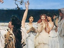

  
[Intangible Textual Heritage](../../../index)  [Classics](../../index) 
[Plutarch](../index)  [Index](index)  [Previous](rgq11)  [Next](rgq13) 

------------------------------------------------------------------------

[Buy this Book at
Amazon.com](https://www.amazon.com/exec/obidos/ASIN/0674993365/internetsacredte)

------------------------------------------------------------------------

[Buy this Book on
Kindle](https://www.amazon.com/exec/obidos/ASIN/B002LE787Q/internetsacredte)

------------------------------------------------------------------------

  
*The Roman and Greek Questions*, by Plutarch, tr. Frank Cole Babbitt,
\[1936\], at Intangible Textual Heritage

------------------------------------------------------------------------

100-109.

100\. Why is it that on the Ides of
August, formerly called Sextilis, all the slaves, female and male, keep
holiday, and the Roman women make a particular practice of washing and
cleansing their heads?

Do the servants have release from work because on this day King Servius
was born from a captive maidservant? [b](#fn_231) And did the washing of their heads begin
with the slave-women, because of their holiday, and extend itself to
free-born women?

 

101\. Why do they adorn their children's
necks with amulets which they call *bullae*? [c](#fn_232)

Was it, like many another thing, in honour of their

p. 150 p. 151

wives, who had been made theirs by force, that they voted this also as a
traditional ornament for the children born from them?

Or is it to honour the manly courage of Tarquin? For the tale is told
that, while he was still but a boy, in the battle against the combined
Latin and Etruscan forces he charged straight into the enemy; and
although he was thrown from his horse, he boldly withstood those that
hurled themselves upon him, and thus gave renewed strength to the
Romans. A brilliant rout of the enemy followed, sixteen thousand were
killed, and he received this amulet as a prize of valour from his father
the king.

Or did the Romans of early times account it not disreputable nor
disgraceful to love male slaves in the flower of youth, as even now
their comedies [a](#fn_233) testify, but they
strictly refrained from boys of free birth; and that they might not be
in any uncertainty, even when they encountered them unclad, did the boys
wear this badge?

Or is this a safeguard to insure orderly conduct, a sort of bridle on
incontinence, that they may be ashamed to pose as men before they have
put off the badge of childhood?

What Varro and his school say is not credible: that since *boulê*
(counsel) is called *bolla* by the Aeolians, the boys put on this
ornament as a symbol of good counsel.

But consider whether they may not wear it because of the moon. For the
visible shape of the moon at the first quarter is not like a sphere, but
like a lentil-seed

p. 152 p. 153

or a quoit; and, as Empedocles [a](#fn_234)
thinks, so also is the matter of which the moon is composed.

 

102\. Why do they name boys when they are
nine days old, but girls when they are eight days old?

Does the precedence of the girls have Nature as its cause? It is a fact
that the female grows up, and attains maturity and perfection before the
male. As for the days, they take those that follow the seventh; for the
seventh is dangerous for newly-born children in various ways and in the
matter of the umbilical cord; for in most cases this comes away on the
seventh day; but until it comes off, the child is more like a plant than
an animal. [b](#fn_235)

Or did they, like the adherents of Pythagoras, regard the even number as
female and the odd number as male? [c](#fn_236)
For the odd number is generative, and, when it is added to the even
number, it prevails over it. And also, when they are divided into units,
the even number, like the female, yields a vacant space between, while
of the odd number an integral part always remains. Wherefore they think
that the odd is suitable for the male, and the even for the female.

Or is it that of all numbers nine [d](#fn_237)
is the first square from the odd and perfect triad, while eight is the
first cube from the even dyad? Now a man should be four-square, [e](#fn_238) eminent, and perfect; but a woman, like
a cube, should be stable, domestic, and difficult to remove from her
place. And this should be added,

p. 154 p. 155

that eight is the cube of two and nine the square of three; women have
two names, men have three.

 

103\. Why do they call children of
unknown fathers *spurii*? [a](#fn_239)

Now the reason is not, as the Greeks believe and lawyers in court are
wont to assert, that these children are begotten of some promiscuous and
common seed; but Spurius is a first name like Sextus and Decimus and
Gaius. They do not write first names in full, but by one letter, as
Titus (T.) and Lucius (L.) and Marcus (M.); or by two, as Tiberius (Ti.)
and Gnaeus (Cn.); or by three, as Sextus (Sex.) and Servius (Ser.).
Spurius, then, is one of those written by two letters: Sp. And by these
two letters they also denote children of unknown fathers, *sine
patre*, [b](#fn_240) that is "without a
father"; by the *s* they indicate *sine* and by the *p* *patre*. This,
then, caused the error, the writing of the same abbreviation for *sine
patre* and for Spurius.

I must state the other explanation also, but it is somewhat absurd: They
assert that the Sabines use the word *spurius* for the *pudenda
muliebria*, and it later came about that they called the child born of
an unmarried, unespoused woman by this name, as if in mockery.

 

104\. Why do they call Bacchus *Liber
Pater* ("Free Father")? [c](#fn_241)

p. 156 p. 157

Is it because he is the father of freedom to drinkers? For most people
become bold and are abounding in frank speech when they are in their
cups. [a](#fn_242) Or is it because he has
provided the means for libations? Or is it derived, as Alexander [b](#fn_243) asserts, from Dionysus
Eleuthereus, [c](#fn_244) so named from
Eleutherae in Boeotia?

 

105\. For what reason is it not the
custom for maidens to marry on public holidays, but widows do marry at
this time? [d](#fn_245)

Is it, as Varro has remarked, that maidens are grieved over marrying,
but older women are glad, and on a holiday one should do nothing in
grief or by constraint?

Or is it rather because it is seemly that not a few should be present
when maidens marry, but disgraceful that many should be present when
widows marry? Now the first marriage is enviable; but the second is to
be deprecated, for women are ashamed if they take a second husband while
the first husband is still living, and they feel sad if they do so when
he is dead. Wherefore they rejoice in a quiet wedding rather than in
noise and processions. Holidays distract most people, so that they have
no leisure for such matters.

Or, because they seized the maiden daughters of the Sabines at a holiday
festival, and thereby became involved in war, did they come to regard it
as ill-omened to marry maidens on holy days?

p. 158 p. 159

106\. Why do the Romans reverence Fortuna
Primigenia, [a](#fn_246) or "First-born," as
one might translate it?

Is it because by Fortune, as they say, it befell Servius, born of a
maidservant, to become a famous king of Rome? This is the assumption
which the majority of Romans make.

Or is it rather because Fortune supplied the origin and birth of
Rome? [b](#fn_247)

Or does the matter have an explanation more natural and philosophic,
which assumes that Fortune is the origin of everything, and Nature
acquires its solid frame by the operation of Fortune, whenever order is
created in any store of matter gathered together at haphazard.

 

107\. Why do the Romans call the
Dionysiac artists [c](#fn_248)
*histriones*? [d](#fn_249)

Is it for the reason that Cluvius Rufus [e](#fn_250) has recorded? For he states that in very
ancient times, in the consulship of Gaius Sulpicius and Licinius
Stolo, [f](#fn_251) a pestilential disease
arose in Rome and destroyed to a man all persons appearing on the stage.
Accordingly, at the request of the Romans, there came many excellent
artists from Etruria, of whom the first in repute and the one who for
the longest time enjoyed success in their theatres, was named Hister;
and therefore all actors are named *histriones* from him.

p. 160 p. 161

108\. Why do they not marry women who are
closely akin to them?

Do they wish to enlarge their relationships by marriage and to acquire
many additional kinsmen by bestowing wives upon others and receiving
wives from others?

Or do they fear the disagreements which arise in marriages of near kin,
on the ground that these tend to destroy natural rights?

Or, since they observed that women by reason of their weakness need many
protectors, were they not willing to take as partners in their household
women closely akin to them, so that if their husbands wronged them,
their kinsmen might bring them succour?

 

109\. Why was it not permitted for the
priest of Jupiter, whom they call the *Flamen Dialis*, to touch either
flour or yeast? [a](#fn_252)

Is it because flour is an incomplete and crude food? For neither has it
remained what it was, wheat, nor has it become what it must become,
bread; but it has both lost the germinative power of the seed and at the
same time it has not attained to the usefulness of food. Wherefore also
the Poet by a metaphor applied to barley-meal the epithet
*mylephatos*, [b](#fn_253) as if it were being
killed or destroyed in the grinding.

Yeast is itself also the product of corruption, and produces corruption
in the dough with which it is mixed; for the dough becomes flabby and
inert, and altogether the process of leavening seems to be one of
putrefaction [c](#fn_254); at any rate if it
goes too far, it completely sours and spoils the flour.

------------------------------------------------------------------------

### Footnotes

[149:b](rgq12.htm#fr_231) *Cf*. 323 B–C, *infra*.

[149:c](rgq12.htm#fr_232) *Cf*. *Life of
Romulus,* xx. (30 C); Pliny, *Natural
History*, xxxiii. 1 (10); Macrobius, *Saturnalia*, i. 6. 7–17.

[151:a](rgq12.htm#fr_233) The so-called
*togatae*, of which no complete specimen has survived; the *palliatae*
of Plautus and Terence, being based on the Greek New Comedy, would prove
nothing.

[153:a](rgq12.htm#fr_234) *Cf*. *Moralia*, 891
C; *Diogenes Laertius*, viii. 77; Diels,
*Frag. der Vorsokratiker*, i. p. 210, A 60.

[153:b](rgq12.htm#fr_235) *Cf*. Aulus Genius,
xvi. 16. 2–3.

[153:c](rgq12.htm#fr_236) *Cf*. 264 A, *supra*.

[153:d](rgq12.htm#fr_237) *Cf*. *Moralia*, 744
A–B.

[153:e](rgq12.htm#fr_238) *Cf*. Bergk, *Poet.
Lyr. Graec.*, Simonides, Frag. 5 (or Edmonds, *Lyra Graeca*, in L.C.L.
ii. p. 284).

[155:a](rgq12.htm#fr_239) *Cf*. Gaius,
*Institutiones*, i. 64; Valerius Maximus, *De Praenominibus*, 6 (p. 590
of Kempf's ed.).

[155:b](rgq12.htm#fr_240) The MSS. have *sine patris*; did Plutarch, or some
Greek copyist, confuse the Latin genitive and ablative, since they are
one in Greek?

[155:c](rgq12.htm#fr_241) *Cf*. Petronius,
*Satyricon*, 41, and Housman's commentary in *Classical Review*, xxxii.
p. 164.

[157:a](rgq12.htm#fr_242) *Cf*. *Moralia*, 716
B.

[157:b](rgq12.htm#fr_243) Müller, *Frag. Hist.
Graec*. iii. p. 244; Alexander Polyhistor.

[157:c](rgq12.htm#fr_244) *Cf*. the inscription
on the chair of the priest of Dionysus in the theatre at Athens, Ἱερέως
Διονύσου Ἐλευθερέως.

[157:d](rgq12.htm#fr_245) *Cf*. Macrobius,
*Saturnalia*, i. 15. 21.

[159:a](rgq12.htm#fr_246) *Cf*. 281 E, *supra*, 322 F, *infra*; Cicero, *De Legibus*, ii. 11; Livy,
xxxiv. 53.

[159:b](rgq12.htm#fr_247) *Cf*. 320 B ff., *infra*.

[159:c](rgq12.htm#fr_248) *Cf*. *Moralia*, 87
F.

[159:d](rgq12.htm#fr_249) *Cf*. Livy, vii. 2;
closely followed by Valerius Maximus, ii. 4. 4.

[159:e](rgq12.htm#fr_250) Peter, *Frag. Hist.
Rom.* p. 314, Cluvius, Frag. 4.

[159:f](rgq12.htm#fr_251) In 361 B.C.

[161:a](rgq12.htm#fr_252) *Cf*. Aulus Gellius,
x. 15. 19.

[161:b](rgq12.htm#fr_253) Homer, *Od*. ii. 355:
"mill-slaughtered."

[161:c](rgq12.htm#fr_254) *Cf*. *Moralia*, 659
B.

------------------------------------------------------------------------

[Next: 110-113.](rgq13)

