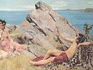

  
[Intangible Textual Heritage](../../index)  [Classics](../index) 
[Index](index)  [Previous](pr01)  [Next](pr03) 

------------------------------------------------------------------------

[Buy this Book at
Amazon.com](https://www.amazon.com/exec/obidos/ASIN/0766180832/internetsacredte)

------------------------------------------------------------------------

  
*Pagan Regeneration*, by Harold R. Willoughby, \[1929\], at Intangible
Textual Heritage

------------------------------------------------------------------------

# CONTENTS

I. PAGAN PEITY IN THE GRAECO-ROMAN WORLD  
II. THE GREATER MYSTERIES AT ELEUSIS  
III. DIONYSIAN EXCESSES  
IV. ORPHIC REFORM  
V. THE REGENERATIVE RITES OF THE GREAT MOTHER  
VI. DEATH AND REBIRTH IN MITHRAISM  
VII. ISIAC INITIATION  
VIII. THE NEW BIRTH EXPERIENCE IN HERMETICISM  
IX. THE MYSTICISM OF PHILO  
X. THE SOCIAL SIGNIFICANCE OF MYSTERY INITIATION

------------------------------------------------------------------------

[Next: Chapter I: Pagan Piety in the Graeco-Roman World](pr03)
