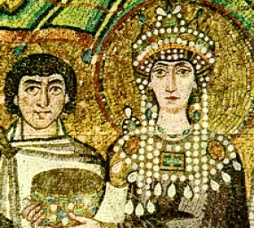

  
[Intangible Textual Heritage](../../../index)  [Classics](../../index) 
[Procopius](../index) 

------------------------------------------------------------------------

[Buy this Book at
Amazon.com](https://www.amazon.com/exec/obidos/ASIN/076617039X/internetsacredte)

------------------------------------------------------------------------

<table width="75%">
<colgroup>
<col style="width: 50%" />
<col style="width: 50%" />
</colgroup>
<tbody>
<tr class="odd">
<td width="50%" data-valign="TOP"></td>
<td width="50%" data-valign="CENTER"><h1 id="the-secret-history" data-align="CENTER">The Secret History</h1>
<h2 id="of-procopius" data-align="CENTER">of Procopius</h2>
<h2 id="tr.-by-richard-atwater" data-align="CENTER">tr. by Richard Atwater</h2>
<h4 id="section" data-align="CENTER">[1927]</h4></td>
</tr>
</tbody>
</table>

------------------------------------------------------------------------

[Contents](#contents)    [Start Reading](shp00)

------------------------------------------------------------------------

|                                                                                                                           |
|---------------------------------------------------------------------------------------------------------------------------|
|  |

Procopius, who also wrote a mainstream military history and a toadying
description of the monuments which Justinian built, had to keep his most
acute writing for posthumous publication. This text flays Justinian and
Theodora as corrupt, immoral, and just plain evil. Even though the
account sounds fantastic, it is considered genuine by modern historians
(but not necessarily accurate). Of course, the Eastern Orthodox Church
considers Justinian a saint, so you'll either love or hate this book.

The original title of this work was Anecdota, which means (as far as I
can tell) 'things not given over, withheld.' I can say that there are a
few *anecdotes* here which fall into the realm of the fantastic.
Procopius speculates that Justinian might have been something . . . not
even human, perhaps vampiric. He soberly quotes eyewitness accounts of
Justinian shapeshifting into a 'shapeless mass of flesh,' and literally
losing--and retrieving--his head ([p. 132](shp15.htm#page_132)). It
sounds just like a modern horror movie special effect. . . . In another
place, the translation has Justinian killing a 'trillion' people. The
text actually says "A myriad myriads of myriads" (a myriad is the
highest number in Greek, 10,000). \[By my reckoning, that is
105\*3 = 1015 = 100,000,000,000,000, or 100
trillion.\] All of this is a bit sophistical of course, what Procopius
obviously means here is "a ridiculous number."

The artistic san-serif 'Procopius' typeface was first used to typeset
this book. [A sample page can be found here](img/02700.jpg).

------------------------------------------------------------------------

 [Title Page](shp00)  
[Contents](shp01)  
[Introduction](shp02)  
[Foreword by the Historian](shp03)  
[I. How The Great General Belisarius Was Hoodwinked By His Wife, Whose
Lover Became A Monk](shp04)  
[II. How Belated Jealousy Affected Belisarius's Military Judgment, to
the Joy of the Enemy](shp05)  
[III. Showing The Danger of Interfering With a Woman's Intrigues,
Especially When the Woman Is the Friend of an Empress](shp06)  
[IV. How Theodora, Revenging Her Dear Antonina, Humiliated the Conqueror
of Africa And Italy](shp07)  
[V. How Theodora Tricked the General's Daughter Into a Liaison With the
Empress's Nephew, and Belisarius Became a Public Laughing
Stock](shp08)  
[VI. Ignorance of the Emperor Justin, and His Stencilled Signature, and
How His Nephew Justinian Was the Virtual Ruler](shp09)  
[VII. Outrages of the Blues](shp10)  
[VIII. Character and Appearance of Justinian](shp11)  
[IX. And How Theodora, Most Depraved of All Courtesans, Won His
Love](shp12)  
[X. How Justinian Created a New Law Permitting Him to Marry a Courtesan
On Her Promise to Repent Her Past; and the Truth About the Apparent
Quarrels of a Happy Pair](shp13)  
[XI. How the Defender of the Faith Ruined His Subjects](shp14)  
[XII. Proving That Justinian and Theodora Were Actually Fiends in Human
Form](shp15)  
[XIII. Deceptive Affability and Piety of a Tyrant](shp16)  
[XIV. Justice For Sale](shp17)  
[XV. How An Roman Citizens Became Slaves, and a Complaining Patrician
Was Ribaldly Mocked by Theodora's Eunuchs](shp18)  
[XVI. What Happened to Those Who Fell Out of Favor With
Theodora](shp19)  
[XVII. How She Saved Five Hundred Harlots from a Life of Sin, Made Away
with Her Own Natural Son, and Other Curious Incidents of Her Passion for
Match Making](shp20)  
[XVIII. How Justinian Killed a Trillion People](shp21)  
[XIX. How He Seized All the Wealth of the Romans and Threw It Away In
the Sea and On the Barbarians](shp22)  
[XX. Debasing of the Quaestorship](shp23)  
[XXI. The Sky Tax, the Selling of All Offices, and How Border Armies
Were Forbidden to Punish Invading Barbarians](shp24)  
[XXII. Further Corruption In High Places](shp25)  
[XXIII. How Landowners Were Ruined](shp26)  
[Unjust Treatment of the Soldiers, and How Justinian Tricked the
“Students” Out of Their Pay by Threatening to Send Them to War](shp27)  
[XXV. How He Robbed His Own Officials, Merchants, Sailors, Workmen, and
Everybody Else](shp28)  
[XXVI. How He Spoiled the Beauty of the Cities and Plundered the
Poor](shp29)  
[XXVII. How the Defender of the Faith Protected the Interests of the
Christians](shp30)  
[XXVIII. His Violation of the Laws of the Romans, and How Jews Were
Fined For Eating Lamb](shp31)  
[XXIX. Other Incidents Revealing Him as a Liar and a Hypocrite](shp32)  
[XXX. Further Innovations of Justinian and Theodora, and a Conclusion
Which Imagines the Death of an Emperor](shp33)  
[Glossary](shp34)  
