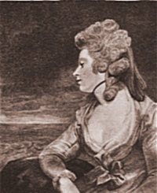

  
[Intangible Textual Heritage](../../../index)  [Classics](../../index) 
[Sappho](../index) 

------------------------------------------------------------------------

[Buy this Book at
Amazon.com](https://www.amazon.com/exec/obidos/ASIN/1419146114/internetsacredte)

------------------------------------------------------------------------

<table width="75%">
<colgroup>
<col style="width: 50%" />
<col style="width: 50%" />
</colgroup>
<tbody>
<tr class="odd">
<td width="50%" data-valign="TOP"> 
Mary Robinson</td>
<td width="50%" data-valign="CENTER"><h1 id="sappho-and-phaon" data-align="CENTER">Sappho and Phaon</h1>
<h2 id="by-mary-robinson" data-align="CENTER">by Mary Robinson</h2>
<h4 id="section" data-align="CENTER">[1796]</h4></td>
</tr>
</tbody>
</table>

------------------------------------------------------------------------

[Contents](#contents)    [Start Reading](sap00)    [Text
\[Zipped\]](saptxt.zip)

------------------------------------------------------------------------

|                                                                                                                           |
|---------------------------------------------------------------------------------------------------------------------------|
|  |

Mary Robinson, (*above*) \[b. 1758 d. 1800\] composed this sonnet
sequence about the legendary death of the famous poetess Sappho.
Robinson led a dramatic life. Her father, a sea captain, abandoned her
mother and five children when she was still a child. Her mother started
a girl's school to support herself, and Robinson was teaching in it at
age 14. She later trained for the stage and became a professional
actress, growing into a legendary beauty. She began a sensational affair
when she was 22 with the Prince of Wales, the future George IV, after he
saw her play Perdita in a production of [The Winter's
Tale](../../../sks/twt/twt). After the Prince spurned her, she became a
pioneering female author. She wrote novels, poetry, plays and feminist
essays. She died in her early forties.

Sappho here differs radically from the version that would emerge in the
19th century. In fact, this had really been the normative view of Sappho
since the Renaissance. In this sonnet sequence, which does not appear to
contain any actual lines from Sappho, Sappho is the tortured lover of a
boatman, Phaon. She follows him to Sicily, and finally leaps off the
Leucadian cliffs to her doom. It is not unlikely that this tale of love
gone wrong appealed to Robinson on a very personal level. Robinson,
during her lifetime, was known as 'the English Sappho,' and has recently
been rediscovered as a feminist trailblazer.

------------------------------------------------------------------------

 [Title Page](sap00)  
[Preface](sap01)  
[Account of Sappho](sap02)  
[The Subject of Each Sonnet](sap03)  
[Introductory](sap04)  
[II. The temple of Chastity.](sap05)  
[III. The Bower of Pleasure.](sap06)  
[IV. Sappho discovers her Passion.](sap07)  
[V. Contemns its Power.](sap08)  
[VI. Describes the characteristics of Love.](sap09)  
[VII. Invokes Reason.](sap10)  
[VIII. Her Passion increases.](sap11)  
[IX. Laments the volatility of Phaon.](sap12)  
[X. Describes Phaon.](sap13)  
[XI. Rejects the Influence of Reason.](sap14)  
[XII. Previous to her Interview with Phaon.](sap15)  
[XIII. She endeavours to fascinate him.](sap16)  
[XIV. To the Aeolian Harp.](sap17)  
[XV. Phaon awakes.](sap18)  
[XVI. Sappho rejects Hope.](sap19)  
[XVII. The Tyranny of Love.](sap20)  
[XVIII. To Phaon.](sap21)  
[XIX. Suspects his constancy.](sap22)  
[XX. To Phaon.](sap23)  
[XXI. Laments her early Misfortunes.](sap24)  
[XXII. Phaon forsakes her.](sap25)  
[XXIII. Sappho's Conjectures.](sap26)  
[XXIV. Her Address to the Moon.](sap27)  
[XXV. To Phaon.](sap28)  
[XXVI. Contemns Philosophy.](sap29)  
[XXVII. Sappho's Address to the Stars.](sap30)  
[XXVIII. Describes the fascinations of Love.](sap31)  
[XXIX. Determines to follow Phaon.](sap32)  
[XXX. Bids farewell to Lesbos.](sap33)  
[XXXI. Describes her Bark.](sap34)  
[XXXII. Dreams of a Rival.](sap35)  
[XXXIII. Reaches Sicily.](sap36)  
[XXXIV. Sappho's Prayer to Venus.](sap37)  
[XXXV. Reproaches Phaon.](sap38)  
[XXXVI. Her confirmed Despair.](sap39)  
[XXXVII. Foresees her Death.](sap40)  
[XXXVIII. To a Sigh.](sap41)  
[XXXIX. To the Muses.](sap42)  
[XL. Visions appear to her in a dream.](sap43)  
[XLI. Resolves to take the Leap of Leucata.](sap44)  
[XLII. Her last Appeal to Phaon.](sap45)  
[XLIII. Her Reflections on the Leucadian Rock before she
perishes.](sap46)  
[XLIV. Sonnect Conclusive](sap47)  
