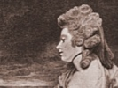

  
[Intangible Textual Heritage](../../../index)  [Classics](../../index) 
[Sappho](../index)  [Index](index)  [Previous](sap27)  [Next](sap29) 

------------------------------------------------------------------------

[Buy this Book at
Amazon.com](https://www.amazon.com/exec/obidos/ASIN/1419146114/internetsacredte)

------------------------------------------------------------------------

  
*Sappho and Phaon*, by Mary Robinson, \[1796\], at Intangible Textual
Heritage

------------------------------------------------------------------------

### XXV. To Phaon.

Can’st thou forget, O! Idol of my Soul!  
Thy Sappho’s voice, her form, her dulcet Lyre!  
That melting ev’ry thought to fond desire,  
Bade sweet delerium o’er thy senses roll?  
Can’st thou, so soon, renounce the blest control  
That calm’d with pity’s tears love’s raging fire,  
While Hope, slow breathing on the trembling wire,  
In every note with soft persuasion stole?  
Oh! Sov’reign of my heart! return! return!  
For me no spring appears, no summers bloom,  
No Sun-beams glitter, and no altars burn!  
The mind’s dark winter of eternal gloom,  
Shews ’midst the waste a solitary urn,  
A blighted laurel, and a mould’ring tomb!

------------------------------------------------------------------------

[Next: XXVI. Contemns Philosophy.](sap29)
