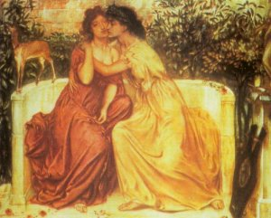

[Sacred-Texts](../../index)  [The Classics](../index)  [Sacred
Sexuality](../../sex/index)  [Neo-Paganism](../../pag/index) 

------------------------------------------------------------------------

<table width="75%">
<colgroup>
<col style="width: 50%" />
<col style="width: 50%" />
</colgroup>
<tbody>
<tr class="odd">
<td width="50%"> 
</td>
<td width="50%"><h1 id="the-poems-of-sappho"> The Poems of Sappho</h1>
<h2 id="translated-by-edwin-marion-cox-1925">Translated by Edwin Marion Cox [1925]</h2>
<h3 id="transliterated-by-j.b.-hare-2000">Transliterated by J.B. Hare [2000]</h3></td>
</tr>
</tbody>
</table>

------------------------------------------------------------------------

[Introduction by J.B. Hare](saphintr)  
[System of Greek Transliteration](saphxlit)  
[Part I](sappho0)  
[Part II](sappho1)  
[Part III](sappho2)  
[Part IV](sappho3)  
[Index of First Lines](first)  

------------------------------------------------------------------------

**Related Material**  
[Sappho in Unicode](../usappho/index)  
[The Songs of Bilitis](../sob/index)  
[H.T. Wharton's Sappho](https://classicpersuasion.org/pw/sappho/index)
\[external site\]

------------------------------------------------------------------------

The translations are from "The Poems of Sappho, with Historical and
Critical Notes, Translations, and a Bibliography" by Edwin Marion Cox,
Published 1925. The translations are in the public domain in the United
States due to the lack of copyright notice in the 1925 edition.

------------------------------------------------------------------------

The transliteration and additional editorial material are Copyright ©
2000 J.B. Hare, All Right Reserved. All uses other than Academic Fair
Use (as defined by U.S. copyright law) require permission of the
copyright holder.
