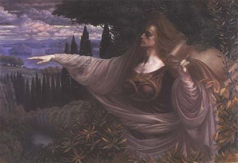

[Intangible Textual Heritage](../../index)  [Classical
Paganism](../index) 

------------------------------------------------------------------------

  
[The Oracle at Dodona...](#aboutimg)

# THE SIBYLLINE ORACLES

#### TRANSLATED FROM THE GREEK

#### INTO ENGLISH BLANK VERSE

###### BY

## MILTON S. TERRY

\[1899\]

[Jump to Index](#toc)  [Start Reading](sib01)

------------------------------------------------------------------------

[The Sibylline Oracles PDF](sib.pdf) \[415Kb\]

------------------------------------------------------------------------

As the translator notes, this collection should more properly titled
'the Pseudo-Sibylline Oracles'. The original Sibylline Books were
closely-guarded oracular scrolls written by prophetic priestesses (the
Sibylls) in the Etruscan and early Roman Era as far back as the 6th
Century B.C.E. These books were destroyed, partially in a fire in 83
B.C.E., and finally burned by order of the Roman General Flavius
Stilicho (365-408 C.E.).

There is very little knowledge of the actual contents of the original
Sibylline Books. The texts which are presented here are forgeries,
probably composed between the second to sixth century C.E. They purport
to predict events which were already history or mythological history at
the time of composition, as well as vague all-purpose predictions,
especially woe for various cities and countries such as Rome and
Assyria. They are an odd pastiche of Hellenistic and Roman Pagan
mythology, including [Homer](../homer/index) and
[Hesiod](../hesiod/index); Jewish legends such as the Garden of Eden,
Noah and the Tower of Babel; thinly veiled references to historical
figures such as Alexander the Great and Cleopatra, as well as a long
list of Roman Emperors; and last but not least, Gnostic and early
Christian homilies and eschatological writings, all in no particular
order. There may be actual residue of the original Sibylline books
wedged in here and there, but this is dubious.

As prophecy, the Pseudo-Sibyllines never rise to the level of
[Nostradamus](../../nos/index). However they are a gold mine for
students of Classical mythology and early first millenium Jewish,
Gnostic and Christian beliefs. Notable are apocalyptic passages
scattered throughout which at times seem like a first draft of the
Biblical [Book of Revelation](../../bib/kjv/rev). The Pseudo-Sibyllines
were referenced by the early Church fathers and in one instance have a
Christian code-phrase in successive first letters on each line (an
'acrostic'). These books, in spite of their Pagan content, have been
described as part of the [Apocrypha](../../chr/apo/index), although they
do not appear on any of the canonical lists.

Note: [The system of Greek transcription used in this document is
described here.](../sappho/saphxlit)

--J.B. Hare

------------------------------------------------------------------------

[Title Page](sib00)  
[Preface](sib01)  
[Contents](sib02)  
[Book I.](sib03)  
[Book II.](sib04)  
[Book III.](sib05)  
[Book IV.](sib06)  
[Book V.](sib07)  
[Book VI.](sib08)  
[Book VII.](sib09)  
[Book VIII.](sib10)  
[Book XI.](sib11)  
[Book XII.](sib12)  
[Book XIII.](sib13)  
[Book XIV.](sib14)  
[Appendices](sib15)  
[Bibliography](sib16)  
[Index](sib17)  

------------------------------------------------------------------------

Artist: Jean Delville \[1896\] (public domain image)
