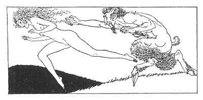

[Intangible Textual Heritage](../../index)  [Classics](../index) 
[Sappho](../sappho/index)  [Index](index)  [Previous](sob012) 
[Next](sob014) 

------------------------------------------------------------------------

p. 31

 

### FLOWERS

Nymphs of the woods and fountains, beneficent friends, oh! here I am. Do
not hide yourselves, but come to my aid, for I am sorely overburdened by
the weight of so many plucked flowers.

I shall choose from among you a poor hamadryad with lifted arms, and
into her leafy hair I'll thrust my heaviest rose.

See! I have taken so many from the fields that I shall never be able to
carry them home, unless you make me up a huge bouquet. If you refuse,
take care:

Yesterday I saw the nymph whose hair is tinted orange served like a
beast by the satyr Lamprosathes, and I shall denounce the shameless
creature.

------------------------------------------------------------------------

[Next: Impatience](sob014)
