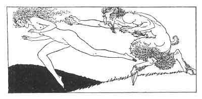

[Intangible Textual Heritage](../../index)  [Classics](../index) 
[Sappho](../sappho/index)  [Index](index)  [Previous](sob018) 
[Next](sob020) 

------------------------------------------------------------------------

p. 37

 

### MOONLIGHT DANCES

Upon the soft grass, in the night, young girls with violet hair have
danced together, and one of each pair gave the lover's answer.

The virgins said: "We are not for you." And, as though they were
ashamed, they shielded their virginity. An aegipan played a flute
beneath the trees.

The others said: "But you will come to seek us." They fashioned their
dresses after the manly garb, and languidly struggled and twined their
dancing limbs.

Then, each declaring herself to be subdued, she took her comrade by the
ears, cup-fashion, and, tilting her head, she drank a lengthy kiss.

------------------------------------------------------------------------

[Next: Little Children](sob020)
