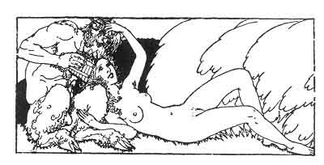

[Intangible Textual Heritage](../../index)  [Classics](../index) 
[Sappho](../sappho/index)  [Index](index)  [Previous](sob021) 
[Next](sob023) 

------------------------------------------------------------------------

p. 40

 

### HER FRIEND, MARRIED

Our mothers carried us together, and tonight Melissa, my dearest friend,
was married. The roses still are lying on the road; the torches still
are flaming, flaming. . .

And I return by the same path with mother, and I dream. Thus, what she
is today, I also might have been. Have I grown up so soon?

The cortege and the flutes, the marriage song; the flowered carriage of
the bridegroom, all these pomps some other night will spread themselves
about me, among the olive branches.

Just as Melissa now, I shall disrobe myself before a man and taste of
love by night, and later still small babes will feed upon my swollen
breasts.

------------------------------------------------------------------------

[Next: Confidences](sob023)
