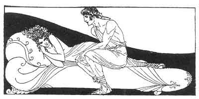

[Intangible Textual Heritage](../../index)  [Classics](../index) 
[Sappho](../sappho/index)  [Index](index)  [Previous](sob027) 
[Next](sob029) 

------------------------------------------------------------------------

p. 46

 

### THE ACCOMMODATING FRIEND

The storm had lasted all night. Selenis of the lovely hair had come to
spin with me. She stayed for fear of the mud, and, pressed tightly each
to each, we filled my tiny bed.

When young girls sleep together sleep itself remains outside the door.
"Bilitis, tell me, tell me whom you love." She slipped her thigh across
my own to warm me sweetly.

And she whispered into my mouth: "I know, Bilitis, whom you love. Close
your eyes, I am Lykas." I answered, touching her, "Can't I tell that you
are just a girl? Your joke's a clumsy one."

But she went on: "Truly I am Lykas if you close your lids. Here are his
arms, here are his hands" . . . and tenderly, in the silence, she
flushed my dreaming with a stranger dream.

------------------------------------------------------------------------

[Next: Prayer to Persephone](sob029)
